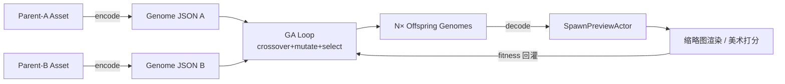

# 比基尼遗传变换算法（UE / MetaHuman / Chaos Cloth）

本文档给出一套基于 **遗传算法（GA）** 的比基尼款式衍生方案：输入两件 MetaHuman / Chaos Cloth 比基尼作为"父本"，输出 N 件结构 / 材质 / 物理表现各异的新款。面向 Unreal Engine 5 项目。

---

## 1. 概述与目标

- **输入**：两件 MetaHuman 或 Chaos Cloth 比基尼资产，称为 `Parent-A`、`Parent-B`。
- **输出**：N 件"新款式"比基尼，可直接穿到 MetaHuman 上并参与 Chaos Cloth 解算。
- **方法**：把比基尼参数化为定长 Genome，对 Genome 做交叉 + 变异 + 选择，再把后代 Genome 解码回 UE 资产。
- **非目标**：
  - 不依赖外部训练数据，不跑深度生成模型；
  - 不重新生成蒙皮权重（用 MetaHuman Outfit 现有的绑定规则）；
  - 不生成全新的 UV / 拓扑（拓扑变化用离散的 `style_id` 切换预制网格来实现）。

---

## 2. 比基尼的参数化（Genome 设计）

一件比基尼在本文中被抽象为 5 个基因块的串联：`Top 结构 | Bottom 结构 | 配件 | 外观 | 物理`。离散字段用整数 id（落地时可 one-hot），连续字段归一化到 `[0, 1]`，颜色用 HSL。

| 基因块 | 字段 | 类型 | 取值 / 含义 | UE 映射 |
|---|---|---|---|---|
| **Top 结构** | `top.style_id` | 离散 enum | `triangle / bandeau / halter / bralette / underwire / sporty` | `DT_BikiniStyleLibrary` 行 id → Skeletal Mesh 资产 |
| | `top.cup_coverage` | 连续 `[0,1]` | 0 极小，1 全包 | Morph Target `MT_CupCoverage` |
| | `top.strap_width` | 连续 `[0,1]` | 肩带宽度 | Morph Target `MT_StrapWidth` |
| | `top.neckline_depth` | 连续 `[0,1]` | 胸前 V 深度 | Morph Target `MT_NeckDepth` |
| **Bottom 结构** | `bottom.style_id` | 离散 enum | `thong / cheeky / brief / high_waist / boyshort / tie_side` | DataTable → Skeletal Mesh |
| | `bottom.rise_height` | 连续 `[0,1]` | 腰线高度 | Morph Target `MT_Rise` |
| | `bottom.side_width` | 连续 `[0,1]` | 侧边宽度 | Morph Target `MT_SideWidth` |
| | `bottom.coverage_back` | 连续 `[0,1]` | 后部遮盖面积 | Morph Target `MT_BackCoverage` |
| **配件** | `acc.tie_type` | 离散 enum | `none / bow / ring / knot / buckle` | Socket 挂点子 Actor |
| | `acc.ruffle` | 连续 `[0,1]` | 荷叶边强度，0 关 | 启用子网格 + Morph 权重 |
| **外观** | `look.hue` | 连续 `[0,1]` | HSL 的 H，对应 `0°~360°` | MID Vector Param `BaseColor` 的 H 通道 |
| | `look.saturation` | 连续 `[0,1]` | | 同上 S |
| | `look.lightness` | 连续 `[0,1]` | | 同上 L |
| | `look.pattern_id` | 离散 enum | `solid / stripe / floral / polka / tie_dye / leopard` | Material Switch / 贴图切换 |
| | `look.pattern_scale` | 连续 `[0,1]` | 图案密度 | MID Scalar Param `PatternScale` |
| | `look.metallic` | 连续 `[0,1]` | | MID Scalar Param `Metallic` |
| | `look.roughness` | 连续 `[0,1]` | | MID Scalar Param `Roughness` |
| **物理（Chaos Cloth）** | `phys.stretch` | 连续 `[0.05, 0.95]` | 拉伸刚度 | `ClothConfig.EdgeStiffness` |
| | `phys.bending` | 连续 `[0.05, 0.95]` | 弯曲刚度 | `ClothConfig.BendingStiffness` |
| | `phys.damping` | 连续 `[0, 0.5]` | 阻尼 | `ClothConfig.Damping` |
| | `phys.density` | 连续 `[0.1, 2.0]` | 单位面积质量倍率 | `ClothConfig.MassScale` |

**Genome 向量长度**：4 个离散字段 + 15 个连续字段 = **19 维**（物理字段内部会按范围再映射）。

### 2.1 Genome JSON Schema（节选）

```json
{
  "version": 1,
  "top":    { "style_id": "triangle", "cup_coverage": 0.42, "strap_width": 0.18, "neckline_depth": 0.55 },
  "bottom": { "style_id": "cheeky",   "rise_height": 0.35,  "side_width":  0.22, "coverage_back": 0.40 },
  "acc":    { "tie_type": "bow", "ruffle": 0.0 },
  "look":   { "hue": 0.62, "saturation": 0.70, "lightness": 0.55,
              "pattern_id": "stripe", "pattern_scale": 0.30,
              "metallic": 0.05, "roughness": 0.45 },
  "phys":   { "stretch": 0.60, "bending": 0.55, "damping": 0.12, "density": 1.00 }
}
```

---

## 3. 编码 / 解码

### 3.1 `encode(UE_Asset) -> Genome`
美术侧为每件"种子"比基尼手动填 Genome JSON（一次性工作），或写编辑器脚本：
1. 读取 DataAsset 里引用的 `TopMesh / BottomMesh`，查 `DT_BikiniStyleLibrary` 反查出 `style_id`；
2. 读取 Morph Target Curve 当前权重 → 对应连续字段；
3. 读取 Material Instance 上的 Vector / Scalar Param → 外观字段（RGB→HSL 转换）；
4. 读取 `ClothingAsset->ClothConfig` → 物理字段。

### 3.2 `decode(Genome) -> UE_Asset`（运行时）
```text
1. 查 DT_BikiniStyleLibrary[top.style_id] -> 得到 SkeletalMesh_Top，赋给 TopComp->SetSkeletalMesh
2. 查 DT_BikiniStyleLibrary[bottom.style_id] -> 同理赋给 BottomComp
3. 对两个 Comp 调 SetMorphTarget(name, weight) 写入 6 个连续结构字段
4. 按 acc.tie_type 在预留 Socket 上 SpawnActor（或销毁旧的）
5. CreateDynamicMaterialInstance，SetVectorParameterValue("BaseColor", HSLtoLinearRGB(h,s,l))
   SetScalarParameterValue("PatternScale" | "Metallic" | "Roughness" | ...)
   按 pattern_id 切 MaterialFunction 的 Switch
6. 覆盖 ClothConfig.{EdgeStiffness, BendingStiffness, Damping, MassScale}
   UClothingSimulationInteractor::PhysicsAssetUpdated() 刷新
```

> **拓扑约束**：Morph Target 不能跨 `style_id` 插值（顶点数不一致）。因此 `style_id` 是"整段继承 or 整段替换"，不做连续混合；连续字段只在同一个 `style_id` 对应的网格上有意义。

---

## 4. 遗传算法主流程

标准 GA，保留两位父本做精英保留（Elitism）。

```text
def run_ga(parent_a, parent_b, N=16, G=20):
    # 4.1 初始化种群
    pop = [parent_a, parent_b]
    for _ in range(N - 2):
        pop.append(mutate(random.choice([parent_a, parent_b]), sigma=0.15))

    for gen in range(G):
        scored = [(g, fitness(g, pop)) for g in pop]

        # 4.2 选择：锦标赛 k=3
        def pick():
            cands = random.sample(scored, 3)
            return max(cands, key=lambda x: x[1])[0]

        # 4.3 生成后代
        elites = [g for g,_ in sorted(scored, key=lambda x:-x[1])[:2]]
        children = list(elites)
        while len(children) < N:
            a, b = pick(), pick()
            c = crossover(a, b)
            c = mutate(c, sigma=0.08)
            c = repair(c)            # 见 §4.6 硬约束修复
            children.append(c)
        pop = children

    return pareto_front(pop)         # 见 §5.3
```

### 4.1 交叉（crossover）

按基因块分层处理，避免产生"半三角杯半 bandeau"的非法组合：

| 字段类别 | 算子 |
|---|---|
| 离散 `style_id` / `pattern_id` / `tie_type` | **单点继承**：从 a 或 b 等概率整体继承 |
| 同一个 `top.style_id` 下的连续字段 | **BLX-α 混合**：`c = a + U(-α, 1+α)·(b-a)`，α=0.3，再 clip 到 `[0,1]` |
| HSL 颜色 | H 通道按**环形最短弧**插值（`h_a, h_b` 先处理 wrap），S/L 线性插值 |
| 物理字段 `phys.*` | **整段继承**（随机挑一位父本的整个 phys 块），避免刚度/阻尼异常组合 |

**环形 H 插值**：
```text
def lerp_hue(h_a, h_b, t):
    d = (h_b - h_a + 1.5) % 1.0 - 0.5   # 取 (-0.5, 0.5]
    return (h_a + t * d) % 1.0
```

### 4.2 变异（mutate）

| 字段 | 算子 |
|---|---|
| 离散字段 | 以 `p_mut_cat = 0.05` 从枚举表重新均匀采样 |
| 连续字段 | 高斯扰动 `x' = clip(x + N(0, σ), 0, 1)`，σ 由代际调度（前期 0.12 → 后期 0.04） |
| 颜色 H | `σ_h = 0.03`（色相小步漂移，保留识别度） |
| 物理字段 | 成对扰动 `stretch ↔ bending` 保持比值，避免解算爆炸 |

### 4.3 硬约束与修复（repair）

变异 / 交叉后一律经过 `repair(g)` 修复非法个体：

- `top.style_id == "bandeau"` → `strap_width := 0`
- `top.cup_coverage + top.neckline_depth > 1.2` → 两者等比缩放到和 = 1.2
- `bottom.style_id == "thong"` → `bottom.coverage_back := min(0.15, coverage_back)`
- `phys.stretch < 0.05` 或 `> 0.95` → clip 到范围
- `phys.stretch / phys.bending ∈ [0.5, 2.0]`，否则把 `bending` 拉回区间

---

## 5. 适应度（Fitness）

### 5.1 可选项
1. **人工打分**：编辑器 UI 列出当前种群缩略图，美术打 1-5 星。最准，最慢。
2. **启发式 fitness**：无人值守，下面 §5.2 公式。
3. **多目标 NSGA-II**：同时优化"新颖度 + 协调度"，取 Pareto 前沿。

### 5.2 启发式 fitness 公式

```text
fitness(g, pop) = w1·harmony(g) + w2·novelty(g, pop) + w3·legal(g)
                  默认 w1=0.4, w2=0.5, w3=0.1
```

- **harmony(g)**：
  - 颜色协调 = 1 − |saturation − 0.6| − 0.5·|lightness − 0.5|（偏好中等饱和 / 中等明度）；
  - 图案 × 颜色冲突：`leopard + hue∈(0.33, 0.50)`（绿色豹纹）扣 0.3；
  - 物理合理 = `1 − |stretch − 0.6| − |bending − 0.5|`（经验中心）。
- **novelty(g, pop)**：对 Genome 去掉 style_id 后做 L2 距离，取 k=3 近邻平均距离，大 → 新颖。
- **legal(g)**：硬约束每违反一条 −0.2；`repair` 之后通常恒为 1.0。

### 5.3 Pareto 前沿（NSGA-II 选型）

若启用多目标：两个目标 `(harmony, novelty)`，走标准 NSGA-II 的非支配排序 + 拥挤度距离；输出第 1 层 Pareto 前沿作为"最终款式集"。好处是防止种群在后期全部收敛到同一个"最顺眼"的款，保持多样性。

---

## 6. 映射到 UE / Chaos Cloth 的落地路径

### 6.1 资产与类
| 资产 / 类 | 作用 |
|---|---|
| `UBikiniGenomeDataAsset` (C++ / UDataAsset) | 序列化一条 Genome，支持编辑器内编辑 |
| `DT_BikiniStyleLibrary` (DataTable) | `style_id` → `SkeletalMesh` / `ClothingAsset` 引用 |
| `UBikiniGenomeDecoder` (USubsystem 或 UActorComponent) | 运行时把 Genome 应用到 SkeletalMeshComponent |
| `M_BikiniMaster` (Material) | 含 HSL 输入、图案 MaterialFunction Switch |
| `UClothingAssetCommon` / `ClothConfig` | 接收 phys 字段 |

### 6.2 数据流



### 6.3 代码分层建议
- **纯算法层**：Python 或纯 C++，不依赖 UE，JSON 进 JSON 出。便于单元测试。
- **UE 集成层**：Editor Utility Widget + Subsystem，负责 encode/decode + 批量 SpawnActor + 截图。
- **运行时层**：仅需要 `UBikiniGenomeDecoder` 一个组件即可完成 Genome → 可视化资产。

### 6.4 关键 UE API 速查
```cpp
// Morph Target
USkeletalMeshComponent::SetMorphTarget(FName Name, float Weight);

// 动态材质
UMaterialInstanceDynamic* MID = UMaterialInstanceDynamic::Create(BaseMat, this);
MID->SetVectorParameterValue(TEXT("BaseColor"), HSLtoLinear(H, S, L));
MID->SetScalarParameterValue(TEXT("PatternScale"), Scale);
MeshComp->SetMaterial(0, MID);

// Cloth
if (UClothingAssetCommon* Asset = Cast<UClothingAssetCommon>(Comp->GetClothingAsset(0))) {
    FClothConfig& Cfg = Asset->ClothConfigs[...];
    Cfg.EdgeStiffness    = Phys.Stretch;
    Cfg.BendingStiffness = Phys.Bending;
    Cfg.Damping          = Phys.Damping;
    Cfg.MassScale        = Phys.Density;
}
Comp->RecreateClothingActors();
```

---

## 7. 最小可行流程（工程师 Checklist）

1. **美术**：准备两件基础比基尼 + 6 套 Top Mesh + 6 套 Bottom Mesh 变体，录入 `DT_BikiniStyleLibrary`。
2. **美术**：为两件父本手填 Genome JSON（或编辑器一键导出）。
3. **程序**：按 §4 伪代码写 `bikini_ga.py`（或 C++ Subsystem），纯 JSON I/O。
4. **程序**：写 `UBikiniGenomeDecoder::Apply(const FGenome&)`，覆盖 Morph / MID / Cloth。
5. **工具**：Editor Utility Widget —— 输入两个 Genome、代数 G、种群 N，点一下"Generate"，在预览场景里一排 SpawnActor 展示 N 件后代。
6. **闭环**：加一个"打分按钮"，美术点星写回 fitness.json，运行下一代。

---

## 8. 风险与边界

| 风险 | 说明 | 规避 |
|---|---|---|
| 跨 style_id 拓扑不一致 | Morph 不能跨网格插值 | `style_id` 整段继承，不插值 |
| Chaos Cloth 数值爆炸 | 低刚度 + 低阻尼触发穿插 | 物理字段范围限制 + 成对扰动 |
| 收敛到单一款式 | 启发式 fitness 偏向某种配色 | 使用 NSGA-II 或强化 novelty 权重 |
| 图案贴图版权 | 不要外部抓取花纹 | 程序化生成（Perlin / SDF / 圆点）或自有素材库 |
| MetaHuman Outfit 绑定 | DNA 不同身型 Morph 效果有偏 | 对每种 body 预烘一套 Morph 权重偏置 |
| 生成款式不适宜传播 | 美术应用前先审核 | 加入 `legal` 字段 + 人工复核环节 |

---

## 9. 后续可扩展

- **图案程序化**：接 UE 的 `UTextureRenderTarget2D` + MaterialToTexture，按 Genome 自动烘花纹贴图；也可外接 Stable Diffusion / ControlNet 生成贴图。
- **自动美学打分**：用 CLIP / 美学预测模型离线打 fitness，替代人工。
- **两阶段优化**：前期 GA 粗采样拓扑 + 离散字段；后期对同一 `style_id` 下的连续字段用 **CMA-ES** 做精细化收敛。
- **代理几何**：GA 初代用低模做预览截图，筛选通过的再切高模，节约渲染时间。

---

## 附录 A：HSL ↔ Linear RGB 参考
UE 材质的 `VectorParameter` 接收 Linear RGB。Genome 里存 HSL 是为了颜色操作更自然，进入 UE 前转换：

```text
H ∈ [0,1) (对应 0°~360°)
S, L ∈ [0,1]

hsl_to_srgb(h,s,l):  # 标准公式（略），得到 sRGB [0,1]
srgb_to_linear(c):   c <= 0.04045 ? c/12.92 : ((c+0.055)/1.055)^2.4
```

## 附录 B：伪代码汇总（快速对照）

```python
def crossover(a, b):
    c = Genome()
    # 离散块整体继承
    c.top.style_id    = choice([a.top.style_id, b.top.style_id])
    c.bottom.style_id = choice([a.bottom.style_id, b.bottom.style_id])
    c.acc.tie_type    = choice([a.acc.tie_type, b.acc.tie_type])
    c.look.pattern_id = choice([a.look.pattern_id, b.look.pattern_id])
    # 物理整段继承
    c.phys = choice([a.phys, b.phys])
    # 连续字段 BLX-α
    for f in CONT_FIELDS:
        c[f] = blx_alpha(a[f], b[f], alpha=0.3)
    # HSL 特殊处理
    t = random()
    c.look.hue        = lerp_hue(a.look.hue, b.look.hue, t)
    c.look.saturation = lerp(a.look.saturation, b.look.saturation, t)
    c.look.lightness  = lerp(a.look.lightness, b.look.lightness, t)
    return c

def mutate(g, sigma=0.08):
    for f in CONT_FIELDS_EXCLUDING_HUE:
        if random() < 0.6:
            g[f] = clip(g[f] + gauss(0, sigma), 0, 1)
    if random() < 0.6:
        g.look.hue = (g.look.hue + gauss(0, 0.03)) % 1.0
    for f in DISCRETE_FIELDS:
        if random() < 0.05:
            g[f] = sample(ENUM_OF(f))
    return g

def repair(g):
    if g.top.style_id == "bandeau":
        g.top.strap_width = 0.0
    s = g.top.cup_coverage + g.top.neckline_depth
    if s > 1.2:
        g.top.cup_coverage    *= 1.2 / s
        g.top.neckline_depth  *= 1.2 / s
    if g.bottom.style_id == "thong":
        g.bottom.coverage_back = min(0.15, g.bottom.coverage_back)
    g.phys.stretch = clip(g.phys.stretch, 0.05, 0.95)
    g.phys.bending = clip(g.phys.bending, 0.05, 0.95)
    ratio = g.phys.stretch / max(g.phys.bending, 1e-3)
    if ratio < 0.5:  g.phys.bending = g.phys.stretch / 0.5
    if ratio > 2.0:  g.phys.bending = g.phys.stretch / 2.0
    return g
```
