# 0820_diverse_seeds

_Day: [`2026-04-29/`](../README.md)_  ·  _Seeds: 20_  ·  _Images: 161_

Local interactive viewer: [`index.html`](index.html)  ·  Top: [`tools/output/`](../../README.md)

## Top-level images

### overview.png

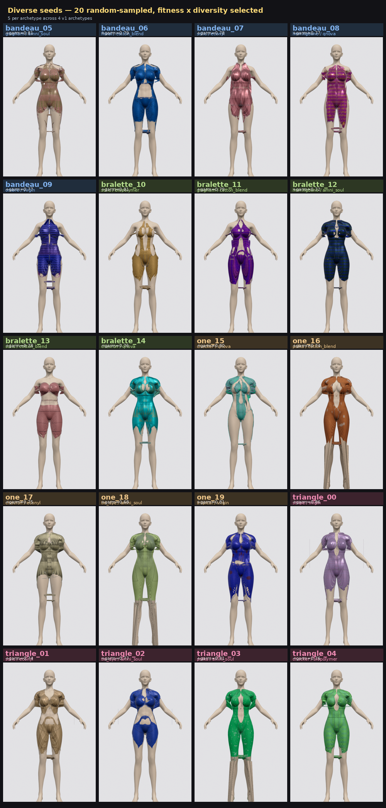

## Seeds (20)

### archetype: `avantgarde_cutout` (1)

#### `diverse_triangle_00`
_style=avantgarde_cutout  pattern=stripe  src=virgin  weave=ribbed_

<table>
  <tr>
    <td align='center'><a href='renders/diverse_triangle_00/01_front.png'>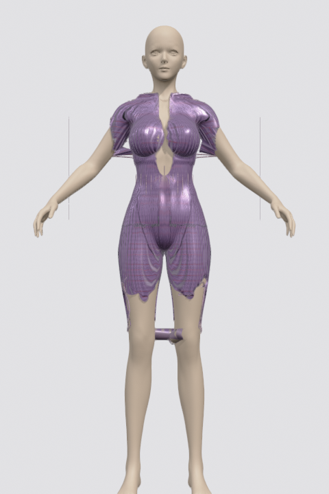</a> 01_front</td>
    <td align='center'><a href='renders/diverse_triangle_00/02_three_quarter.png'>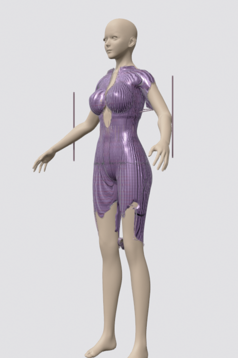</a> 02_three_quarter</td>
    <td align='center'><a href='renders/diverse_triangle_00/03_side_left.png'>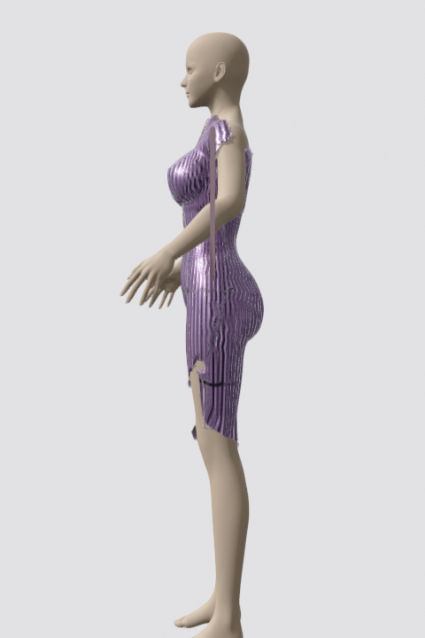</a> 03_side_left</td>
    <td align='center'><a href='renders/diverse_triangle_00/04_back.png'>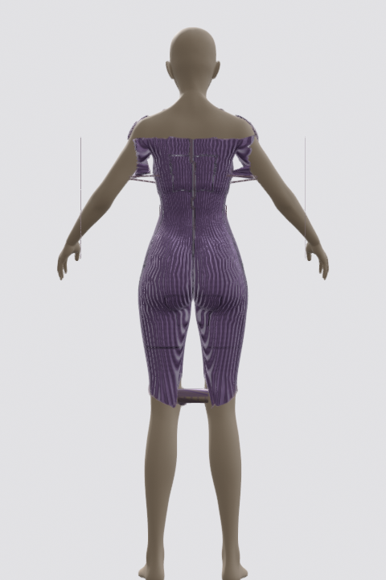</a> 04_back</td>
  </tr>
  <tr>
    <td align='center'><a href='renders/diverse_triangle_00/05_chest_close.png'>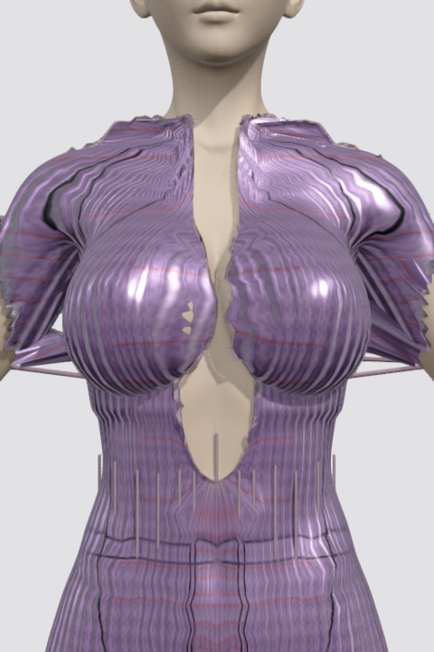</a> 05_chest_close</td>
    <td align='center'><a href='renders/diverse_triangle_00/06_hip_close.png'>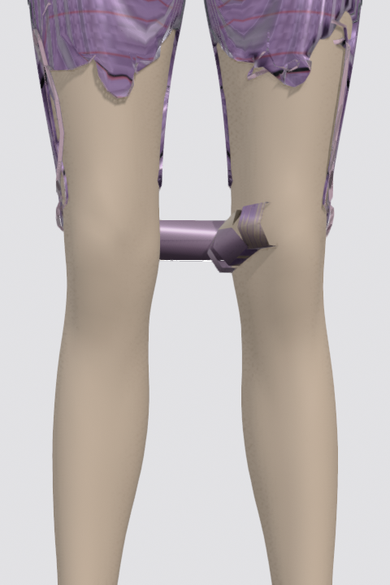</a> 06_hip_close</td>
    <td align='center'><a href='renders/diverse_triangle_00/07_neck_top.png'>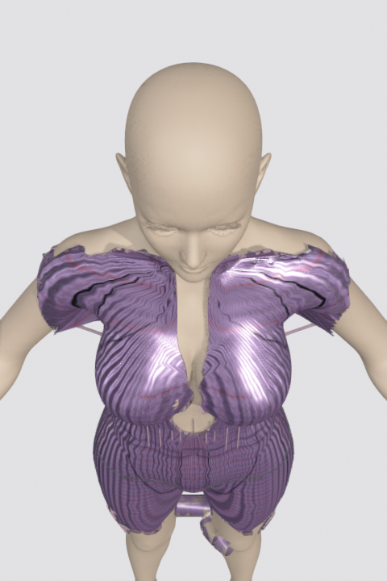</a> 07_neck_top</td>
    <td align='center'><a href='renders/diverse_triangle_00/08_shoulder_top.png'>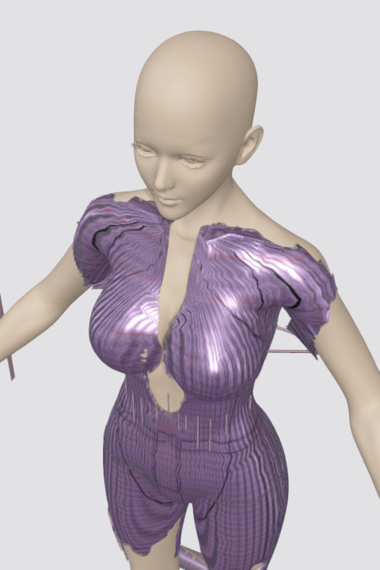</a> 08_shoulder_top</td>
  </tr>
</table>

### archetype: `boho_cultgaia` (4)

#### `diverse_bandeau_05`
_style=boho_cultgaia  pattern=gingham  src=amni_soul  weave=ribbed_

<table>
  <tr>
    <td align='center'><a href='renders/diverse_bandeau_05/01_front.png'>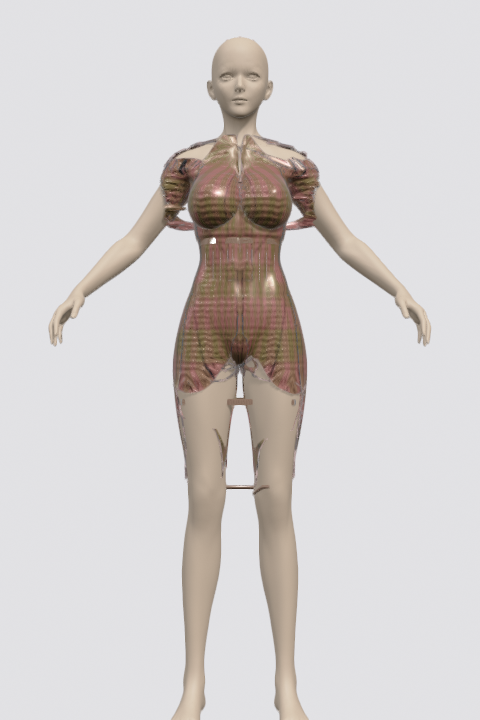</a> 01_front</td>
    <td align='center'><a href='renders/diverse_bandeau_05/02_three_quarter.png'>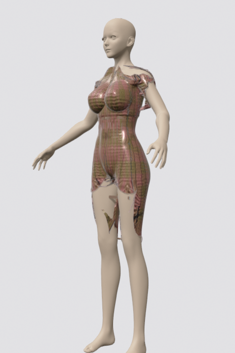</a> 02_three_quarter</td>
    <td align='center'><a href='renders/diverse_bandeau_05/03_side_left.png'>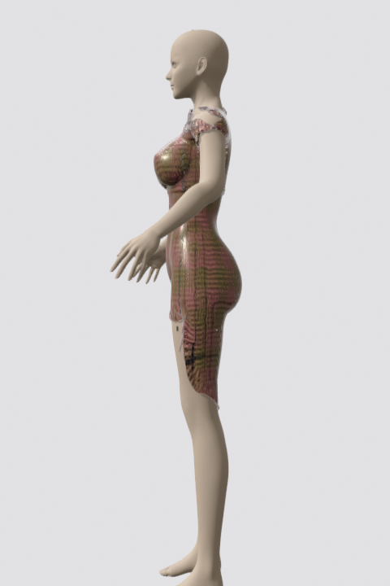</a> 03_side_left</td>
    <td align='center'><a href='renders/diverse_bandeau_05/04_back.png'>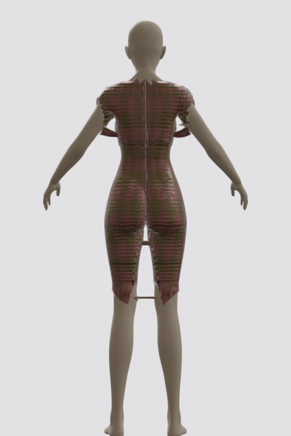</a> 04_back</td>
  </tr>
  <tr>
    <td align='center'><a href='renders/diverse_bandeau_05/05_chest_close.png'>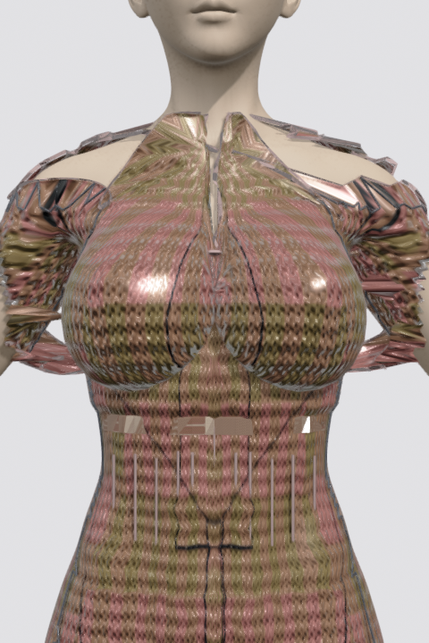</a> 05_chest_close</td>
    <td align='center'><a href='renders/diverse_bandeau_05/06_hip_close.png'>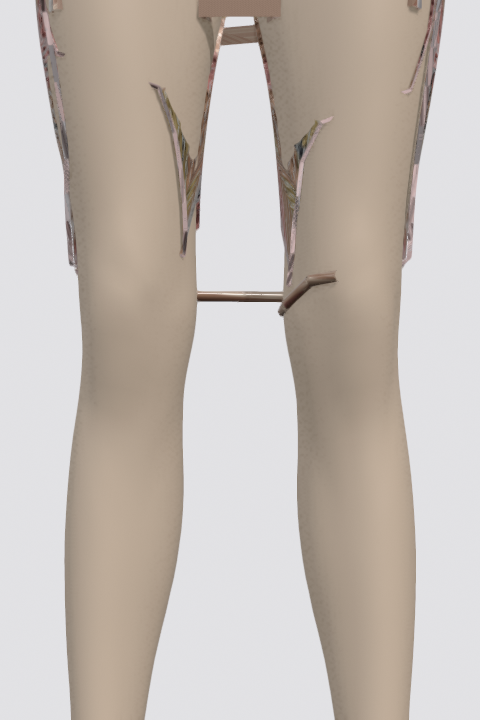</a> 06_hip_close</td>
    <td align='center'><a href='renders/diverse_bandeau_05/07_neck_top.png'>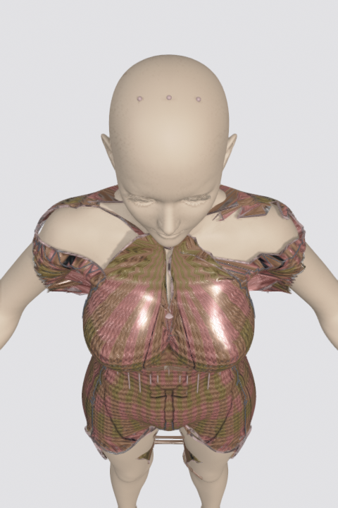</a> 07_neck_top</td>
    <td align='center'><a href='renders/diverse_bandeau_05/08_shoulder_top.png'>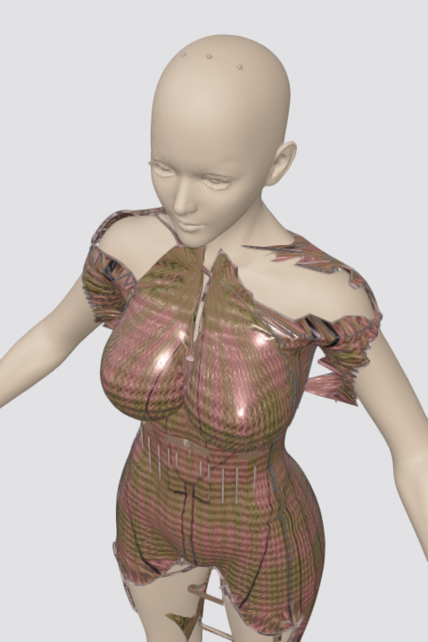</a> 08_shoulder_top</td>
  </tr>
</table>

#### `diverse_bralette_11`
_style=boho_cultgaia  pattern=gingham  src=cotton_blend  weave=ribbed_

<table>
  <tr>
    <td align='center'><a href='renders/diverse_bralette_11/01_front.png'>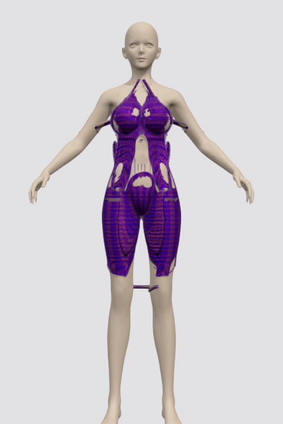</a> 01_front</td>
    <td align='center'><a href='renders/diverse_bralette_11/02_three_quarter.png'>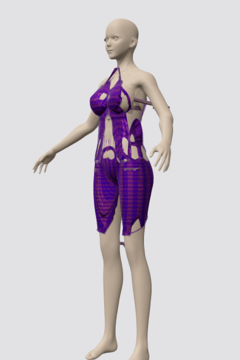</a> 02_three_quarter</td>
    <td align='center'><a href='renders/diverse_bralette_11/03_side_left.png'>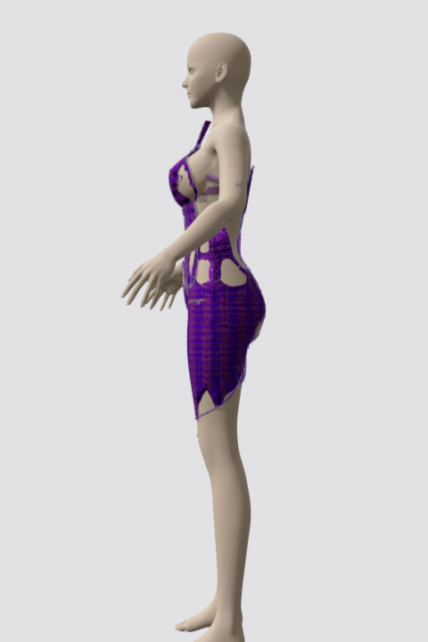</a> 03_side_left</td>
    <td align='center'><a href='renders/diverse_bralette_11/04_back.png'>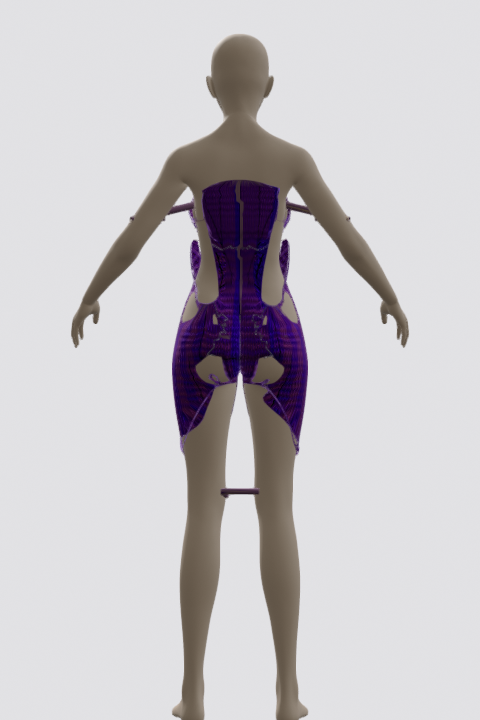</a> 04_back</td>
  </tr>
  <tr>
    <td align='center'><a href='renders/diverse_bralette_11/05_chest_close.png'>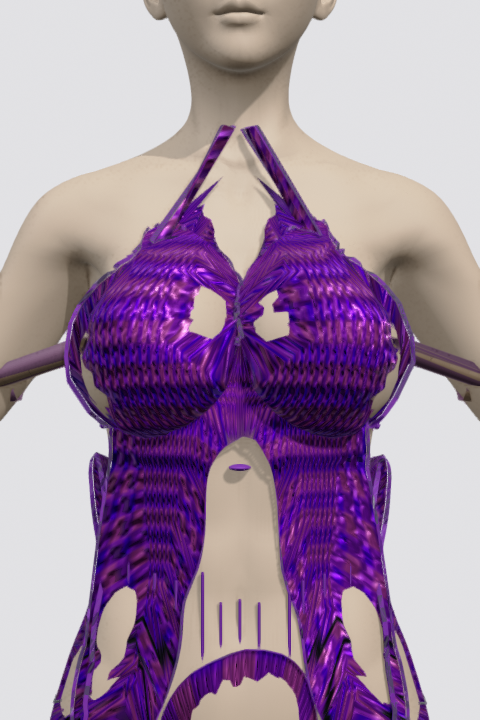</a> 05_chest_close</td>
    <td align='center'><a href='renders/diverse_bralette_11/06_hip_close.png'>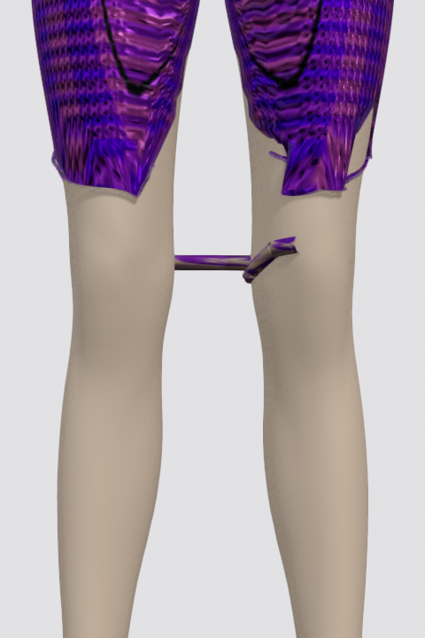</a> 06_hip_close</td>
    <td align='center'><a href='renders/diverse_bralette_11/07_neck_top.png'>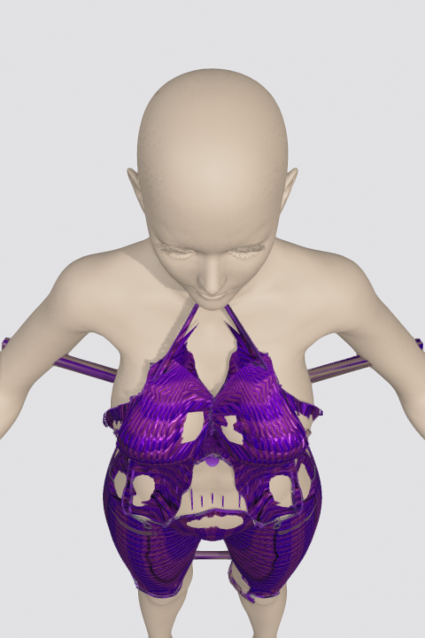</a> 07_neck_top</td>
    <td align='center'><a href='renders/diverse_bralette_11/08_shoulder_top.png'>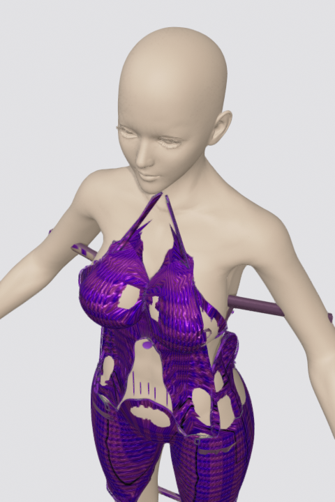</a> 08_shoulder_top</td>
  </tr>
</table>

#### `diverse_one_16`
_style=boho_cultgaia  pattern=polka  src=cotton_blend  weave=crochet_

<table>
  <tr>
    <td align='center'><a href='renders/diverse_one_16/01_front.png'>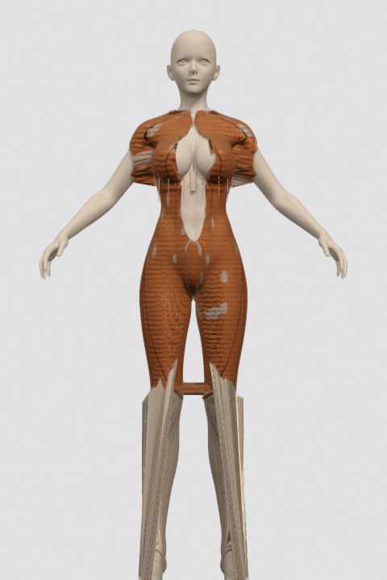</a> 01_front</td>
    <td align='center'><a href='renders/diverse_one_16/02_three_quarter.png'>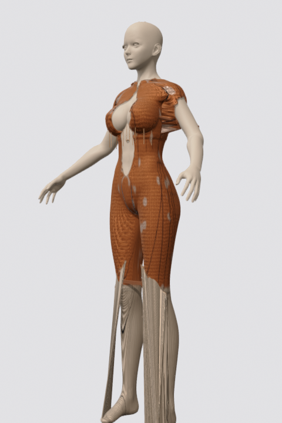</a> 02_three_quarter</td>
    <td align='center'><a href='renders/diverse_one_16/03_side_left.png'>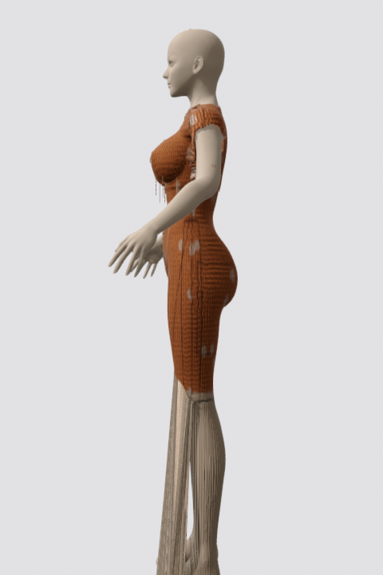</a> 03_side_left</td>
    <td align='center'><a href='renders/diverse_one_16/04_back.png'>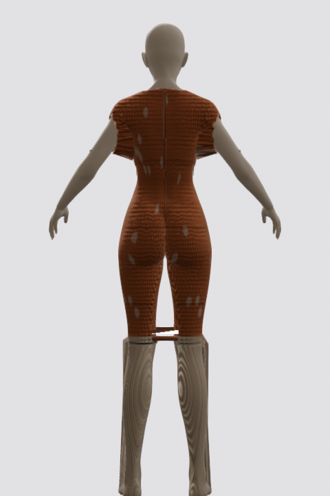</a> 04_back</td>
  </tr>
  <tr>
    <td align='center'><a href='renders/diverse_one_16/05_chest_close.png'>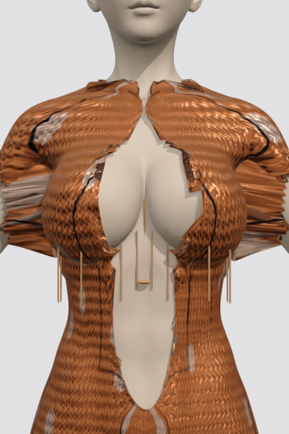</a> 05_chest_close</td>
    <td align='center'><a href='renders/diverse_one_16/06_hip_close.png'>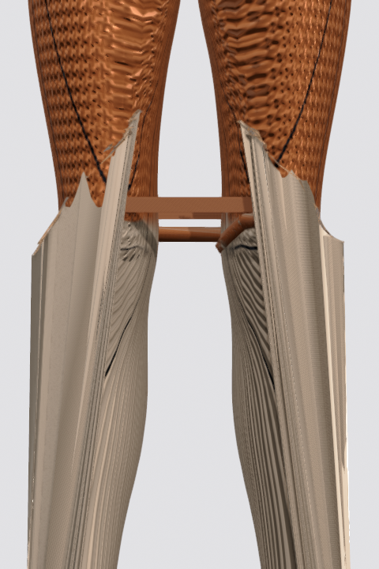</a> 06_hip_close</td>
    <td align='center'><a href='renders/diverse_one_16/07_neck_top.png'>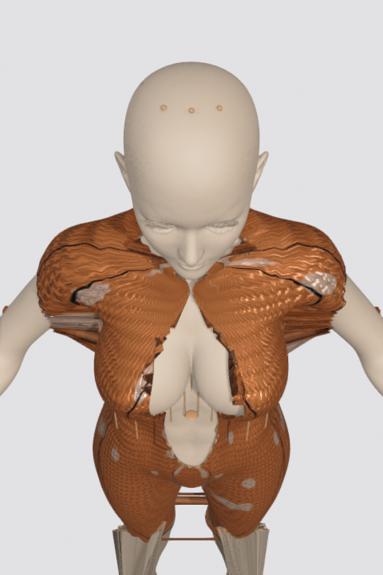</a> 07_neck_top</td>
    <td align='center'><a href='renders/diverse_one_16/08_shoulder_top.png'>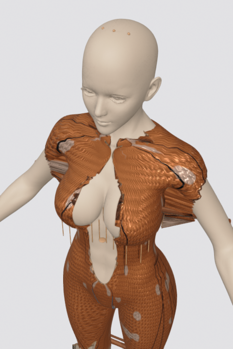</a> 08_shoulder_top</td>
  </tr>
</table>

#### `diverse_triangle_03`
_style=boho_cultgaia  pattern=polka  src=amni_soul  weave=crochet_

<table>
  <tr>
    <td align='center'><a href='renders/diverse_triangle_03/01_front.png'>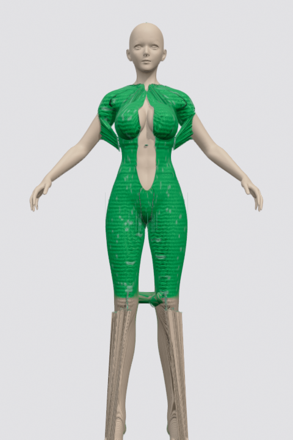</a> 01_front</td>
    <td align='center'><a href='renders/diverse_triangle_03/02_three_quarter.png'>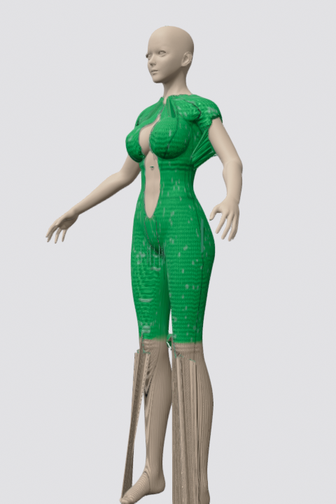</a> 02_three_quarter</td>
    <td align='center'><a href='renders/diverse_triangle_03/03_side_left.png'>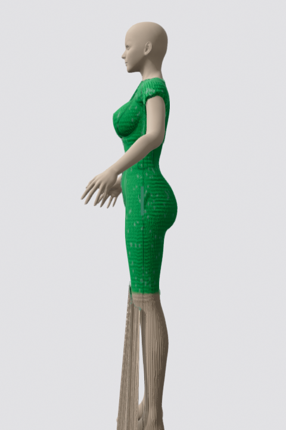</a> 03_side_left</td>
    <td align='center'><a href='renders/diverse_triangle_03/04_back.png'>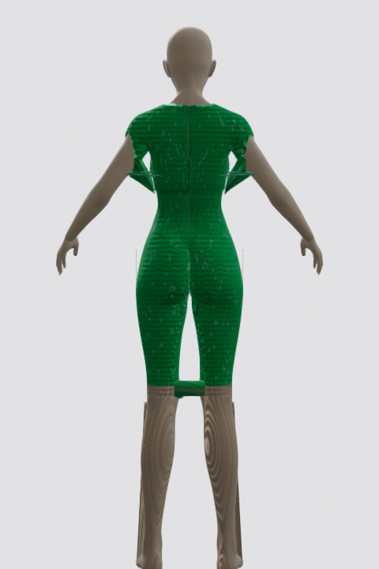</a> 04_back</td>
  </tr>
  <tr>
    <td align='center'><a href='renders/diverse_triangle_03/05_chest_close.png'>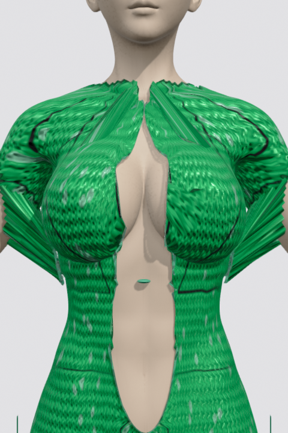</a> 05_chest_close</td>
    <td align='center'><a href='renders/diverse_triangle_03/06_hip_close.png'>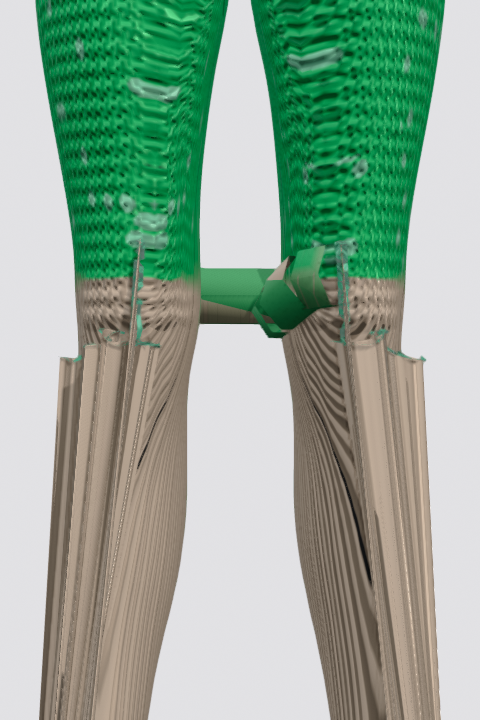</a> 06_hip_close</td>
    <td align='center'><a href='renders/diverse_triangle_03/07_neck_top.png'>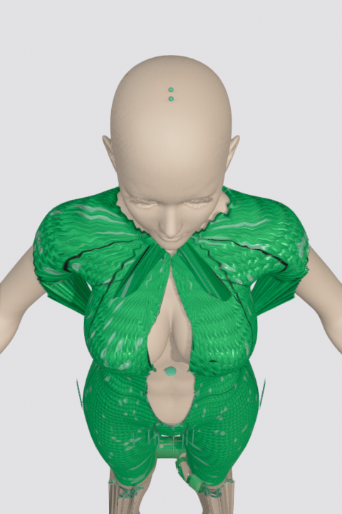</a> 07_neck_top</td>
    <td align='center'><a href='renders/diverse_triangle_03/08_shoulder_top.png'>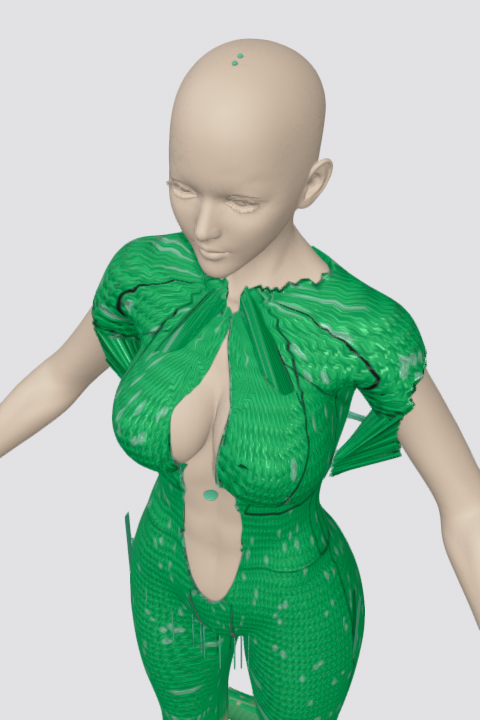</a> 08_shoulder_top</td>
  </tr>
</table>

### archetype: `brazilian` (1)

#### `diverse_bralette_14`
_style=brazilian  pattern=chevron  src=qnova  weave=velvet_

<table>
  <tr>
    <td align='center'><a href='renders/diverse_bralette_14/01_front.png'>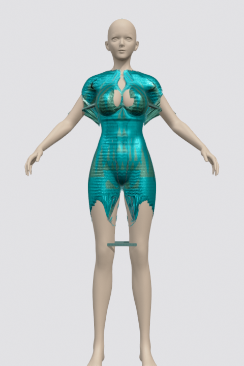</a> 01_front</td>
    <td align='center'><a href='renders/diverse_bralette_14/02_three_quarter.png'>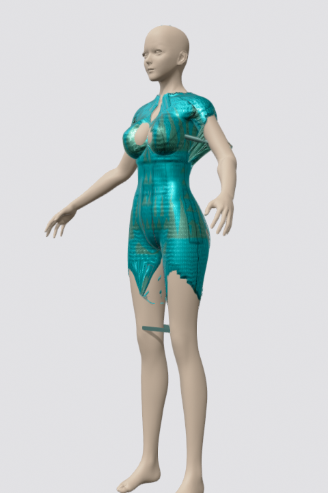</a> 02_three_quarter</td>
    <td align='center'><a href='renders/diverse_bralette_14/03_side_left.png'>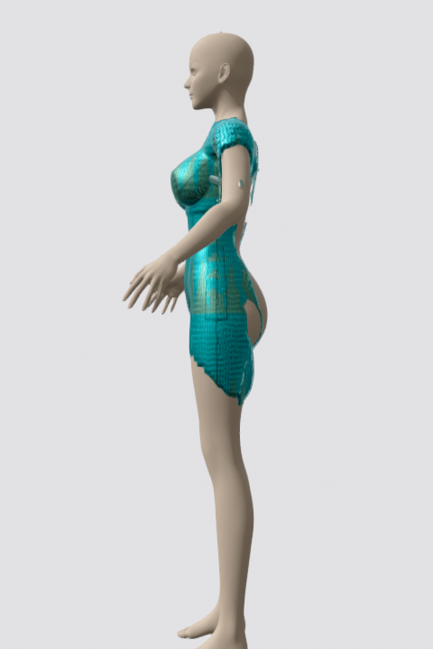</a> 03_side_left</td>
    <td align='center'><a href='renders/diverse_bralette_14/04_back.png'>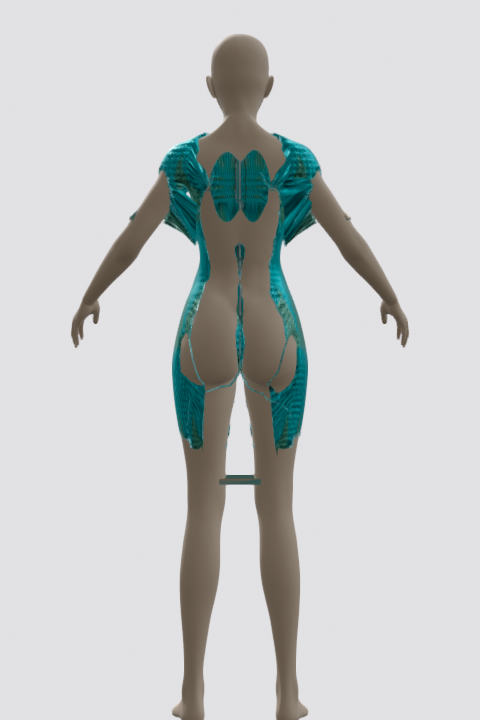</a> 04_back</td>
  </tr>
  <tr>
    <td align='center'><a href='renders/diverse_bralette_14/05_chest_close.png'>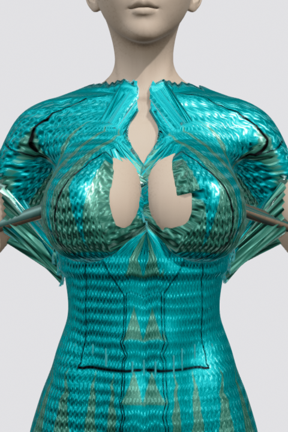</a> 05_chest_close</td>
    <td align='center'><a href='renders/diverse_bralette_14/06_hip_close.png'>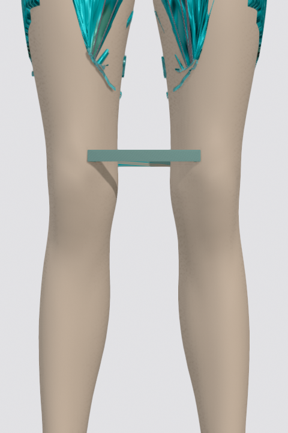</a> 06_hip_close</td>
    <td align='center'><a href='renders/diverse_bralette_14/07_neck_top.png'>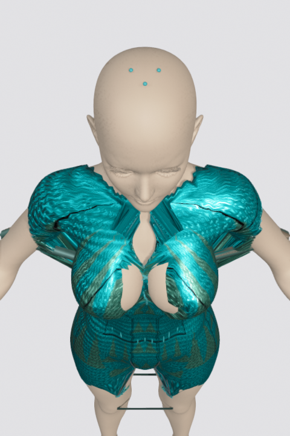</a> 07_neck_top</td>
    <td align='center'><a href='renders/diverse_bralette_14/08_shoulder_top.png'>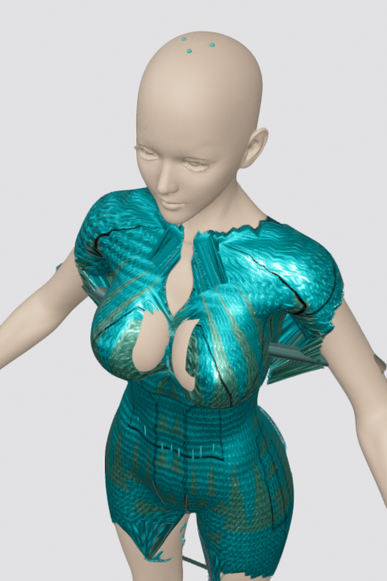</a> 08_shoulder_top</td>
  </tr>
</table>

### archetype: `free` (3)

#### `diverse_bandeau_09`
_style=free  pattern=ombre  src=virgin  weave=mesh_

<table>
  <tr>
    <td align='center'><a href='renders/diverse_bandeau_09/01_front.png'>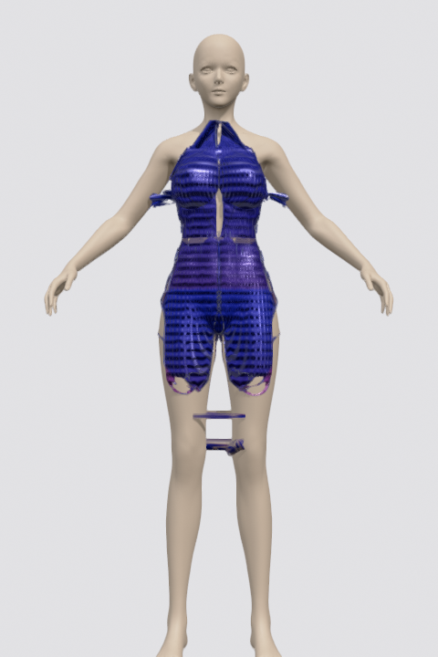</a> 01_front</td>
    <td align='center'><a href='renders/diverse_bandeau_09/02_three_quarter.png'>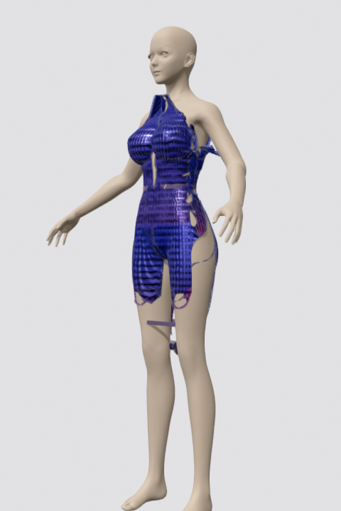</a> 02_three_quarter</td>
    <td align='center'><a href='renders/diverse_bandeau_09/03_side_left.png'>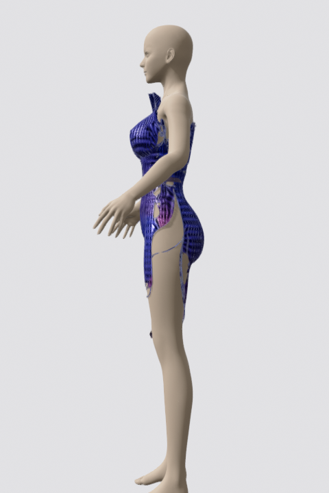</a> 03_side_left</td>
    <td align='center'><a href='renders/diverse_bandeau_09/04_back.png'>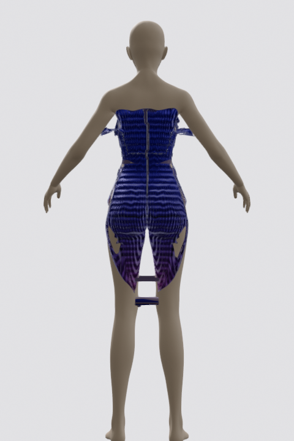</a> 04_back</td>
  </tr>
  <tr>
    <td align='center'><a href='renders/diverse_bandeau_09/05_chest_close.png'>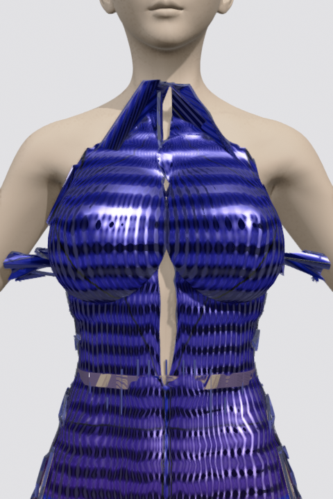</a> 05_chest_close</td>
    <td align='center'><a href='renders/diverse_bandeau_09/06_hip_close.png'>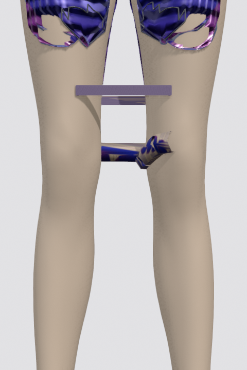</a> 06_hip_close</td>
    <td align='center'><a href='renders/diverse_bandeau_09/07_neck_top.png'>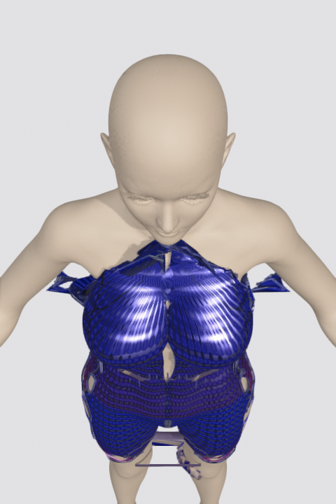</a> 07_neck_top</td>
    <td align='center'><a href='renders/diverse_bandeau_09/08_shoulder_top.png'>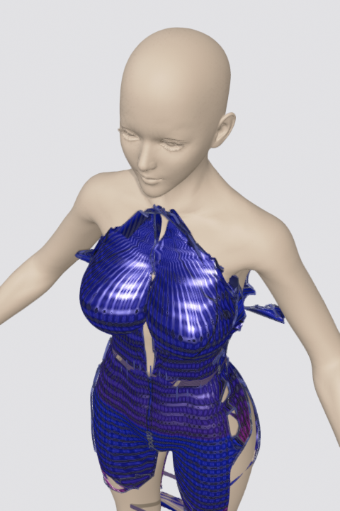</a> 08_shoulder_top</td>
  </tr>
</table>

#### `diverse_one_15`
_style=free  pattern=checker  src=qnova  weave=velvet_

<table>
  <tr>
    <td align='center'><a href='renders/diverse_one_15/01_front.png'>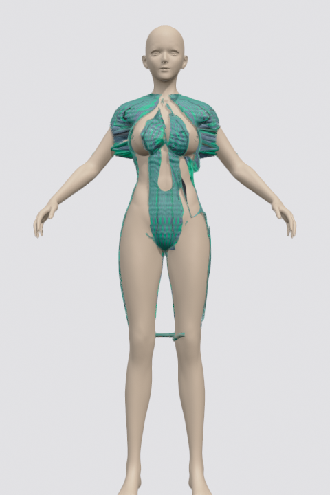</a> 01_front</td>
    <td align='center'><a href='renders/diverse_one_15/02_three_quarter.png'>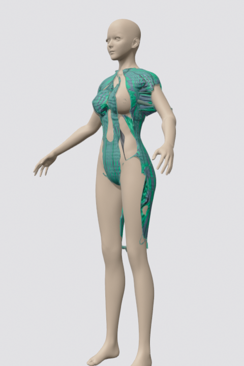</a> 02_three_quarter</td>
    <td align='center'><a href='renders/diverse_one_15/03_side_left.png'>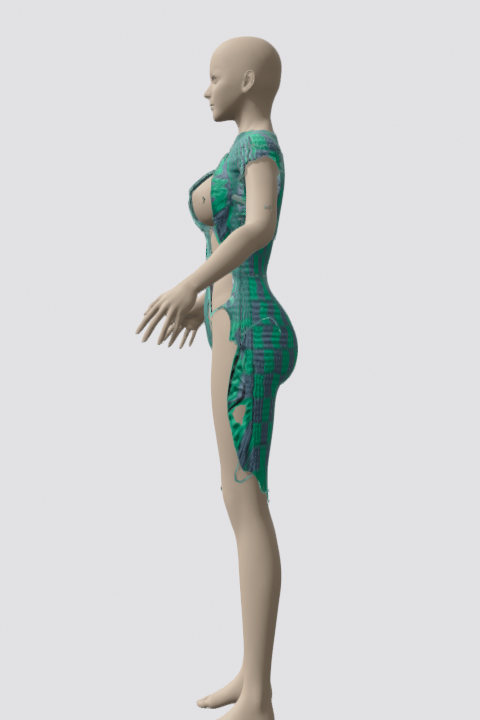</a> 03_side_left</td>
    <td align='center'><a href='renders/diverse_one_15/04_back.png'>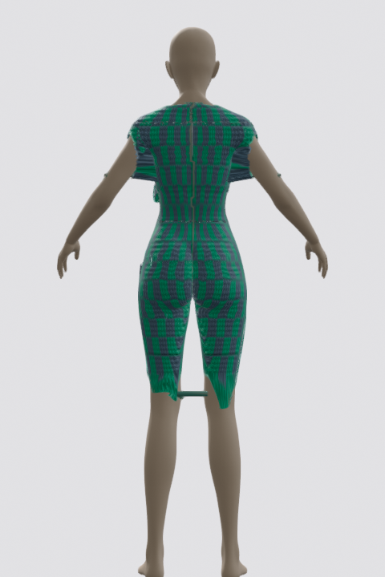</a> 04_back</td>
  </tr>
  <tr>
    <td align='center'><a href='renders/diverse_one_15/05_chest_close.png'>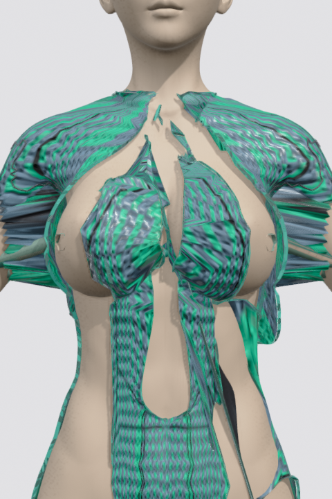</a> 05_chest_close</td>
    <td align='center'><a href='renders/diverse_one_15/06_hip_close.png'>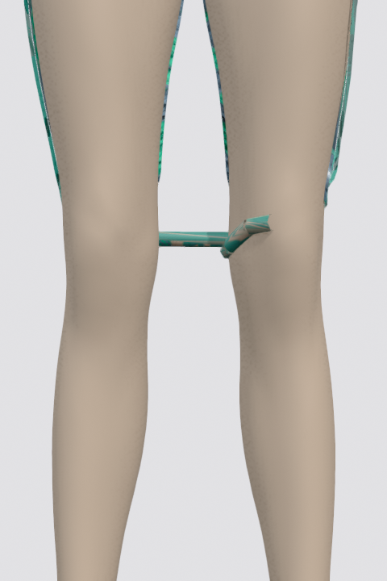</a> 06_hip_close</td>
    <td align='center'><a href='renders/diverse_one_15/07_neck_top.png'>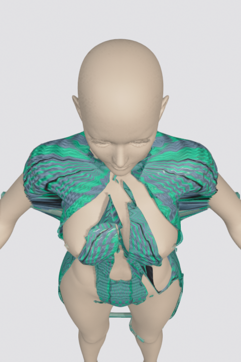</a> 07_neck_top</td>
    <td align='center'><a href='renders/diverse_one_15/08_shoulder_top.png'>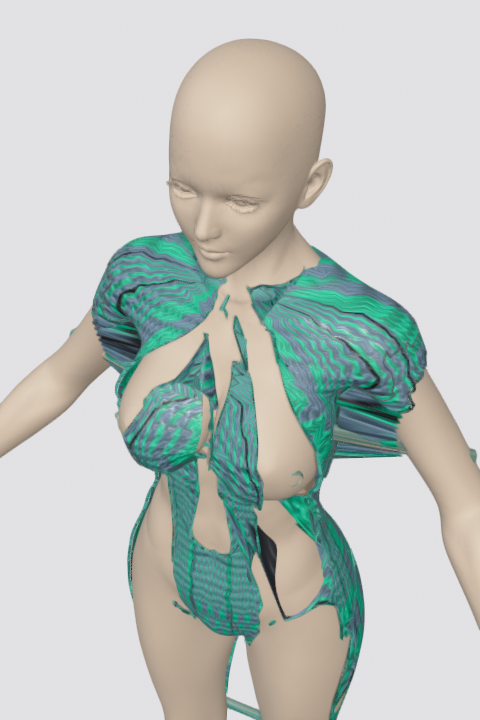</a> 08_shoulder_top</td>
  </tr>
</table>

#### `diverse_triangle_04`
_style=free  pattern=checker  src=biopolymer  weave=shiny_knit_

<table>
  <tr>
    <td align='center'><a href='renders/diverse_triangle_04/01_front.png'>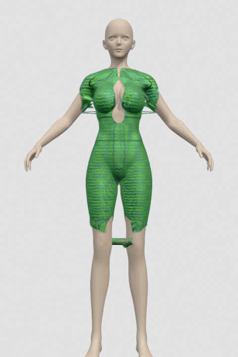</a> 01_front</td>
    <td align='center'><a href='renders/diverse_triangle_04/02_three_quarter.png'>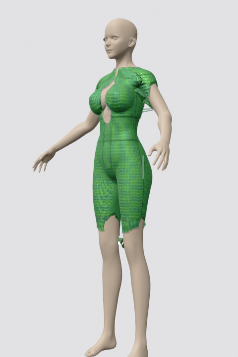</a> 02_three_quarter</td>
    <td align='center'><a href='renders/diverse_triangle_04/03_side_left.png'>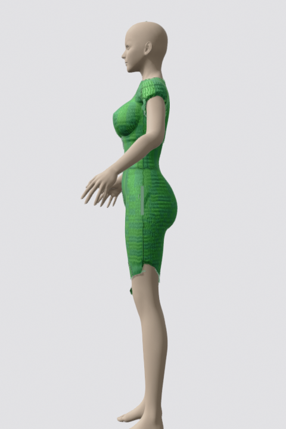</a> 03_side_left</td>
    <td align='center'><a href='renders/diverse_triangle_04/04_back.png'>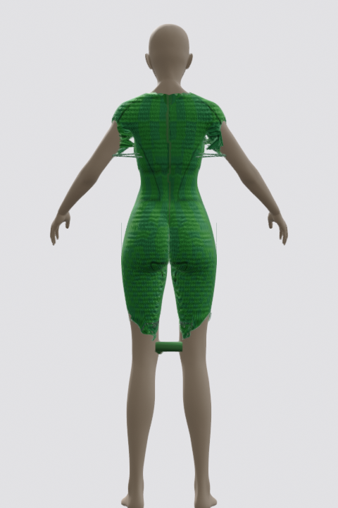</a> 04_back</td>
  </tr>
  <tr>
    <td align='center'><a href='renders/diverse_triangle_04/05_chest_close.png'>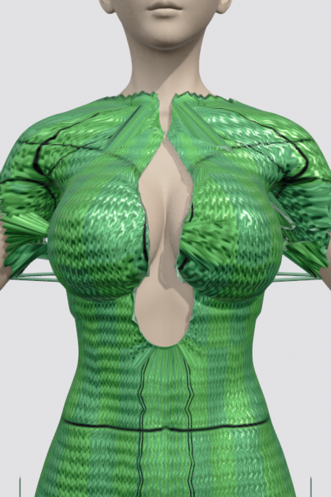</a> 05_chest_close</td>
    <td align='center'><a href='renders/diverse_triangle_04/06_hip_close.png'>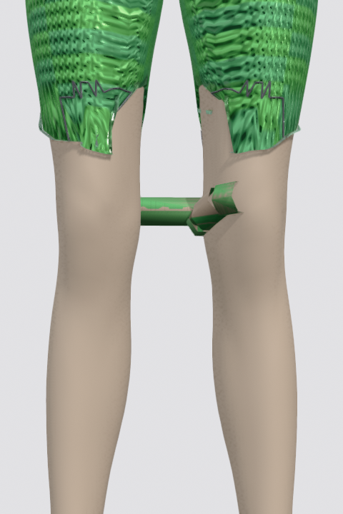</a> 06_hip_close</td>
    <td align='center'><a href='renders/diverse_triangle_04/07_neck_top.png'>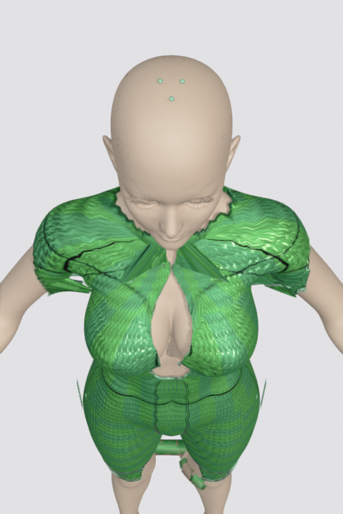</a> 07_neck_top</td>
    <td align='center'><a href='renders/diverse_triangle_04/08_shoulder_top.png'>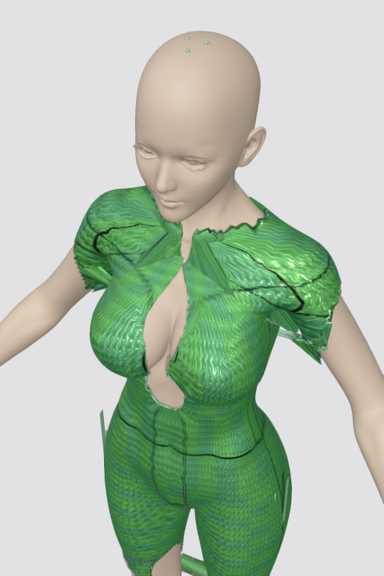</a> 08_shoulder_top</td>
  </tr>
</table>

### archetype: `hunzag_crinkle` (2)

#### `diverse_bandeau_07`
_style=hunzag_crinkle  pattern=polka  src=econyl  weave=crinkle_

<table>
  <tr>
    <td align='center'><a href='renders/diverse_bandeau_07/01_front.png'>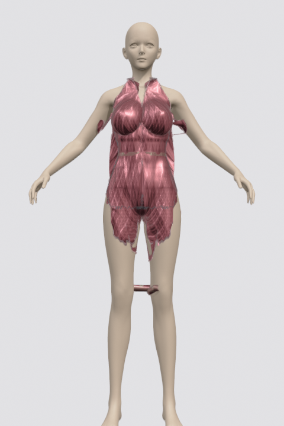</a> 01_front</td>
    <td align='center'><a href='renders/diverse_bandeau_07/02_three_quarter.png'>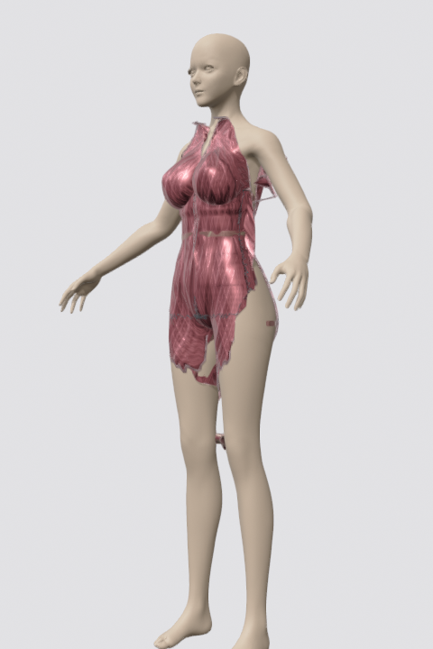</a> 02_three_quarter</td>
    <td align='center'><a href='renders/diverse_bandeau_07/03_side_left.png'>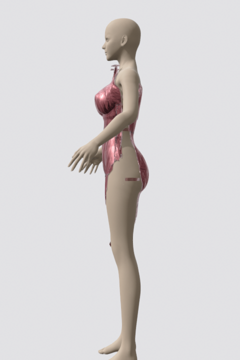</a> 03_side_left</td>
    <td align='center'><a href='renders/diverse_bandeau_07/04_back.png'>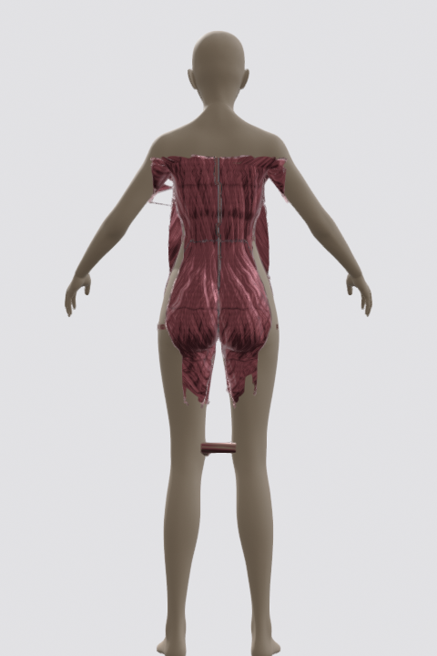</a> 04_back</td>
  </tr>
  <tr>
    <td align='center'><a href='renders/diverse_bandeau_07/05_chest_close.png'>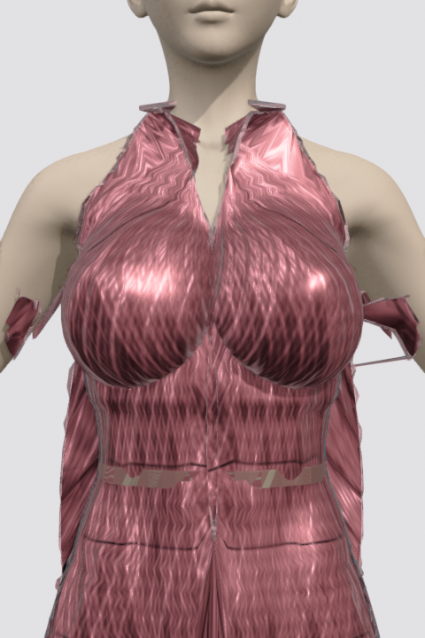</a> 05_chest_close</td>
    <td align='center'><a href='renders/diverse_bandeau_07/06_hip_close.png'>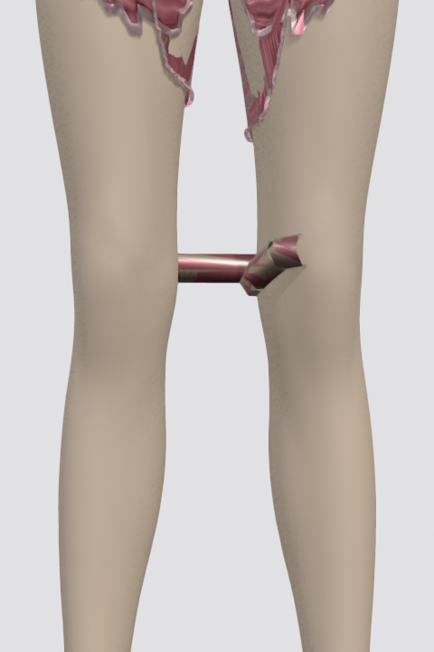</a> 06_hip_close</td>
    <td align='center'><a href='renders/diverse_bandeau_07/07_neck_top.png'>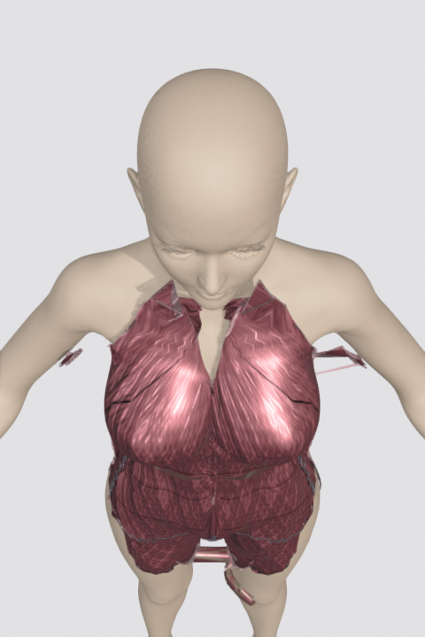</a> 07_neck_top</td>
    <td align='center'><a href='renders/diverse_bandeau_07/08_shoulder_top.png'>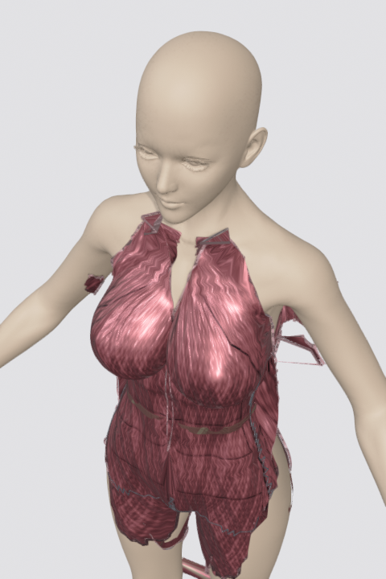</a> 08_shoulder_top</td>
  </tr>
</table>

#### `diverse_triangle_01`
_style=hunzag_crinkle  pattern=leopard  src=econyl  weave=crinkle_

<table>
  <tr>
    <td align='center'><a href='renders/diverse_triangle_01/01_front.png'>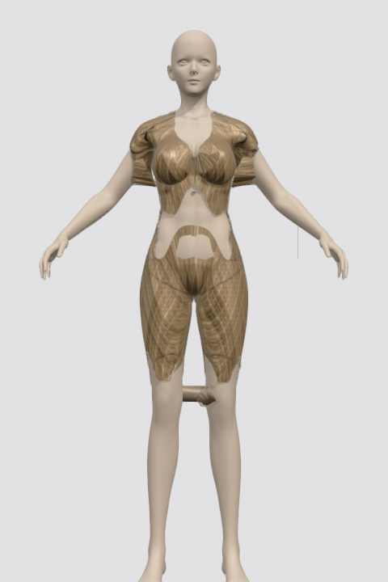</a> 01_front</td>
    <td align='center'><a href='renders/diverse_triangle_01/02_three_quarter.png'>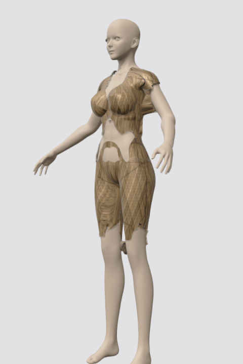</a> 02_three_quarter</td>
    <td align='center'><a href='renders/diverse_triangle_01/03_side_left.png'>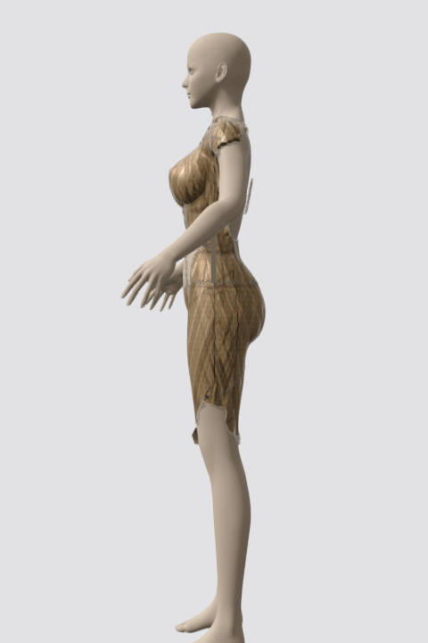</a> 03_side_left</td>
    <td align='center'><a href='renders/diverse_triangle_01/04_back.png'>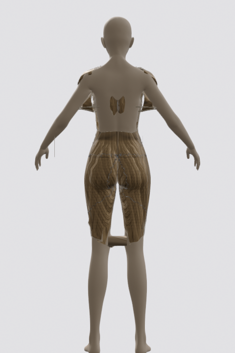</a> 04_back</td>
  </tr>
  <tr>
    <td align='center'><a href='renders/diverse_triangle_01/05_chest_close.png'>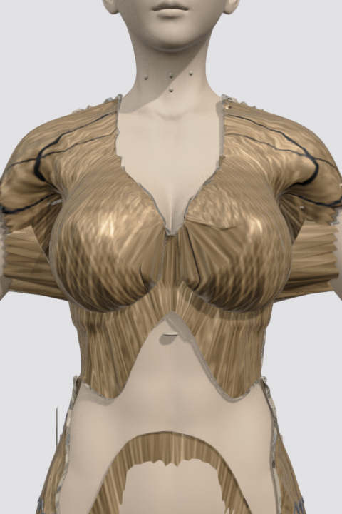</a> 05_chest_close</td>
    <td align='center'><a href='renders/diverse_triangle_01/06_hip_close.png'>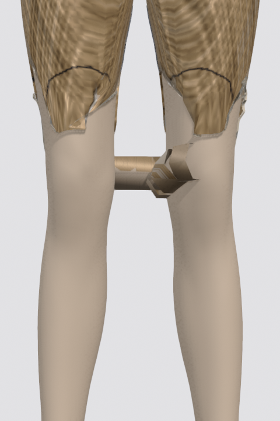</a> 06_hip_close</td>
    <td align='center'><a href='renders/diverse_triangle_01/07_neck_top.png'>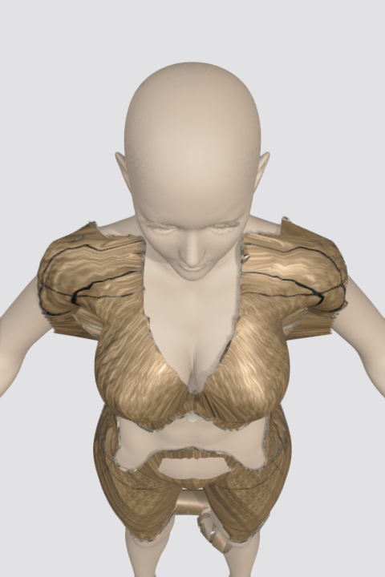</a> 07_neck_top</td>
    <td align='center'><a href='renders/diverse_triangle_01/08_shoulder_top.png'>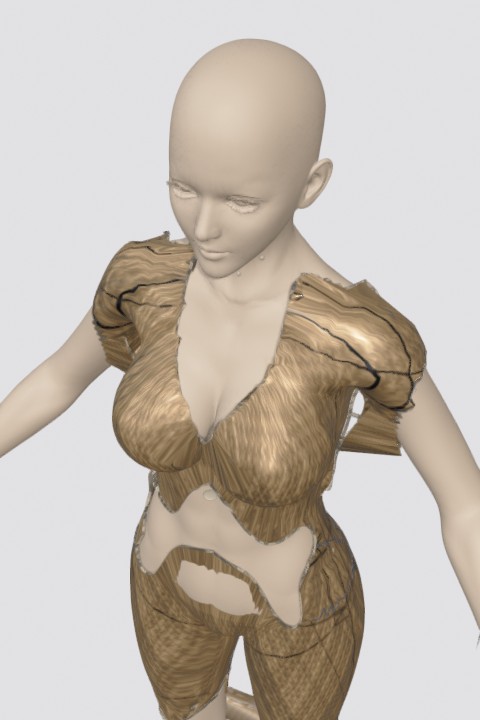</a> 08_shoulder_top</td>
  </tr>
</table>

### archetype: `italian_luxe` (3)

#### `diverse_one_18`
_style=italian_luxe  pattern=tie_dye  src=amni_soul  weave=shiny_knit_

<table>
  <tr>
    <td align='center'><a href='renders/diverse_one_18/01_front.png'>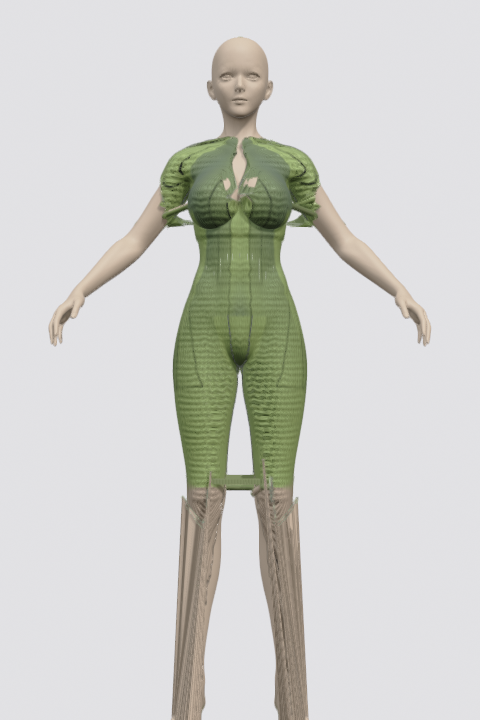</a> 01_front</td>
    <td align='center'><a href='renders/diverse_one_18/02_three_quarter.png'>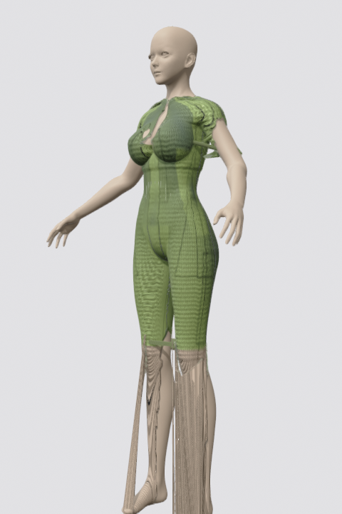</a> 02_three_quarter</td>
    <td align='center'><a href='renders/diverse_one_18/03_side_left.png'>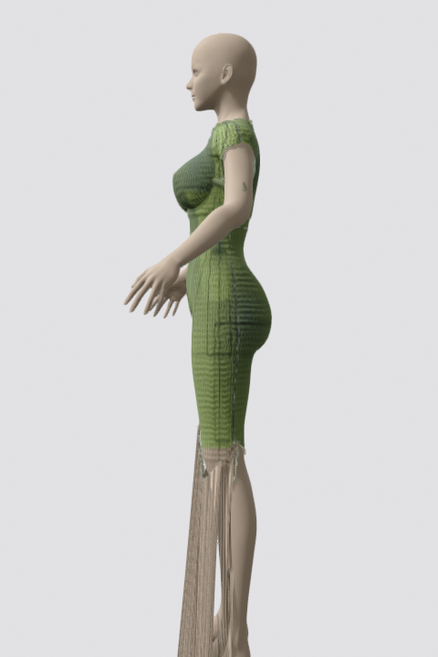</a> 03_side_left</td>
    <td align='center'><a href='renders/diverse_one_18/04_back.png'>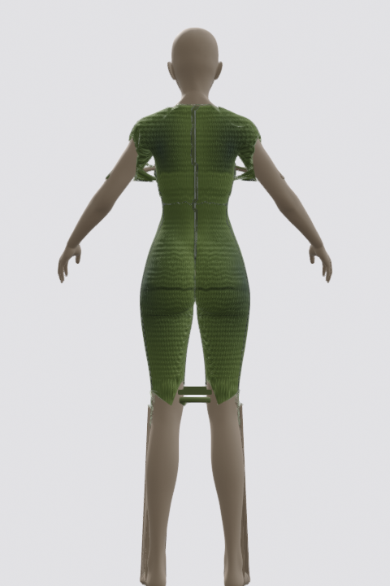</a> 04_back</td>
  </tr>
  <tr>
    <td align='center'><a href='renders/diverse_one_18/05_chest_close.png'>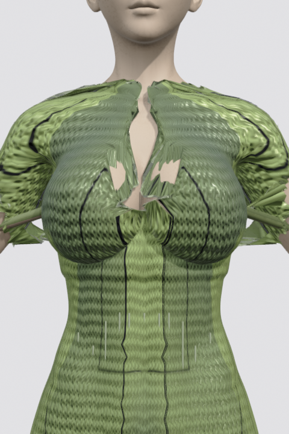</a> 05_chest_close</td>
    <td align='center'><a href='renders/diverse_one_18/06_hip_close.png'>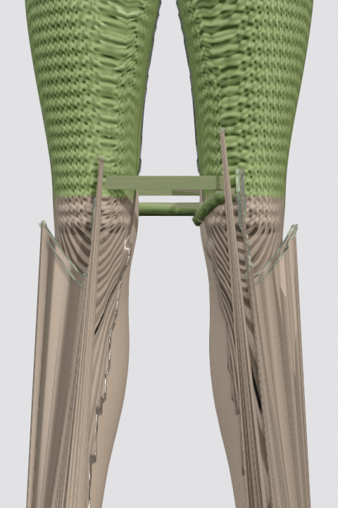</a> 06_hip_close</td>
    <td align='center'><a href='renders/diverse_one_18/07_neck_top.png'>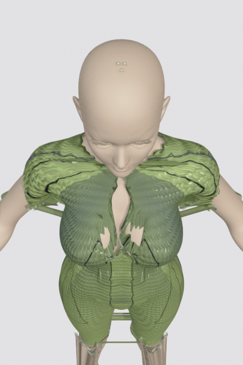</a> 07_neck_top</td>
    <td align='center'><a href='renders/diverse_one_18/08_shoulder_top.png'>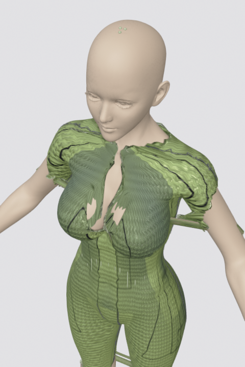</a> 08_shoulder_top</td>
  </tr>
</table>

#### `diverse_one_19`
_style=italian_luxe  pattern=tropical  src=virgin  weave=crochet_

<table>
  <tr>
    <td align='center'><a href='renders/diverse_one_19/01_front.png'>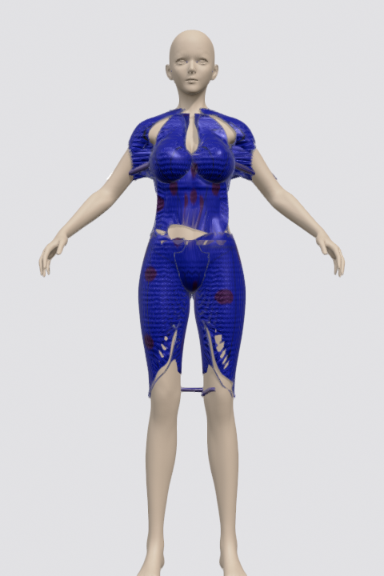</a> 01_front</td>
    <td align='center'><a href='renders/diverse_one_19/02_three_quarter.png'>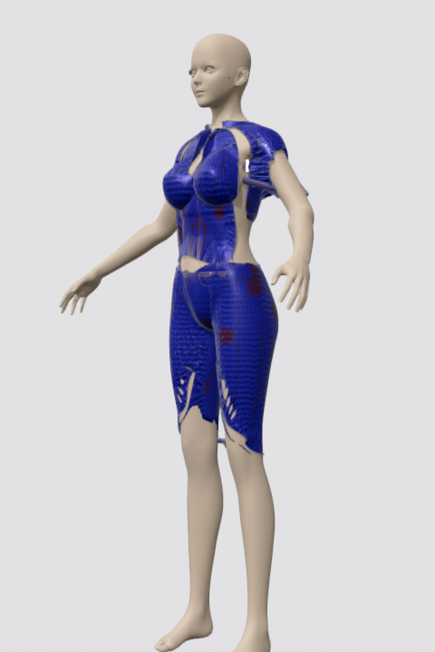</a> 02_three_quarter</td>
    <td align='center'><a href='renders/diverse_one_19/03_side_left.png'>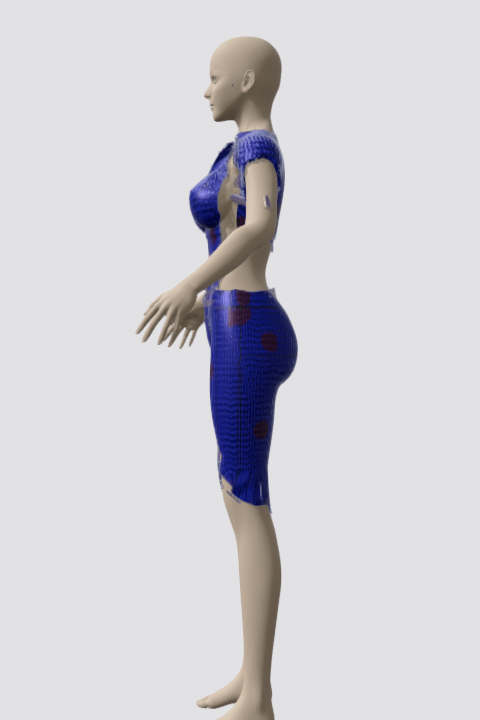</a> 03_side_left</td>
    <td align='center'><a href='renders/diverse_one_19/04_back.png'>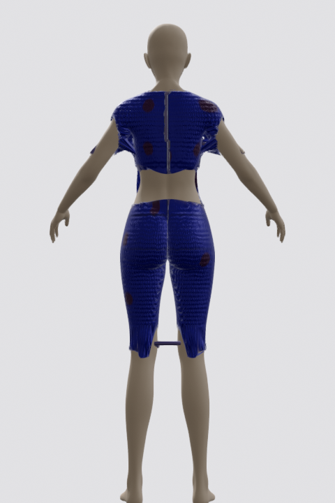</a> 04_back</td>
  </tr>
  <tr>
    <td align='center'><a href='renders/diverse_one_19/05_chest_close.png'>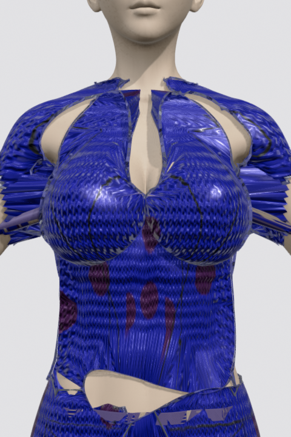</a> 05_chest_close</td>
    <td align='center'><a href='renders/diverse_one_19/06_hip_close.png'>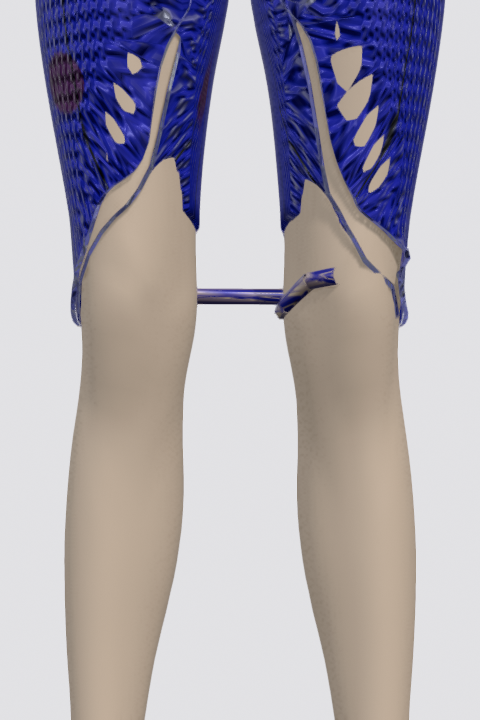</a> 06_hip_close</td>
    <td align='center'><a href='renders/diverse_one_19/07_neck_top.png'>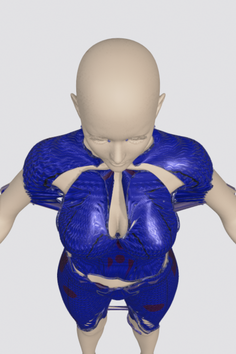</a> 07_neck_top</td>
    <td align='center'><a href='renders/diverse_one_19/08_shoulder_top.png'>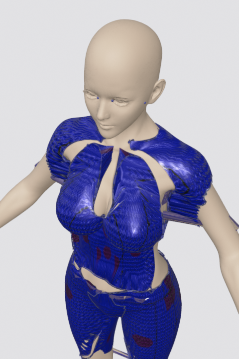</a> 08_shoulder_top</td>
  </tr>
</table>

#### `diverse_triangle_02`
_style=italian_luxe  pattern=tie_dye  src=amni_soul  weave=velvet_

<table>
  <tr>
    <td align='center'><a href='renders/diverse_triangle_02/01_front.png'>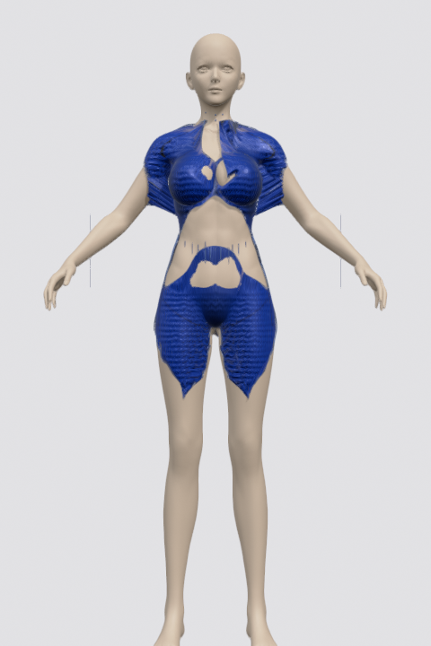</a> 01_front</td>
    <td align='center'><a href='renders/diverse_triangle_02/02_three_quarter.png'>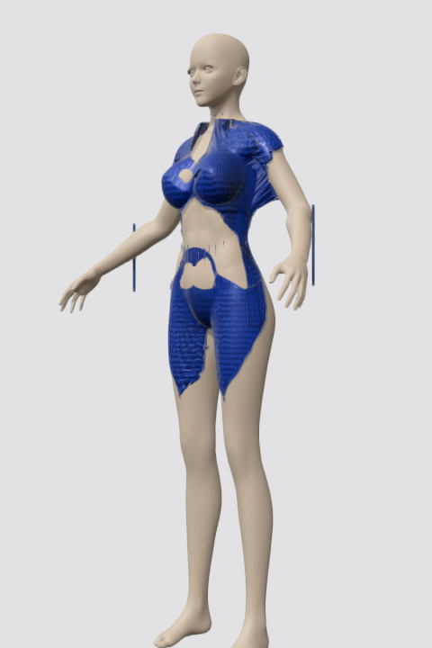</a> 02_three_quarter</td>
    <td align='center'><a href='renders/diverse_triangle_02/03_side_left.png'>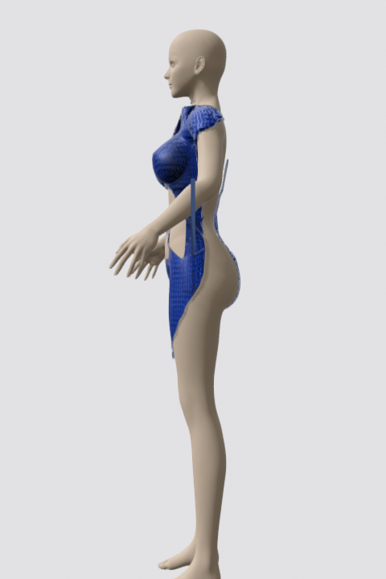</a> 03_side_left</td>
    <td align='center'><a href='renders/diverse_triangle_02/04_back.png'>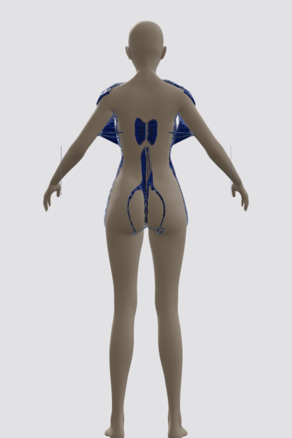</a> 04_back</td>
  </tr>
  <tr>
    <td align='center'><a href='renders/diverse_triangle_02/05_chest_close.png'>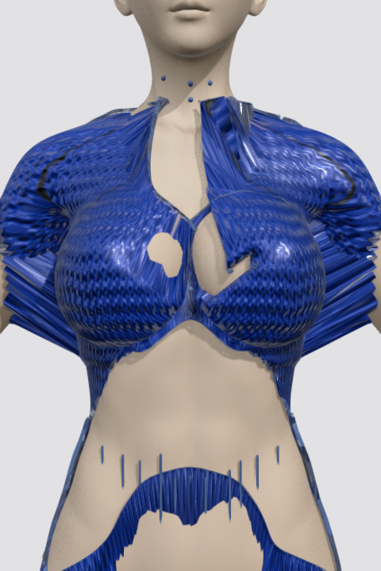</a> 05_chest_close</td>
    <td align='center'><a href='renders/diverse_triangle_02/06_hip_close.png'>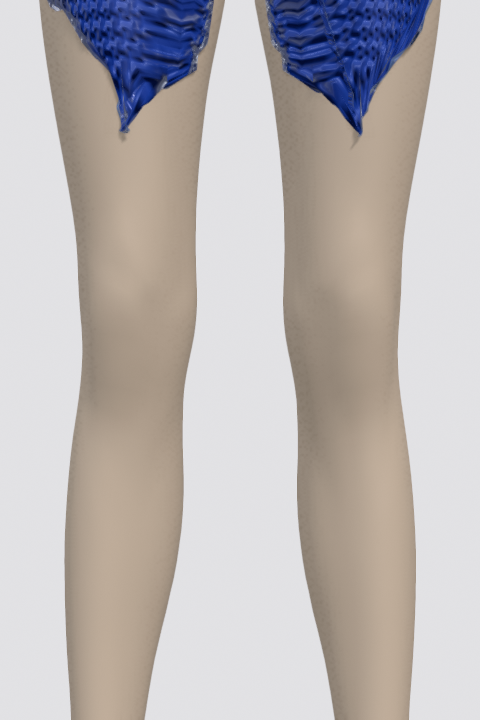</a> 06_hip_close</td>
    <td align='center'><a href='renders/diverse_triangle_02/07_neck_top.png'>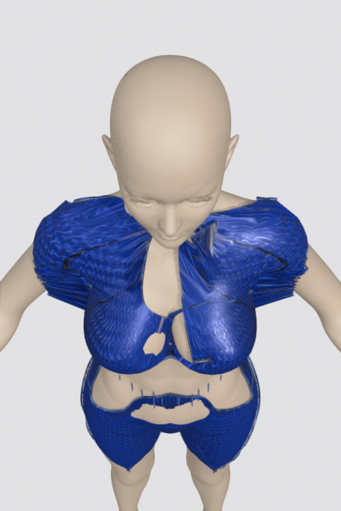</a> 07_neck_top</td>
    <td align='center'><a href='renders/diverse_triangle_02/08_shoulder_top.png'>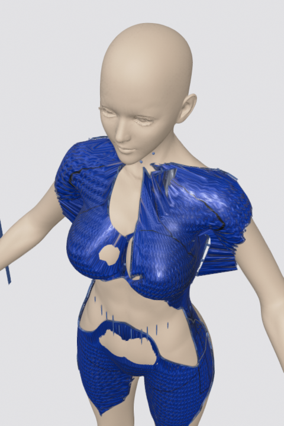</a> 08_shoulder_top</td>
  </tr>
</table>

### archetype: `japanese_minimal` (1)

#### `diverse_bralette_10`
_style=japanese_minimal  pattern=polka  src=biopolymer  weave=plain_

<table>
  <tr>
    <td align='center'><a href='renders/diverse_bralette_10/01_front.png'>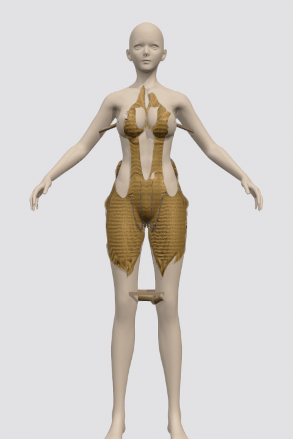</a> 01_front</td>
    <td align='center'><a href='renders/diverse_bralette_10/02_three_quarter.png'>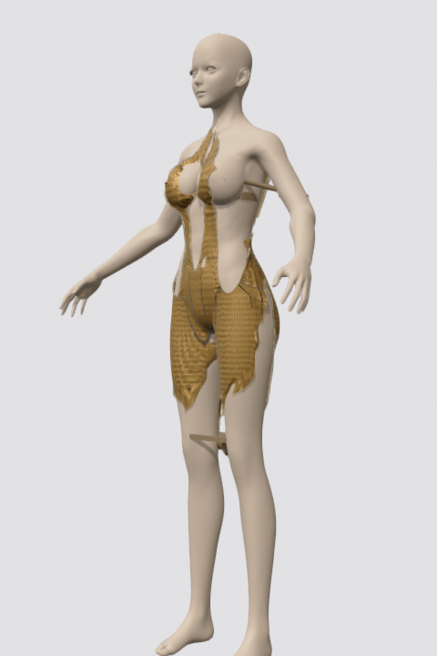</a> 02_three_quarter</td>
    <td align='center'><a href='renders/diverse_bralette_10/03_side_left.png'>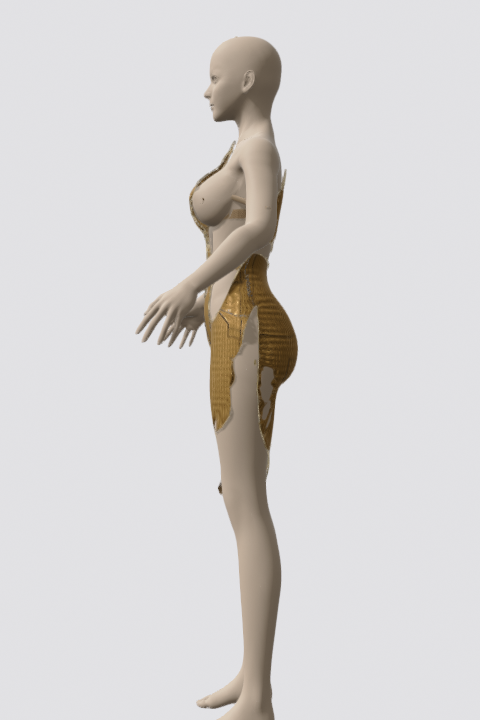</a> 03_side_left</td>
    <td align='center'><a href='renders/diverse_bralette_10/04_back.png'>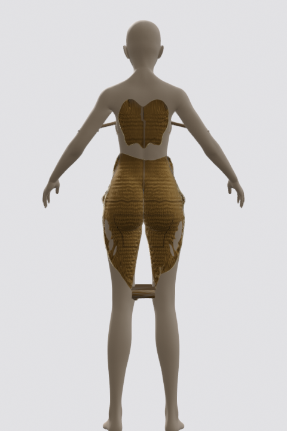</a> 04_back</td>
  </tr>
  <tr>
    <td align='center'><a href='renders/diverse_bralette_10/05_chest_close.png'>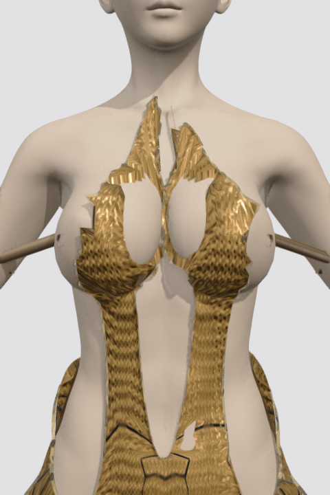</a> 05_chest_close</td>
    <td align='center'><a href='renders/diverse_bralette_10/06_hip_close.png'>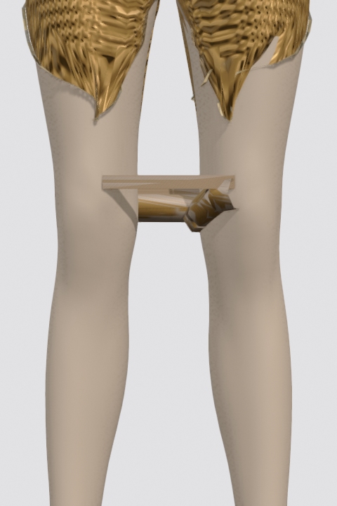</a> 06_hip_close</td>
    <td align='center'><a href='renders/diverse_bralette_10/07_neck_top.png'>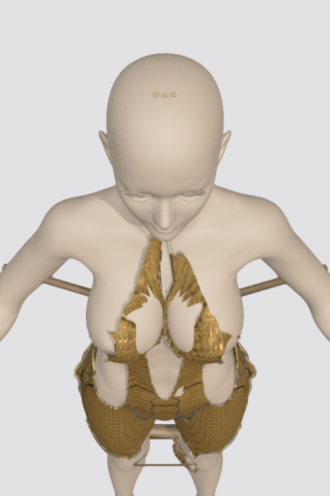</a> 07_neck_top</td>
    <td align='center'><a href='renders/diverse_bralette_10/08_shoulder_top.png'>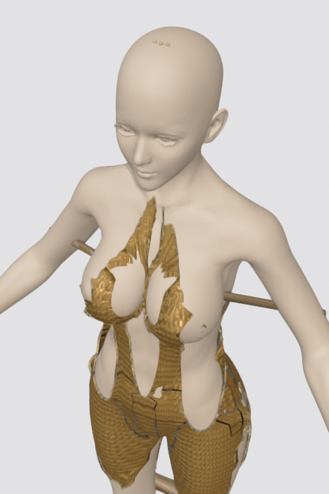</a> 08_shoulder_top</td>
  </tr>
</table>

### archetype: `retro_missoni` (3)

#### `diverse_bandeau_06`
_style=retro_missoni  pattern=floral  src=cotton_blend  weave=shiny_knit_

<table>
  <tr>
    <td align='center'><a href='renders/diverse_bandeau_06/01_front.png'>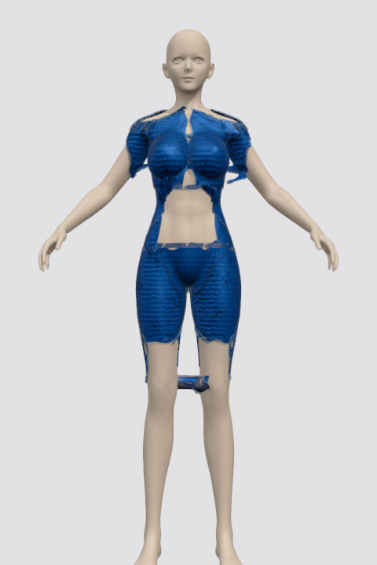</a> 01_front</td>
    <td align='center'><a href='renders/diverse_bandeau_06/02_three_quarter.png'>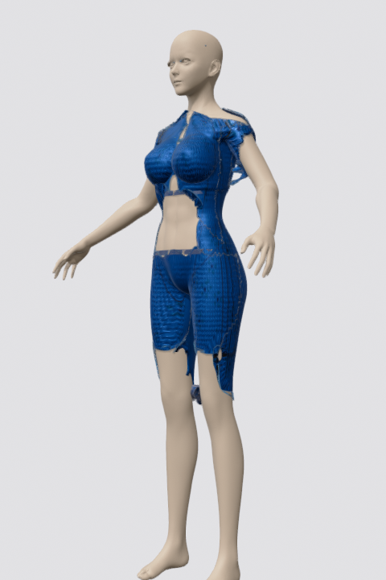</a> 02_three_quarter</td>
    <td align='center'><a href='renders/diverse_bandeau_06/03_side_left.png'>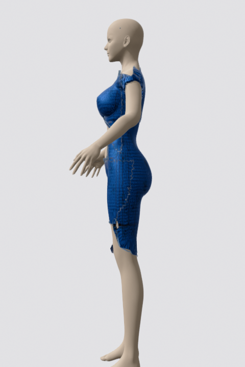</a> 03_side_left</td>
    <td align='center'><a href='renders/diverse_bandeau_06/04_back.png'>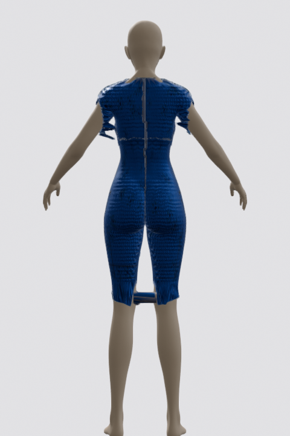</a> 04_back</td>
  </tr>
  <tr>
    <td align='center'><a href='renders/diverse_bandeau_06/05_chest_close.png'>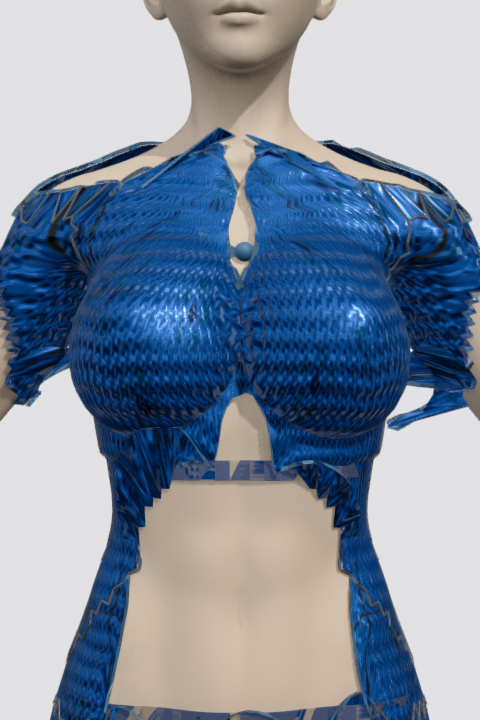</a> 05_chest_close</td>
    <td align='center'><a href='renders/diverse_bandeau_06/06_hip_close.png'>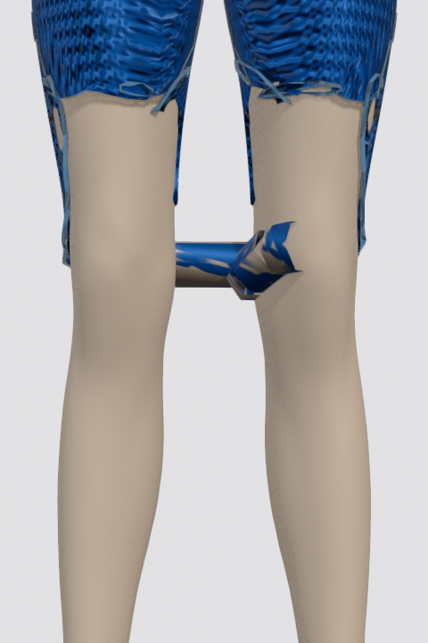</a> 06_hip_close</td>
    <td align='center'><a href='renders/diverse_bandeau_06/07_neck_top.png'>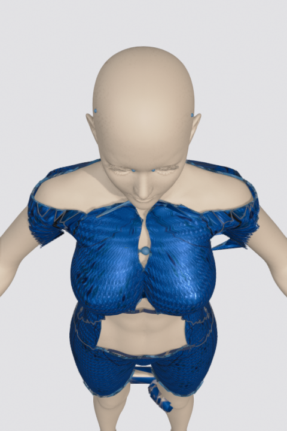</a> 07_neck_top</td>
    <td align='center'><a href='renders/diverse_bandeau_06/08_shoulder_top.png'>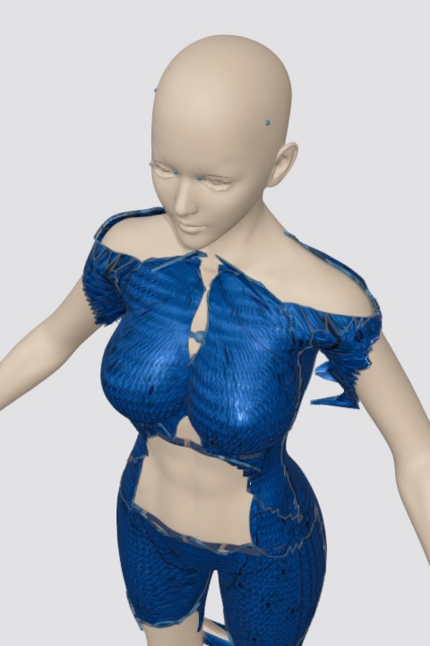</a> 08_shoulder_top</td>
  </tr>
</table>

#### `diverse_bralette_12`
_style=retro_missoni  pattern=herringbone  src=amni_soul  weave=shiny_knit_

<table>
  <tr>
    <td align='center'><a href='renders/diverse_bralette_12/01_front.png'>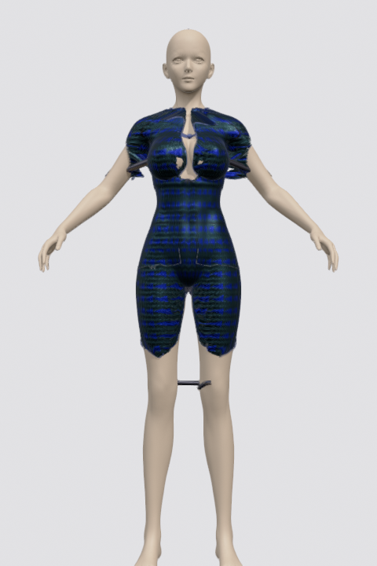</a> 01_front</td>
    <td align='center'><a href='renders/diverse_bralette_12/02_three_quarter.png'>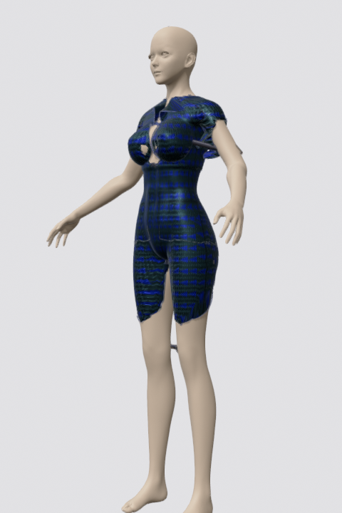</a> 02_three_quarter</td>
    <td align='center'><a href='renders/diverse_bralette_12/03_side_left.png'>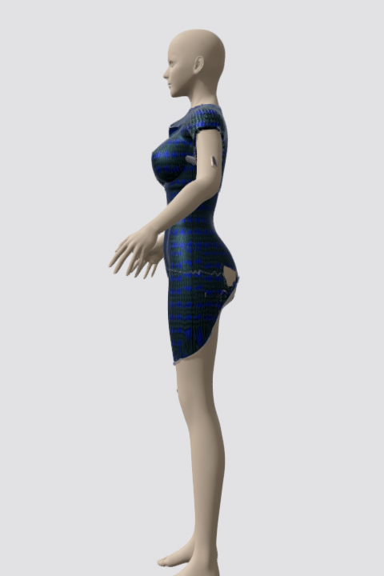</a> 03_side_left</td>
    <td align='center'><a href='renders/diverse_bralette_12/04_back.png'>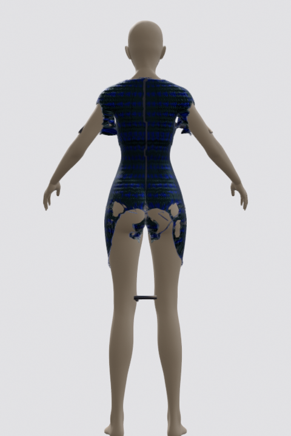</a> 04_back</td>
  </tr>
  <tr>
    <td align='center'><a href='renders/diverse_bralette_12/05_chest_close.png'>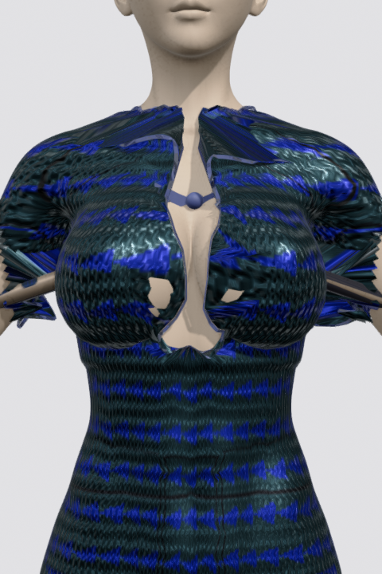</a> 05_chest_close</td>
    <td align='center'><a href='renders/diverse_bralette_12/06_hip_close.png'>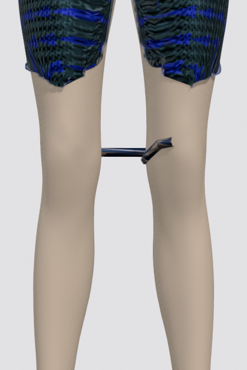</a> 06_hip_close</td>
    <td align='center'><a href='renders/diverse_bralette_12/07_neck_top.png'>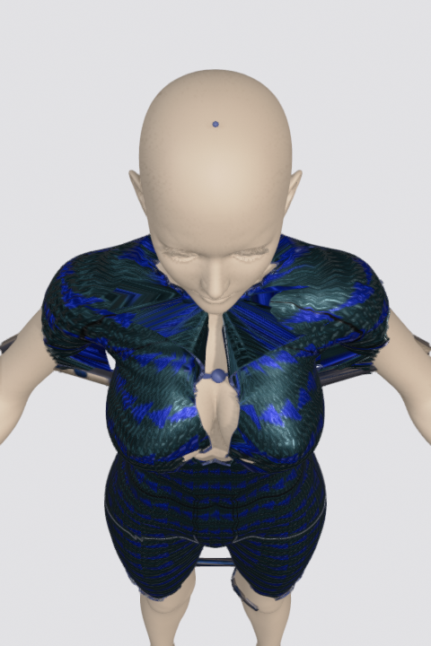</a> 07_neck_top</td>
    <td align='center'><a href='renders/diverse_bralette_12/08_shoulder_top.png'>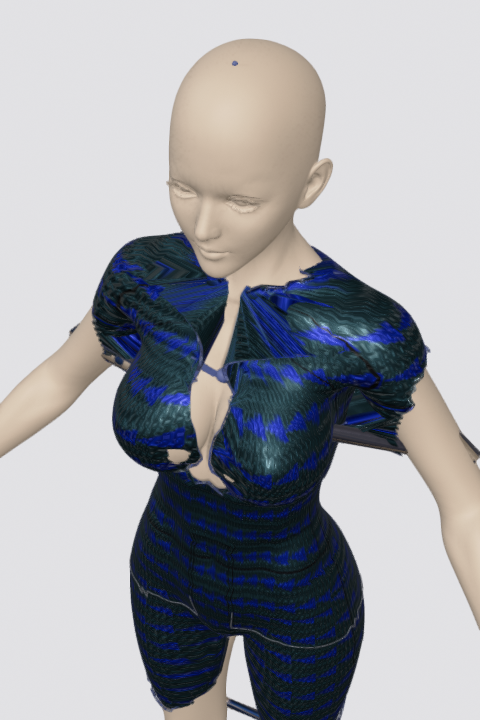</a> 08_shoulder_top</td>
  </tr>
</table>

#### `diverse_one_17`
_style=retro_missoni  pattern=stripe  src=econyl  weave=ribbed_

<table>
  <tr>
    <td align='center'><a href='renders/diverse_one_17/01_front.png'>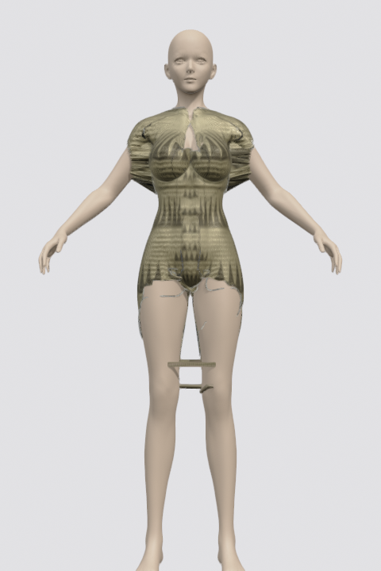</a> 01_front</td>
    <td align='center'><a href='renders/diverse_one_17/02_three_quarter.png'>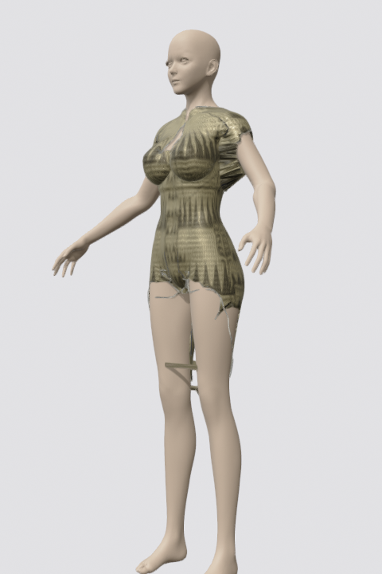</a> 02_three_quarter</td>
    <td align='center'><a href='renders/diverse_one_17/03_side_left.png'>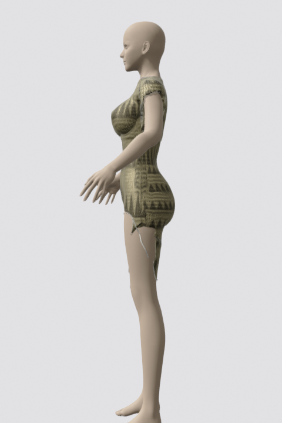</a> 03_side_left</td>
    <td align='center'><a href='renders/diverse_one_17/04_back.png'>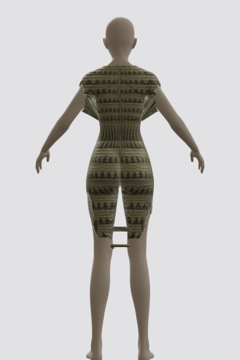</a> 04_back</td>
  </tr>
  <tr>
    <td align='center'><a href='renders/diverse_one_17/05_chest_close.png'>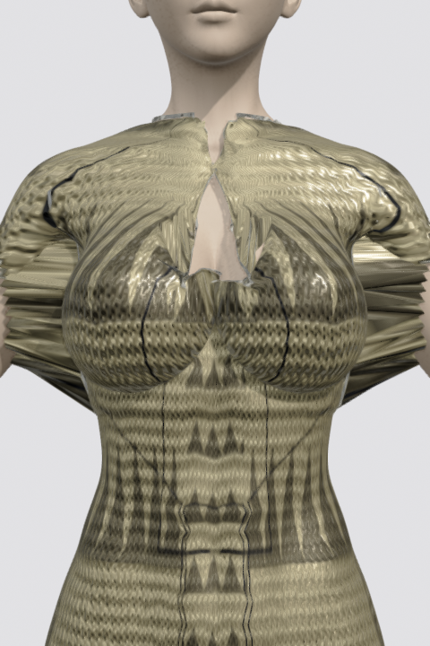</a> 05_chest_close</td>
    <td align='center'><a href='renders/diverse_one_17/06_hip_close.png'>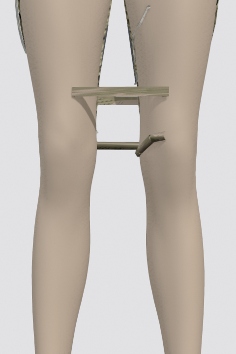</a> 06_hip_close</td>
    <td align='center'><a href='renders/diverse_one_17/07_neck_top.png'>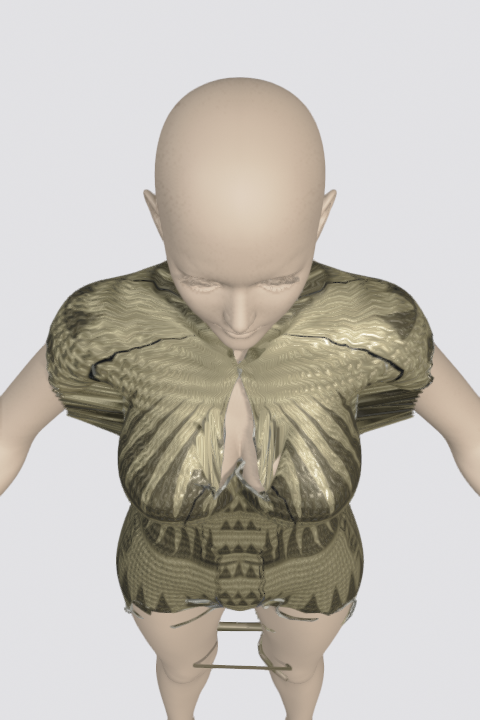</a> 07_neck_top</td>
    <td align='center'><a href='renders/diverse_one_17/08_shoulder_top.png'>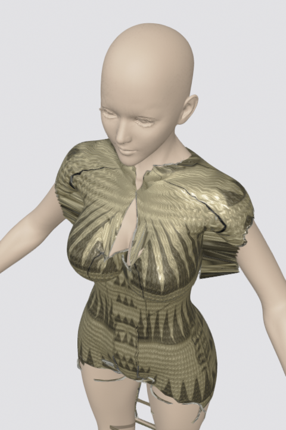</a> 08_shoulder_top</td>
  </tr>
</table>

### archetype: `spanish_mediterranean` (2)

#### `diverse_bandeau_08`
_style=spanish_mediterranean  pattern=herringbone  src=qnova  weave=crochet_

<table>
  <tr>
    <td align='center'><a href='renders/diverse_bandeau_08/01_front.png'>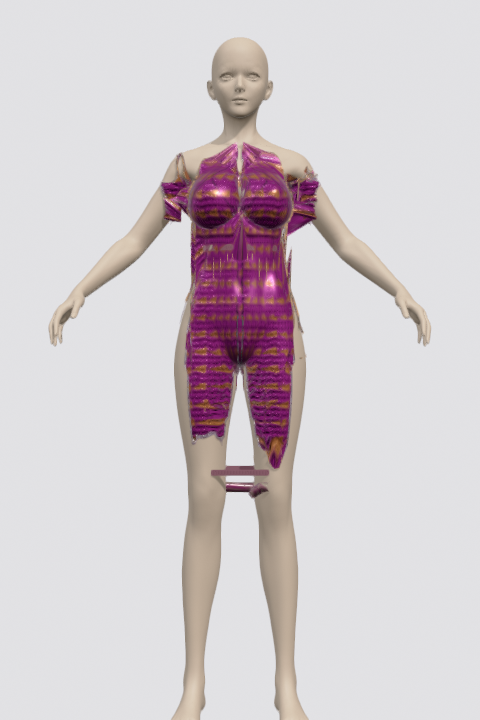</a> 01_front</td>
    <td align='center'><a href='renders/diverse_bandeau_08/02_three_quarter.png'>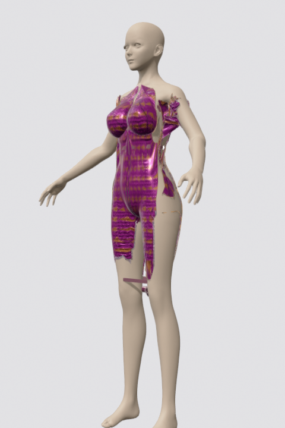</a> 02_three_quarter</td>
    <td align='center'><a href='renders/diverse_bandeau_08/03_side_left.png'>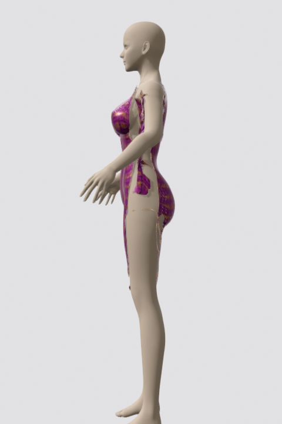</a> 03_side_left</td>
    <td align='center'><a href='renders/diverse_bandeau_08/04_back.png'>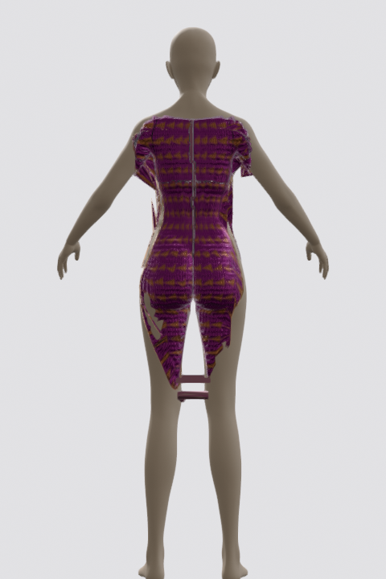</a> 04_back</td>
  </tr>
  <tr>
    <td align='center'><a href='renders/diverse_bandeau_08/05_chest_close.png'>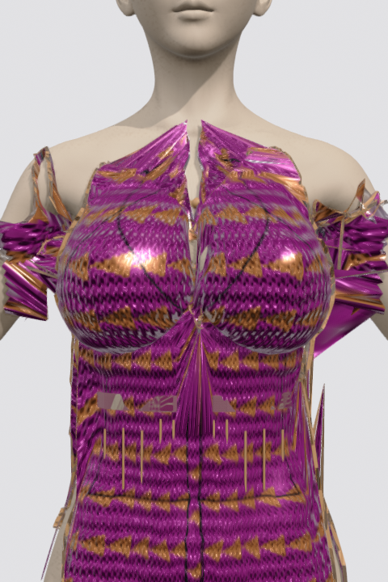</a> 05_chest_close</td>
    <td align='center'><a href='renders/diverse_bandeau_08/06_hip_close.png'>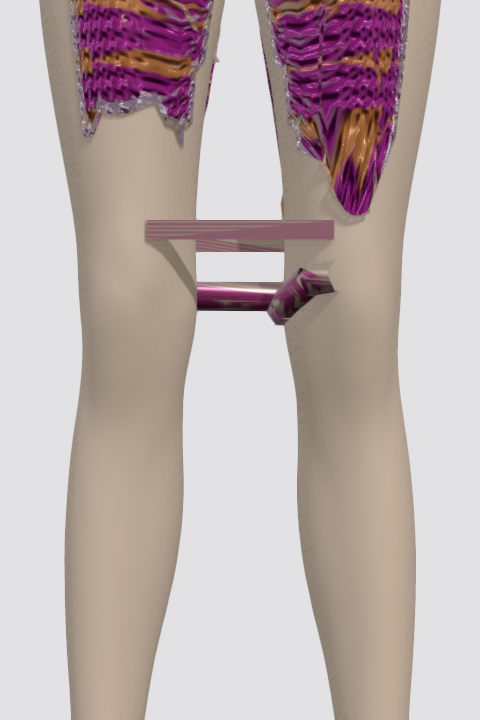</a> 06_hip_close</td>
    <td align='center'><a href='renders/diverse_bandeau_08/07_neck_top.png'>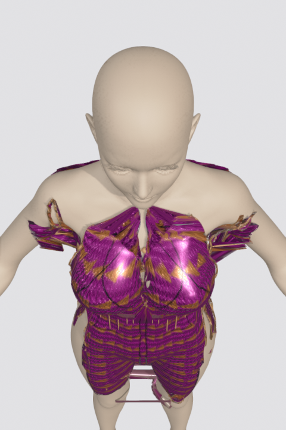</a> 07_neck_top</td>
    <td align='center'><a href='renders/diverse_bandeau_08/08_shoulder_top.png'>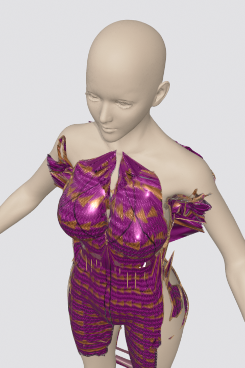</a> 08_shoulder_top</td>
  </tr>
</table>

#### `diverse_bralette_13`
_style=spanish_mediterranean  pattern=solid  src=cotton_blend  weave=shiny_knit_

<table>
  <tr>
    <td align='center'><a href='renders/diverse_bralette_13/01_front.png'>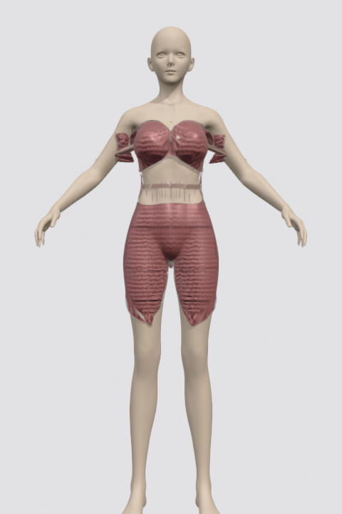</a> 01_front</td>
    <td align='center'><a href='renders/diverse_bralette_13/02_three_quarter.png'>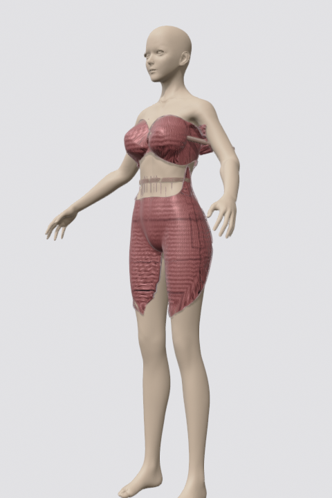</a> 02_three_quarter</td>
    <td align='center'><a href='renders/diverse_bralette_13/03_side_left.png'>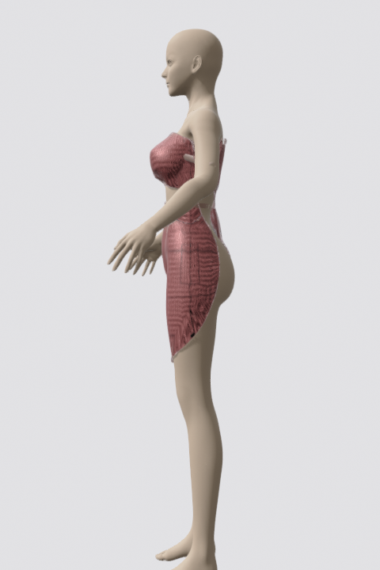</a> 03_side_left</td>
    <td align='center'><a href='renders/diverse_bralette_13/04_back.png'>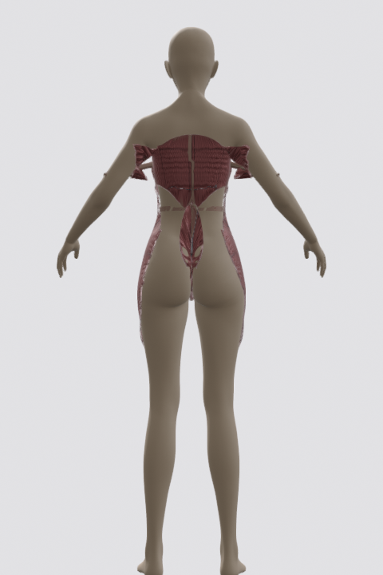</a> 04_back</td>
  </tr>
  <tr>
    <td align='center'><a href='renders/diverse_bralette_13/05_chest_close.png'>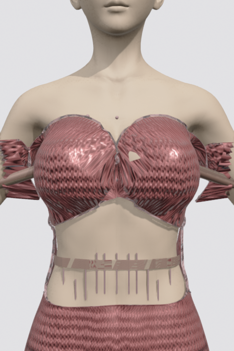</a> 05_chest_close</td>
    <td align='center'><a href='renders/diverse_bralette_13/06_hip_close.png'>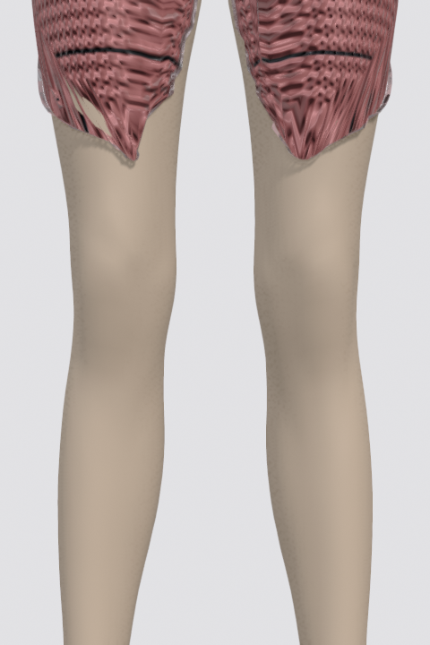</a> 06_hip_close</td>
    <td align='center'><a href='renders/diverse_bralette_13/07_neck_top.png'>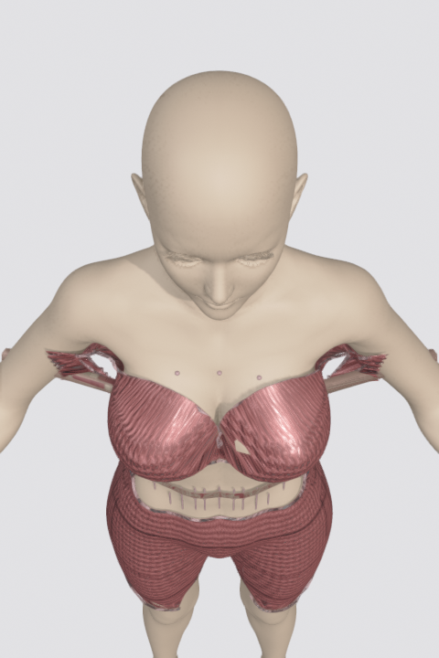</a> 07_neck_top</td>
    <td align='center'><a href='renders/diverse_bralette_13/08_shoulder_top.png'>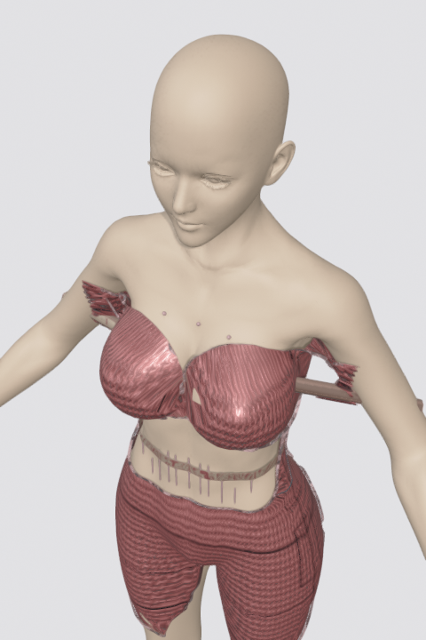</a> 08_shoulder_top</td>
  </tr>
</table>

## Run report

# Diverse seeds — 20 auto-synthesized

Generated by `tools/diverse_seeds.py --samples 80 --keep 5 --seed 42`.

Each archetype gets 5 seeds, picked by greedy farthest-point selection over (style_archetype, pattern, fabric_weave, fabric_source, palette_preset, hardware-bools, hue bucket) from a pool of ~70-75 validated random samples.

| Seed | Archetype | Pattern | Fabric source | Style | overall | +garm |
|---|---|---|---|---|---|---|
| `diverse_bandeau_05` | bandeau_back_band | gingham | amni_soul | boho_cultgaia | 0.837 | 0.815 |
| `diverse_bandeau_06` | bandeau_back_band | floral | cotton_blend | retro_missoni | 0.823 | 0.787 |
| `diverse_bandeau_07` | bandeau_back_band | solid | econyl | hunzag_crinkle | 0.805 | 0.776 |
| `diverse_bandeau_08` | bandeau_back_band | herringbone | qnova | spanish_mediterranean | 0.761 | 0.766 |
| `diverse_bandeau_09` | bandeau_back_band | ombre | virgin | free | 0.788 | 0.765 |
| `diverse_bralette_10` | bralette_shoulder_strap | solid | biopolymer | japanese_minimal | 0.788 | 0.811 |
| `diverse_bralette_11` | bralette_shoulder_strap | gingham | cotton_blend | boho_cultgaia | 0.823 | 0.786 |
| `diverse_bralette_12` | bralette_shoulder_strap | herringbone | amni_soul | retro_missoni | 0.701 | 0.719 |
| `diverse_bralette_13` | bralette_shoulder_strap | solid | cotton_blend | spanish_mediterranean | 0.816 | 0.783 |
| `diverse_bralette_14` | bralette_shoulder_strap | chevron | qnova | brazilian | 0.776 | 0.758 |
| `diverse_one_15` | one_piece_maillot | checker | qnova | free | 0.842 | 0.799 |
| `diverse_one_16` | one_piece_maillot | polka | cotton_blend | boho_cultgaia | 0.726 | 0.744 |
| `diverse_one_17` | one_piece_maillot | chevron | econyl | retro_missoni | 0.771 | 0.754 |
| `diverse_one_18` | one_piece_maillot | tie_dye | amni_soul | italian_luxe | 0.649 | 0.677 |
| `diverse_one_19` | one_piece_maillot | tropical | virgin | italian_luxe | 0.828 | 0.809 |
| `diverse_triangle_00` | triangle_string_halter | stripe | virgin | avantgarde_cutout | 0.892 | 0.861 |
| `diverse_triangle_01` | triangle_string_halter | solid | econyl | hunzag_crinkle | 0.751 | 0.742 |
| `diverse_triangle_02` | triangle_string_halter | tie_dye | amni_soul | italian_luxe | 0.807 | 0.772 |
| `diverse_triangle_03` | triangle_string_halter | polka | amni_soul | boho_cultgaia | 0.824 | 0.806 |
| `diverse_triangle_04` | triangle_string_halter | checker | biopolymer | free | 0.769 | 0.762 |

