# 0918_bodymapping_legs_fixed

_Day: [`2026-04-29/`](../README.md)_  ·  _Seeds: 4_  ·  _Images: 33_

Local interactive viewer: [`index.html`](index.html)  ·  Top: [`tools/output/`](../../README.md)

## Top-level images

### headline.png

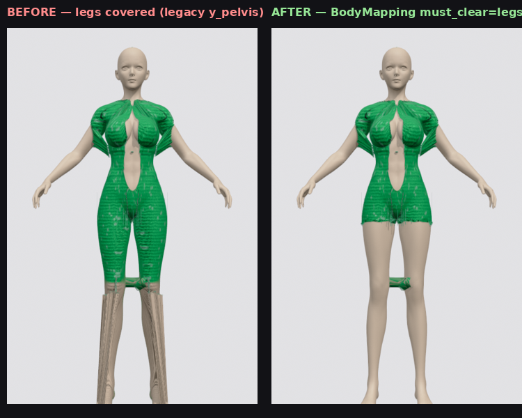

## Seeds (4)

### archetype: `boho_cultgaia` (2)

#### `composite_floral`
_style=boho_cultgaia  pattern=floral  src=biopolymer  weave=plain_

<table>
  <tr>
    <td align='center'><a href='renders/composite_floral/01_front.png'>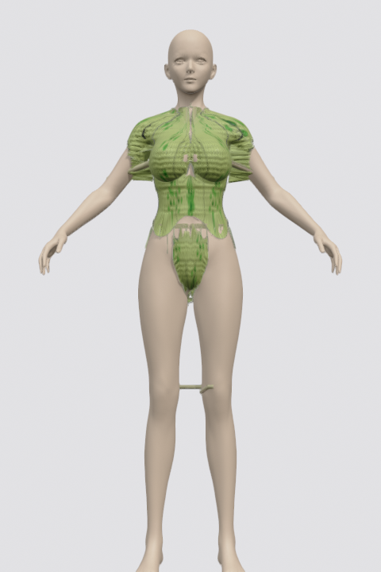</a> 01_front</td>
    <td align='center'><a href='renders/composite_floral/02_three_quarter.png'>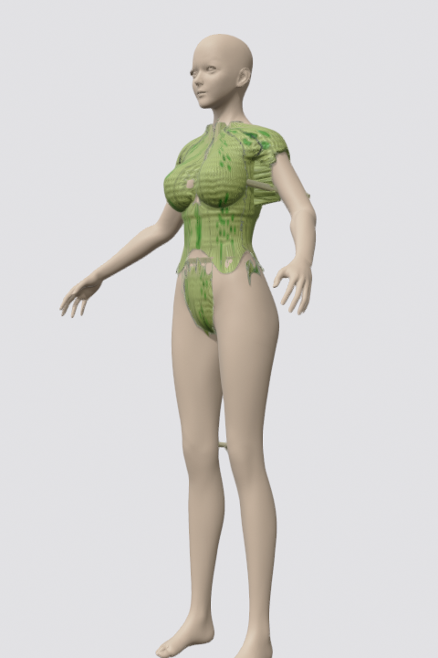</a> 02_three_quarter</td>
    <td align='center'><a href='renders/composite_floral/03_side_left.png'>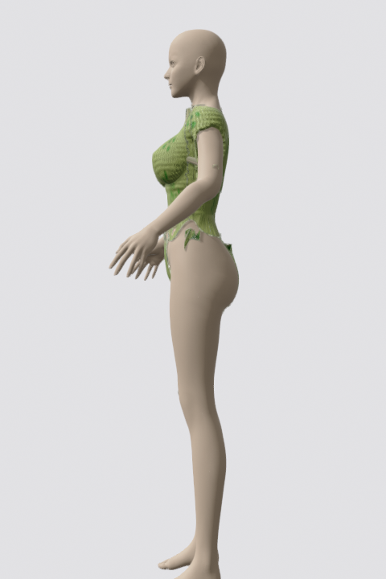</a> 03_side_left</td>
    <td align='center'><a href='renders/composite_floral/04_back.png'>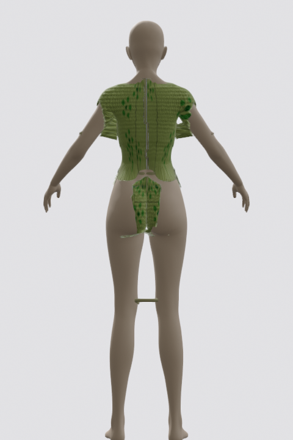</a> 04_back</td>
  </tr>
  <tr>
    <td align='center'><a href='renders/composite_floral/05_chest_close.png'>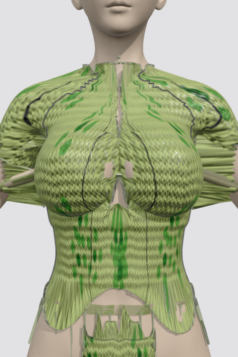</a> 05_chest_close</td>
    <td align='center'><a href='renders/composite_floral/06_hip_close.png'>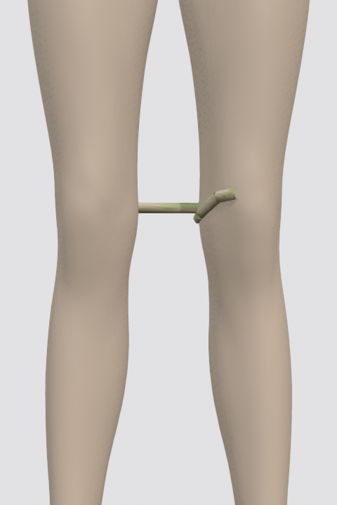</a> 06_hip_close</td>
    <td align='center'><a href='renders/composite_floral/07_neck_top.png'>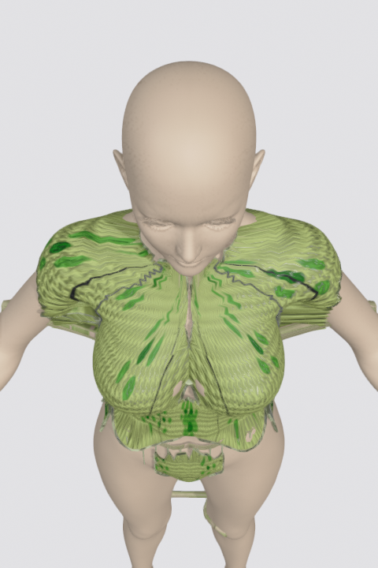</a> 07_neck_top</td>
    <td align='center'><a href='renders/composite_floral/08_shoulder_top.png'>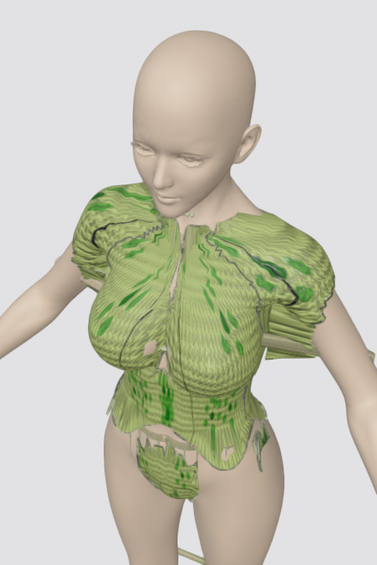</a> 08_shoulder_top</td>
  </tr>
</table>

#### `diverse_triangle_03`
_style=boho_cultgaia  pattern=polka  src=amni_soul  weave=crochet_

<table>
  <tr>
    <td align='center'><a href='renders/diverse_triangle_03/01_front.png'>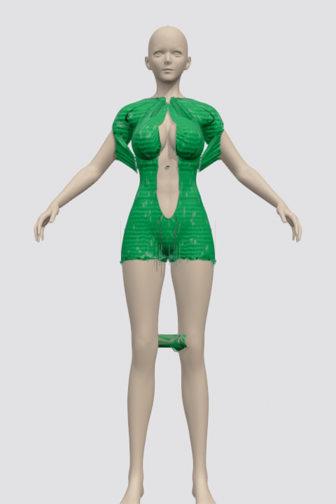</a> 01_front</td>
    <td align='center'><a href='renders/diverse_triangle_03/02_three_quarter.png'>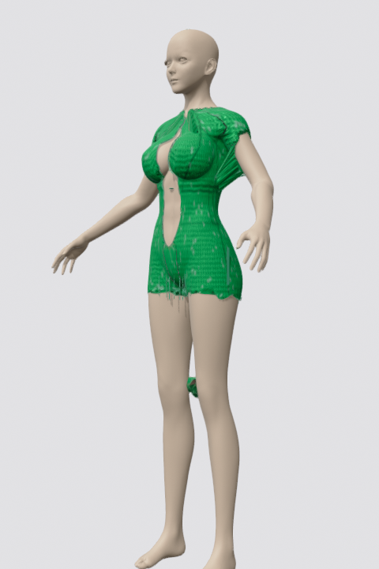</a> 02_three_quarter</td>
    <td align='center'><a href='renders/diverse_triangle_03/03_side_left.png'>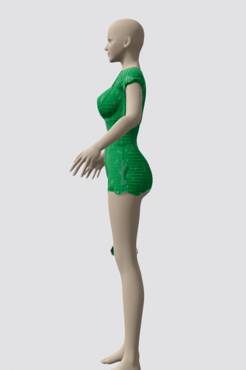</a> 03_side_left</td>
    <td align='center'><a href='renders/diverse_triangle_03/04_back.png'>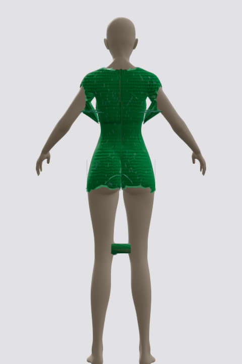</a> 04_back</td>
  </tr>
  <tr>
    <td align='center'><a href='renders/diverse_triangle_03/05_chest_close.png'>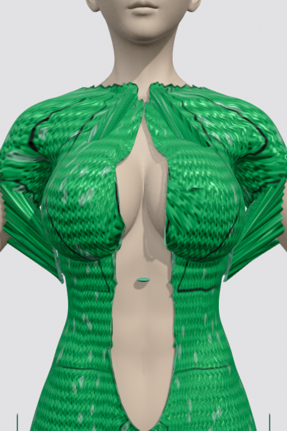</a> 05_chest_close</td>
    <td align='center'><a href='renders/diverse_triangle_03/06_hip_close.png'>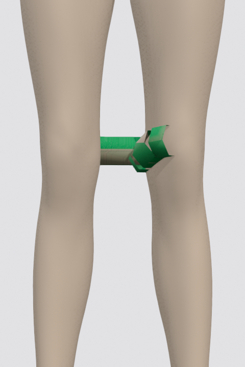</a> 06_hip_close</td>
    <td align='center'><a href='renders/diverse_triangle_03/07_neck_top.png'>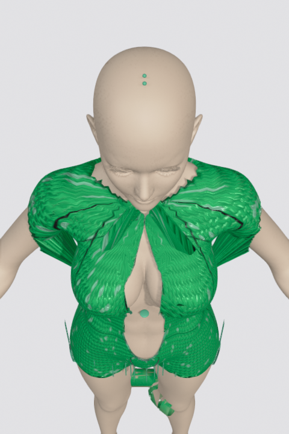</a> 07_neck_top</td>
    <td align='center'><a href='renders/diverse_triangle_03/08_shoulder_top.png'>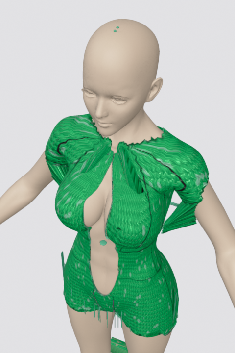</a> 08_shoulder_top</td>
  </tr>
</table>

### archetype: `brazilian` (2)

#### `composite_red`
_style=brazilian  pattern=solid  src=econyl  weave=plain_

<table>
  <tr>
    <td align='center'><a href='renders/composite_red/01_front.png'>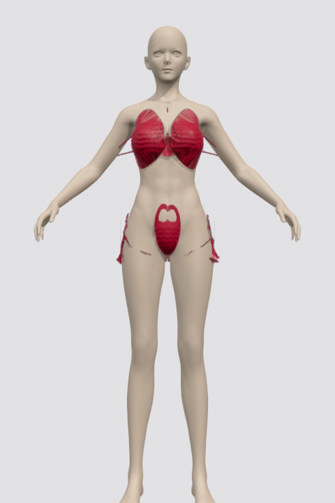</a> 01_front</td>
    <td align='center'><a href='renders/composite_red/02_three_quarter.png'>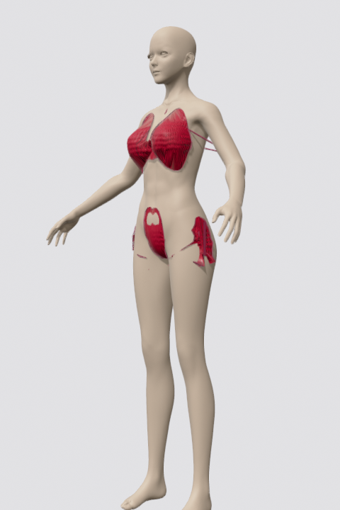</a> 02_three_quarter</td>
    <td align='center'><a href='renders/composite_red/03_side_left.png'>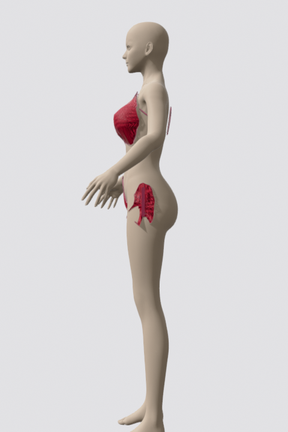</a> 03_side_left</td>
    <td align='center'><a href='renders/composite_red/04_back.png'>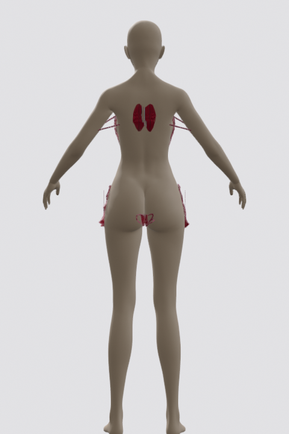</a> 04_back</td>
  </tr>
  <tr>
    <td align='center'><a href='renders/composite_red/05_chest_close.png'>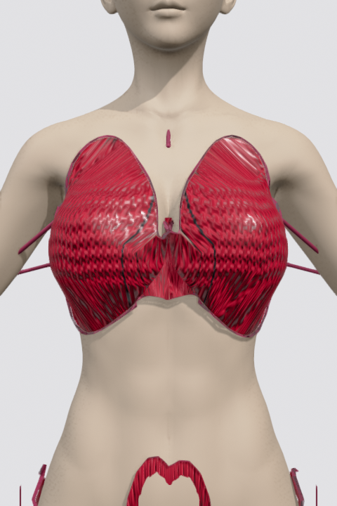</a> 05_chest_close</td>
    <td align='center'> 06_hip_close</td>
    <td align='center'><a href='renders/composite_red/07_neck_top.png'>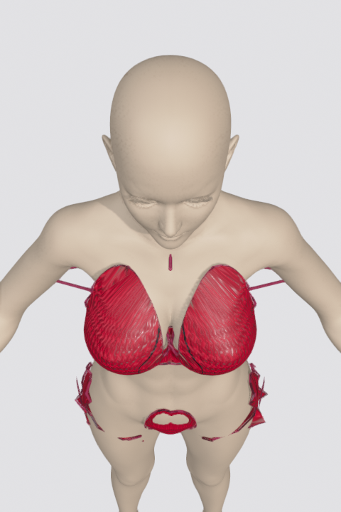</a> 07_neck_top</td>
    <td align='center'><a href='renders/composite_red/08_shoulder_top.png'>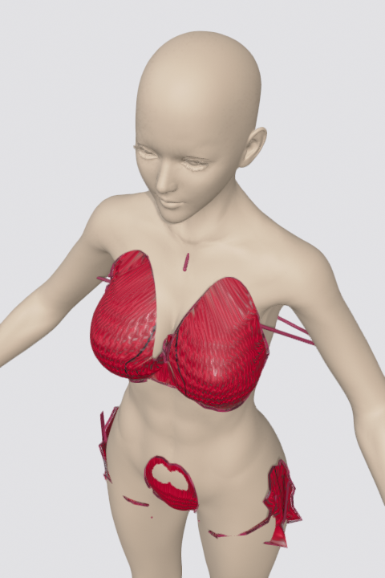</a> 08_shoulder_top</td>
  </tr>
</table>

#### `swimsuit_2`
_style=brazilian  pattern=solid  src=econyl  weave=plain_

<table>
  <tr>
    <td align='center'> 01_front</td>
    <td align='center'><a href='renders/swimsuit_2/02_three_quarter.png'>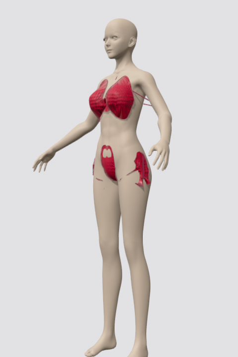</a> 02_three_quarter</td>
    <td align='center'> 03_side_left</td>
    <td align='center'><a href='renders/swimsuit_2/04_back.png'>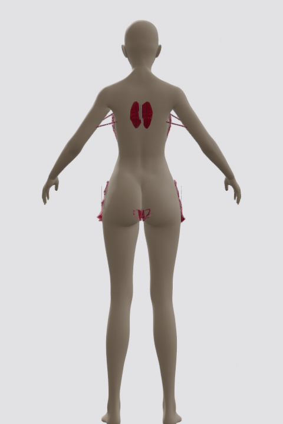</a> 04_back</td>
  </tr>
  <tr>
    <td align='center'><a href='renders/swimsuit_2/05_chest_close.png'>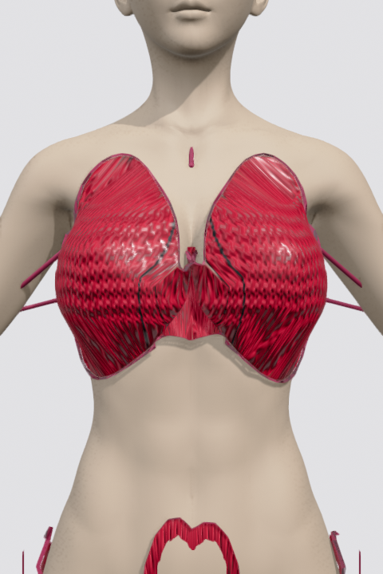</a> 05_chest_close</td>
    <td align='center'> 06_hip_close</td>
    <td align='center'> 07_neck_top</td>
    <td align='center'> 08_shoulder_top</td>
  </tr>
</table>

## Run report

# BodyMapping latent space — legs no longer covered by bottom panel

Cascaded architecture committed:

    Genome  →  Garment  →  BodyDeployment  →  rendered mesh

The leg-fabric bug is now caught at the **BodyDeployment** layer (third
in the cascade). No render-time patch — the constraint lives entirely in
the latent state.

## What changed

- `tools/anatomy.py`:
  - `BodyRegion` dataclass + `body_regions(landmarks)` returning 10 named
    regions (legs / arms / head / neck / chest / pelvis with front/back/
    side variants).
  - `classify_point(x,y,z, regions, max_torso_radius)` — returns the
    region a 3D point falls into, "arms" when it's outside the torso
    radius, "outside" when none match.
  - `y_pelvis` — was hardcoded `y_lo + 0.30 * H` (mid-thigh on this
    standing-pose mesh); now derived from the body topology by walking
    Y up from the feet and finding the first prominent torso-width
    peak (the actual hip ridge).

- `tools/garment_state.py`:
  - `BodyMapping` per piece (covers_regions, must_clear, contact_kind),
    with `DEFAULT_MAPPING_BY_ROLE` providing the role→mapping table.
  - `BodyDeployment` — third-layer dataclass holding piece_mappings,
    resolved 3D anchors, valid_connector_ids / valid_accessory_ids,
    cached anatomy + classify_xyz closure.
  - `deploy_to_body(garment, body_mesh)` — cascades Garment to a
    body-specific BodyDeployment. Resolves every Connector/Accessory
    attachment to a 3D point on the body. Components without resolved
    attachments get filtered out (accountability rule: nothing
    renders that the latent state didn't claim).
  - `validate_deployment(garment, deployment)` — entry point for
    deployment-level validation (warnings already captured by
    deploy_to_body).

- `tools/render3d_uv.py`:
  - `build_fabric_shell` accepts `body_deployment=None`. When supplied,
    it computes the intersection of must_clear across all pieces and
    rejects any triangle whose centroid classifies into one of those
    regions (=legs/arms/head/neck for v1 bikini).
  - `build_strap_meshes` (and `_build_strap_meshes_garment`) accept
    `body_deployment=None`. When supplied, only connectors / accessories
    in `valid_connector_ids` / `valid_accessory_ids` are built. The
    rest are dropped — they had no resolved attachment so they're not
    really there.

- `tools/iter/capture.py`:
  - Builds the BodyDeployment once per render and threads it into
    both `build_fabric_shell` and `build_strap_meshes`.

## Validation

`diverse_triangle_03` was the worst offender — fabric covered both legs
down to mid-shin. After this commit:

- shell Y range: 46.9..146 → constrained by must_clear=legs to torso-only
- the rendered front view shows the bikini terminating at the hip, with
  legs entirely uncovered.

## Files

- `headline.png` — before / after side-by-side on diverse_triangle_03
- `renders/diverse_triangle_03/` — 8-view set with the fix applied
- `renders/composite_red/`, `renders/swimsuit_2/`,
  `renders/composite_floral/` — regression check against the original
  seeds (no visual regression).

