# 0657_v2_ga_demo

_Day: [`2026-05-08/`](../README.md)_  ·  _Seeds: 12_  ·  _Images: 97_

Local interactive viewer: [`index.html`](index.html)  ·  Top: [`tools/output/`](../../README.md)

## Top-level images

### overview.png

## Seeds (12)

### archetype: `unknown` (12)

#### `bandeau_back_band__top1`

<table>
  <tr>
    <td align='center'><a href='renders/bandeau_back_band__top1/01_front.png'>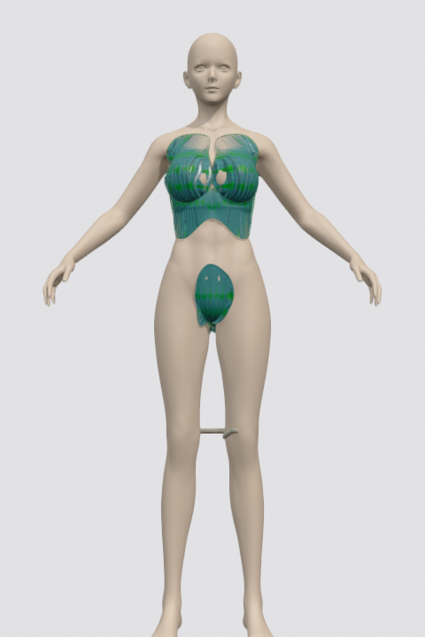</a> 01_front</td>
    <td align='center'><a href='renders/bandeau_back_band__top1/02_three_quarter.png'>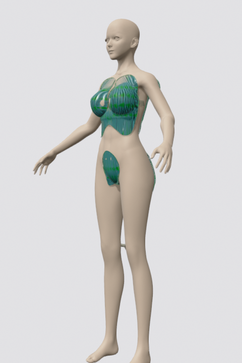</a> 02_three_quarter</td>
    <td align='center'><a href='renders/bandeau_back_band__top1/03_side_left.png'>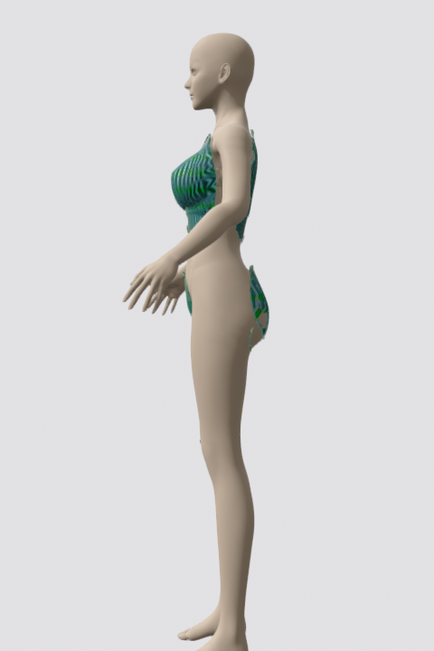</a> 03_side_left</td>
    <td align='center'><a href='renders/bandeau_back_band__top1/04_back.png'>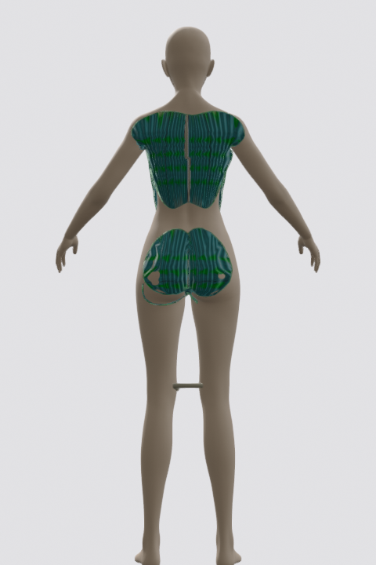</a> 04_back</td>
  </tr>
  <tr>
    <td align='center'><a href='renders/bandeau_back_band__top1/05_chest_close.png'>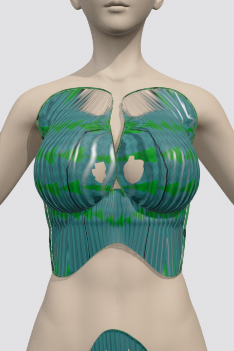</a> 05_chest_close</td>
    <td align='center'> 06_hip_close</td>
    <td align='center'><a href='renders/bandeau_back_band__top1/07_neck_top.png'>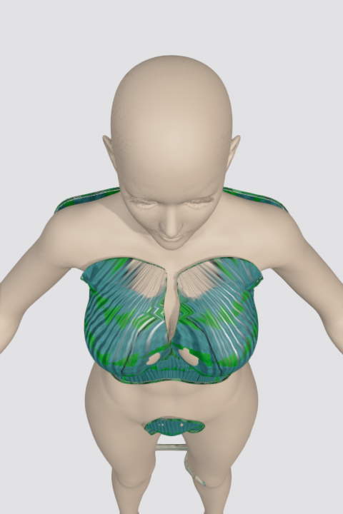</a> 07_neck_top</td>
    <td align='center'><a href='renders/bandeau_back_band__top1/08_shoulder_top.png'>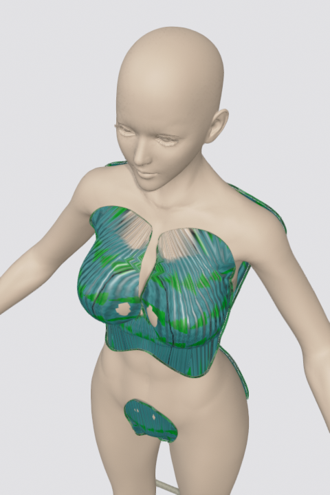</a> 08_shoulder_top</td>
  </tr>
</table>

#### `bandeau_back_band__top2`

<table>
  <tr>
    <td align='center'><a href='renders/bandeau_back_band__top2/01_front.png'>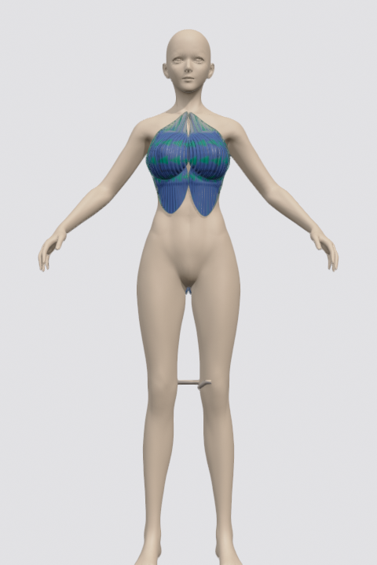</a> 01_front</td>
    <td align='center'><a href='renders/bandeau_back_band__top2/02_three_quarter.png'>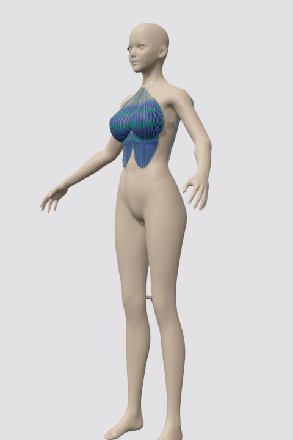</a> 02_three_quarter</td>
    <td align='center'><a href='renders/bandeau_back_band__top2/03_side_left.png'>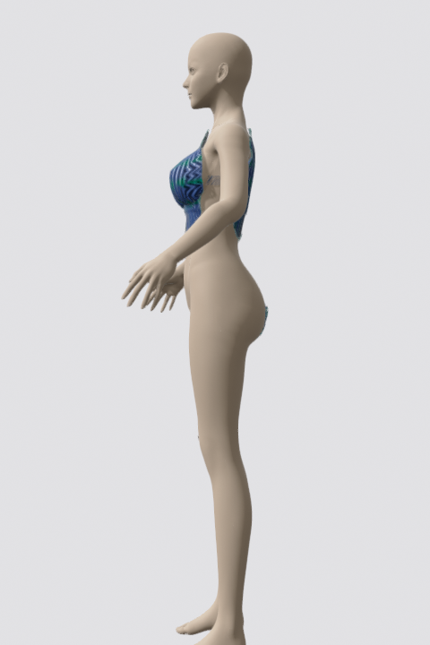</a> 03_side_left</td>
    <td align='center'><a href='renders/bandeau_back_band__top2/04_back.png'>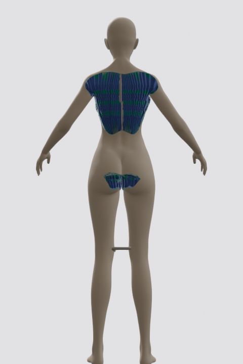</a> 04_back</td>
  </tr>
  <tr>
    <td align='center'><a href='renders/bandeau_back_band__top2/05_chest_close.png'>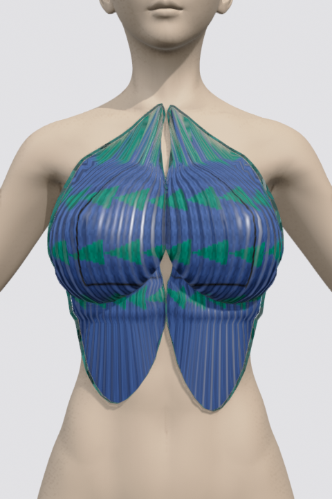</a> 05_chest_close</td>
    <td align='center'> 06_hip_close</td>
    <td align='center'><a href='renders/bandeau_back_band__top2/07_neck_top.png'>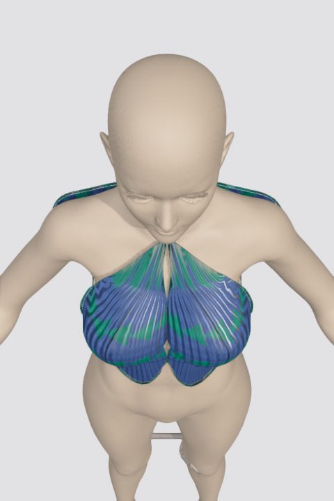</a> 07_neck_top</td>
    <td align='center'><a href='renders/bandeau_back_band__top2/08_shoulder_top.png'>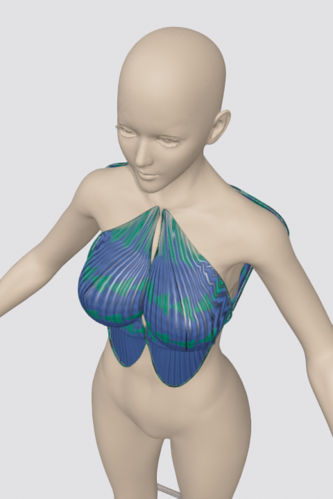</a> 08_shoulder_top</td>
  </tr>
</table>

#### `bandeau_back_band__top3`

<table>
  <tr>
    <td align='center'><a href='renders/bandeau_back_band__top3/01_front.png'>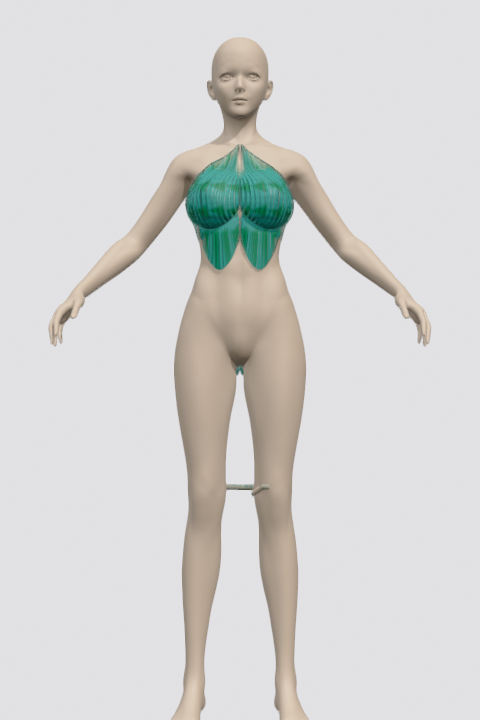</a> 01_front</td>
    <td align='center'><a href='renders/bandeau_back_band__top3/02_three_quarter.png'>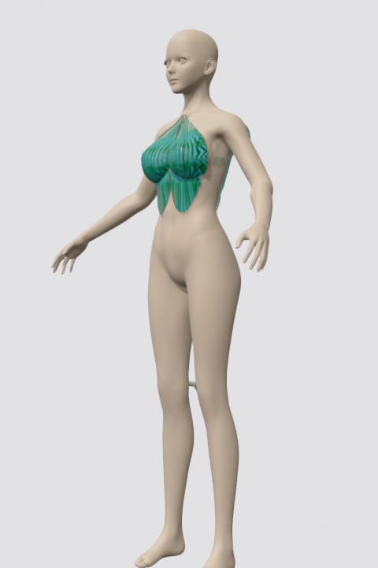</a> 02_three_quarter</td>
    <td align='center'><a href='renders/bandeau_back_band__top3/03_side_left.png'>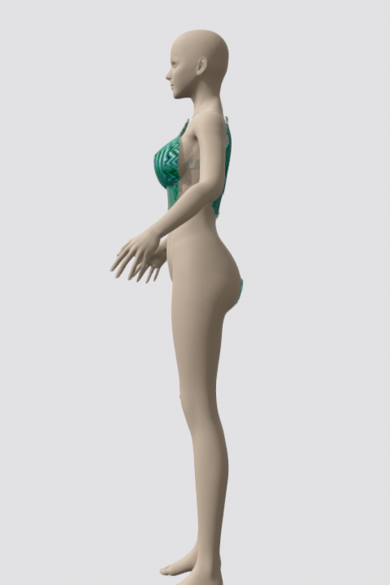</a> 03_side_left</td>
    <td align='center'><a href='renders/bandeau_back_band__top3/04_back.png'>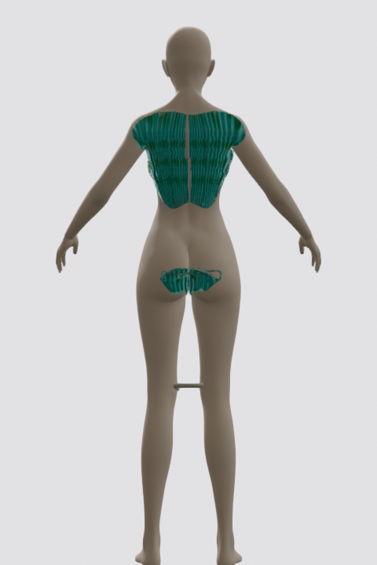</a> 04_back</td>
  </tr>
  <tr>
    <td align='center'><a href='renders/bandeau_back_band__top3/05_chest_close.png'>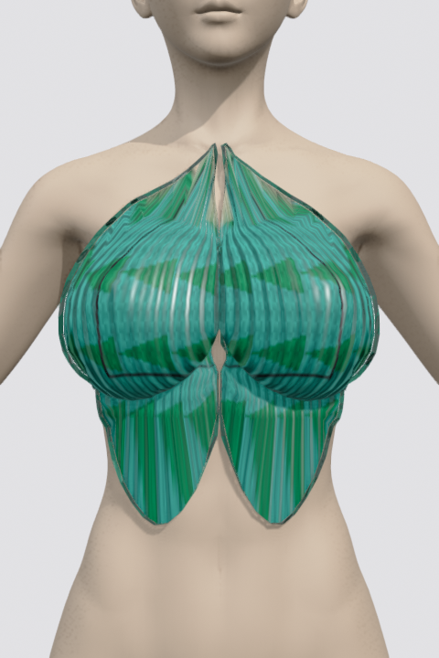</a> 05_chest_close</td>
    <td align='center'> 06_hip_close</td>
    <td align='center'><a href='renders/bandeau_back_band__top3/07_neck_top.png'>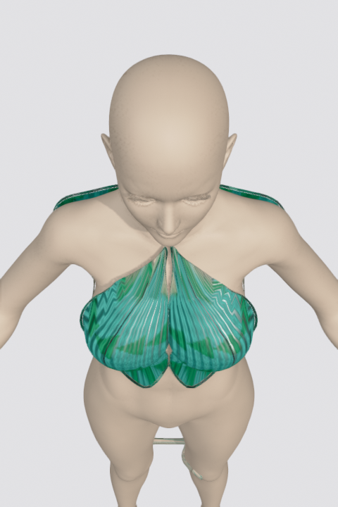</a> 07_neck_top</td>
    <td align='center'><a href='renders/bandeau_back_band__top3/08_shoulder_top.png'>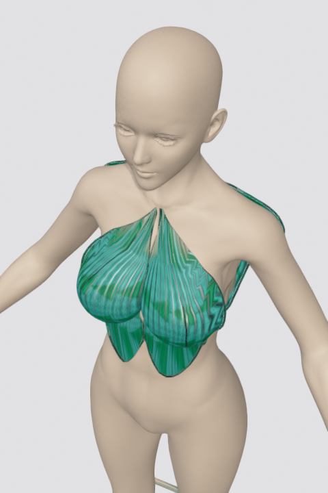</a> 08_shoulder_top</td>
  </tr>
</table>

#### `bralette_shoulder_strap__top1`

<table>
  <tr>
    <td align='center'><a href='renders/bralette_shoulder_strap__top1/01_front.png'>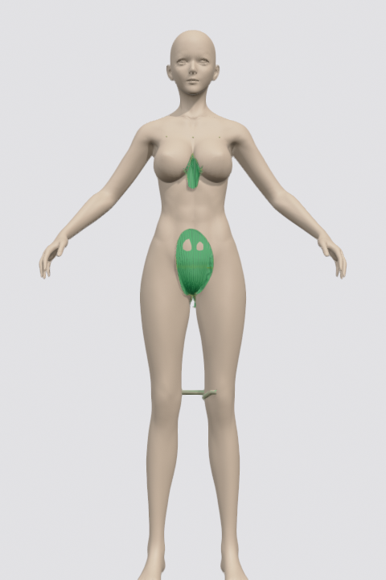</a> 01_front</td>
    <td align='center'><a href='renders/bralette_shoulder_strap__top1/02_three_quarter.png'>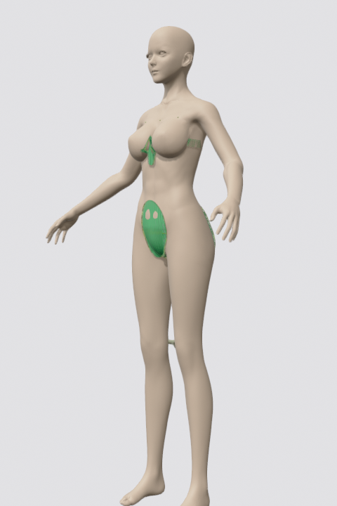</a> 02_three_quarter</td>
    <td align='center'> 03_side_left</td>
    <td align='center'><a href='renders/bralette_shoulder_strap__top1/04_back.png'>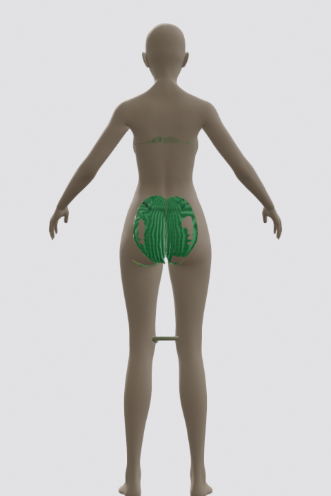</a> 04_back</td>
  </tr>
  <tr>
    <td align='center'><a href='renders/bralette_shoulder_strap__top1/05_chest_close.png'>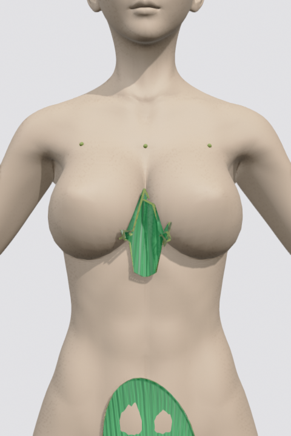</a> 05_chest_close</td>
    <td align='center'><a href='renders/bralette_shoulder_strap__top1/06_hip_close.png'>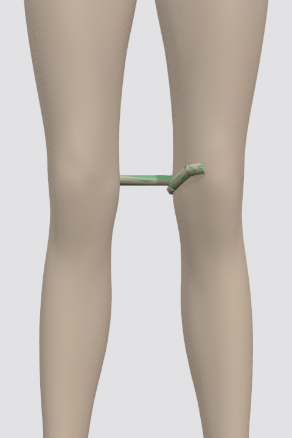</a> 06_hip_close</td>
    <td align='center'><a href='renders/bralette_shoulder_strap__top1/07_neck_top.png'>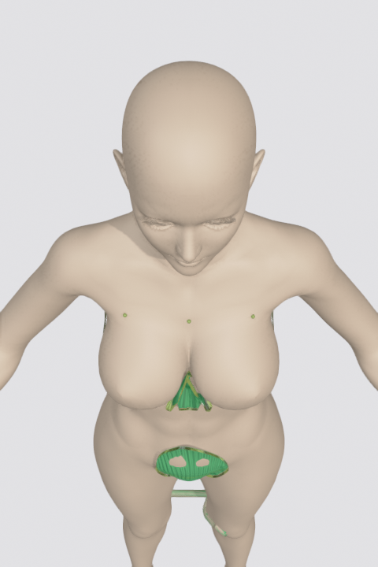</a> 07_neck_top</td>
    <td align='center'><a href='renders/bralette_shoulder_strap__top1/08_shoulder_top.png'>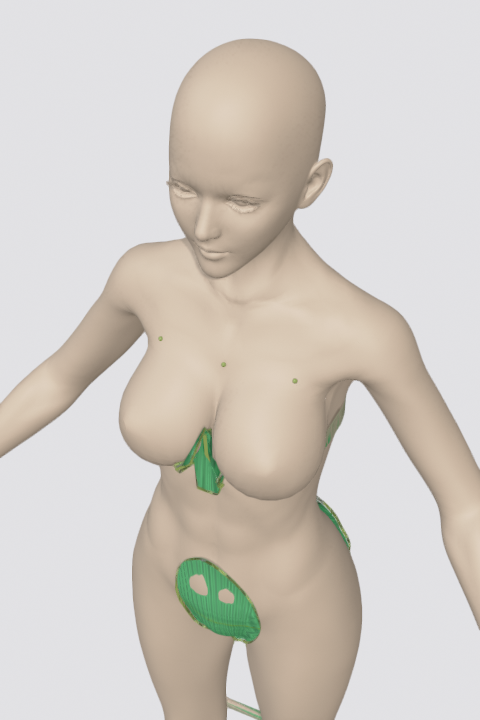</a> 08_shoulder_top</td>
  </tr>
</table>

#### `bralette_shoulder_strap__top2`

<table>
  <tr>
    <td align='center'><a href='renders/bralette_shoulder_strap__top2/01_front.png'>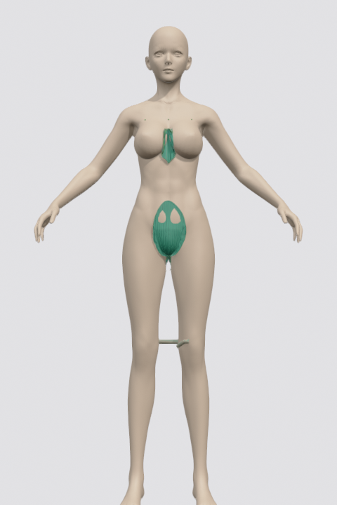</a> 01_front</td>
    <td align='center'><a href='renders/bralette_shoulder_strap__top2/02_three_quarter.png'>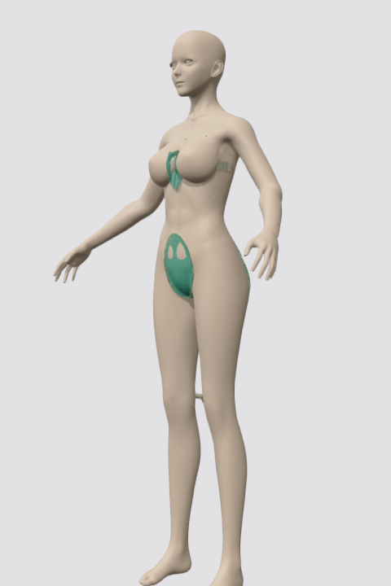</a> 02_three_quarter</td>
    <td align='center'> 03_side_left</td>
    <td align='center'><a href='renders/bralette_shoulder_strap__top2/04_back.png'>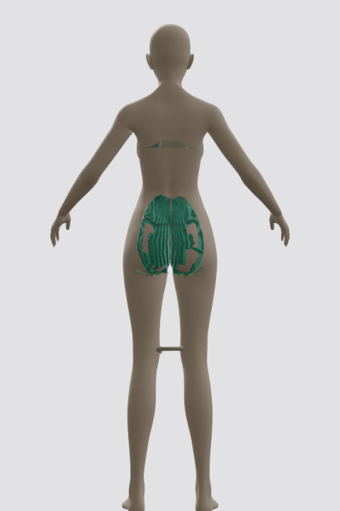</a> 04_back</td>
  </tr>
  <tr>
    <td align='center'><a href='renders/bralette_shoulder_strap__top2/05_chest_close.png'>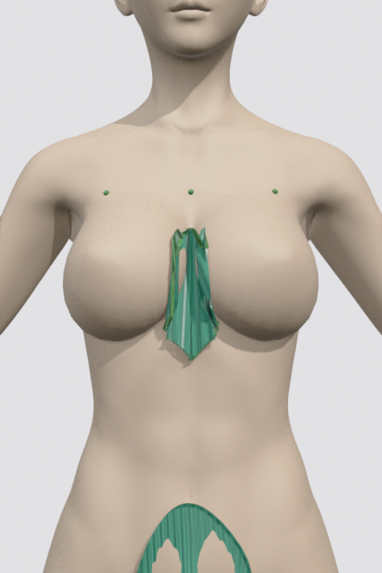</a> 05_chest_close</td>
    <td align='center'><a href='renders/bralette_shoulder_strap__top2/06_hip_close.png'>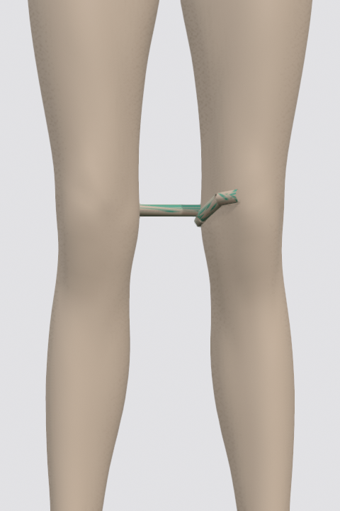</a> 06_hip_close</td>
    <td align='center'><a href='renders/bralette_shoulder_strap__top2/07_neck_top.png'>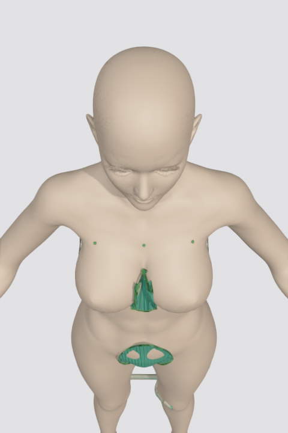</a> 07_neck_top</td>
    <td align='center'><a href='renders/bralette_shoulder_strap__top2/08_shoulder_top.png'>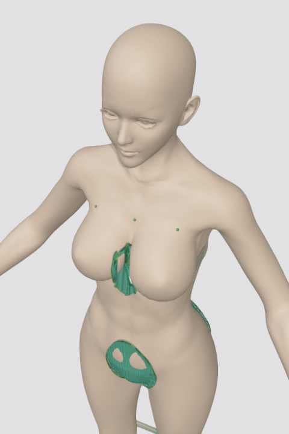</a> 08_shoulder_top</td>
  </tr>
</table>

#### `bralette_shoulder_strap__top3`

<table>
  <tr>
    <td align='center'><a href='renders/bralette_shoulder_strap__top3/01_front.png'>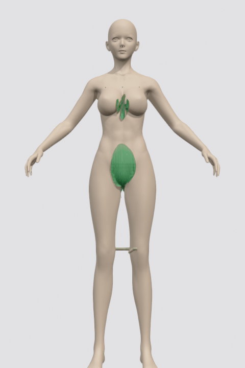</a> 01_front</td>
    <td align='center'><a href='renders/bralette_shoulder_strap__top3/02_three_quarter.png'>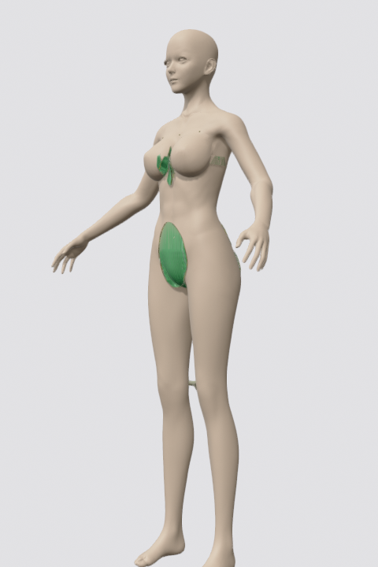</a> 02_three_quarter</td>
    <td align='center'><a href='renders/bralette_shoulder_strap__top3/03_side_left.png'>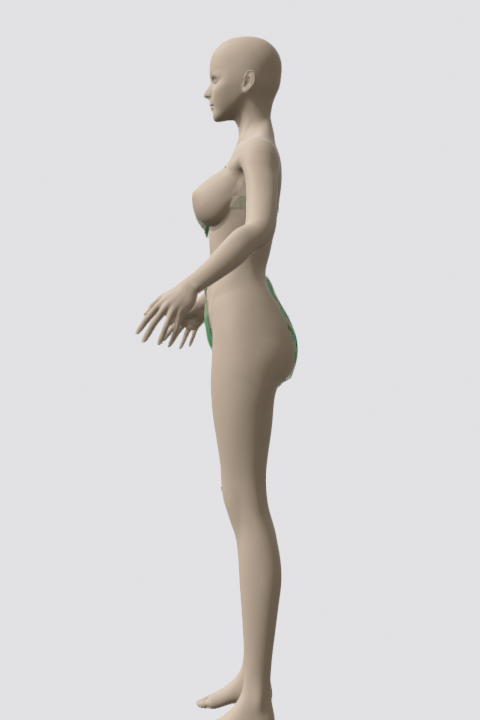</a> 03_side_left</td>
    <td align='center'><a href='renders/bralette_shoulder_strap__top3/04_back.png'>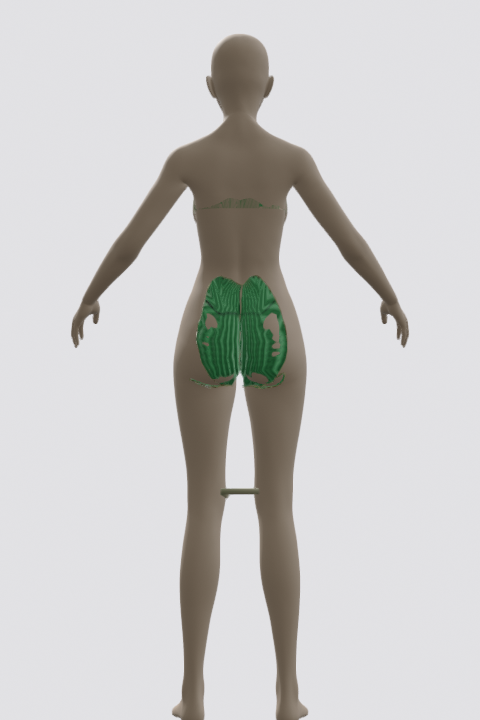</a> 04_back</td>
  </tr>
  <tr>
    <td align='center'><a href='renders/bralette_shoulder_strap__top3/05_chest_close.png'>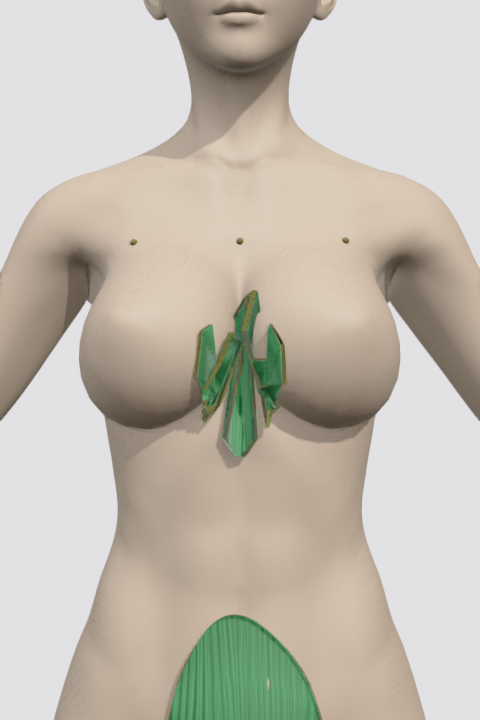</a> 05_chest_close</td>
    <td align='center'> 06_hip_close</td>
    <td align='center'><a href='renders/bralette_shoulder_strap__top3/07_neck_top.png'>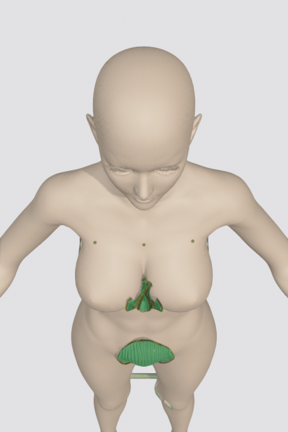</a> 07_neck_top</td>
    <td align='center'><a href='renders/bralette_shoulder_strap__top3/08_shoulder_top.png'>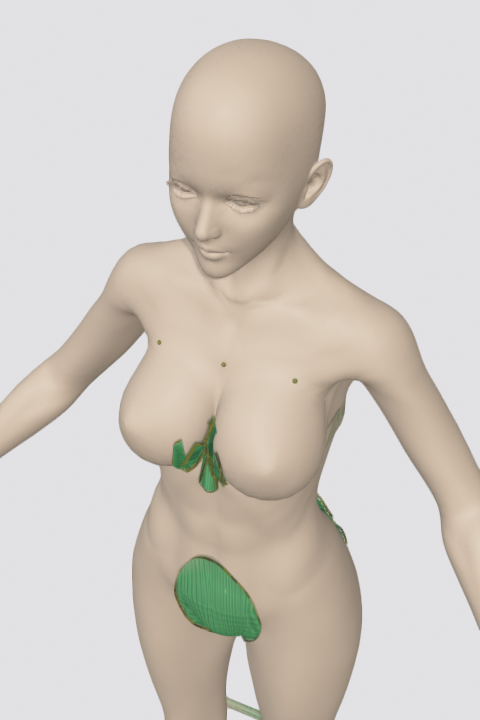</a> 08_shoulder_top</td>
  </tr>
</table>

#### `one_piece_maillot__top1`

<table>
  <tr>
    <td align='center'><a href='renders/one_piece_maillot__top1/01_front.png'>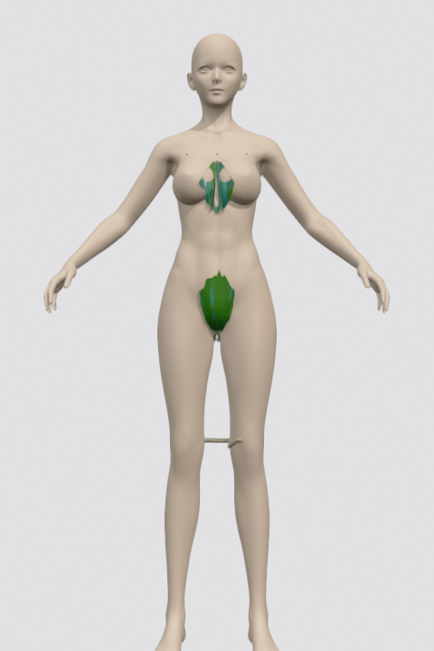</a> 01_front</td>
    <td align='center'><a href='renders/one_piece_maillot__top1/02_three_quarter.png'>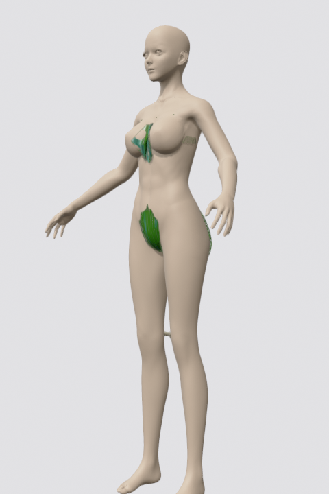</a> 02_three_quarter</td>
    <td align='center'> 03_side_left</td>
    <td align='center'><a href='renders/one_piece_maillot__top1/04_back.png'>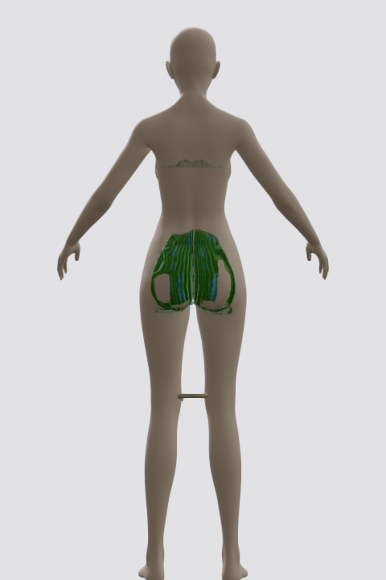</a> 04_back</td>
  </tr>
  <tr>
    <td align='center'><a href='renders/one_piece_maillot__top1/05_chest_close.png'>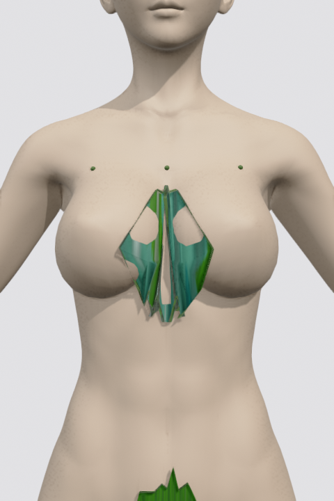</a> 05_chest_close</td>
    <td align='center'><a href='renders/one_piece_maillot__top1/06_hip_close.png'>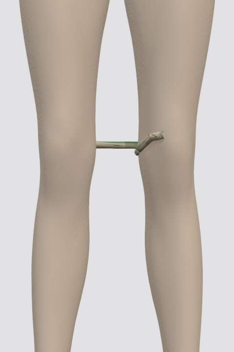</a> 06_hip_close</td>
    <td align='center'><a href='renders/one_piece_maillot__top1/07_neck_top.png'>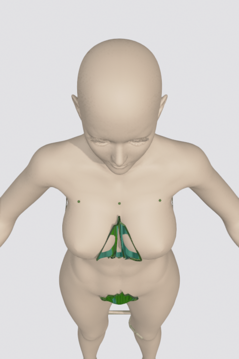</a> 07_neck_top</td>
    <td align='center'><a href='renders/one_piece_maillot__top1/08_shoulder_top.png'>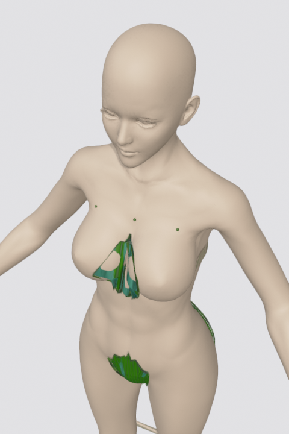</a> 08_shoulder_top</td>
  </tr>
</table>

#### `one_piece_maillot__top2`

<table>
  <tr>
    <td align='center'><a href='renders/one_piece_maillot__top2/01_front.png'>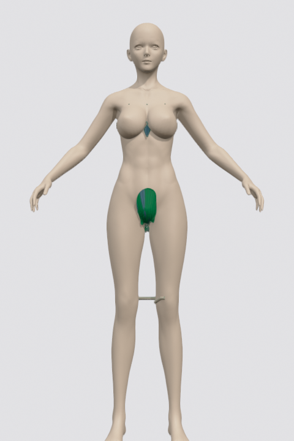</a> 01_front</td>
    <td align='center'><a href='renders/one_piece_maillot__top2/02_three_quarter.png'>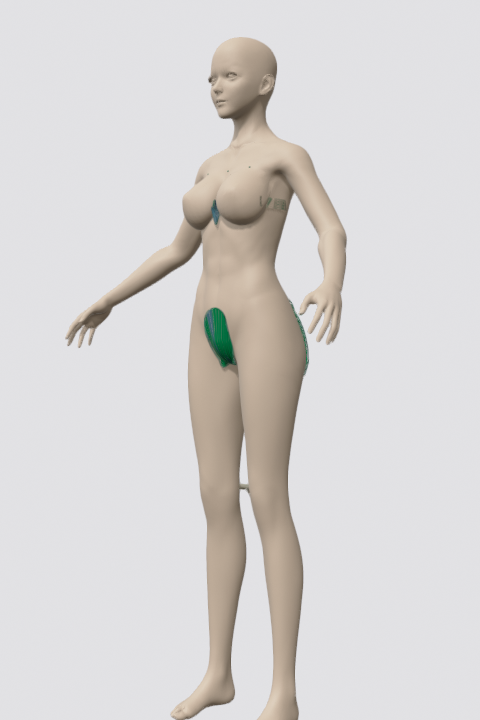</a> 02_three_quarter</td>
    <td align='center'><a href='renders/one_piece_maillot__top2/03_side_left.png'>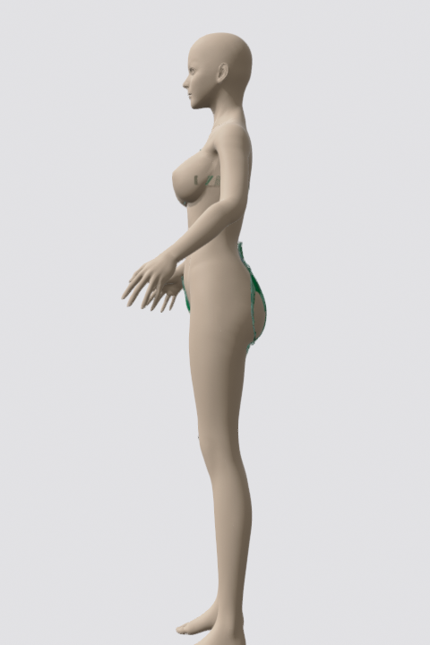</a> 03_side_left</td>
    <td align='center'><a href='renders/one_piece_maillot__top2/04_back.png'>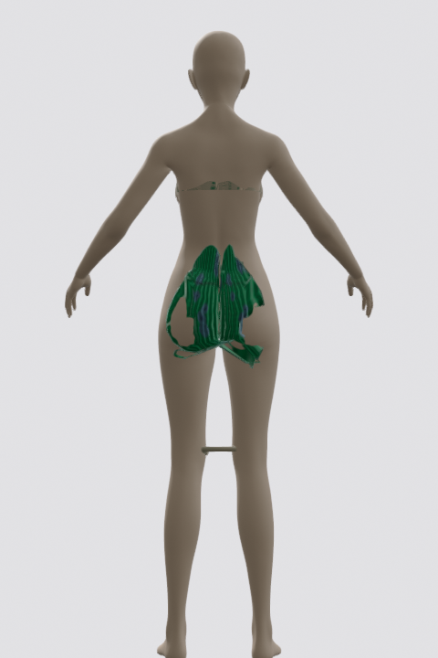</a> 04_back</td>
  </tr>
  <tr>
    <td align='center'> 05_chest_close</td>
    <td align='center'> 06_hip_close</td>
    <td align='center'><a href='renders/one_piece_maillot__top2/07_neck_top.png'>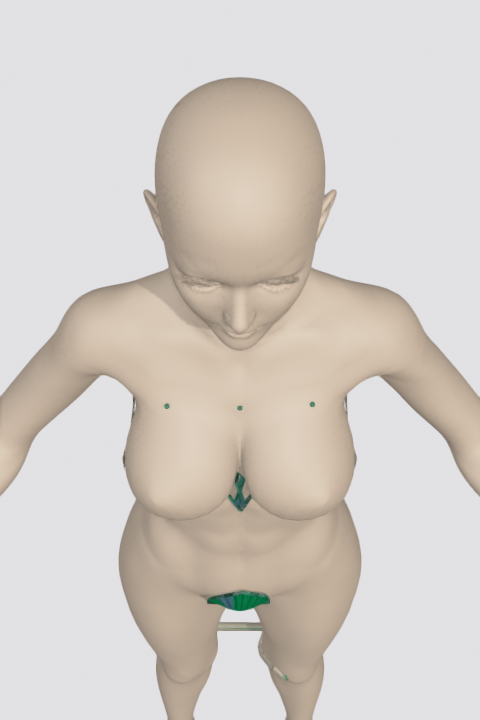</a> 07_neck_top</td>
    <td align='center'><a href='renders/one_piece_maillot__top2/08_shoulder_top.png'>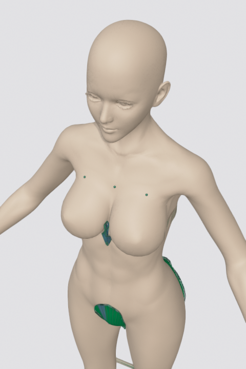</a> 08_shoulder_top</td>
  </tr>
</table>

#### `one_piece_maillot__top3`

<table>
  <tr>
    <td align='center'><a href='renders/one_piece_maillot__top3/01_front.png'>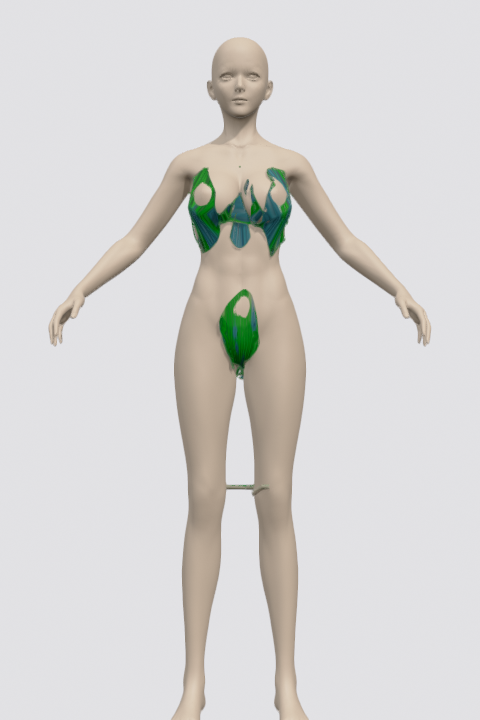</a> 01_front</td>
    <td align='center'><a href='renders/one_piece_maillot__top3/02_three_quarter.png'>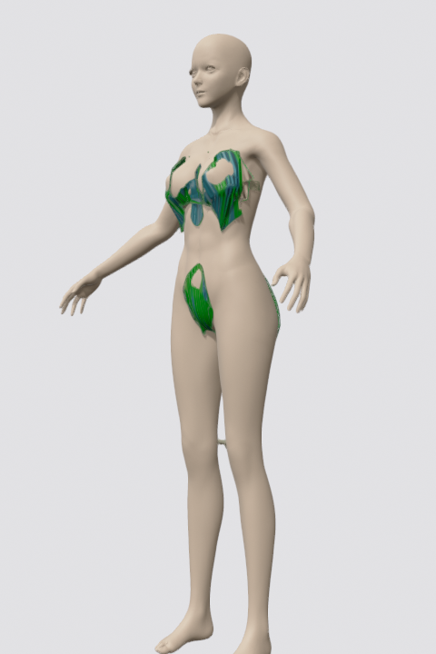</a> 02_three_quarter</td>
    <td align='center'><a href='renders/one_piece_maillot__top3/03_side_left.png'>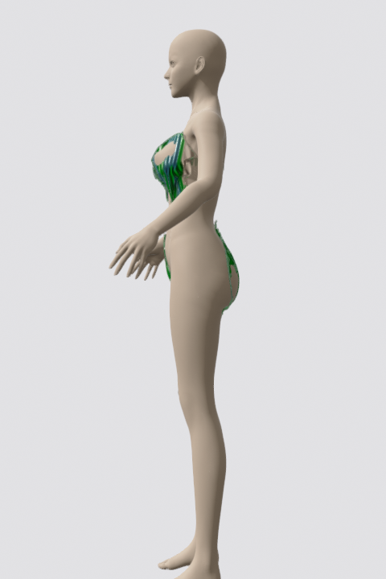</a> 03_side_left</td>
    <td align='center'><a href='renders/one_piece_maillot__top3/04_back.png'>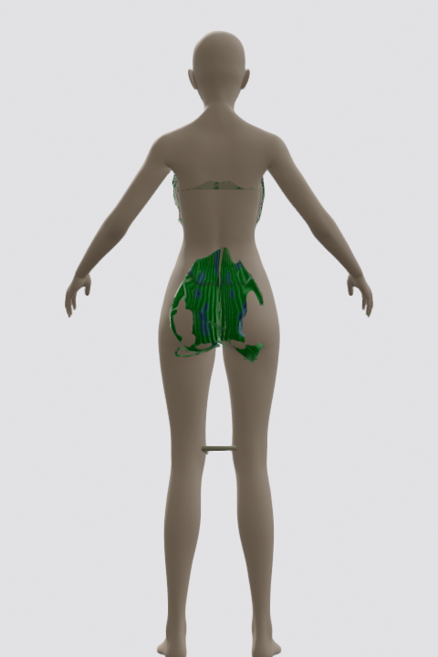</a> 04_back</td>
  </tr>
  <tr>
    <td align='center'><a href='renders/one_piece_maillot__top3/05_chest_close.png'>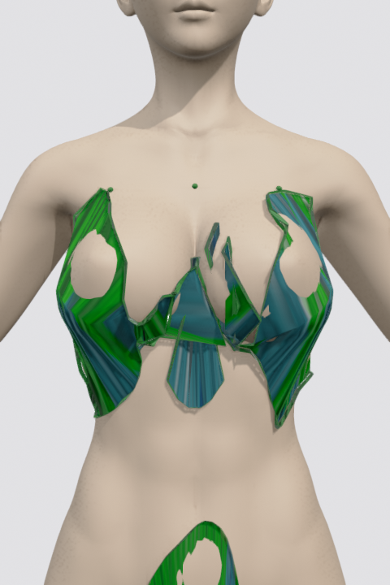</a> 05_chest_close</td>
    <td align='center'><a href='renders/one_piece_maillot__top3/06_hip_close.png'>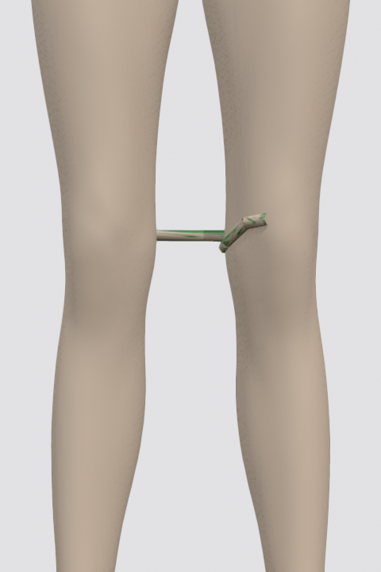</a> 06_hip_close</td>
    <td align='center'><a href='renders/one_piece_maillot__top3/07_neck_top.png'>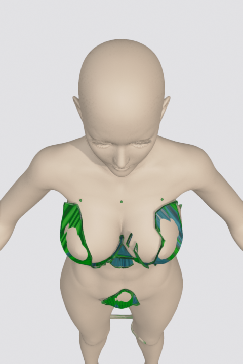</a> 07_neck_top</td>
    <td align='center'><a href='renders/one_piece_maillot__top3/08_shoulder_top.png'>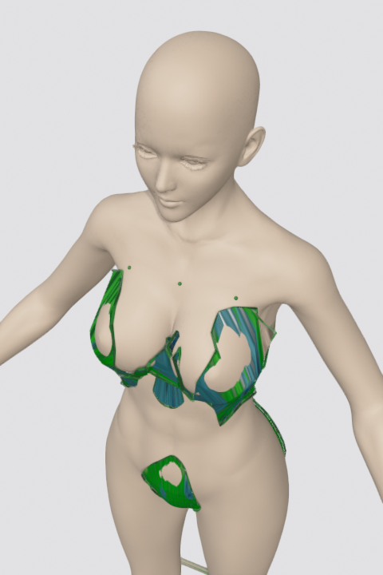</a> 08_shoulder_top</td>
  </tr>
</table>

#### `triangle_string_halter__top1`

<table>
  <tr>
    <td align='center'><a href='renders/triangle_string_halter__top1/01_front.png'>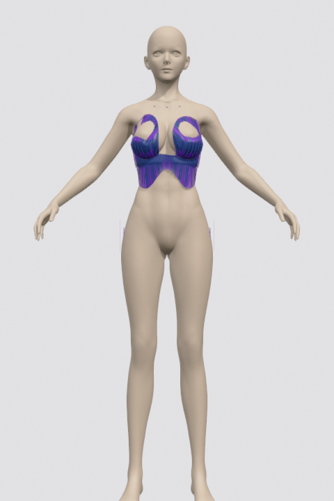</a> 01_front</td>
    <td align='center'><a href='renders/triangle_string_halter__top1/02_three_quarter.png'>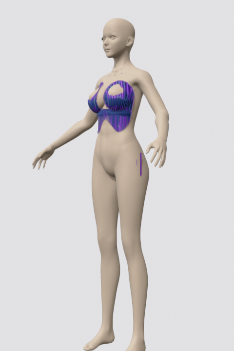</a> 02_three_quarter</td>
    <td align='center'><a href='renders/triangle_string_halter__top1/03_side_left.png'>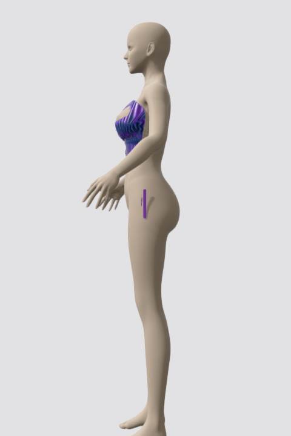</a> 03_side_left</td>
    <td align='center'><a href='renders/triangle_string_halter__top1/04_back.png'>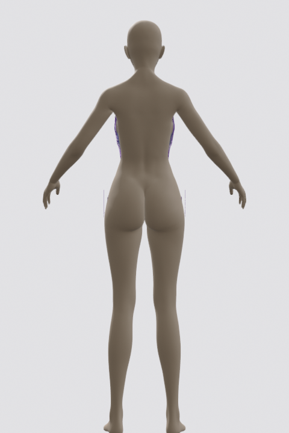</a> 04_back</td>
  </tr>
  <tr>
    <td align='center'><a href='renders/triangle_string_halter__top1/05_chest_close.png'>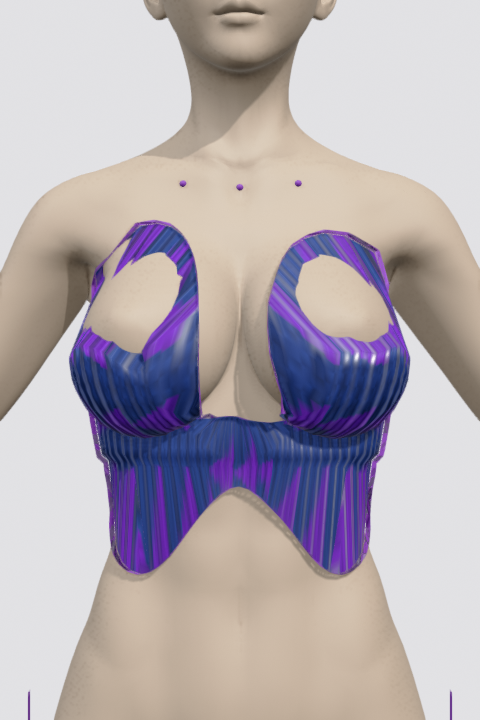</a> 05_chest_close</td>
    <td align='center'> 06_hip_close</td>
    <td align='center'><a href='renders/triangle_string_halter__top1/07_neck_top.png'>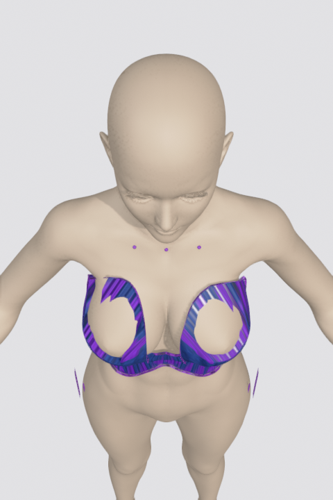</a> 07_neck_top</td>
    <td align='center'><a href='renders/triangle_string_halter__top1/08_shoulder_top.png'>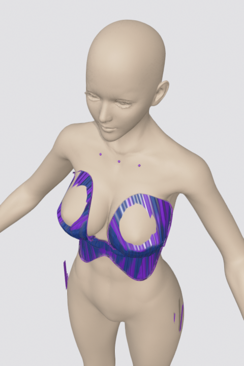</a> 08_shoulder_top</td>
  </tr>
</table>

#### `triangle_string_halter__top2`

<table>
  <tr>
    <td align='center'><a href='renders/triangle_string_halter__top2/01_front.png'>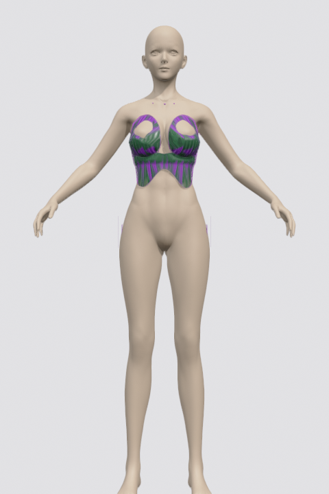</a> 01_front</td>
    <td align='center'><a href='renders/triangle_string_halter__top2/02_three_quarter.png'>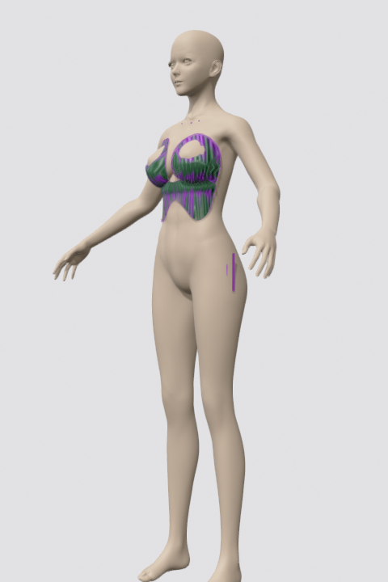</a> 02_three_quarter</td>
    <td align='center'><a href='renders/triangle_string_halter__top2/03_side_left.png'>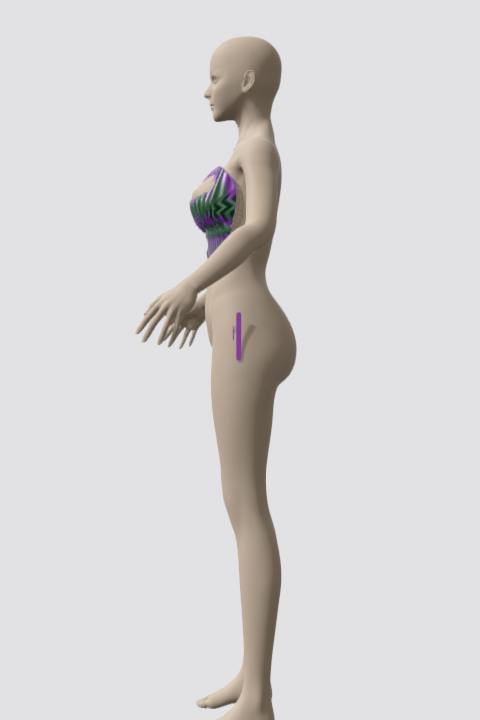</a> 03_side_left</td>
    <td align='center'><a href='renders/triangle_string_halter__top2/04_back.png'>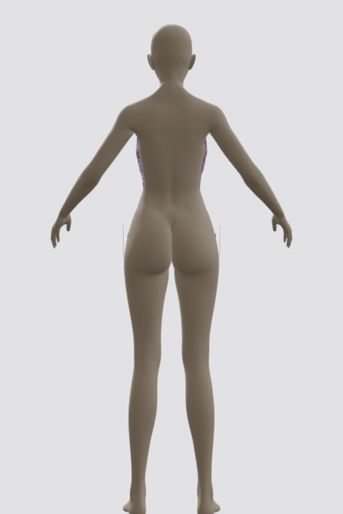</a> 04_back</td>
  </tr>
  <tr>
    <td align='center'><a href='renders/triangle_string_halter__top2/05_chest_close.png'>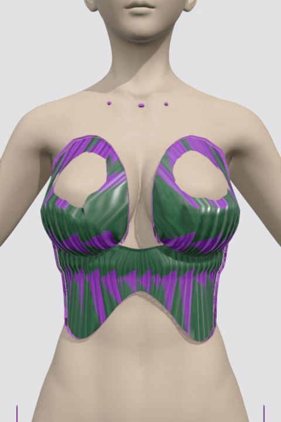</a> 05_chest_close</td>
    <td align='center'> 06_hip_close</td>
    <td align='center'><a href='renders/triangle_string_halter__top2/07_neck_top.png'>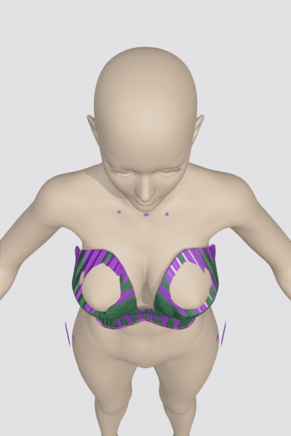</a> 07_neck_top</td>
    <td align='center'><a href='renders/triangle_string_halter__top2/08_shoulder_top.png'>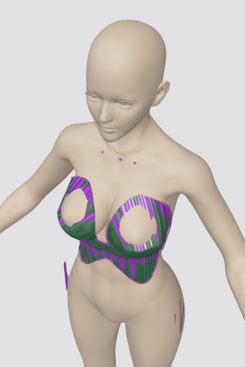</a> 08_shoulder_top</td>
  </tr>
</table>

#### `triangle_string_halter__top3`

<table>
  <tr>
    <td align='center'><a href='renders/triangle_string_halter__top3/01_front.png'>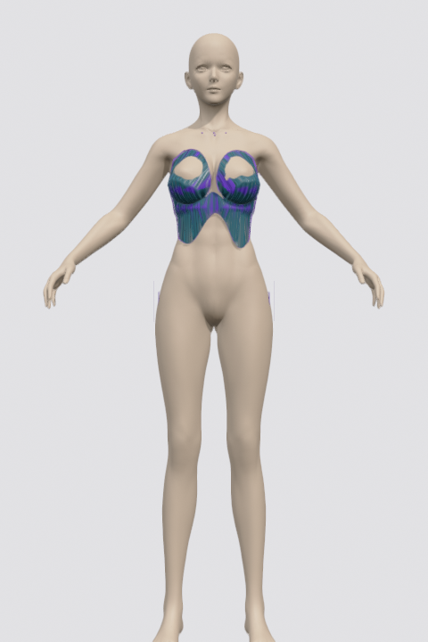</a> 01_front</td>
    <td align='center'><a href='renders/triangle_string_halter__top3/02_three_quarter.png'>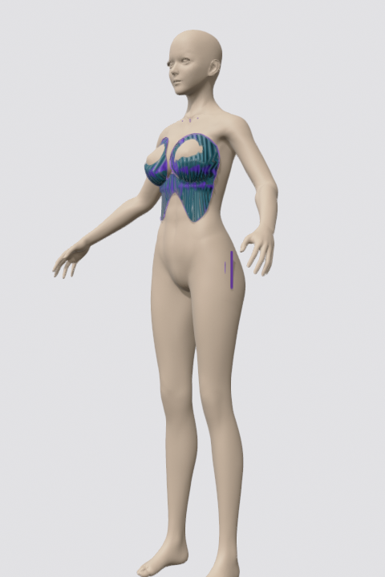</a> 02_three_quarter</td>
    <td align='center'><a href='renders/triangle_string_halter__top3/03_side_left.png'>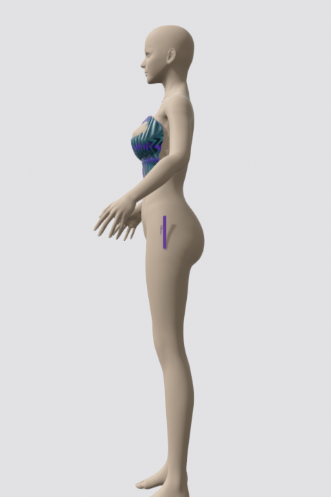</a> 03_side_left</td>
    <td align='center'> 04_back</td>
  </tr>
  <tr>
    <td align='center'><a href='renders/triangle_string_halter__top3/05_chest_close.png'>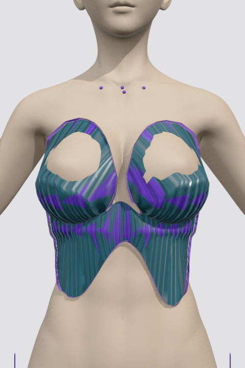</a> 05_chest_close</td>
    <td align='center'> 06_hip_close</td>
    <td align='center'><a href='renders/triangle_string_halter__top3/07_neck_top.png'>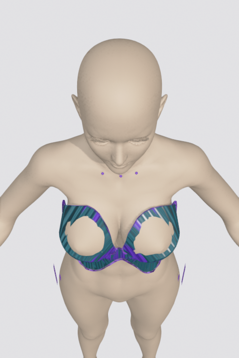</a> 07_neck_top</td>
    <td align='center'><a href='renders/triangle_string_halter__top3/08_shoulder_top.png'>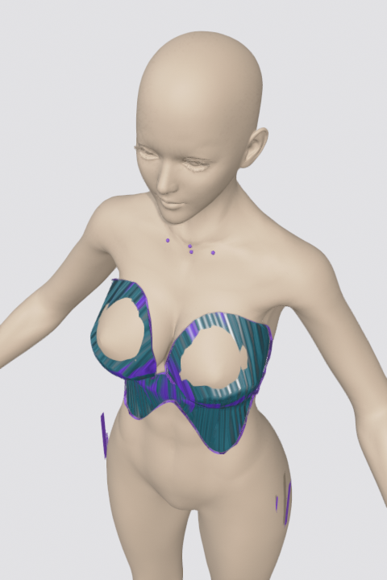</a> 08_shoulder_top</td>
  </tr>
</table>

## Run report

# v2 outfit_ga demo — outfit-native fitness

Per archetype, ran `outfit_ga.evolve(pop=20, gens=12)` with the new `outfit_evaluate` composite (40% aesthetic + 25% manufacturing + 35% outfit-native). Top-3 outfits rendered.

## Trajectories (mean / max composite per generation)

| archetype | mean start | mean end | max start | max end | Δ max |
|---|---|---|---|---|---|
| triangle_string_halter | 0.795 | 0.855 | 0.828 | 0.888 | +0.060 |
| bandeau_back_band | 0.791 | 0.868 | 0.838 | 0.888 | +0.051 |
| bralette_shoulder_strap | 0.823 | 0.906 | 0.870 | 0.939 | +0.069 |
| one_piece_maillot | 0.788 | 0.881 | 0.845 | 0.901 | +0.056 |

## Top-3 per archetype

| outfit | composite | outfit | v1 | v1+garment | slot picks |
|---|---|---|---|---|---|
| `triangle_string_halter__top1` | 0.888 | 0.877 | 0.843 | 0.891 | cup=CUP_TRIANGLE_L · bottom_front=BOT_THONG_S · bottom_back=BOT_THONG_M · halter_strap=STR_HALTER_3MM · side_tie=STR_TIE_CORD_3MM · …+2 |
| `triangle_string_halter__top2` | 0.888 | 0.852 | 0.865 | 0.905 | cup=CUP_TRIANGLE_L · bottom_front=BOT_THONG_S · bottom_back=BOT_THONG_M · halter_strap=STR_HALTER_3MM · side_tie=STR_TIE_CORD_3MM · …+2 |
| `triangle_string_halter__top3` | 0.885 | 0.877 | 0.837 | 0.887 | cup=CUP_TRIANGLE_L · bottom_front=BOT_THONG_S · bottom_back=BOT_THONG_M · halter_strap=STR_HALTER_3MM · side_tie=STR_TIE_CORD_3MM · …+2 |
| `bandeau_back_band__top1` | 0.888 | 0.868 | 0.852 | 0.897 | cup=CUP_BALCONETTE_L · bottom_front=BOT_HIGHWAIST_S · bottom_back=BOT_CHEEKY_M · back_band=STR_BACKBAND_PLAIN · primary_fabric=F_AMNI_SOUL_RIBBED · …+3 |
| `bandeau_back_band__top2` | 0.887 | 0.868 | 0.850 | 0.895 | cup=CUP_BANDEAU_S · bottom_front=BOT_BRIEF_M · bottom_back=BOT_CHEEKY_S · back_band=STR_BACKBAND_PLAIN · primary_fabric=F_AMNI_SOUL_RIBBED · …+3 |
| `bandeau_back_band__top3` | 0.887 | 0.851 | 0.864 | 0.904 | cup=CUP_BANDEAU_S · bottom_front=BOT_BRIEF_M · bottom_back=BOT_CHEEKY_M · back_band=STR_BACKBAND_PLAIN · primary_fabric=F_AMNI_SOUL_RIBBED · …+3 |
| `bralette_shoulder_strap__top1` | 0.939 | 0.927 | 0.928 | 0.945 | cup=CUP_BRAZILIAN_M · bottom_front=BOT_HIGHWAIST_S · bottom_back=BOT_BRIEF_M · shoulder_strap=STR_SHOULDER_WOVEN_15MM · slider=HW_SLIDER_10MM_NICKEL · …+3 |
| `bralette_shoulder_strap__top2` | 0.935 | 0.927 | 0.916 | 0.938 | cup=CUP_BRAZILIAN_M · bottom_front=BOT_HIGHWAIST_S · bottom_back=BOT_BRIEF_M · shoulder_strap=STR_SHOULDER_WOVEN_15MM · slider=HW_SLIDER_20MM_GOLD · …+3 |
| `bralette_shoulder_strap__top3` | 0.932 | 0.927 | 0.909 | 0.933 | cup=CUP_BRAZILIAN_M · bottom_front=BOT_HIGHWAIST_S · bottom_back=BOT_BRIEF_M · shoulder_strap=STR_SHOULDER_WOVEN_15MM · slider=HW_SLIDER_10MM_NICKEL · …+3 |
| `one_piece_maillot__top1` | 0.901 | 0.881 | 0.873 | 0.910 | cup=CUP_TRIANGLE_M · bottom_front=BOT_HIGHWAIST_S · bottom_back=BOT_BRIEF_S · shoulder_strap=STR_HALTER_3MM · primary_fabric=F_AMNI_SOUL_RIBBED · …+5 |
| `one_piece_maillot__top2` | 0.898 | 0.881 | 0.865 | 0.905 | cup=CUP_TRIANGLE_M · bottom_front=BOT_HIGHWAIST_S · bottom_back=BOT_BRAZILIAN_S · shoulder_strap=STR_HALTER_3MM · primary_fabric=F_AMNI_SOUL_RIBBED · …+5 |
| `one_piece_maillot__top3` | 0.898 | 0.881 | 0.865 | 0.905 | cup=CUP_TRIANGLE_M · bottom_front=BOT_HIGHWAIST_S · bottom_back=BOT_CHEEKY_M · shoulder_strap=STR_HALTER_3MM · primary_fabric=F_AMNI_SOUL_RIBBED · …+5 |

## Outfit-native axis breakdown

| outfit | slot_richness | library_diversity | compatibility_strength | anatomy_coverage | palette_coherence | manufacturing_realism |
|---|---|---|---|---|---|---|
| `triangle_string_halter__top1` | 0.91 | 1.00 | 0.70 | 0.70 | 0.95 | 1.00 |
| `triangle_string_halter__top2` | 0.91 | 1.00 | 0.70 | 0.70 | 0.80 | 1.00 |
| `triangle_string_halter__top3` | 0.91 | 1.00 | 0.70 | 0.70 | 0.95 | 1.00 |
| `bandeau_back_band__top1` | 0.56 | 1.00 | 0.70 | 1.00 | 0.95 | 1.00 |
| `bandeau_back_band__top2` | 0.56 | 1.00 | 0.70 | 1.00 | 0.95 | 1.00 |
| `bandeau_back_band__top3` | 0.56 | 1.00 | 0.70 | 1.00 | 0.85 | 1.00 |
| `bralette_shoulder_strap__top1` | 0.91 | 1.00 | 0.70 | 1.00 | 0.95 | 1.00 |
| `bralette_shoulder_strap__top2` | 0.91 | 1.00 | 0.70 | 1.00 | 0.95 | 1.00 |
| `bralette_shoulder_strap__top3` | 0.91 | 1.00 | 0.70 | 1.00 | 0.95 | 1.00 |
| `one_piece_maillot__top1` | 0.64 | 1.00 | 0.70 | 1.00 | 0.95 | 1.00 |
| `one_piece_maillot__top2` | 0.64 | 1.00 | 0.70 | 1.00 | 0.95 | 1.00 |
| `one_piece_maillot__top3` | 0.64 | 1.00 | 0.70 | 1.00 | 0.95 | 1.00 |

