# 1021_v2_pure_random

_Day: [`2026-05-08/`](../README.md)_  ·  _Seeds: 16_  ·  _Images: 129_

Local interactive viewer: [`index.html`](index.html)  ·  Top: [`tools/output/`](../../README.md)

## Top-level images

### overview.png

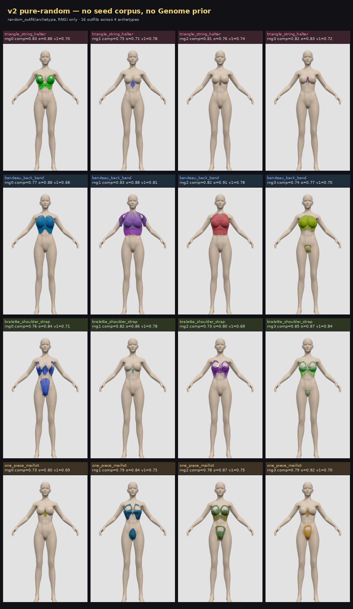

## Seeds (16)

### archetype: `unknown` (16)

#### `bandeau_back_band__rng0`

<table>
  <tr>
    <td align='center'><a href='renders/bandeau_back_band__rng0/01_front.png'>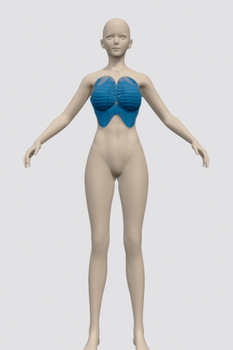</a> 01_front</td>
    <td align='center'><a href='renders/bandeau_back_band__rng0/02_three_quarter.png'>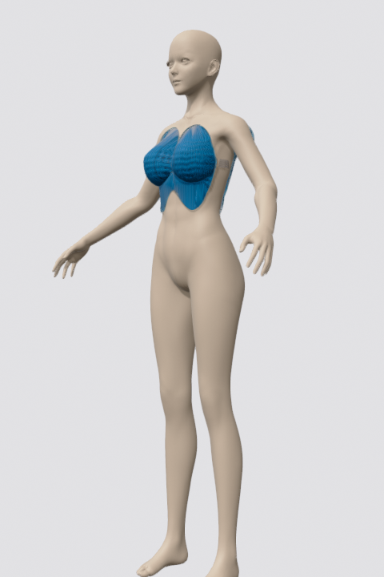</a> 02_three_quarter</td>
    <td align='center'><a href='renders/bandeau_back_band__rng0/03_side_left.png'>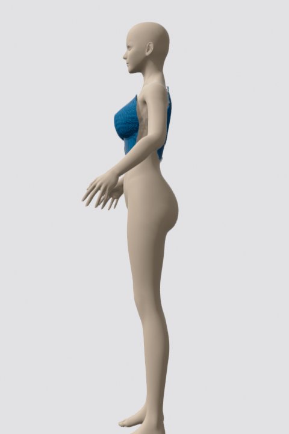</a> 03_side_left</td>
    <td align='center'><a href='renders/bandeau_back_band__rng0/04_back.png'>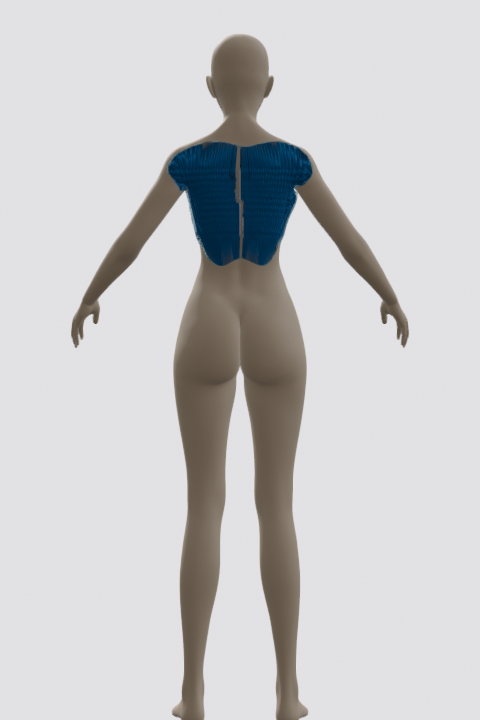</a> 04_back</td>
  </tr>
  <tr>
    <td align='center'><a href='renders/bandeau_back_band__rng0/05_chest_close.png'>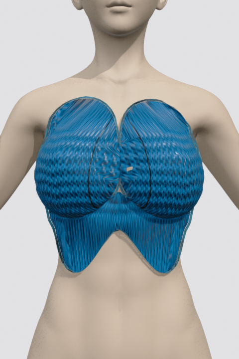</a> 05_chest_close</td>
    <td align='center'> 06_hip_close</td>
    <td align='center'><a href='renders/bandeau_back_band__rng0/07_neck_top.png'>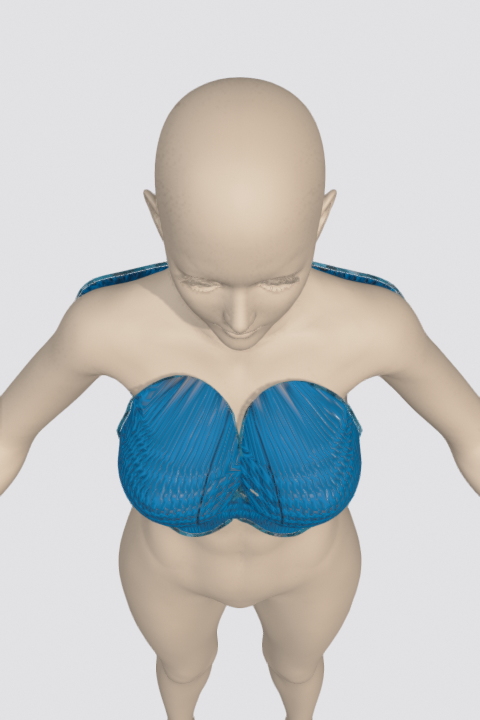</a> 07_neck_top</td>
    <td align='center'><a href='renders/bandeau_back_band__rng0/08_shoulder_top.png'>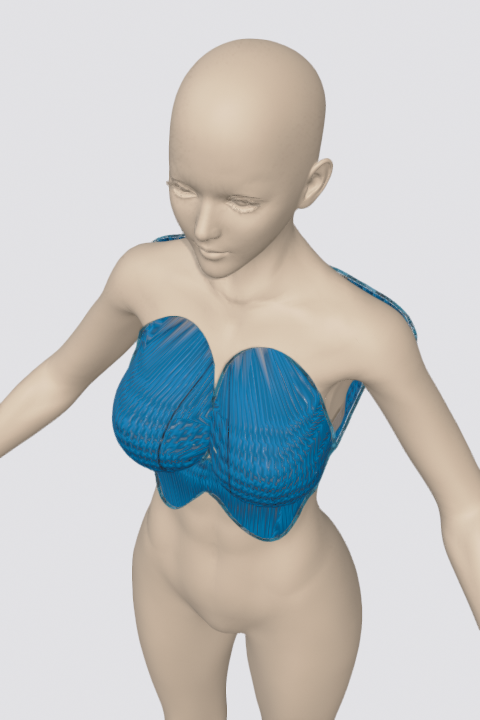</a> 08_shoulder_top</td>
  </tr>
</table>

#### `bandeau_back_band__rng1`

<table>
  <tr>
    <td align='center'><a href='renders/bandeau_back_band__rng1/01_front.png'>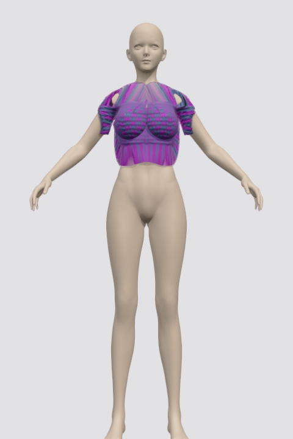</a> 01_front</td>
    <td align='center'><a href='renders/bandeau_back_band__rng1/02_three_quarter.png'>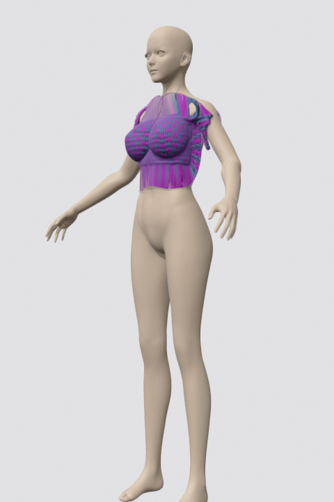</a> 02_three_quarter</td>
    <td align='center'><a href='renders/bandeau_back_band__rng1/03_side_left.png'>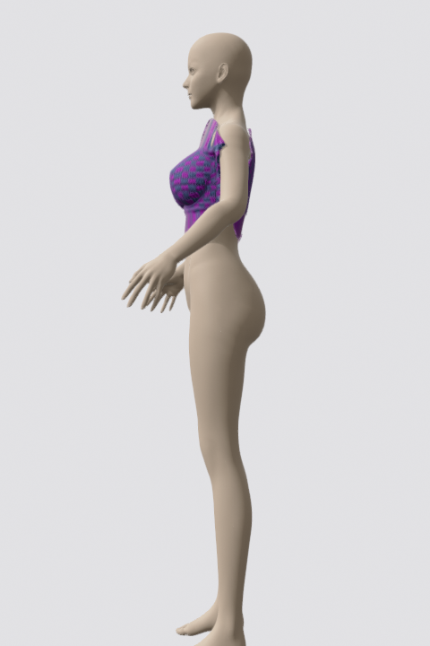</a> 03_side_left</td>
    <td align='center'><a href='renders/bandeau_back_band__rng1/04_back.png'>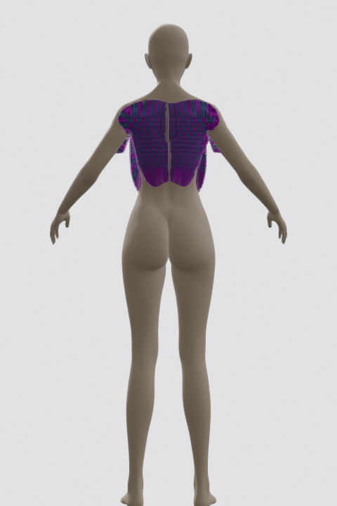</a> 04_back</td>
  </tr>
  <tr>
    <td align='center'><a href='renders/bandeau_back_band__rng1/05_chest_close.png'>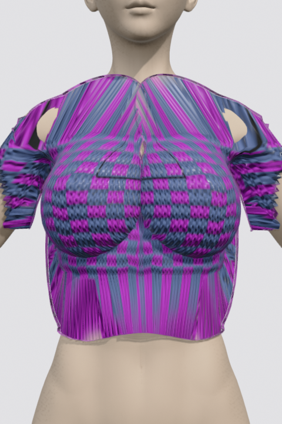</a> 05_chest_close</td>
    <td align='center'> 06_hip_close</td>
    <td align='center'><a href='renders/bandeau_back_band__rng1/07_neck_top.png'>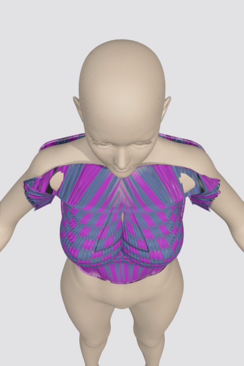</a> 07_neck_top</td>
    <td align='center'><a href='renders/bandeau_back_band__rng1/08_shoulder_top.png'>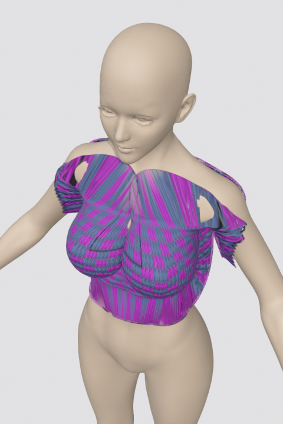</a> 08_shoulder_top</td>
  </tr>
</table>

#### `bandeau_back_band__rng2`

<table>
  <tr>
    <td align='center'><a href='renders/bandeau_back_band__rng2/01_front.png'>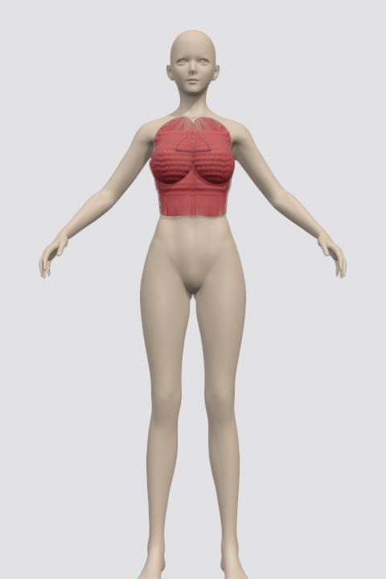</a> 01_front</td>
    <td align='center'><a href='renders/bandeau_back_band__rng2/02_three_quarter.png'>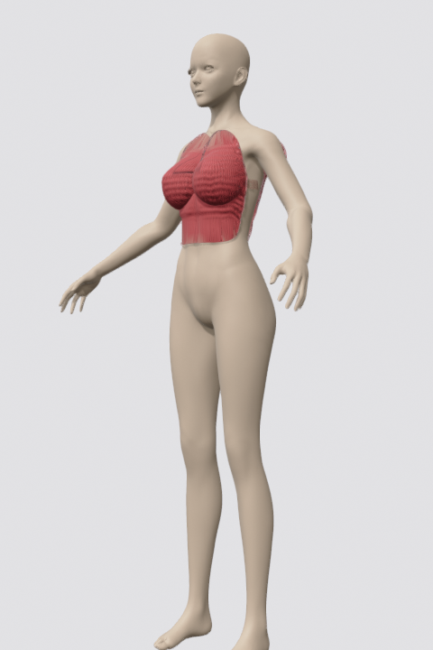</a> 02_three_quarter</td>
    <td align='center'><a href='renders/bandeau_back_band__rng2/03_side_left.png'>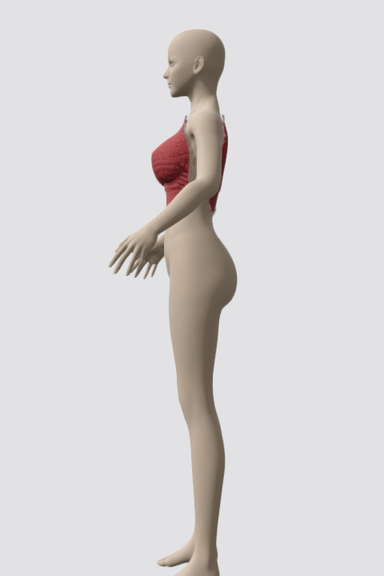</a> 03_side_left</td>
    <td align='center'><a href='renders/bandeau_back_band__rng2/04_back.png'>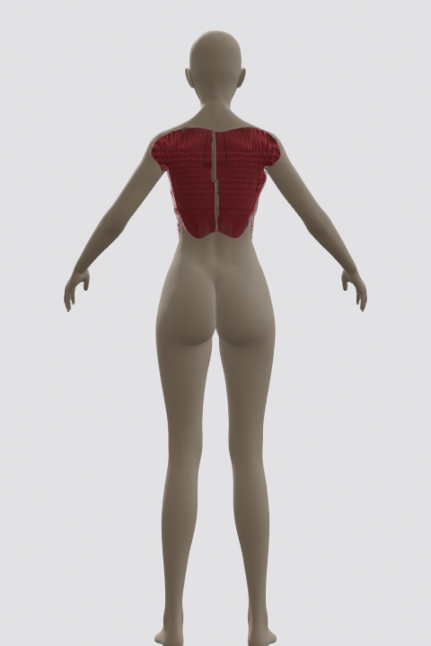</a> 04_back</td>
  </tr>
  <tr>
    <td align='center'><a href='renders/bandeau_back_band__rng2/05_chest_close.png'>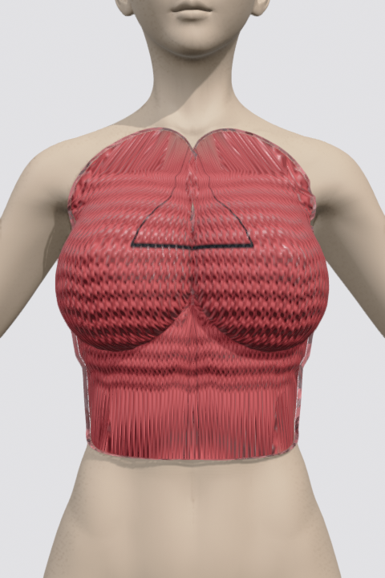</a> 05_chest_close</td>
    <td align='center'> 06_hip_close</td>
    <td align='center'><a href='renders/bandeau_back_band__rng2/07_neck_top.png'>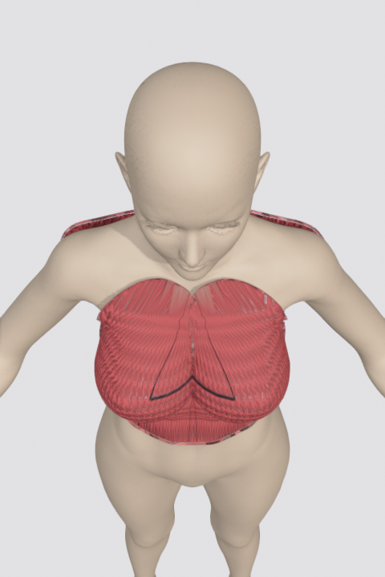</a> 07_neck_top</td>
    <td align='center'><a href='renders/bandeau_back_band__rng2/08_shoulder_top.png'>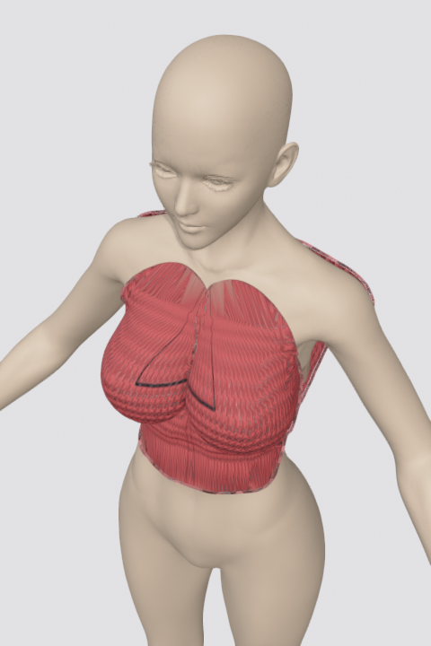</a> 08_shoulder_top</td>
  </tr>
</table>

#### `bandeau_back_band__rng3`

<table>
  <tr>
    <td align='center'><a href='renders/bandeau_back_band__rng3/01_front.png'>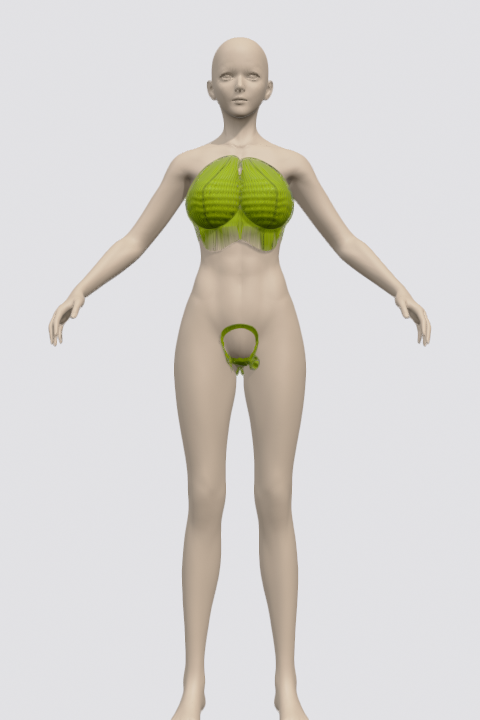</a> 01_front</td>
    <td align='center'><a href='renders/bandeau_back_band__rng3/02_three_quarter.png'>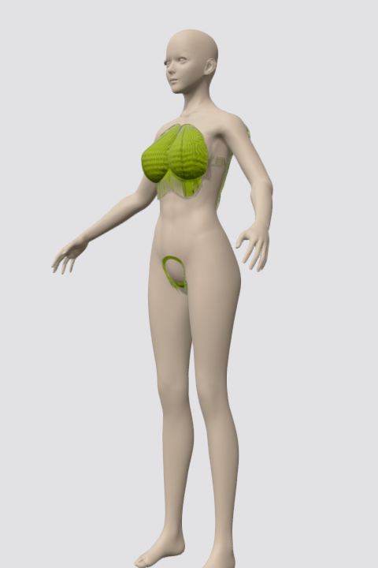</a> 02_three_quarter</td>
    <td align='center'><a href='renders/bandeau_back_band__rng3/03_side_left.png'>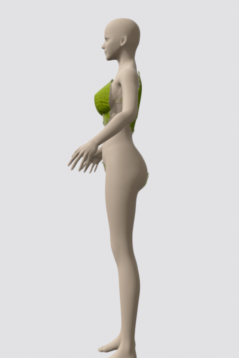</a> 03_side_left</td>
    <td align='center'><a href='renders/bandeau_back_band__rng3/04_back.png'>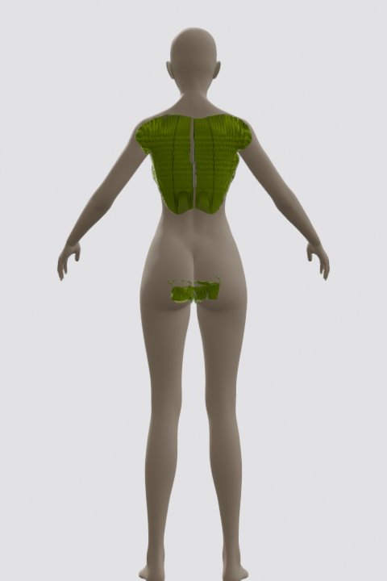</a> 04_back</td>
  </tr>
  <tr>
    <td align='center'><a href='renders/bandeau_back_band__rng3/05_chest_close.png'>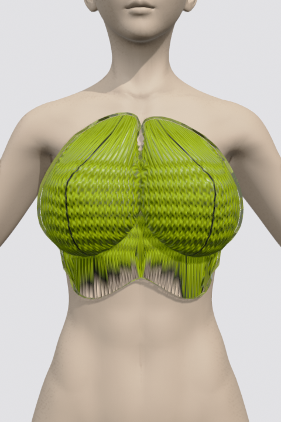</a> 05_chest_close</td>
    <td align='center'> 06_hip_close</td>
    <td align='center'><a href='renders/bandeau_back_band__rng3/07_neck_top.png'>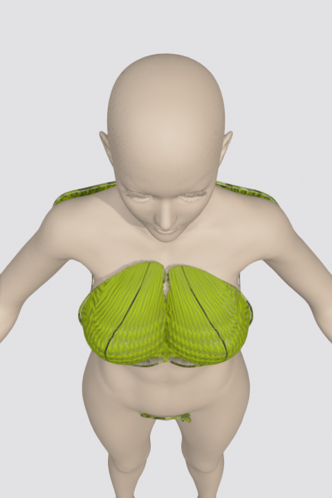</a> 07_neck_top</td>
    <td align='center'><a href='renders/bandeau_back_band__rng3/08_shoulder_top.png'>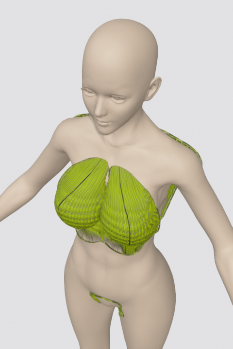</a> 08_shoulder_top</td>
  </tr>
</table>

#### `bralette_shoulder_strap__rng0`

<table>
  <tr>
    <td align='center'><a href='renders/bralette_shoulder_strap__rng0/01_front.png'>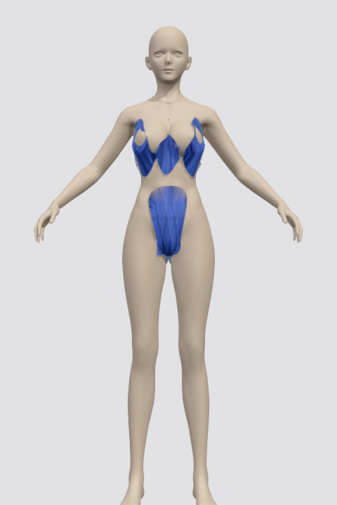</a> 01_front</td>
    <td align='center'><a href='renders/bralette_shoulder_strap__rng0/02_three_quarter.png'>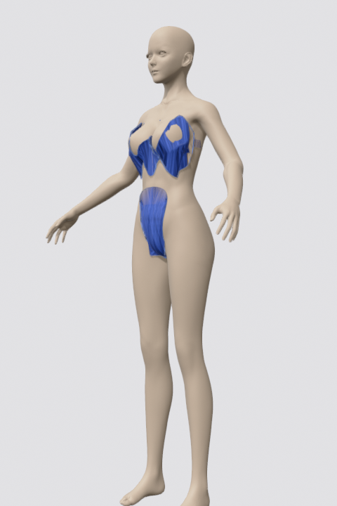</a> 02_three_quarter</td>
    <td align='center'><a href='renders/bralette_shoulder_strap__rng0/03_side_left.png'>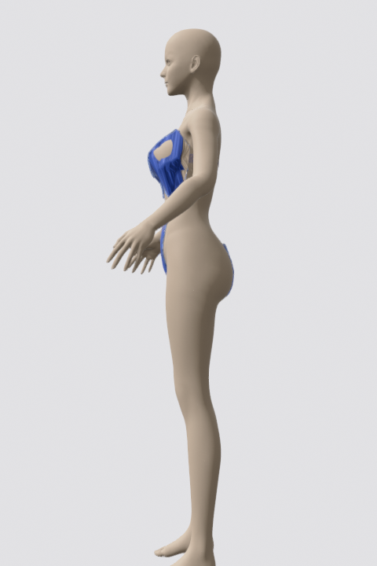</a> 03_side_left</td>
    <td align='center'><a href='renders/bralette_shoulder_strap__rng0/04_back.png'>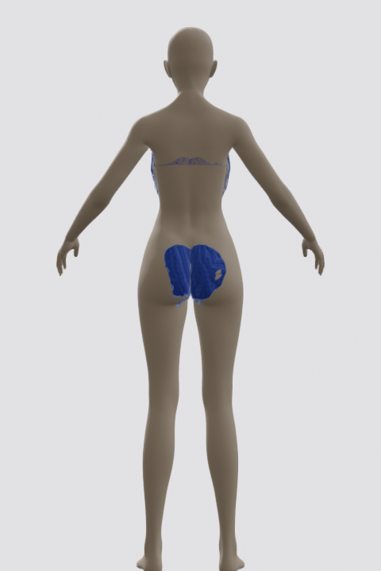</a> 04_back</td>
  </tr>
  <tr>
    <td align='center'><a href='renders/bralette_shoulder_strap__rng0/05_chest_close.png'>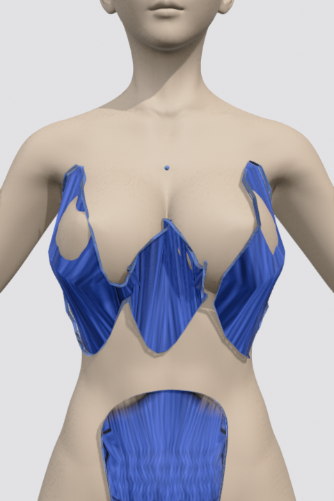</a> 05_chest_close</td>
    <td align='center'> 06_hip_close</td>
    <td align='center'><a href='renders/bralette_shoulder_strap__rng0/07_neck_top.png'>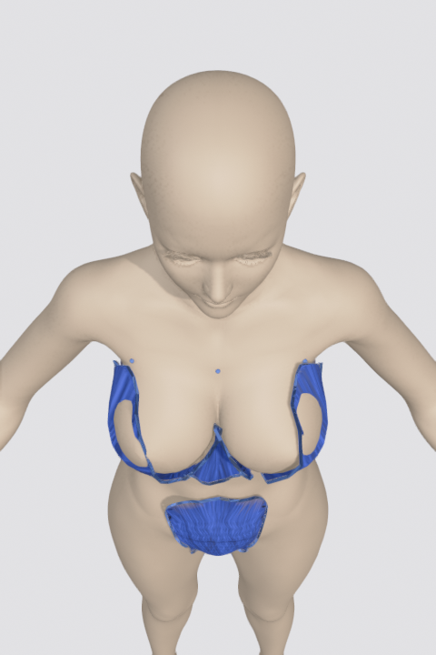</a> 07_neck_top</td>
    <td align='center'><a href='renders/bralette_shoulder_strap__rng0/08_shoulder_top.png'>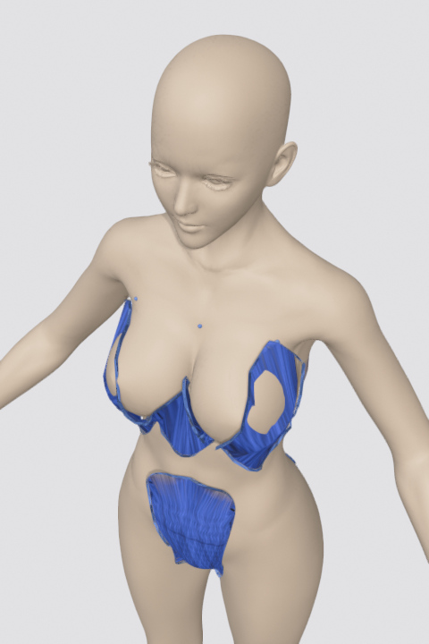</a> 08_shoulder_top</td>
  </tr>
</table>

#### `bralette_shoulder_strap__rng1`

<table>
  <tr>
    <td align='center'> 01_front</td>
    <td align='center'><a href='renders/bralette_shoulder_strap__rng1/02_three_quarter.png'>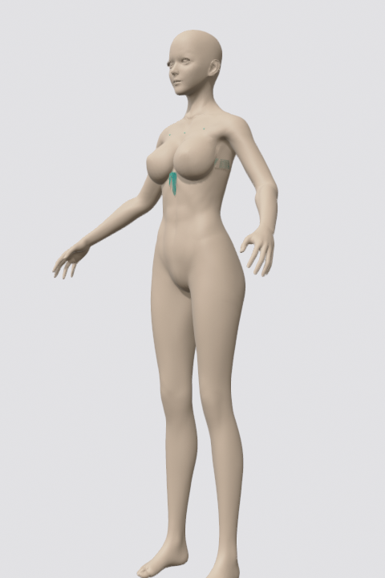</a> 02_three_quarter</td>
    <td align='center'><a href='renders/bralette_shoulder_strap__rng1/03_side_left.png'>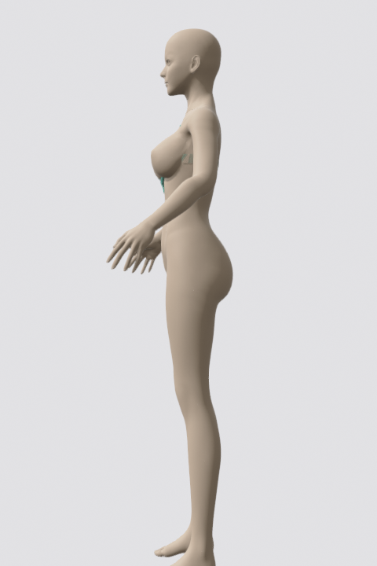</a> 03_side_left</td>
    <td align='center'><a href='renders/bralette_shoulder_strap__rng1/04_back.png'>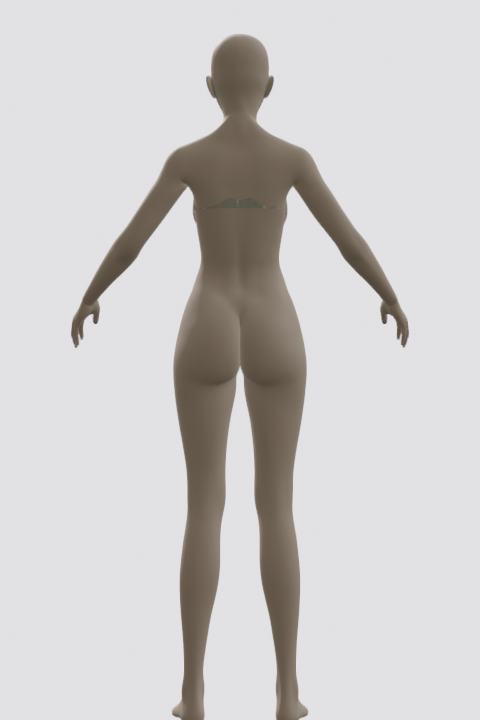</a> 04_back</td>
  </tr>
  <tr>
    <td align='center'><a href='renders/bralette_shoulder_strap__rng1/05_chest_close.png'>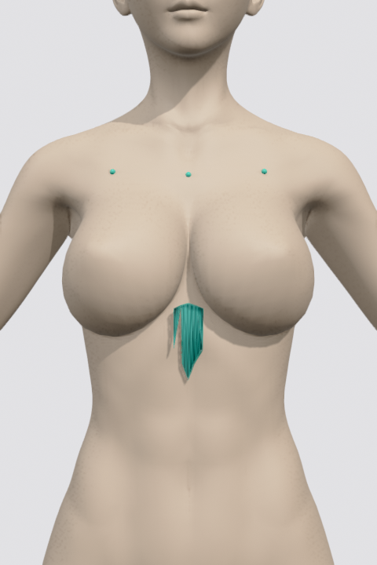</a> 05_chest_close</td>
    <td align='center'> 06_hip_close</td>
    <td align='center'> 07_neck_top</td>
    <td align='center'><a href='renders/bralette_shoulder_strap__rng1/08_shoulder_top.png'>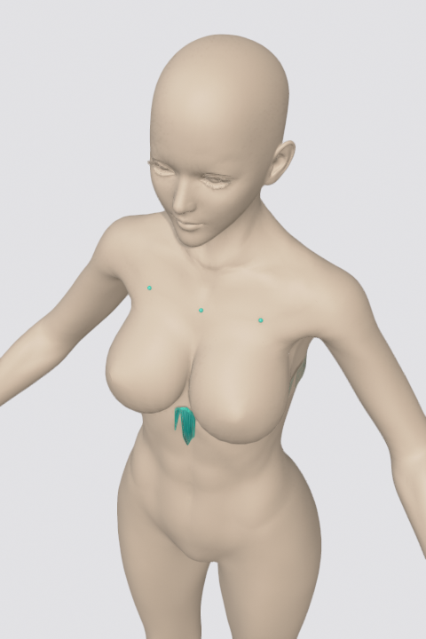</a> 08_shoulder_top</td>
  </tr>
</table>

#### `bralette_shoulder_strap__rng2`

<table>
  <tr>
    <td align='center'><a href='renders/bralette_shoulder_strap__rng2/01_front.png'>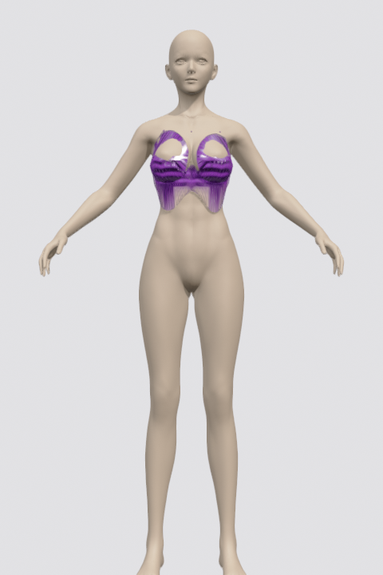</a> 01_front</td>
    <td align='center'><a href='renders/bralette_shoulder_strap__rng2/02_three_quarter.png'>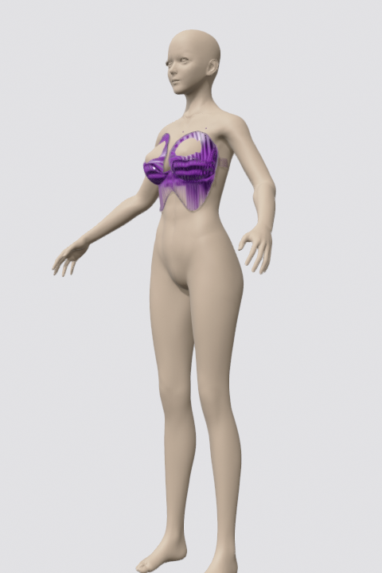</a> 02_three_quarter</td>
    <td align='center'><a href='renders/bralette_shoulder_strap__rng2/03_side_left.png'>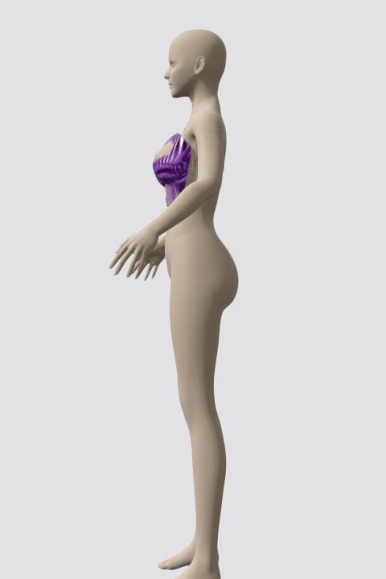</a> 03_side_left</td>
    <td align='center'><a href='renders/bralette_shoulder_strap__rng2/04_back.png'>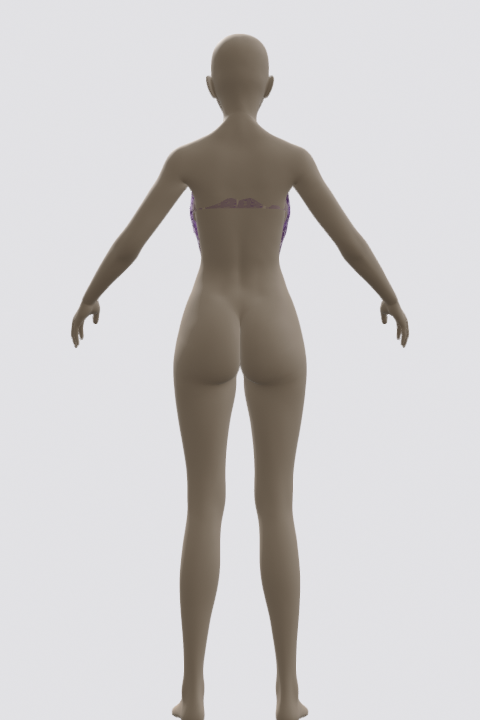</a> 04_back</td>
  </tr>
  <tr>
    <td align='center'><a href='renders/bralette_shoulder_strap__rng2/05_chest_close.png'>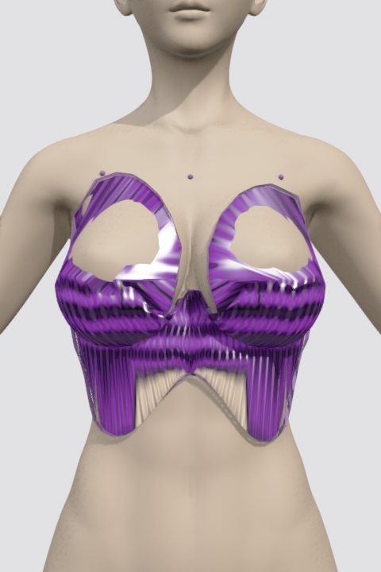</a> 05_chest_close</td>
    <td align='center'> 06_hip_close</td>
    <td align='center'><a href='renders/bralette_shoulder_strap__rng2/07_neck_top.png'>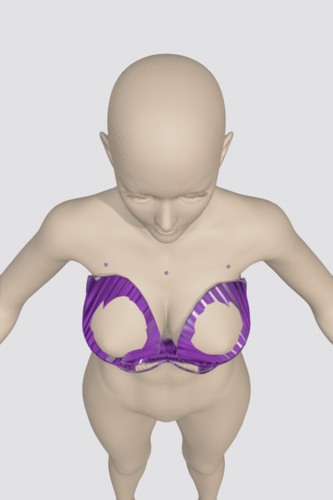</a> 07_neck_top</td>
    <td align='center'><a href='renders/bralette_shoulder_strap__rng2/08_shoulder_top.png'>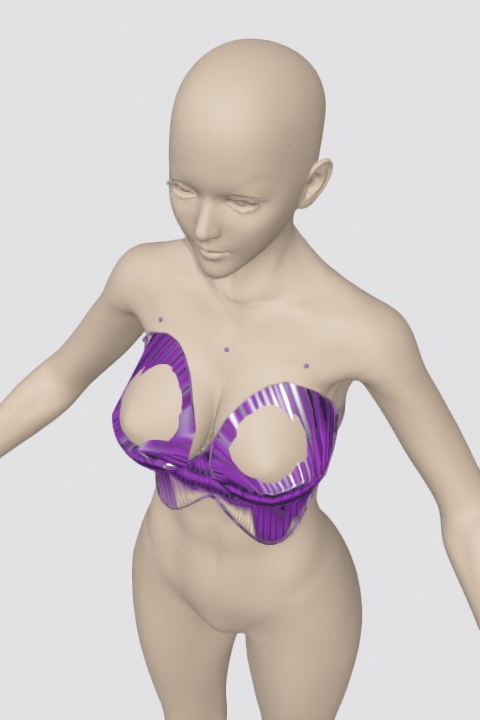</a> 08_shoulder_top</td>
  </tr>
</table>

#### `bralette_shoulder_strap__rng3`

<table>
  <tr>
    <td align='center'><a href='renders/bralette_shoulder_strap__rng3/01_front.png'>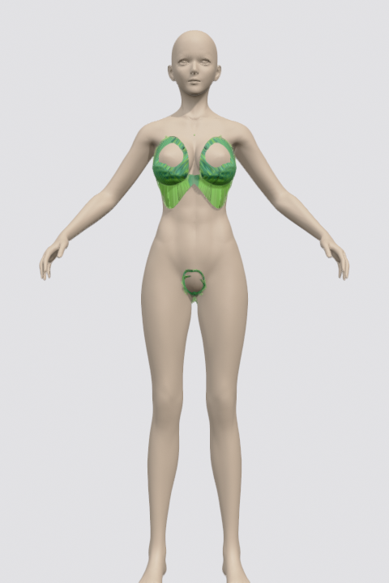</a> 01_front</td>
    <td align='center'><a href='renders/bralette_shoulder_strap__rng3/02_three_quarter.png'>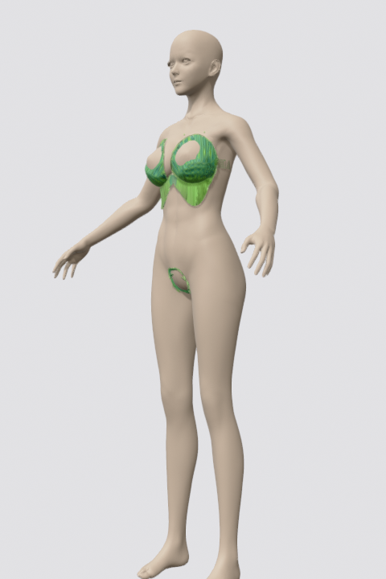</a> 02_three_quarter</td>
    <td align='center'><a href='renders/bralette_shoulder_strap__rng3/03_side_left.png'>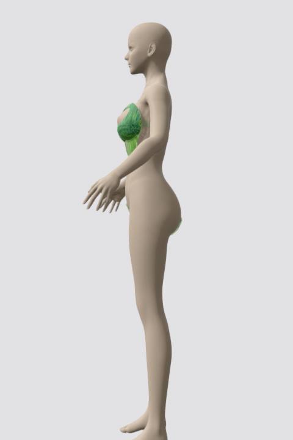</a> 03_side_left</td>
    <td align='center'><a href='renders/bralette_shoulder_strap__rng3/04_back.png'>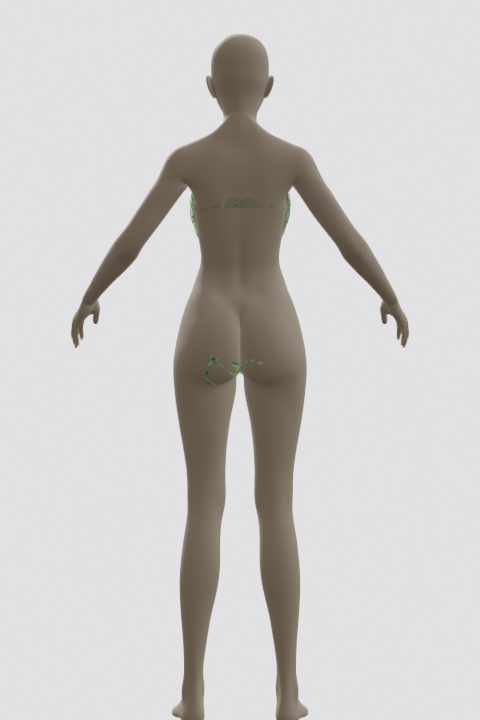</a> 04_back</td>
  </tr>
  <tr>
    <td align='center'><a href='renders/bralette_shoulder_strap__rng3/05_chest_close.png'>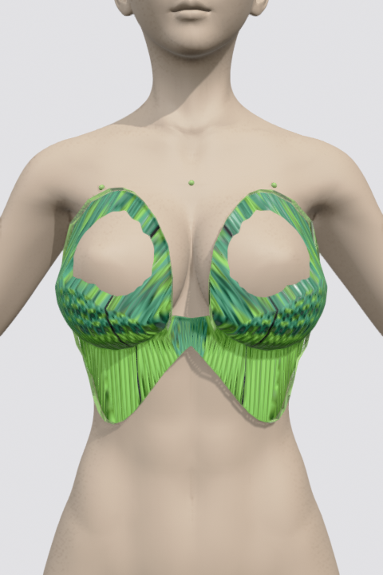</a> 05_chest_close</td>
    <td align='center'><a href='renders/bralette_shoulder_strap__rng3/06_hip_close.png'>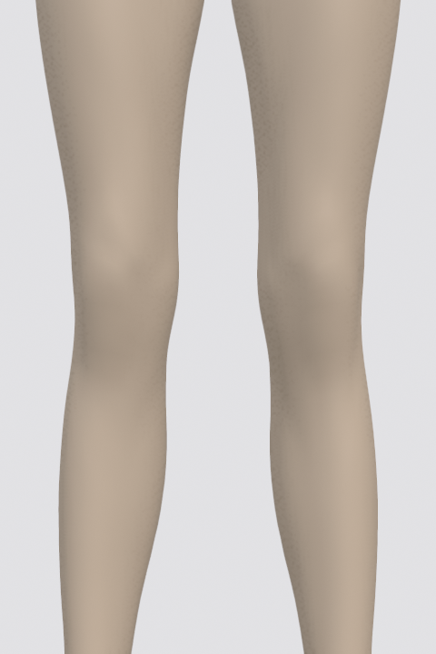</a> 06_hip_close</td>
    <td align='center'><a href='renders/bralette_shoulder_strap__rng3/07_neck_top.png'>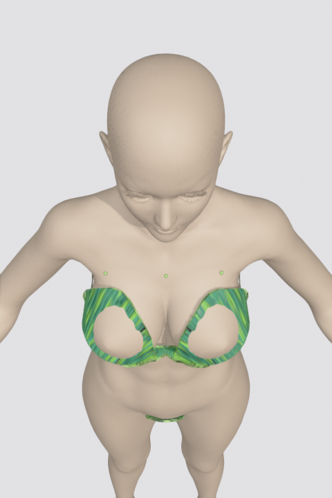</a> 07_neck_top</td>
    <td align='center'><a href='renders/bralette_shoulder_strap__rng3/08_shoulder_top.png'>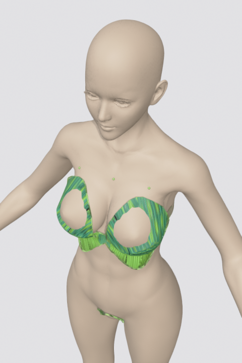</a> 08_shoulder_top</td>
  </tr>
</table>

#### `one_piece_maillot__rng0`

<table>
  <tr>
    <td align='center'><a href='renders/one_piece_maillot__rng0/01_front.png'>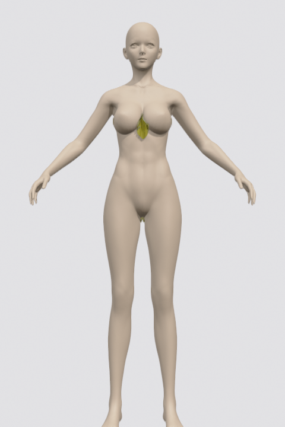</a> 01_front</td>
    <td align='center'><a href='renders/one_piece_maillot__rng0/02_three_quarter.png'>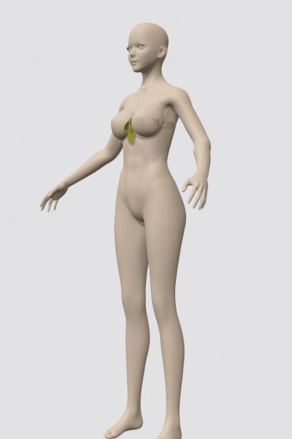</a> 02_three_quarter</td>
    <td align='center'><a href='renders/one_piece_maillot__rng0/03_side_left.png'>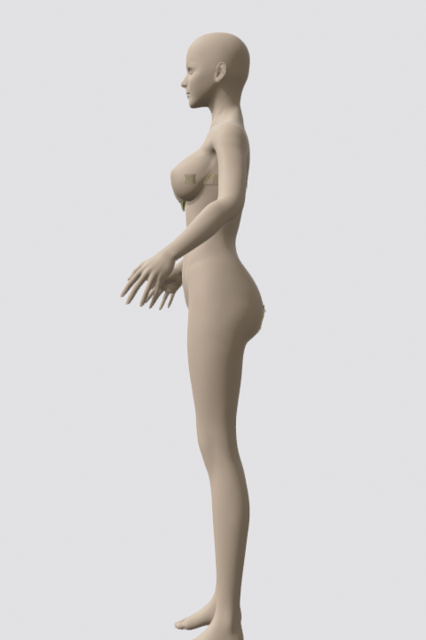</a> 03_side_left</td>
    <td align='center'> 04_back</td>
  </tr>
  <tr>
    <td align='center'><a href='renders/one_piece_maillot__rng0/05_chest_close.png'>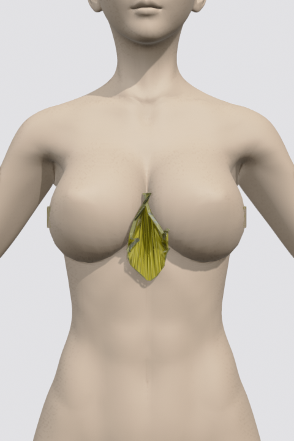</a> 05_chest_close</td>
    <td align='center'> 06_hip_close</td>
    <td align='center'> 07_neck_top</td>
    <td align='center'><a href='renders/one_piece_maillot__rng0/08_shoulder_top.png'>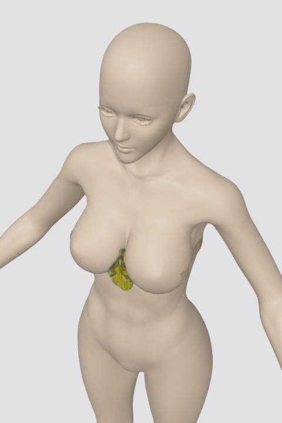</a> 08_shoulder_top</td>
  </tr>
</table>

#### `one_piece_maillot__rng1`

<table>
  <tr>
    <td align='center'><a href='renders/one_piece_maillot__rng1/01_front.png'>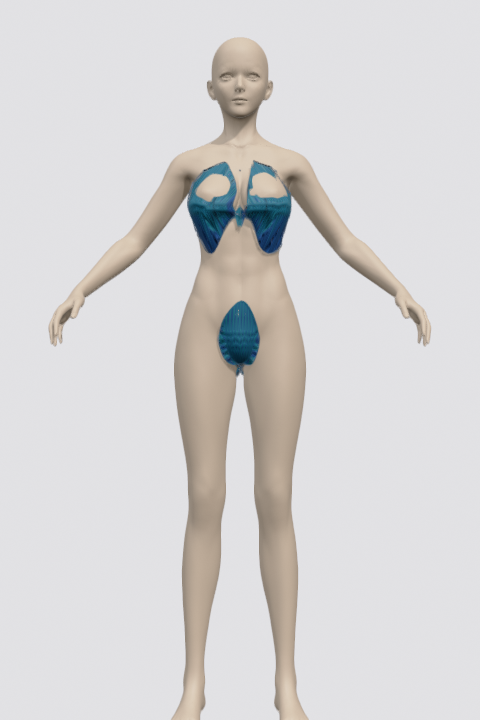</a> 01_front</td>
    <td align='center'><a href='renders/one_piece_maillot__rng1/02_three_quarter.png'>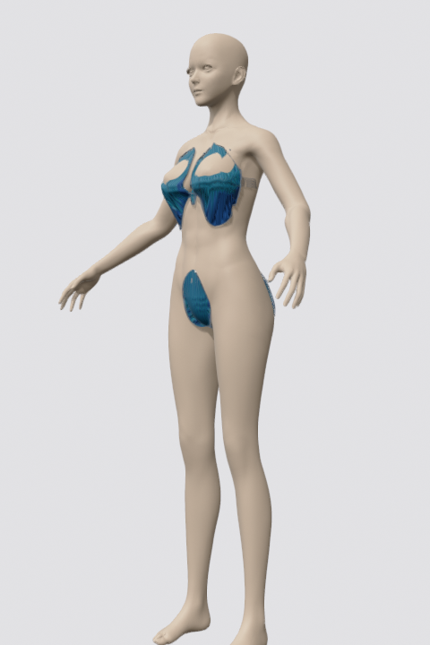</a> 02_three_quarter</td>
    <td align='center'><a href='renders/one_piece_maillot__rng1/03_side_left.png'>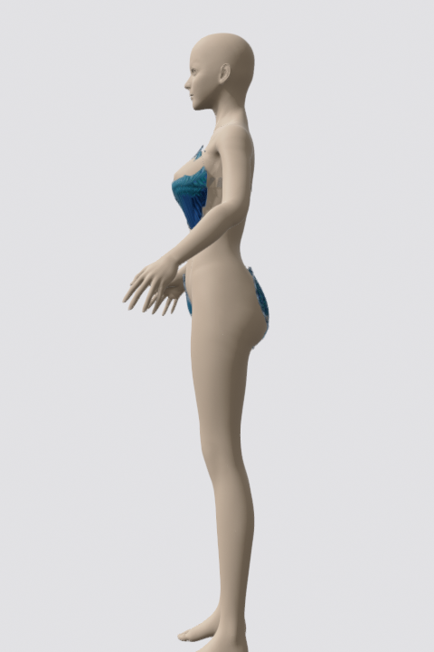</a> 03_side_left</td>
    <td align='center'><a href='renders/one_piece_maillot__rng1/04_back.png'>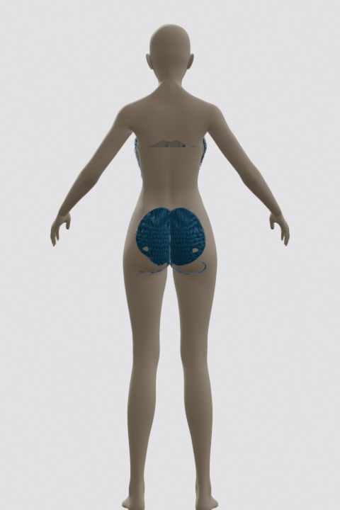</a> 04_back</td>
  </tr>
  <tr>
    <td align='center'><a href='renders/one_piece_maillot__rng1/05_chest_close.png'>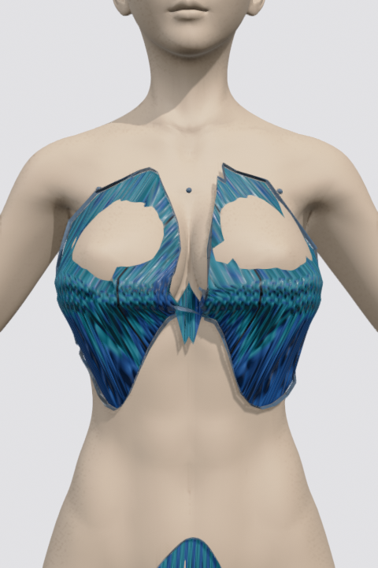</a> 05_chest_close</td>
    <td align='center'> 06_hip_close</td>
    <td align='center'><a href='renders/one_piece_maillot__rng1/07_neck_top.png'>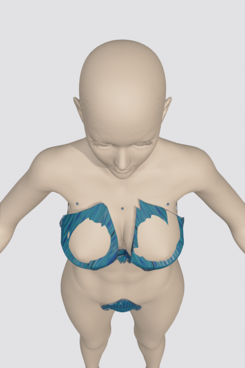</a> 07_neck_top</td>
    <td align='center'><a href='renders/one_piece_maillot__rng1/08_shoulder_top.png'>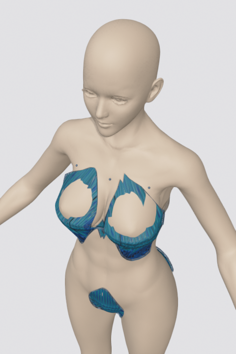</a> 08_shoulder_top</td>
  </tr>
</table>

#### `one_piece_maillot__rng2`

<table>
  <tr>
    <td align='center'><a href='renders/one_piece_maillot__rng2/01_front.png'>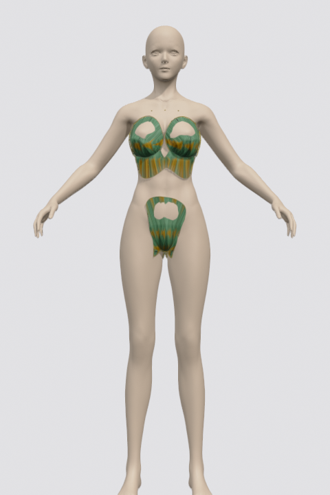</a> 01_front</td>
    <td align='center'><a href='renders/one_piece_maillot__rng2/02_three_quarter.png'>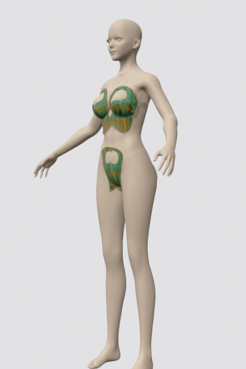</a> 02_three_quarter</td>
    <td align='center'><a href='renders/one_piece_maillot__rng2/03_side_left.png'>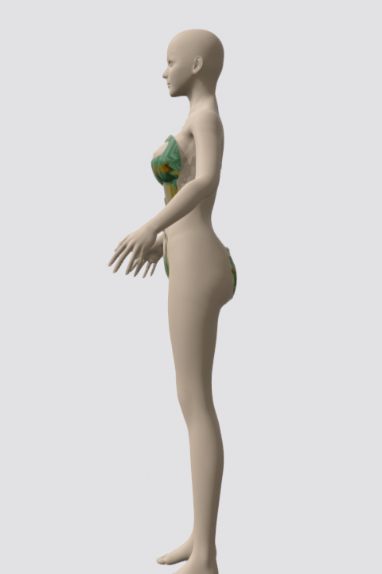</a> 03_side_left</td>
    <td align='center'><a href='renders/one_piece_maillot__rng2/04_back.png'>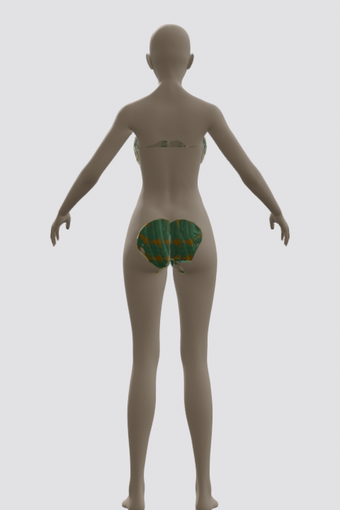</a> 04_back</td>
  </tr>
  <tr>
    <td align='center'><a href='renders/one_piece_maillot__rng2/05_chest_close.png'>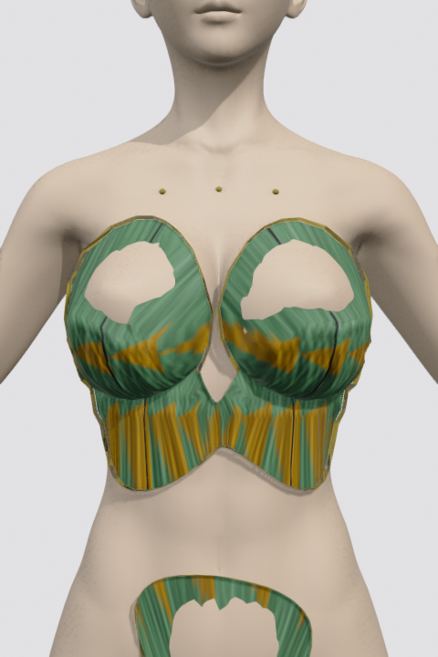</a> 05_chest_close</td>
    <td align='center'> 06_hip_close</td>
    <td align='center'><a href='renders/one_piece_maillot__rng2/07_neck_top.png'>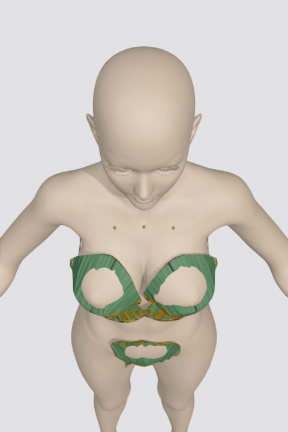</a> 07_neck_top</td>
    <td align='center'><a href='renders/one_piece_maillot__rng2/08_shoulder_top.png'>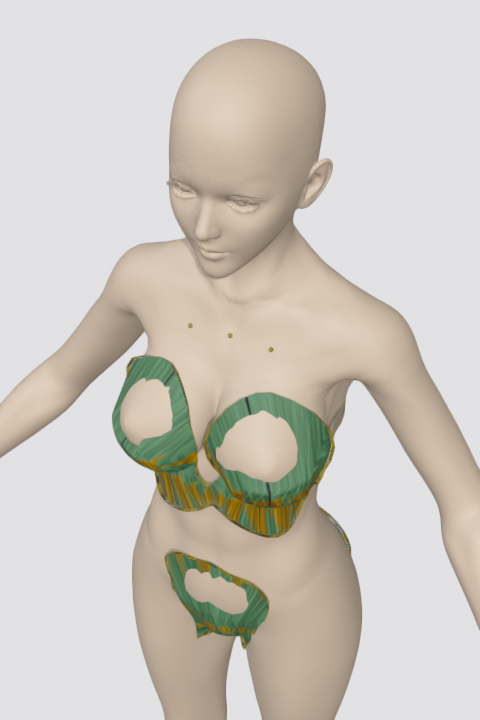</a> 08_shoulder_top</td>
  </tr>
</table>

#### `one_piece_maillot__rng3`

<table>
  <tr>
    <td align='center'><a href='renders/one_piece_maillot__rng3/01_front.png'>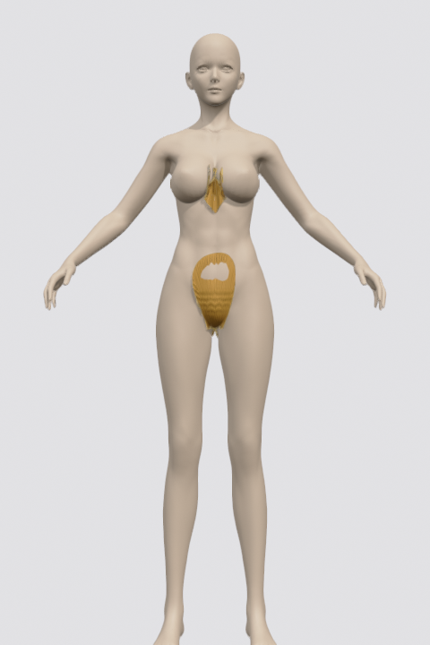</a> 01_front</td>
    <td align='center'><a href='renders/one_piece_maillot__rng3/02_three_quarter.png'>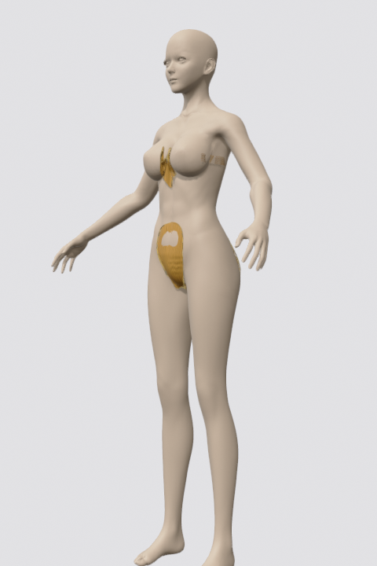</a> 02_three_quarter</td>
    <td align='center'> 03_side_left</td>
    <td align='center'><a href='renders/one_piece_maillot__rng3/04_back.png'>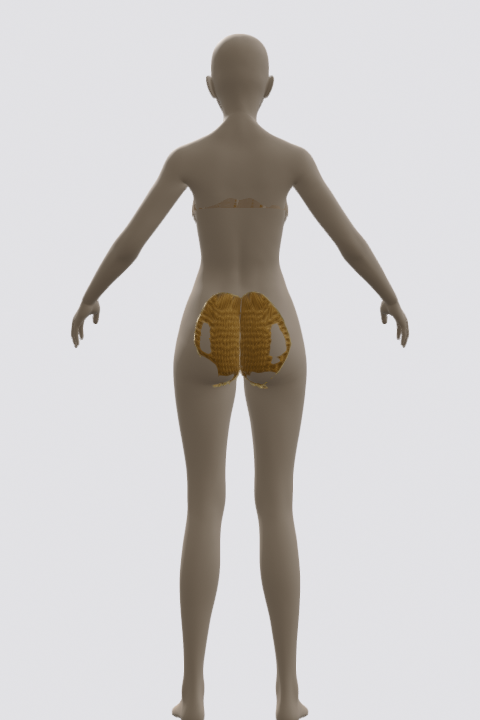</a> 04_back</td>
  </tr>
  <tr>
    <td align='center'><a href='renders/one_piece_maillot__rng3/05_chest_close.png'>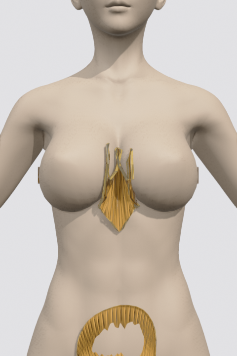</a> 05_chest_close</td>
    <td align='center'><a href='renders/one_piece_maillot__rng3/06_hip_close.png'>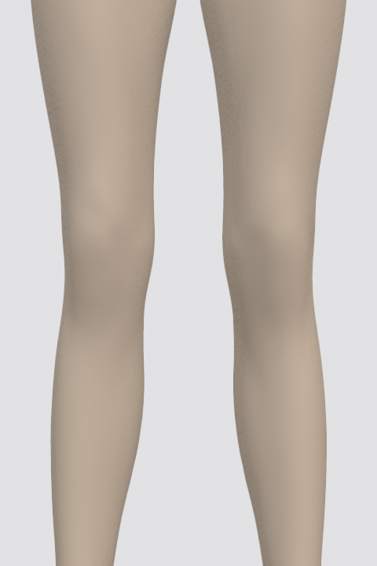</a> 06_hip_close</td>
    <td align='center'><a href='renders/one_piece_maillot__rng3/07_neck_top.png'>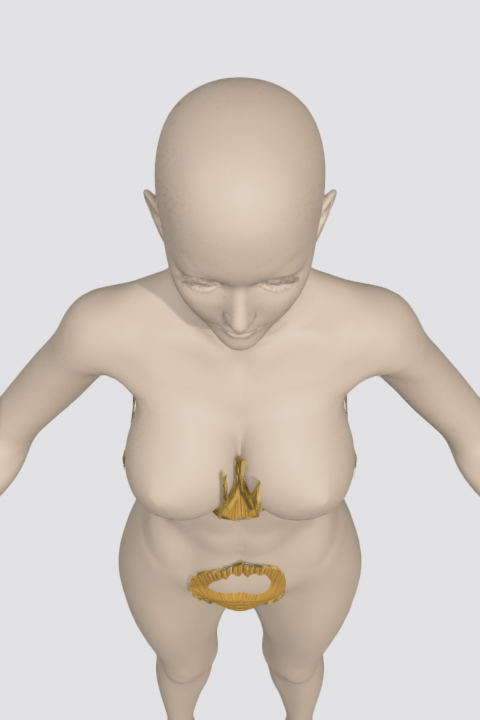</a> 07_neck_top</td>
    <td align='center'><a href='renders/one_piece_maillot__rng3/08_shoulder_top.png'>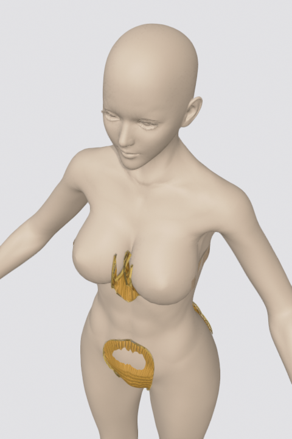</a> 08_shoulder_top</td>
  </tr>
</table>

#### `triangle_string_halter__rng0`

<table>
  <tr>
    <td align='center'><a href='renders/triangle_string_halter__rng0/01_front.png'>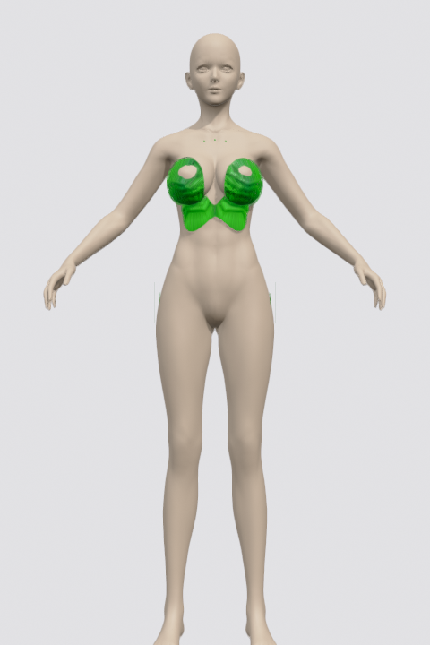</a> 01_front</td>
    <td align='center'><a href='renders/triangle_string_halter__rng0/02_three_quarter.png'>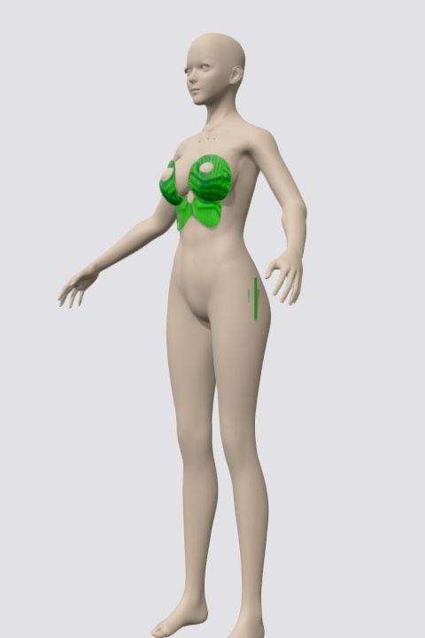</a> 02_three_quarter</td>
    <td align='center'><a href='renders/triangle_string_halter__rng0/03_side_left.png'>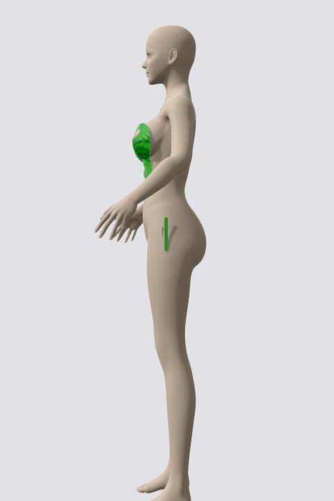</a> 03_side_left</td>
    <td align='center'><a href='renders/triangle_string_halter__rng0/04_back.png'>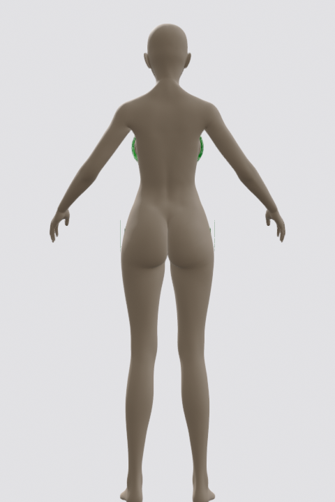</a> 04_back</td>
  </tr>
  <tr>
    <td align='center'><a href='renders/triangle_string_halter__rng0/05_chest_close.png'>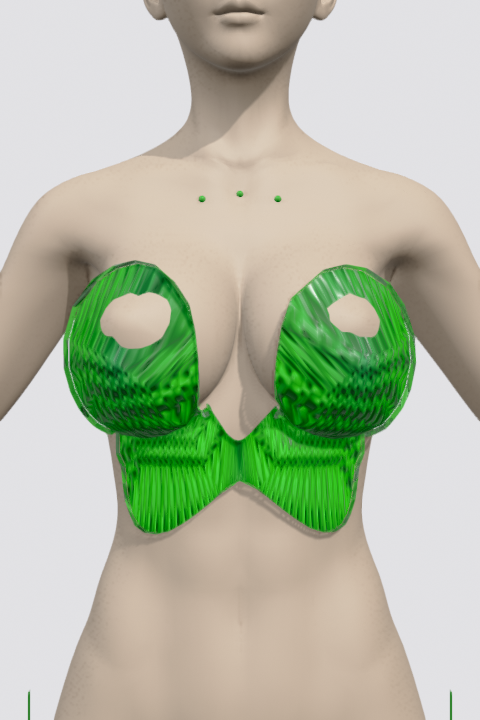</a> 05_chest_close</td>
    <td align='center'> 06_hip_close</td>
    <td align='center'><a href='renders/triangle_string_halter__rng0/07_neck_top.png'>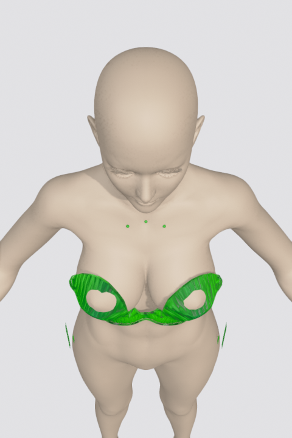</a> 07_neck_top</td>
    <td align='center'><a href='renders/triangle_string_halter__rng0/08_shoulder_top.png'>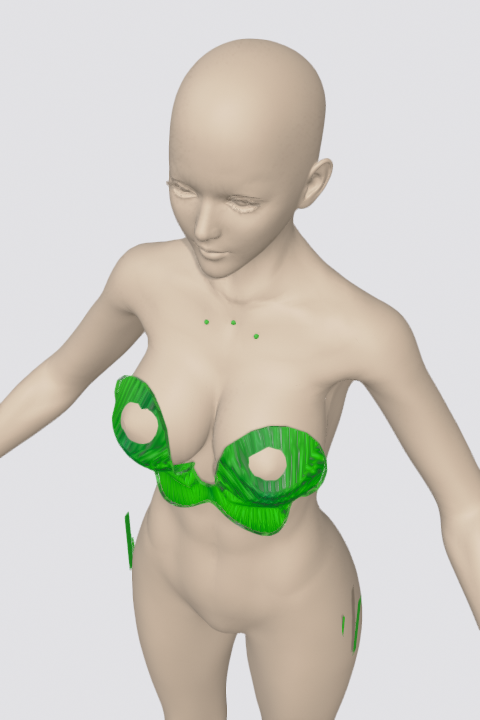</a> 08_shoulder_top</td>
  </tr>
</table>

#### `triangle_string_halter__rng1`

<table>
  <tr>
    <td align='center'><a href='renders/triangle_string_halter__rng1/01_front.png'>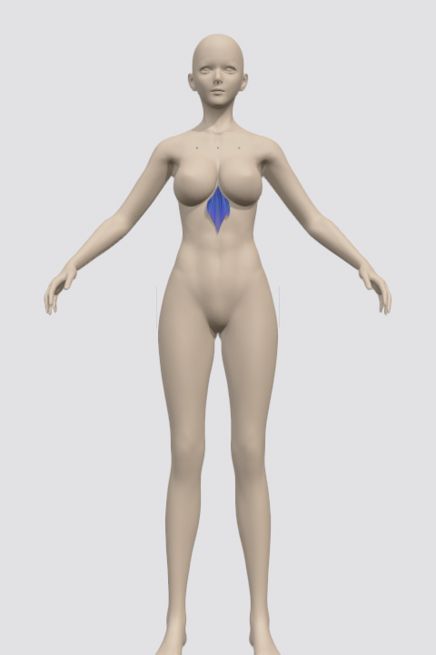</a> 01_front</td>
    <td align='center'><a href='renders/triangle_string_halter__rng1/02_three_quarter.png'>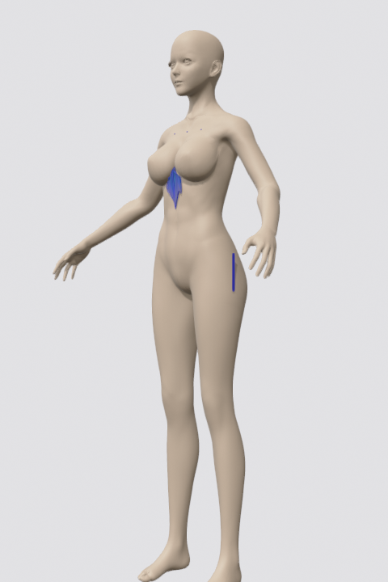</a> 02_three_quarter</td>
    <td align='center'><a href='renders/triangle_string_halter__rng1/03_side_left.png'>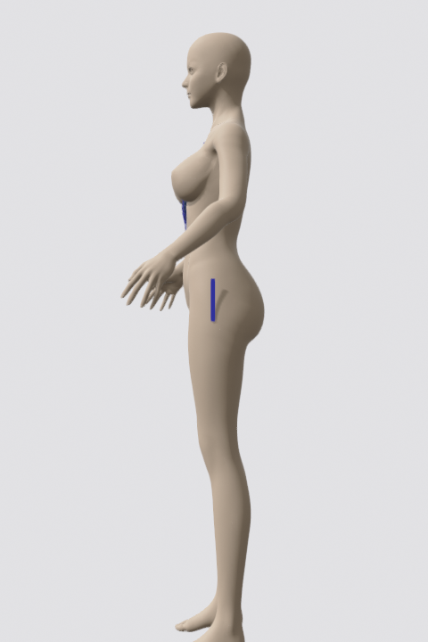</a> 03_side_left</td>
    <td align='center'> 04_back</td>
  </tr>
  <tr>
    <td align='center'><a href='renders/triangle_string_halter__rng1/05_chest_close.png'>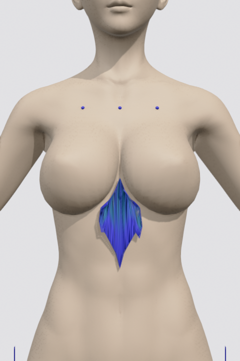</a> 05_chest_close</td>
    <td align='center'> 06_hip_close</td>
    <td align='center'><a href='renders/triangle_string_halter__rng1/07_neck_top.png'>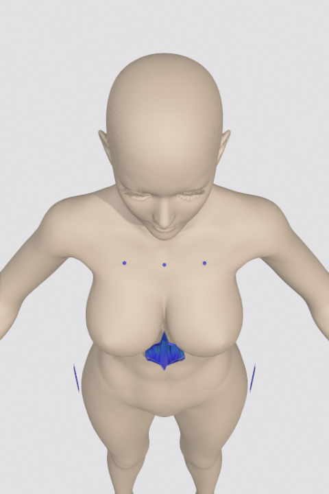</a> 07_neck_top</td>
    <td align='center'><a href='renders/triangle_string_halter__rng1/08_shoulder_top.png'>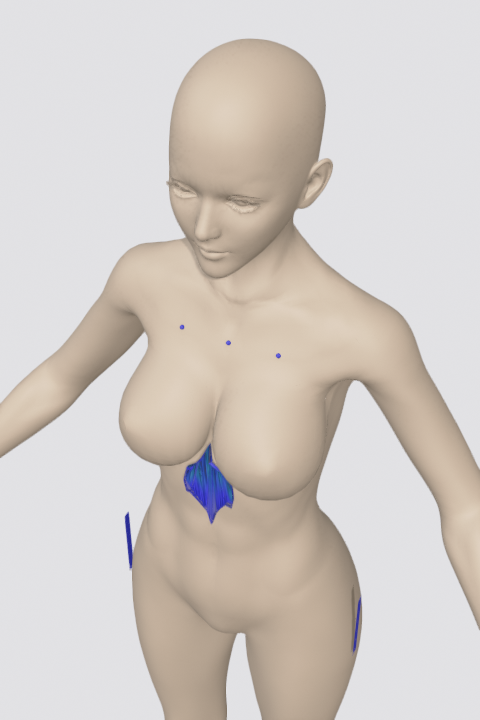</a> 08_shoulder_top</td>
  </tr>
</table>

#### `triangle_string_halter__rng2`

<table>
  <tr>
    <td align='center'> 01_front</td>
    <td align='center'><a href='renders/triangle_string_halter__rng2/02_three_quarter.png'>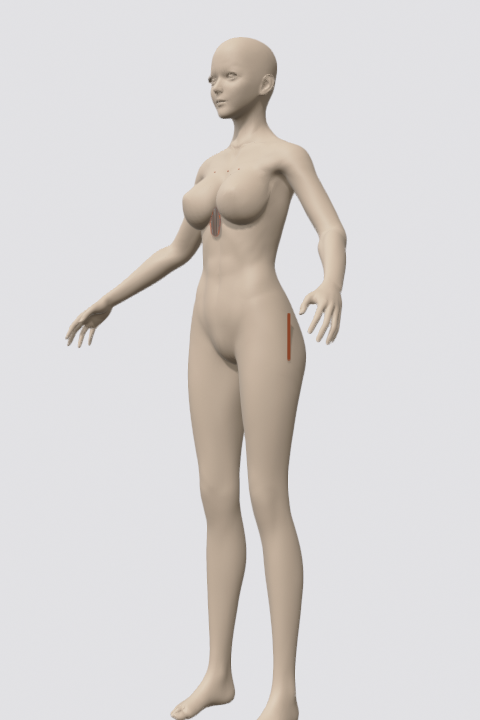</a> 02_three_quarter</td>
    <td align='center'> 03_side_left</td>
    <td align='center'> 04_back</td>
  </tr>
  <tr>
    <td align='center'><a href='renders/triangle_string_halter__rng2/05_chest_close.png'>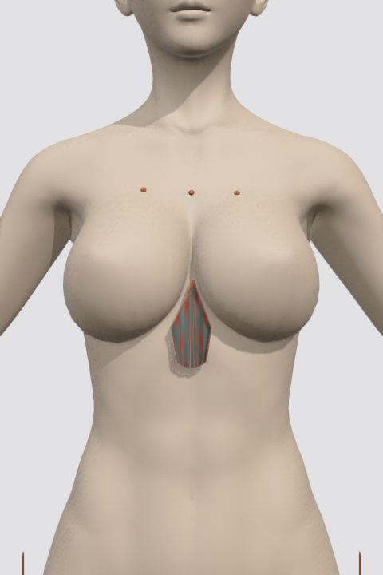</a> 05_chest_close</td>
    <td align='center'> 06_hip_close</td>
    <td align='center'> 07_neck_top</td>
    <td align='center'><a href='renders/triangle_string_halter__rng2/08_shoulder_top.png'>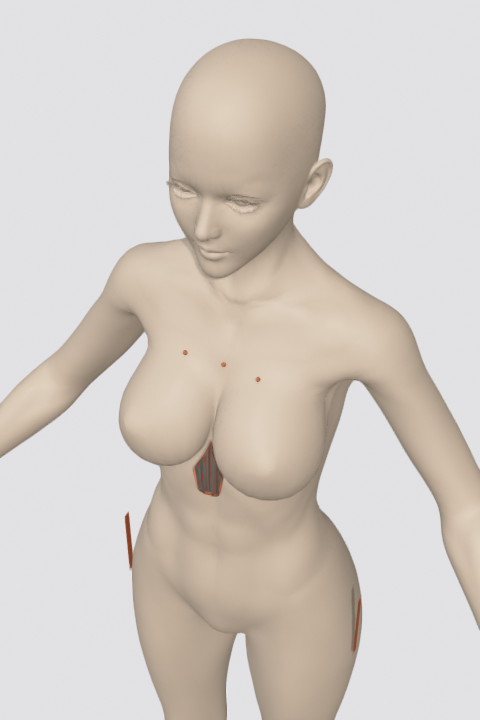</a> 08_shoulder_top</td>
  </tr>
</table>

#### `triangle_string_halter__rng3`

<table>
  <tr>
    <td align='center'><a href='renders/triangle_string_halter__rng3/01_front.png'>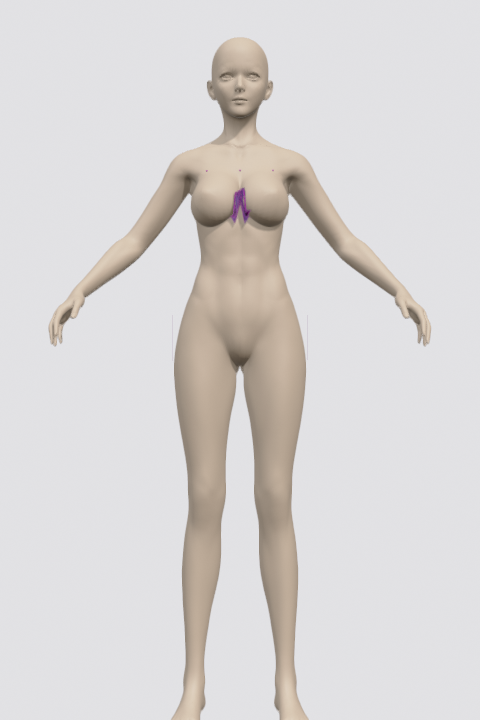</a> 01_front</td>
    <td align='center'><a href='renders/triangle_string_halter__rng3/02_three_quarter.png'>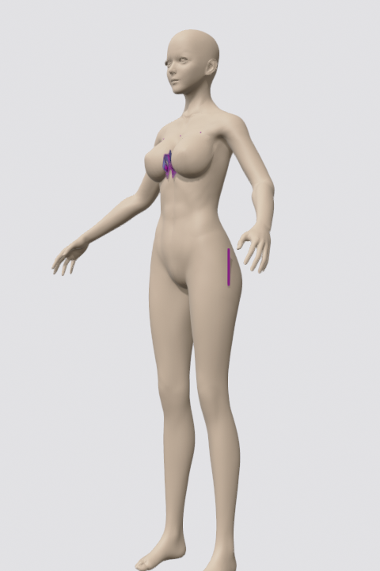</a> 02_three_quarter</td>
    <td align='center'> 03_side_left</td>
    <td align='center'> 04_back</td>
  </tr>
  <tr>
    <td align='center'><a href='renders/triangle_string_halter__rng3/05_chest_close.png'>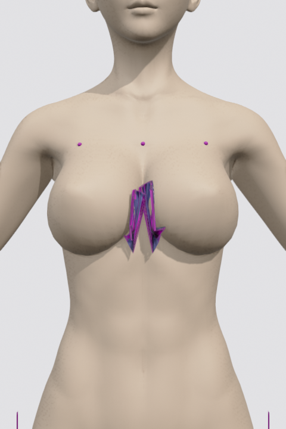</a> 05_chest_close</td>
    <td align='center'> 06_hip_close</td>
    <td align='center'><a href='renders/triangle_string_halter__rng3/07_neck_top.png'>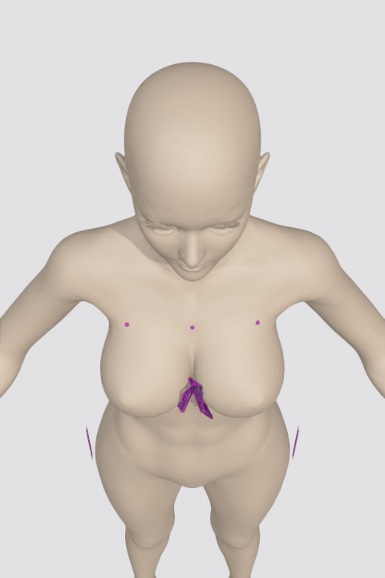</a> 07_neck_top</td>
    <td align='center'><a href='renders/triangle_string_halter__rng3/08_shoulder_top.png'>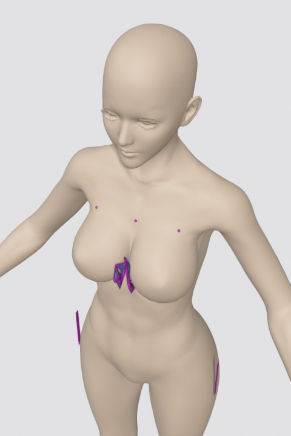</a> 08_shoulder_top</td>
  </tr>
</table>

## Run report

# v2 pure-random — no seed corpus, no Genome prior

Generated 16 outfits via `random_outfit(arch, rng)` only.
No `seed_to_outfit.py`, no `genome_to_outfit`, no read of `assets/seeds/` or `assets/seeds_v2/`.

## Per-outfit scores

| outfit | composite | outfit-native | v1-aesthetic | n_slots |
|---|---|---|---|---|
| `triangle_string_halter__rng0` | 0.831 | 0.882 | 0.696 | 10 |
| `triangle_string_halter__rng1` | 0.752 | 0.708 | 0.776 | 4 |
| `triangle_string_halter__rng2` | 0.805 | 0.759 | 0.740 | 5 |
| `triangle_string_halter__rng3` | 0.822 | 0.832 | 0.719 | 6 |
| `bandeau_back_band__rng0` | 0.774 | 0.880 | 0.681 | 6 |
| `bandeau_back_band__rng1` | 0.827 | 0.880 | 0.813 | 7 |
| `bandeau_back_band__rng2` | 0.822 | 0.906 | 0.776 | 7 |
| `bandeau_back_band__rng3` | 0.745 | 0.769 | 0.705 | 5 |
| `bralette_shoulder_strap__rng0` | 0.763 | 0.845 | 0.714 | 7 |
| `bralette_shoulder_strap__rng1` | 0.822 | 0.864 | 0.784 | 9 |
| `bralette_shoulder_strap__rng2` | 0.735 | 0.795 | 0.688 | 6 |
| `bralette_shoulder_strap__rng3` | 0.848 | 0.867 | 0.845 | 8 |
| `one_piece_maillot__rng0` | 0.735 | 0.795 | 0.689 | 5 |
| `one_piece_maillot__rng1` | 0.789 | 0.838 | 0.754 | 6 |
| `one_piece_maillot__rng2` | 0.784 | 0.867 | 0.747 | 7 |
| `one_piece_maillot__rng3` | 0.794 | 0.917 | 0.697 | 8 |

## Aggregate (across 16 pure-random outfits)

- composite: mean=0.790, std=0.037, range=[0.735, 0.848]
- outfit-native: mean=0.838, std=0.058, range=[0.708, 0.917]

## Library_id frequency (which entries actually got picked)

| library_id | count |
|---|---|
| `F_CROCHET_COTTON` | 8 |
| `BOT_THONG_M` | 6 |
| `BOT_BRIEF_M` | 4 |
| `BOT_CHEEKY_S` | 4 |
| `BOT_HIGHWAIST_S` | 4 |
| `BOT_BRAZILIAN_S` | 3 |
| `BOT_BRIEF_S` | 3 |
| `CUP_BRAZILIAN_L` | 3 |
| `F_BIOPOLYMER_PLAIN` | 3 |
| `F_ECONYL_PLAIN_LIGHT` | 3 |
| `STR_BACKBAND_RIBBED` | 3 |
| `STR_HALTER_3MM` | 3 |
| `STR_SHOULDER_WOVEN_15MM` | 3 |
| `ACC_TASSEL_SILK_50MM` | 2 |
| `BJ_BODY_CHAIN_WAIST` | 2 |
| `BOT_THONG_S` | 2 |
| `CUP_BRAZILIAN_M` | 2 |
| `CUP_BRAZILIAN_S` | 2 |
| `CUP_TRIANGLE_M` | 2 |
| `CUP_TRIANGLE_S` | 2 |
| `F_AMNI_SOUL_RIBBED` | 2 |
| `F_FOAM_CUP_3MM` | 2 |
| `F_HUNZA_CRINKLE` | 2 |
| `F_MESH_OUTER` | 2 |
| `STR_SHOULDER_WOVEN_10MM` | 2 |
| `S_COVERSTITCH_3NEEDLE` | 2 |
| `S_OVERLOCK_4THREAD` | 2 |
| `ACC_BOW_CHIFFON_30MM` | 1 |
| `ACC_FRINGE_RAW_60MM` | 1 |
| `ACC_PENDANT_DROP_15MM_GOLD` | 1 |
| `ACC_SHELL_TROCHUS_25MM` | 1 |
| `BJ_ANKLET_CHARM_BEACH` | 1 |
| `BJ_BRACELET_BEADED` | 1 |
| `BJ_EARRING_DROP_GOLD` | 1 |
| `BJ_EARRING_STUD_PEARL` | 1 |
| `BOT_BRAZILIAN_M` | 1 |
| `BOT_HIGHWAIST_M` | 1 |
| `CUP_BALCONETTE_M` | 1 |
| `CUP_BANDEAU_L` | 1 |
| `CUP_BANDEAU_M` | 1 |
| `CUP_BANDEAU_S` | 1 |
| `CUP_FOAM_MOLDED_S` | 1 |
| `F_MISSONI_SHINY_KNIT` | 1 |
| `F_POWERMESH_LINING` | 1 |
| `F_VIRGIN_VELVET` | 1 |
| `HW_OR_12MM_GOLD` | 1 |
| `HW_SLIDER_10MM_NICKEL` | 1 |
| `STR_BACKBAND_PLAIN` | 1 |
| `STR_FOE_10MM` | 1 |
| `STR_FOE_25MM` | 1 |
| `STR_HALTER_5MM` | 1 |
| `STR_SHOULDER_PADDED_20MM` | 1 |
| `STR_TIE_CORD_5MM` | 1 |
| `S_FOE_BIND_15MM` | 1 |
| `S_FOE_BIND_25MM` | 1 |

