# 1135_v2_strict_both_max

_Day: [`2026-05-08/`](../README.md)_  ·  _Seeds: 16_  ·  _Images: 129_

Local interactive viewer: [`index.html`](index.html)  ·  Top: [`tools/output/`](../../README.md)

## Top-level images

### overview.png

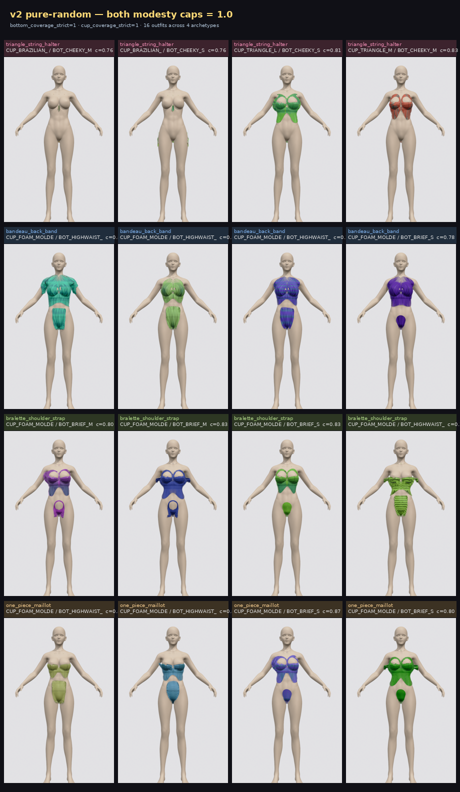

## Seeds (16)

### archetype: `unknown` (16)

#### `bandeau_back_band__rng0`

<table>
  <tr>
    <td align='center'><a href='renders/bandeau_back_band__rng0/01_front.png'>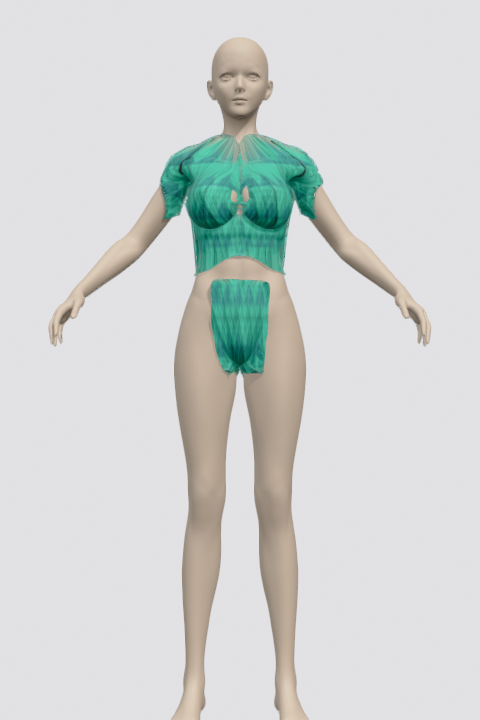</a> 01_front</td>
    <td align='center'><a href='renders/bandeau_back_band__rng0/02_three_quarter.png'>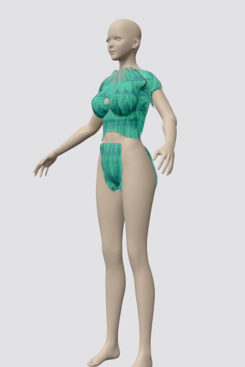</a> 02_three_quarter</td>
    <td align='center'><a href='renders/bandeau_back_band__rng0/03_side_left.png'>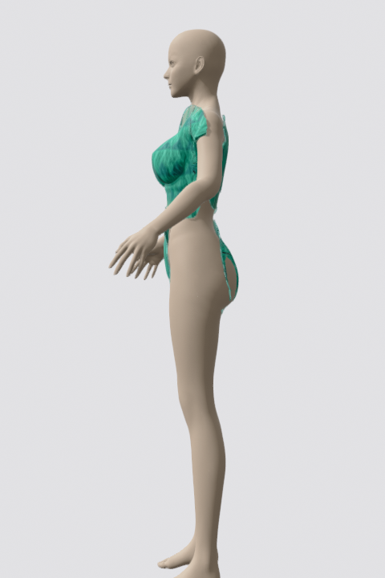</a> 03_side_left</td>
    <td align='center'><a href='renders/bandeau_back_band__rng0/04_back.png'>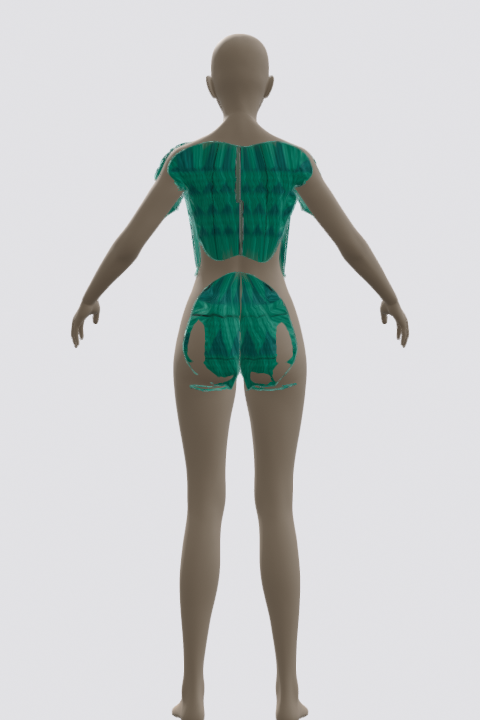</a> 04_back</td>
  </tr>
  <tr>
    <td align='center'><a href='renders/bandeau_back_band__rng0/05_chest_close.png'>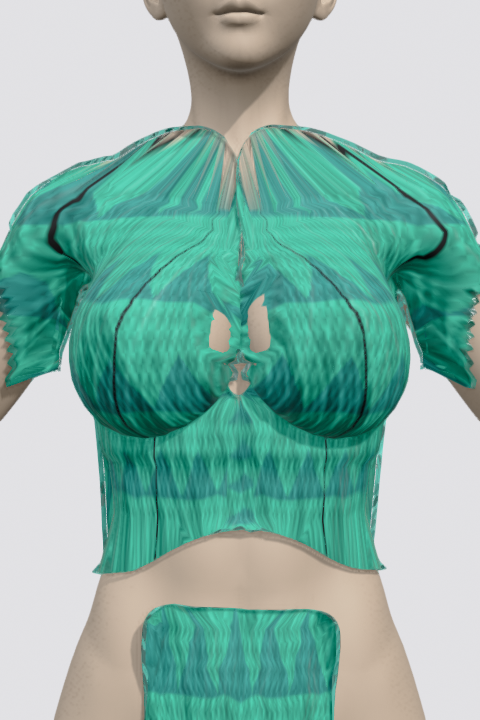</a> 05_chest_close</td>
    <td align='center'> 06_hip_close</td>
    <td align='center'><a href='renders/bandeau_back_band__rng0/07_neck_top.png'>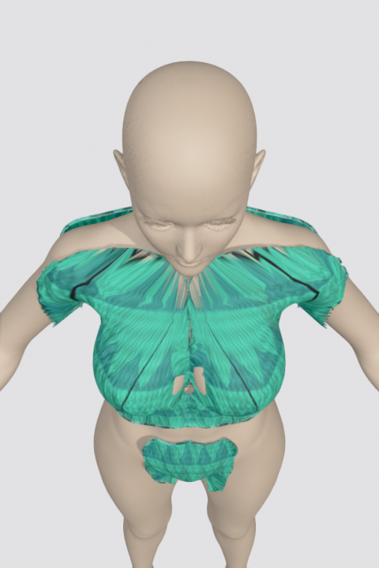</a> 07_neck_top</td>
    <td align='center'><a href='renders/bandeau_back_band__rng0/08_shoulder_top.png'>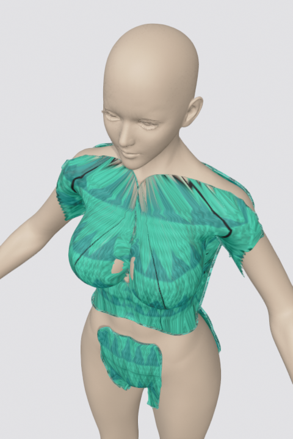</a> 08_shoulder_top</td>
  </tr>
</table>

#### `bandeau_back_band__rng1`

<table>
  <tr>
    <td align='center'><a href='renders/bandeau_back_band__rng1/01_front.png'>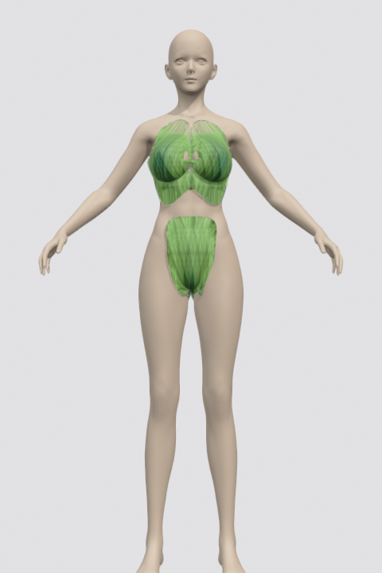</a> 01_front</td>
    <td align='center'><a href='renders/bandeau_back_band__rng1/02_three_quarter.png'>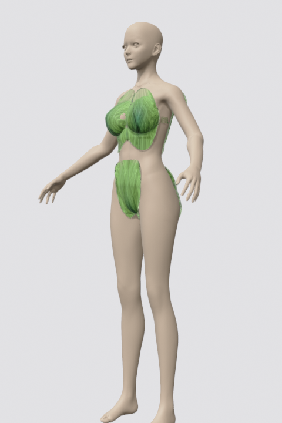</a> 02_three_quarter</td>
    <td align='center'><a href='renders/bandeau_back_band__rng1/03_side_left.png'>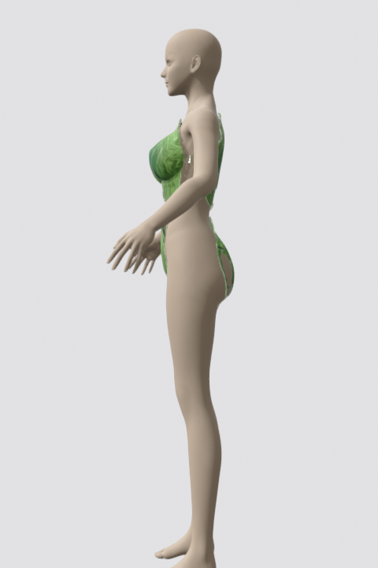</a> 03_side_left</td>
    <td align='center'><a href='renders/bandeau_back_band__rng1/04_back.png'>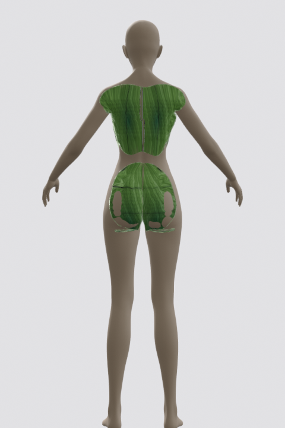</a> 04_back</td>
  </tr>
  <tr>
    <td align='center'><a href='renders/bandeau_back_band__rng1/05_chest_close.png'>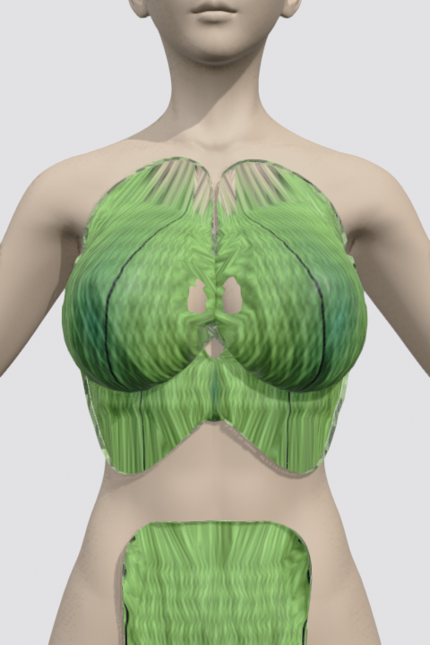</a> 05_chest_close</td>
    <td align='center'> 06_hip_close</td>
    <td align='center'><a href='renders/bandeau_back_band__rng1/07_neck_top.png'>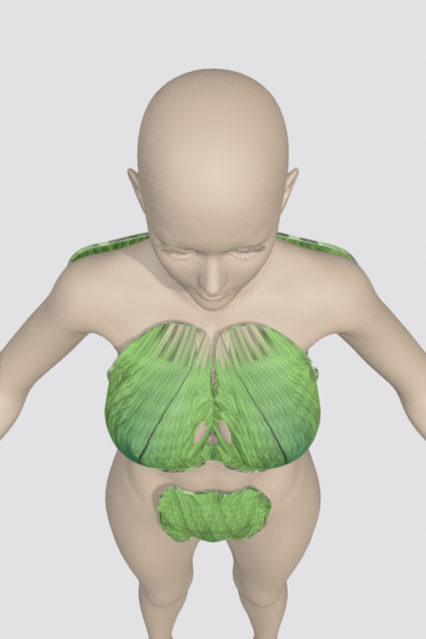</a> 07_neck_top</td>
    <td align='center'><a href='renders/bandeau_back_band__rng1/08_shoulder_top.png'>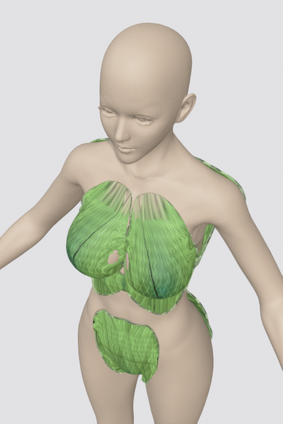</a> 08_shoulder_top</td>
  </tr>
</table>

#### `bandeau_back_band__rng2`

<table>
  <tr>
    <td align='center'><a href='renders/bandeau_back_band__rng2/01_front.png'>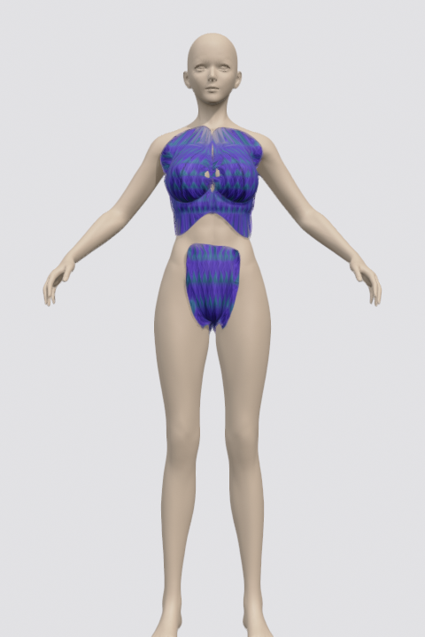</a> 01_front</td>
    <td align='center'><a href='renders/bandeau_back_band__rng2/02_three_quarter.png'>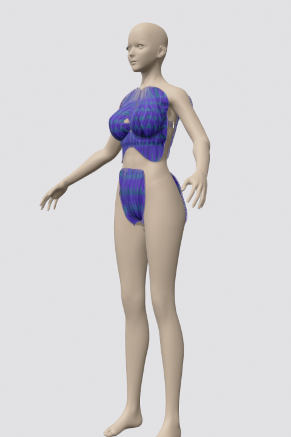</a> 02_three_quarter</td>
    <td align='center'><a href='renders/bandeau_back_band__rng2/03_side_left.png'>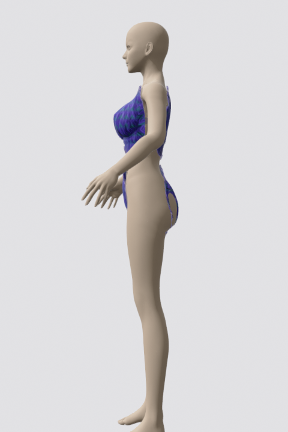</a> 03_side_left</td>
    <td align='center'><a href='renders/bandeau_back_band__rng2/04_back.png'>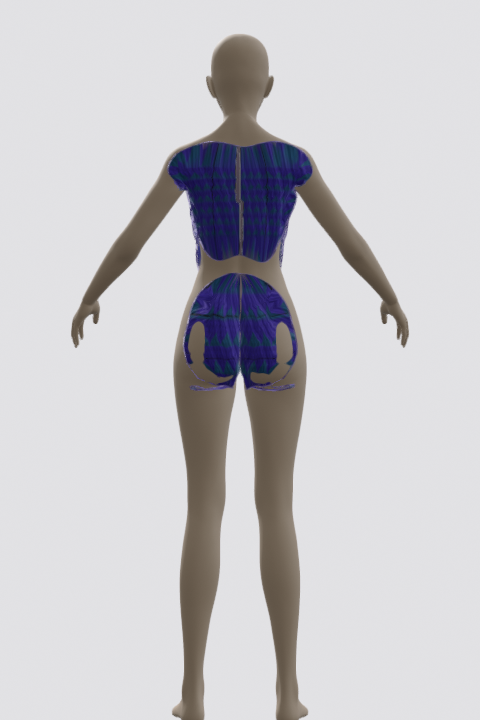</a> 04_back</td>
  </tr>
  <tr>
    <td align='center'><a href='renders/bandeau_back_band__rng2/05_chest_close.png'>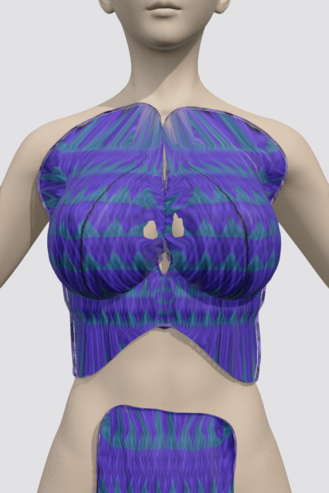</a> 05_chest_close</td>
    <td align='center'> 06_hip_close</td>
    <td align='center'><a href='renders/bandeau_back_band__rng2/07_neck_top.png'>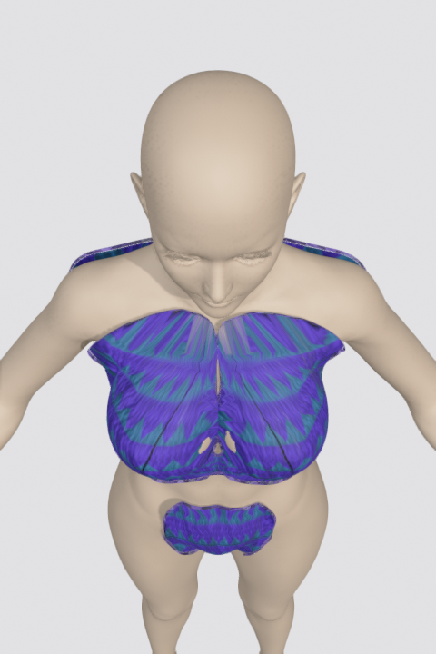</a> 07_neck_top</td>
    <td align='center'><a href='renders/bandeau_back_band__rng2/08_shoulder_top.png'>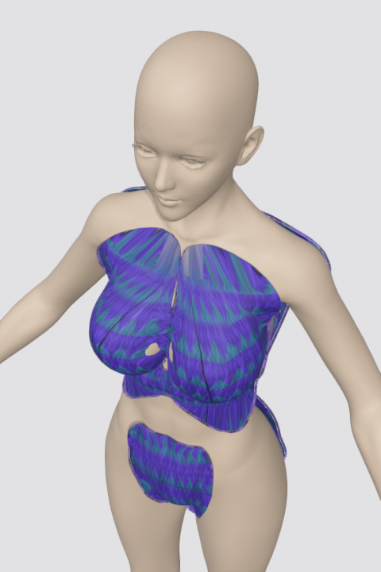</a> 08_shoulder_top</td>
  </tr>
</table>

#### `bandeau_back_band__rng3`

<table>
  <tr>
    <td align='center'><a href='renders/bandeau_back_band__rng3/01_front.png'>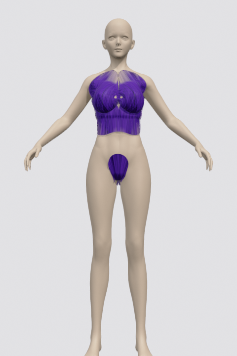</a> 01_front</td>
    <td align='center'><a href='renders/bandeau_back_band__rng3/02_three_quarter.png'>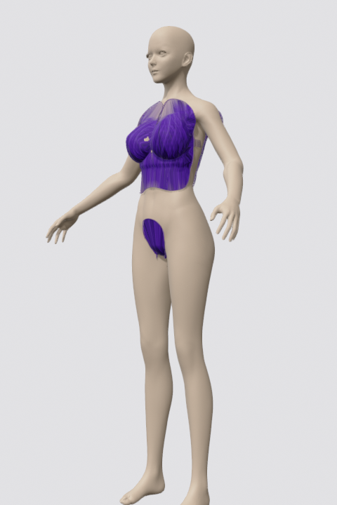</a> 02_three_quarter</td>
    <td align='center'><a href='renders/bandeau_back_band__rng3/03_side_left.png'>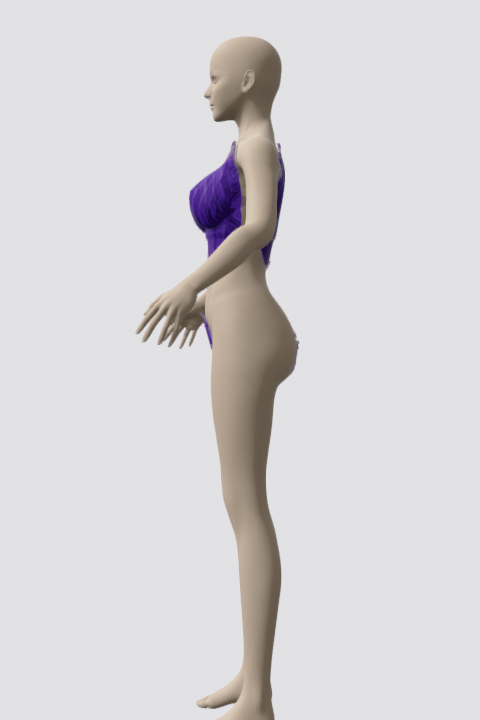</a> 03_side_left</td>
    <td align='center'><a href='renders/bandeau_back_band__rng3/04_back.png'>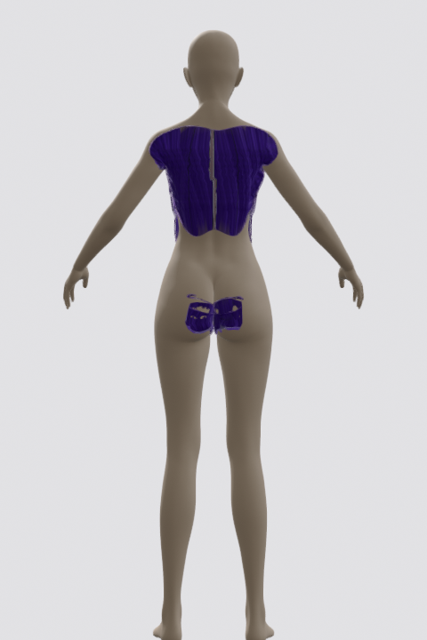</a> 04_back</td>
  </tr>
  <tr>
    <td align='center'><a href='renders/bandeau_back_band__rng3/05_chest_close.png'>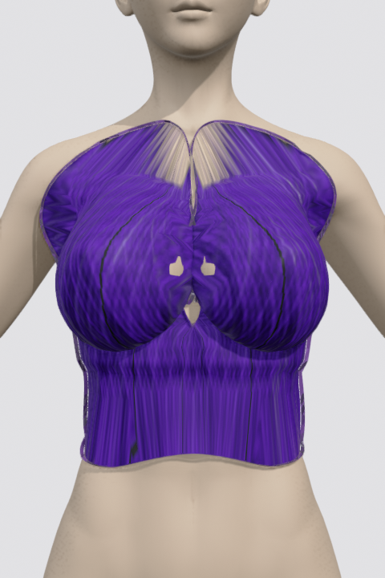</a> 05_chest_close</td>
    <td align='center'> 06_hip_close</td>
    <td align='center'><a href='renders/bandeau_back_band__rng3/07_neck_top.png'>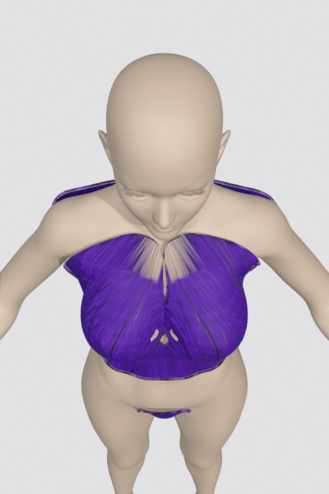</a> 07_neck_top</td>
    <td align='center'><a href='renders/bandeau_back_band__rng3/08_shoulder_top.png'>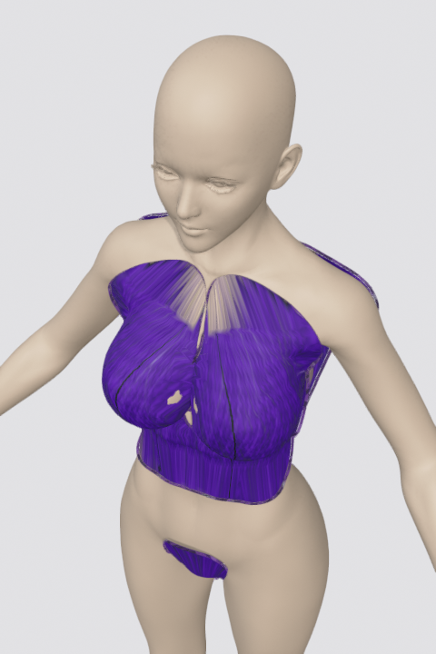</a> 08_shoulder_top</td>
  </tr>
</table>

#### `bralette_shoulder_strap__rng0`

<table>
  <tr>
    <td align='center'><a href='renders/bralette_shoulder_strap__rng0/01_front.png'>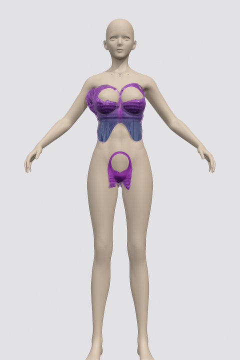</a> 01_front</td>
    <td align='center'><a href='renders/bralette_shoulder_strap__rng0/02_three_quarter.png'>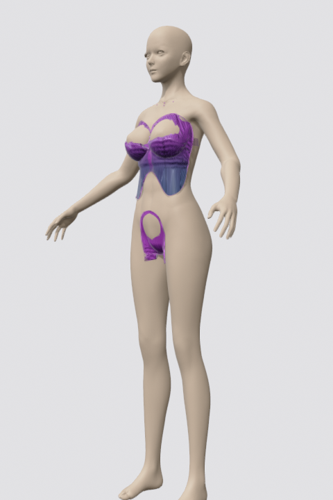</a> 02_three_quarter</td>
    <td align='center'><a href='renders/bralette_shoulder_strap__rng0/03_side_left.png'>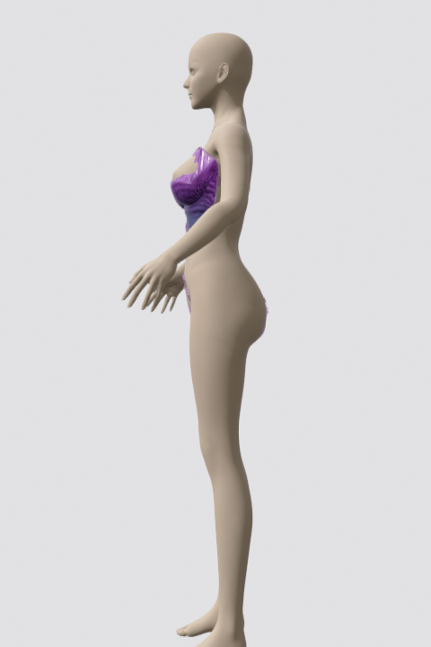</a> 03_side_left</td>
    <td align='center'><a href='renders/bralette_shoulder_strap__rng0/04_back.png'>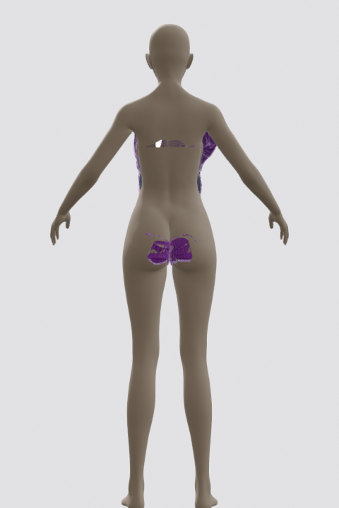</a> 04_back</td>
  </tr>
  <tr>
    <td align='center'><a href='renders/bralette_shoulder_strap__rng0/05_chest_close.png'>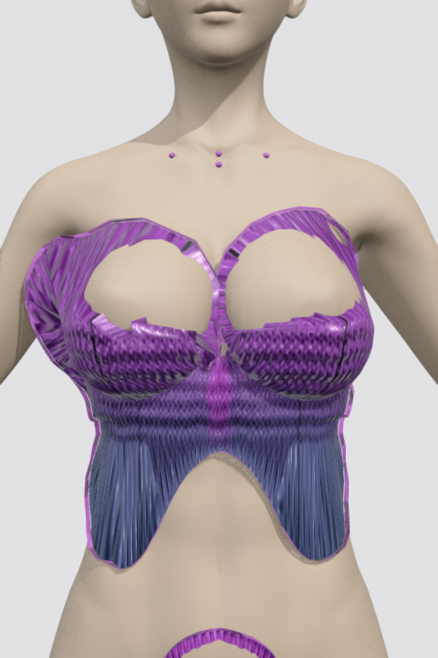</a> 05_chest_close</td>
    <td align='center'> 06_hip_close</td>
    <td align='center'><a href='renders/bralette_shoulder_strap__rng0/07_neck_top.png'>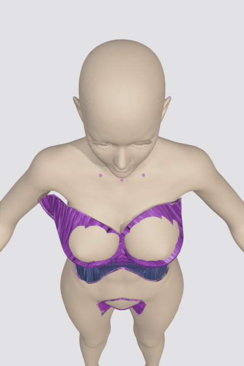</a> 07_neck_top</td>
    <td align='center'><a href='renders/bralette_shoulder_strap__rng0/08_shoulder_top.png'>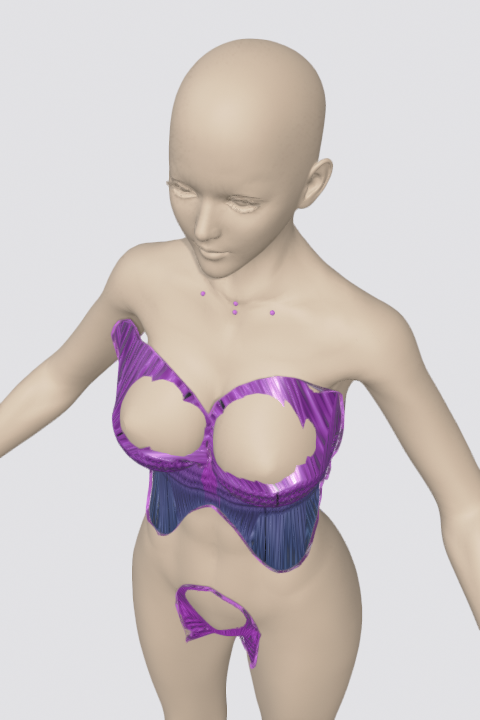</a> 08_shoulder_top</td>
  </tr>
</table>

#### `bralette_shoulder_strap__rng1`

<table>
  <tr>
    <td align='center'><a href='renders/bralette_shoulder_strap__rng1/01_front.png'>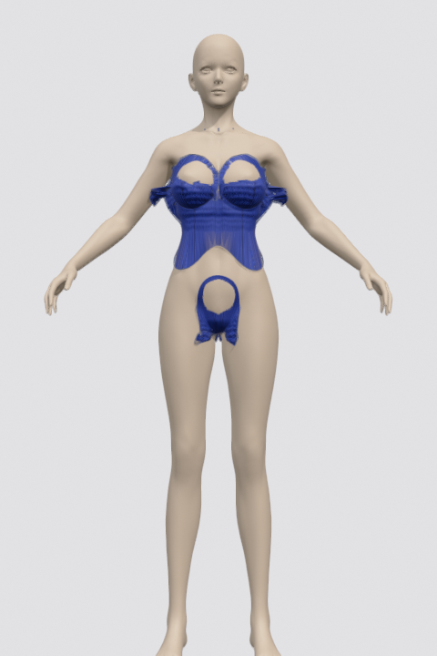</a> 01_front</td>
    <td align='center'><a href='renders/bralette_shoulder_strap__rng1/02_three_quarter.png'>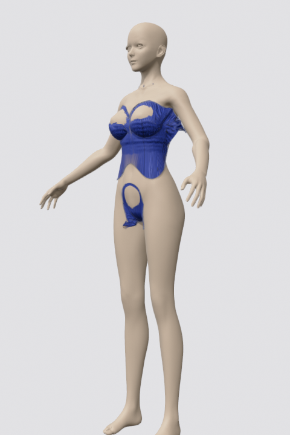</a> 02_three_quarter</td>
    <td align='center'><a href='renders/bralette_shoulder_strap__rng1/03_side_left.png'>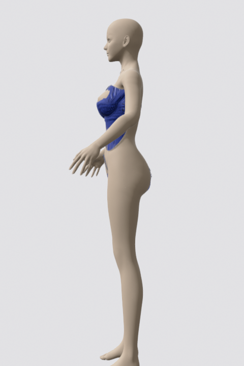</a> 03_side_left</td>
    <td align='center'><a href='renders/bralette_shoulder_strap__rng1/04_back.png'>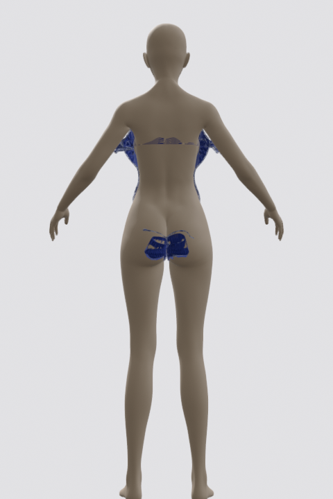</a> 04_back</td>
  </tr>
  <tr>
    <td align='center'><a href='renders/bralette_shoulder_strap__rng1/05_chest_close.png'>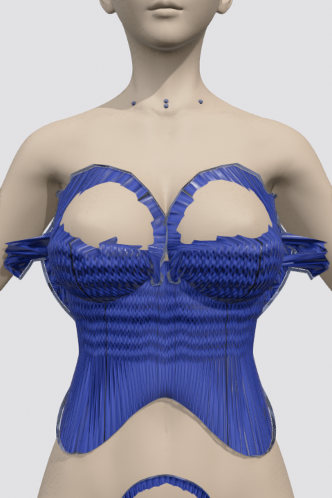</a> 05_chest_close</td>
    <td align='center'> 06_hip_close</td>
    <td align='center'><a href='renders/bralette_shoulder_strap__rng1/07_neck_top.png'>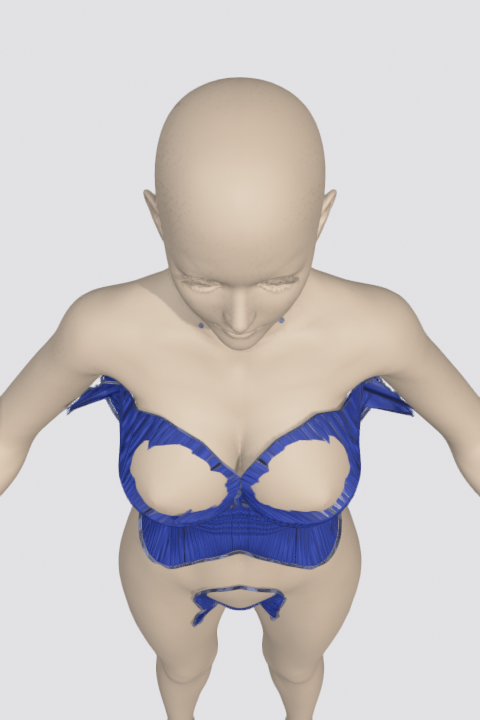</a> 07_neck_top</td>
    <td align='center'><a href='renders/bralette_shoulder_strap__rng1/08_shoulder_top.png'>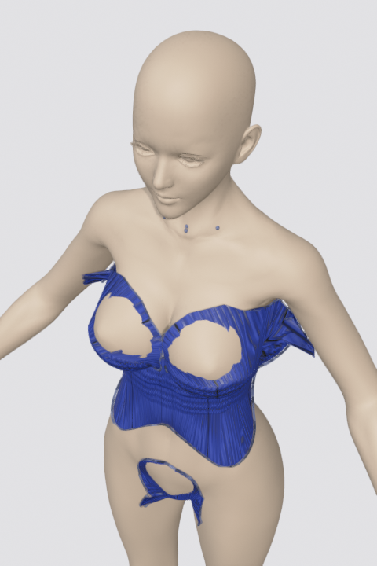</a> 08_shoulder_top</td>
  </tr>
</table>

#### `bralette_shoulder_strap__rng2`

<table>
  <tr>
    <td align='center'><a href='renders/bralette_shoulder_strap__rng2/01_front.png'>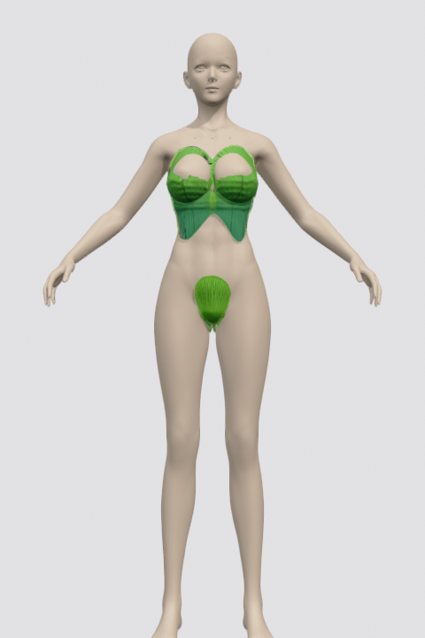</a> 01_front</td>
    <td align='center'><a href='renders/bralette_shoulder_strap__rng2/02_three_quarter.png'>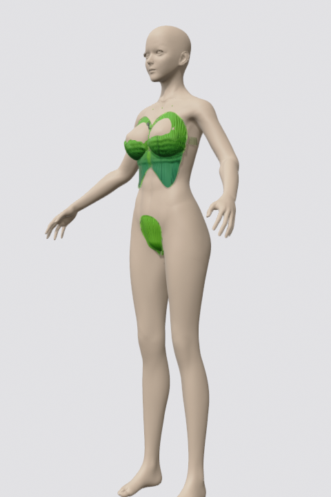</a> 02_three_quarter</td>
    <td align='center'><a href='renders/bralette_shoulder_strap__rng2/03_side_left.png'>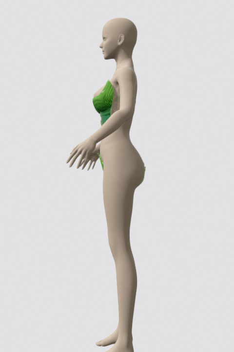</a> 03_side_left</td>
    <td align='center'><a href='renders/bralette_shoulder_strap__rng2/04_back.png'>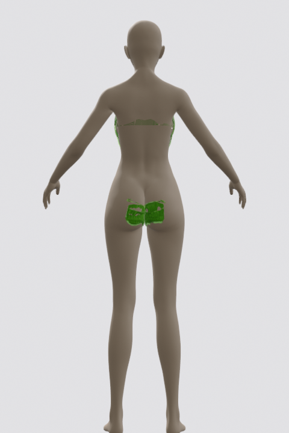</a> 04_back</td>
  </tr>
  <tr>
    <td align='center'><a href='renders/bralette_shoulder_strap__rng2/05_chest_close.png'>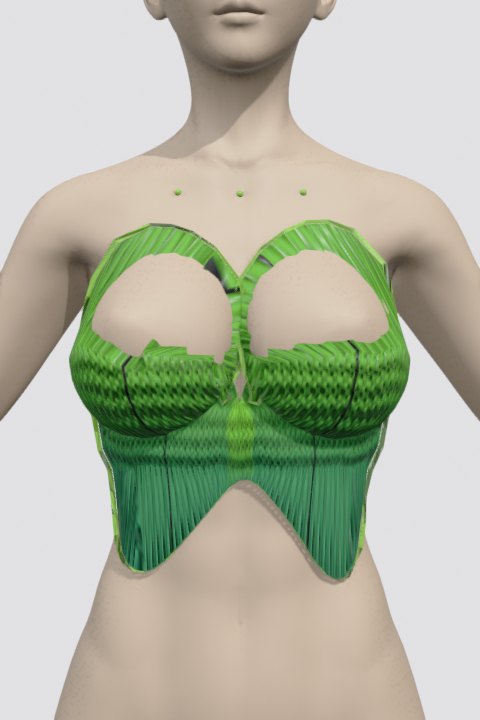</a> 05_chest_close</td>
    <td align='center'> 06_hip_close</td>
    <td align='center'><a href='renders/bralette_shoulder_strap__rng2/07_neck_top.png'>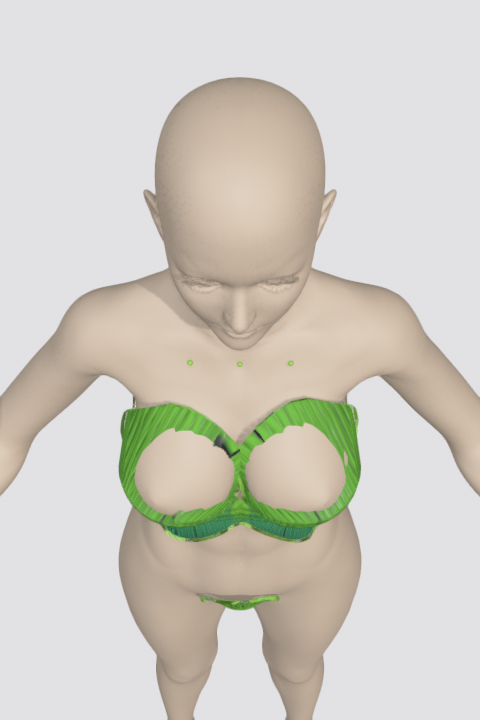</a> 07_neck_top</td>
    <td align='center'><a href='renders/bralette_shoulder_strap__rng2/08_shoulder_top.png'>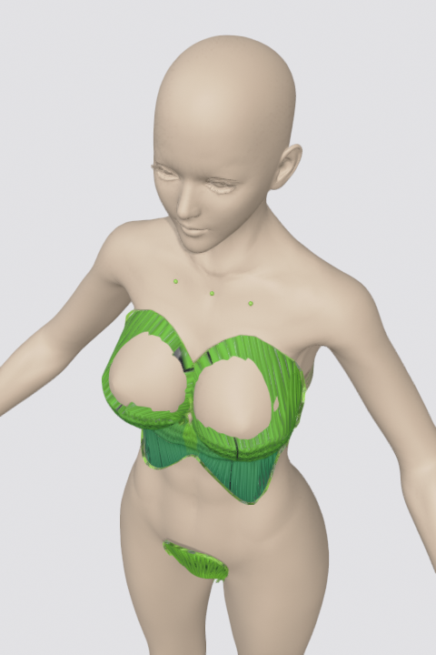</a> 08_shoulder_top</td>
  </tr>
</table>

#### `bralette_shoulder_strap__rng3`

<table>
  <tr>
    <td align='center'><a href='renders/bralette_shoulder_strap__rng3/01_front.png'>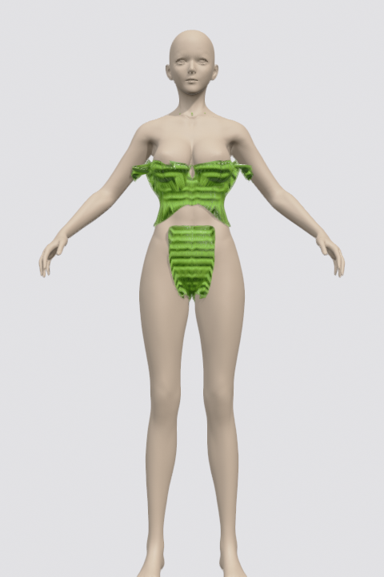</a> 01_front</td>
    <td align='center'><a href='renders/bralette_shoulder_strap__rng3/02_three_quarter.png'>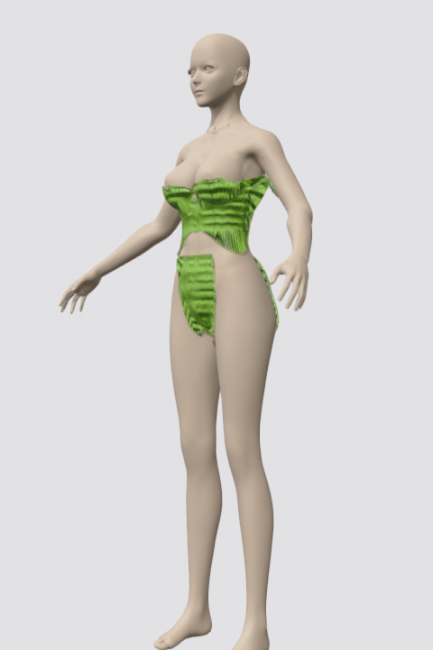</a> 02_three_quarter</td>
    <td align='center'><a href='renders/bralette_shoulder_strap__rng3/03_side_left.png'>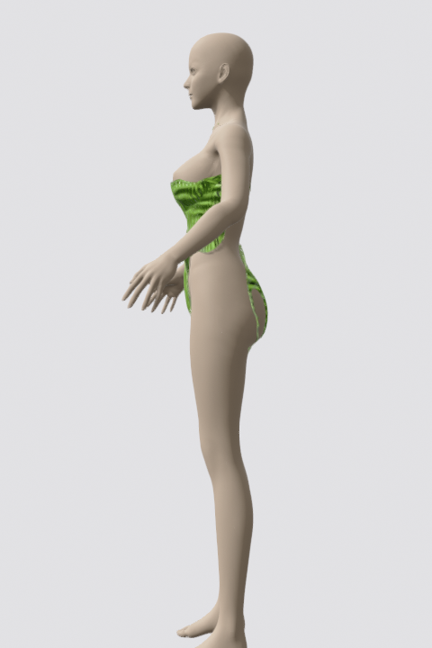</a> 03_side_left</td>
    <td align='center'><a href='renders/bralette_shoulder_strap__rng3/04_back.png'>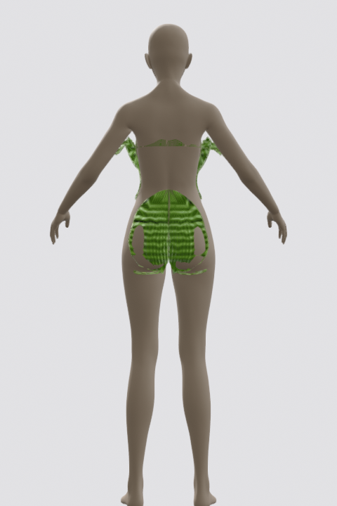</a> 04_back</td>
  </tr>
  <tr>
    <td align='center'><a href='renders/bralette_shoulder_strap__rng3/05_chest_close.png'>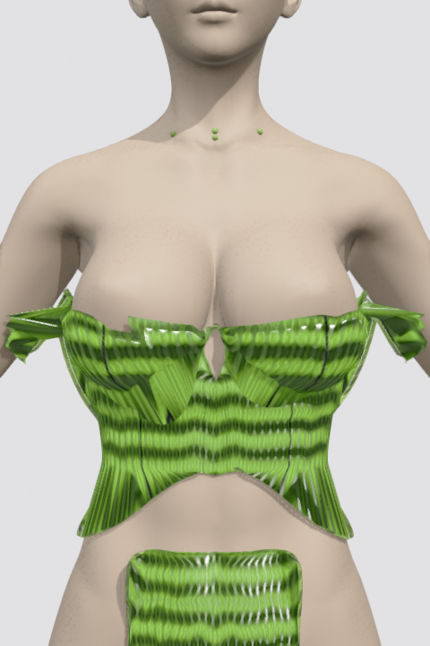</a> 05_chest_close</td>
    <td align='center'> 06_hip_close</td>
    <td align='center'><a href='renders/bralette_shoulder_strap__rng3/07_neck_top.png'>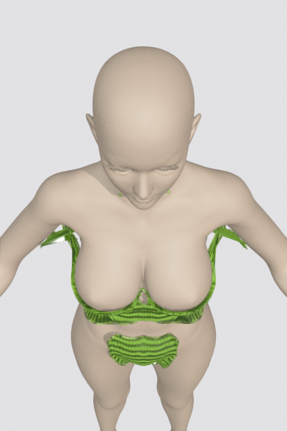</a> 07_neck_top</td>
    <td align='center'><a href='renders/bralette_shoulder_strap__rng3/08_shoulder_top.png'>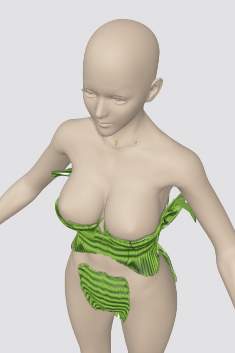</a> 08_shoulder_top</td>
  </tr>
</table>

#### `one_piece_maillot__rng0`

<table>
  <tr>
    <td align='center'><a href='renders/one_piece_maillot__rng0/01_front.png'>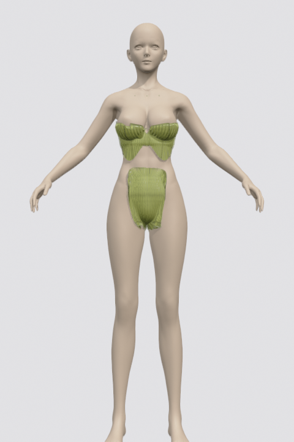</a> 01_front</td>
    <td align='center'><a href='renders/one_piece_maillot__rng0/02_three_quarter.png'>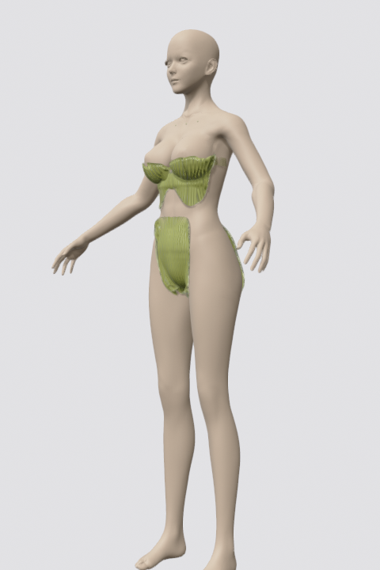</a> 02_three_quarter</td>
    <td align='center'><a href='renders/one_piece_maillot__rng0/03_side_left.png'>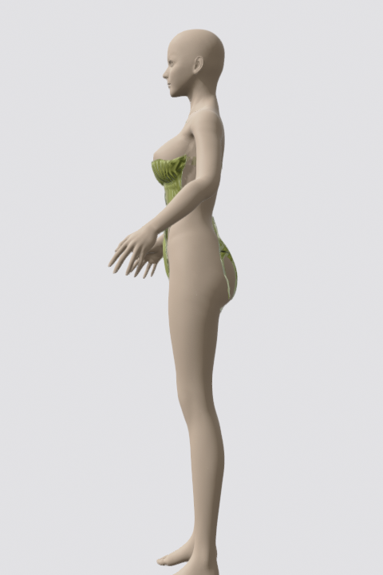</a> 03_side_left</td>
    <td align='center'><a href='renders/one_piece_maillot__rng0/04_back.png'>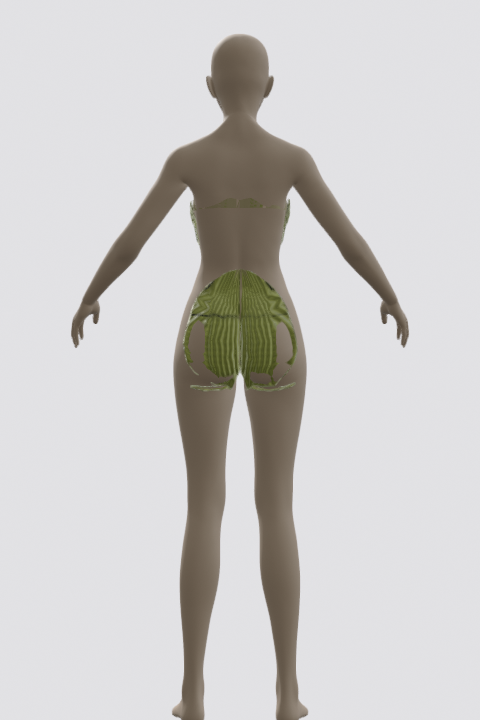</a> 04_back</td>
  </tr>
  <tr>
    <td align='center'><a href='renders/one_piece_maillot__rng0/05_chest_close.png'>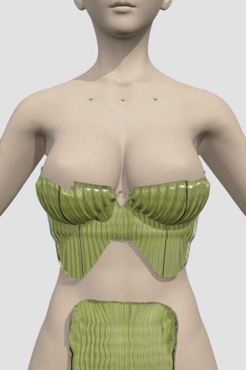</a> 05_chest_close</td>
    <td align='center'><a href='renders/one_piece_maillot__rng0/06_hip_close.png'>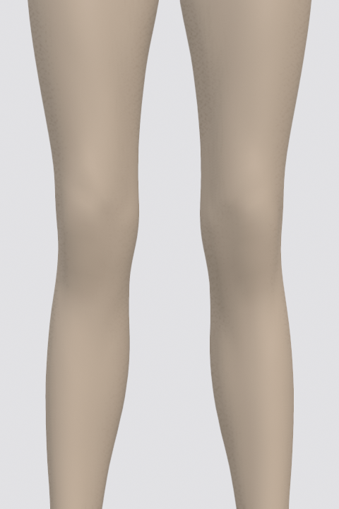</a> 06_hip_close</td>
    <td align='center'><a href='renders/one_piece_maillot__rng0/07_neck_top.png'>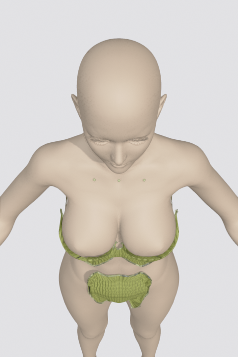</a> 07_neck_top</td>
    <td align='center'><a href='renders/one_piece_maillot__rng0/08_shoulder_top.png'>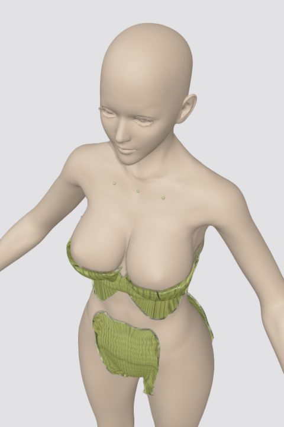</a> 08_shoulder_top</td>
  </tr>
</table>

#### `one_piece_maillot__rng1`

<table>
  <tr>
    <td align='center'><a href='renders/one_piece_maillot__rng1/01_front.png'>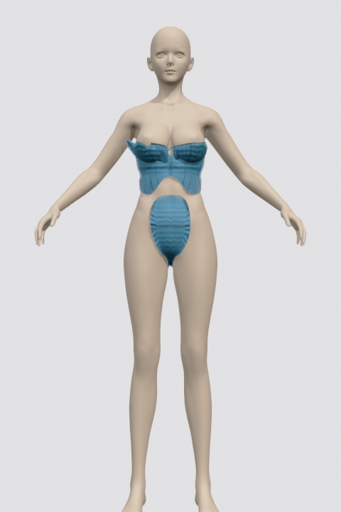</a> 01_front</td>
    <td align='center'><a href='renders/one_piece_maillot__rng1/02_three_quarter.png'>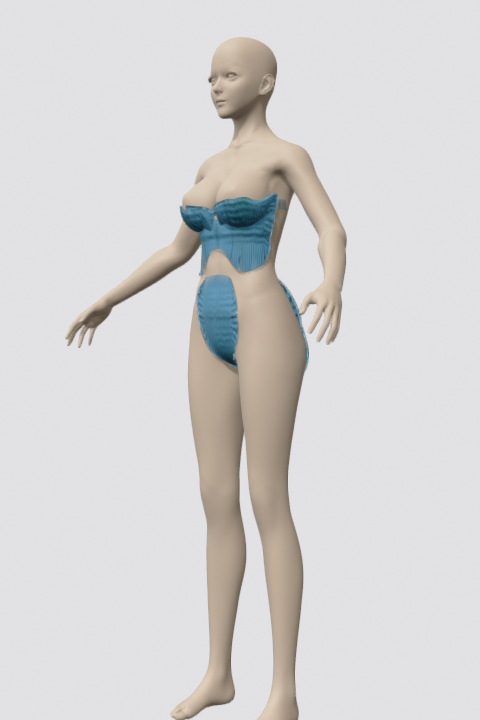</a> 02_three_quarter</td>
    <td align='center'><a href='renders/one_piece_maillot__rng1/03_side_left.png'>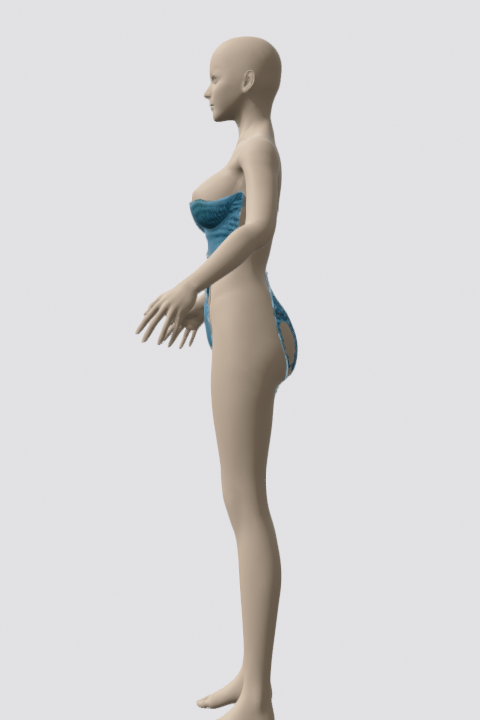</a> 03_side_left</td>
    <td align='center'><a href='renders/one_piece_maillot__rng1/04_back.png'>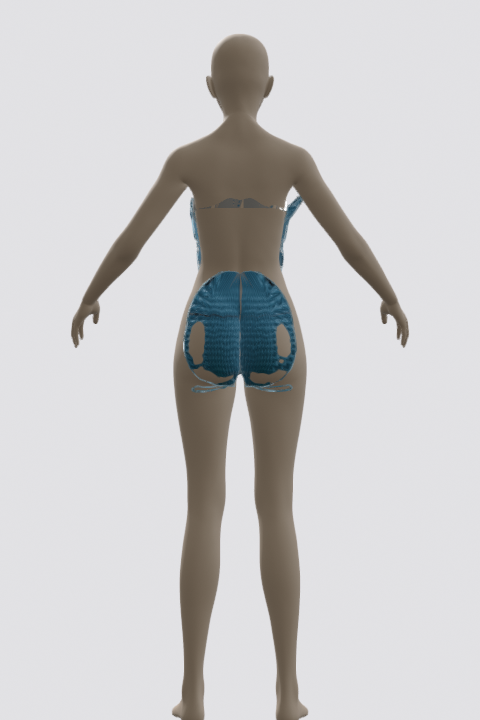</a> 04_back</td>
  </tr>
  <tr>
    <td align='center'><a href='renders/one_piece_maillot__rng1/05_chest_close.png'>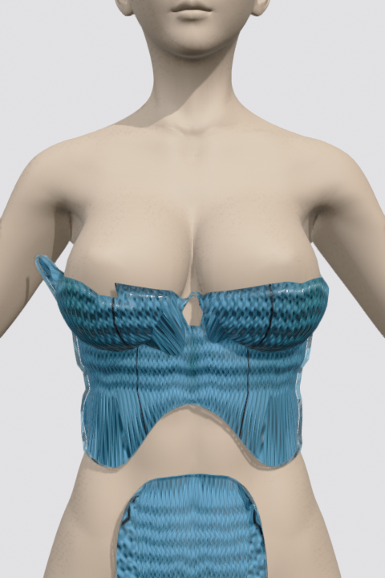</a> 05_chest_close</td>
    <td align='center'> 06_hip_close</td>
    <td align='center'><a href='renders/one_piece_maillot__rng1/07_neck_top.png'>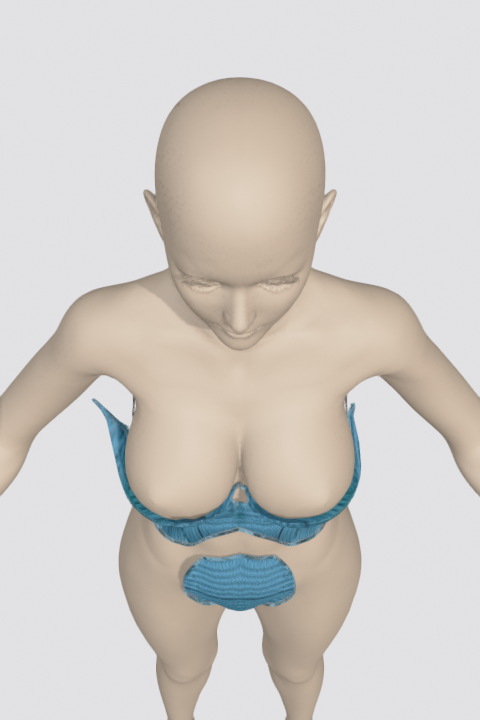</a> 07_neck_top</td>
    <td align='center'><a href='renders/one_piece_maillot__rng1/08_shoulder_top.png'>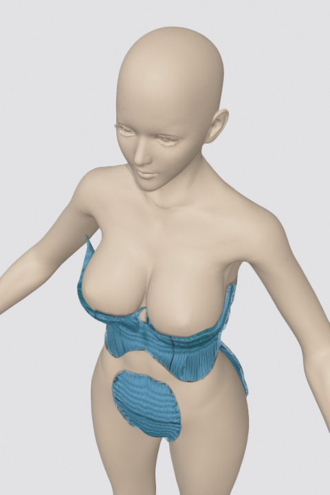</a> 08_shoulder_top</td>
  </tr>
</table>

#### `one_piece_maillot__rng2`

<table>
  <tr>
    <td align='center'><a href='renders/one_piece_maillot__rng2/01_front.png'>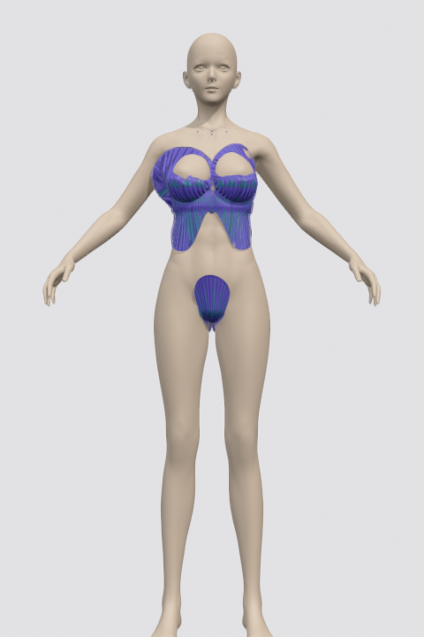</a> 01_front</td>
    <td align='center'><a href='renders/one_piece_maillot__rng2/02_three_quarter.png'>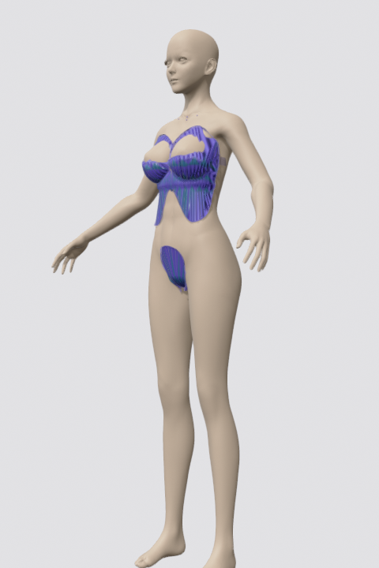</a> 02_three_quarter</td>
    <td align='center'><a href='renders/one_piece_maillot__rng2/03_side_left.png'>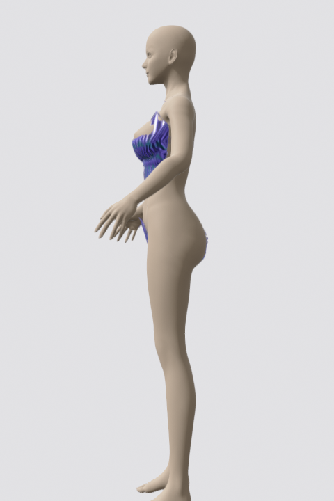</a> 03_side_left</td>
    <td align='center'><a href='renders/one_piece_maillot__rng2/04_back.png'>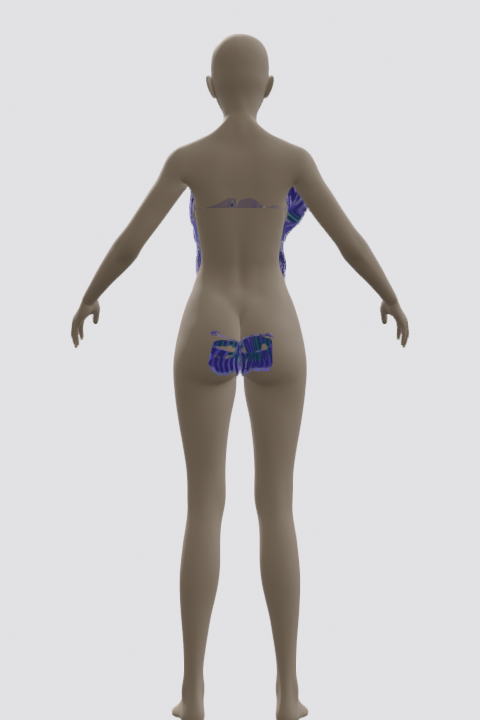</a> 04_back</td>
  </tr>
  <tr>
    <td align='center'><a href='renders/one_piece_maillot__rng2/05_chest_close.png'>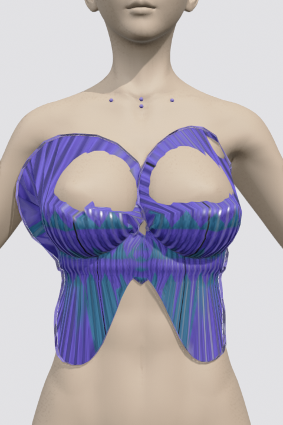</a> 05_chest_close</td>
    <td align='center'><a href='renders/one_piece_maillot__rng2/06_hip_close.png'>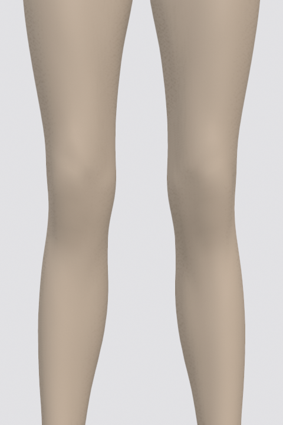</a> 06_hip_close</td>
    <td align='center'><a href='renders/one_piece_maillot__rng2/07_neck_top.png'>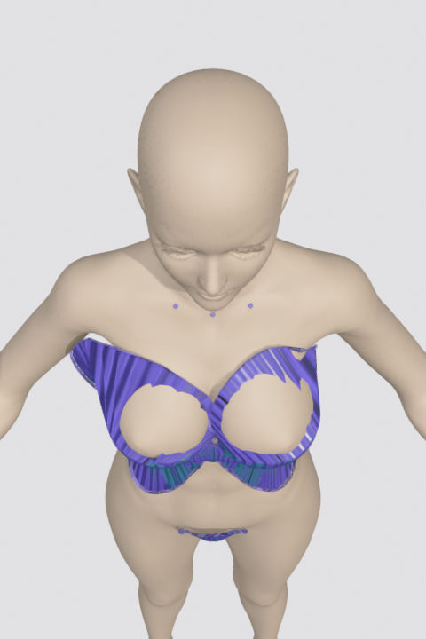</a> 07_neck_top</td>
    <td align='center'><a href='renders/one_piece_maillot__rng2/08_shoulder_top.png'>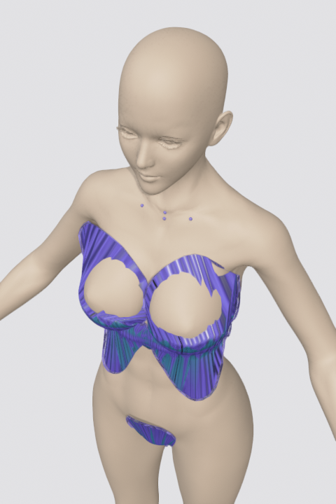</a> 08_shoulder_top</td>
  </tr>
</table>

#### `one_piece_maillot__rng3`

<table>
  <tr>
    <td align='center'><a href='renders/one_piece_maillot__rng3/01_front.png'>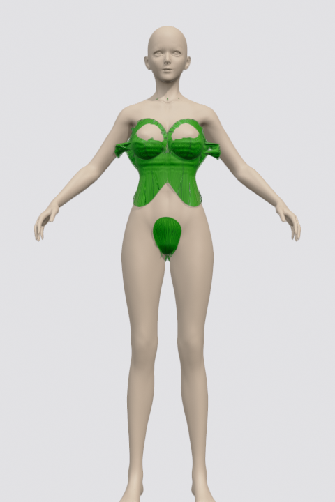</a> 01_front</td>
    <td align='center'><a href='renders/one_piece_maillot__rng3/02_three_quarter.png'>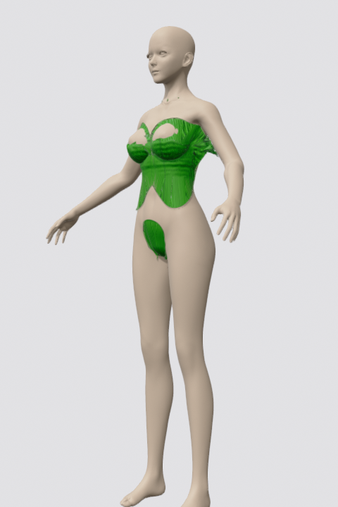</a> 02_three_quarter</td>
    <td align='center'><a href='renders/one_piece_maillot__rng3/03_side_left.png'>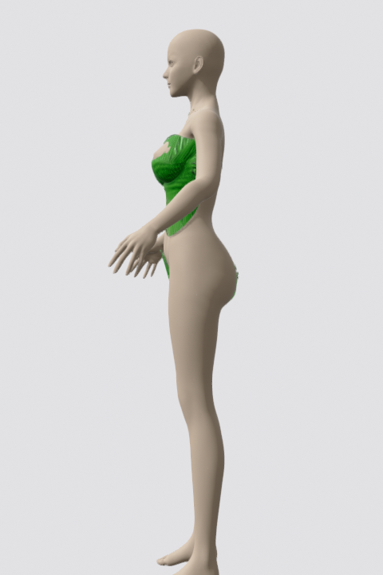</a> 03_side_left</td>
    <td align='center'><a href='renders/one_piece_maillot__rng3/04_back.png'>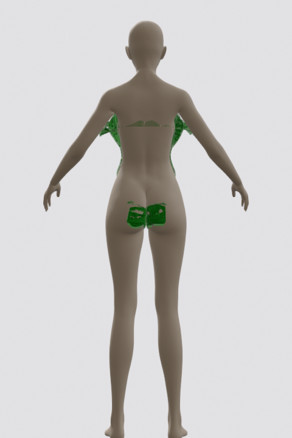</a> 04_back</td>
  </tr>
  <tr>
    <td align='center'><a href='renders/one_piece_maillot__rng3/05_chest_close.png'>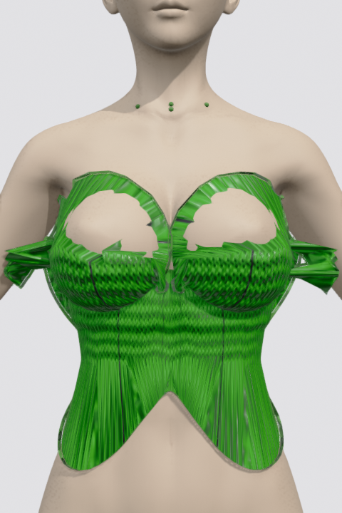</a> 05_chest_close</td>
    <td align='center'> 06_hip_close</td>
    <td align='center'><a href='renders/one_piece_maillot__rng3/07_neck_top.png'>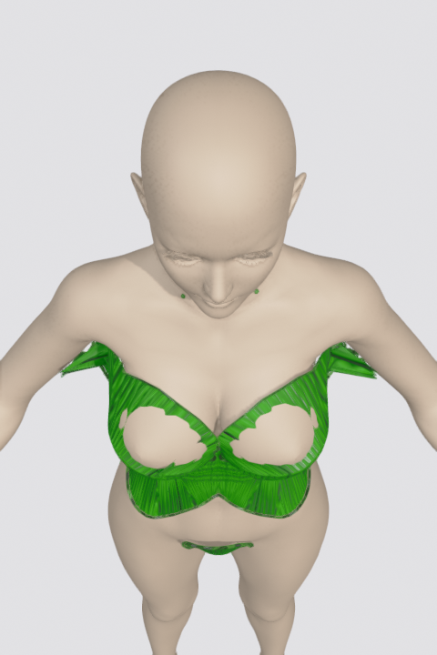</a> 07_neck_top</td>
    <td align='center'><a href='renders/one_piece_maillot__rng3/08_shoulder_top.png'>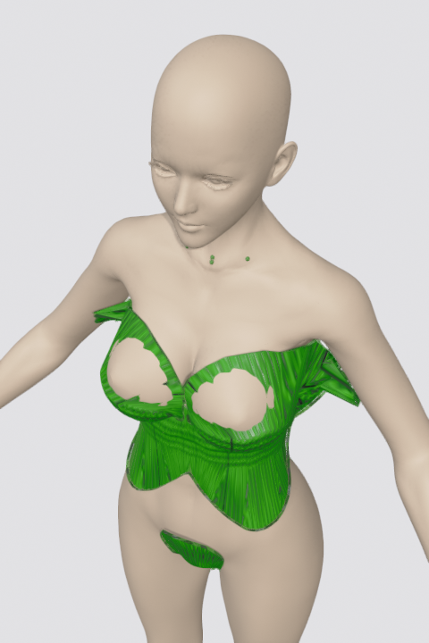</a> 08_shoulder_top</td>
  </tr>
</table>

#### `triangle_string_halter__rng0`

<table>
  <tr>
    <td align='center'><a href='renders/triangle_string_halter__rng0/01_front.png'>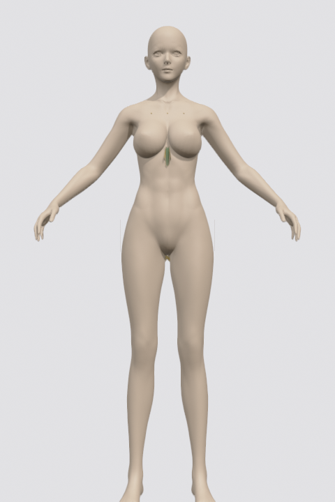</a> 01_front</td>
    <td align='center'><a href='renders/triangle_string_halter__rng0/02_three_quarter.png'>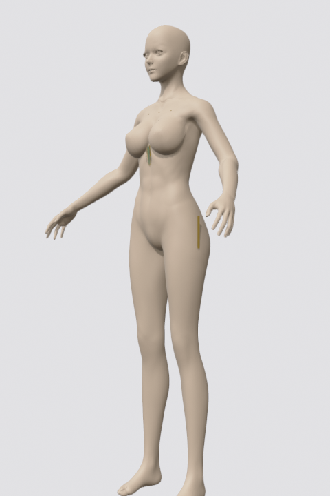</a> 02_three_quarter</td>
    <td align='center'><a href='renders/triangle_string_halter__rng0/03_side_left.png'>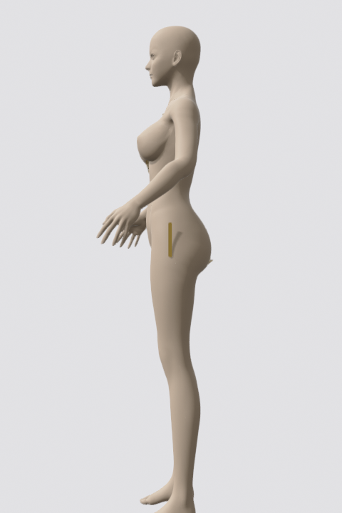</a> 03_side_left</td>
    <td align='center'><a href='renders/triangle_string_halter__rng0/04_back.png'>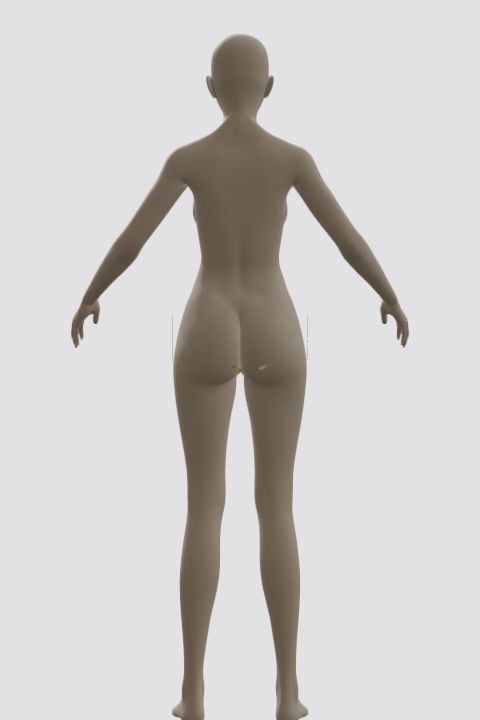</a> 04_back</td>
  </tr>
  <tr>
    <td align='center'><a href='renders/triangle_string_halter__rng0/05_chest_close.png'>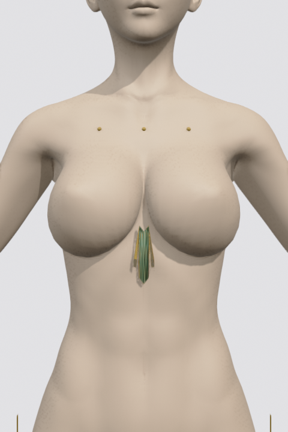</a> 05_chest_close</td>
    <td align='center'> 06_hip_close</td>
    <td align='center'><a href='renders/triangle_string_halter__rng0/07_neck_top.png'>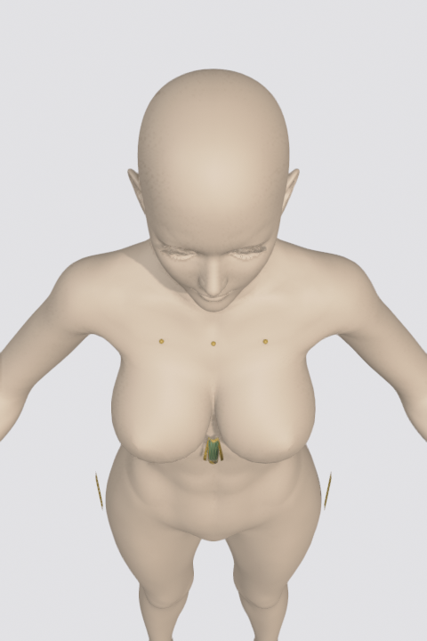</a> 07_neck_top</td>
    <td align='center'><a href='renders/triangle_string_halter__rng0/08_shoulder_top.png'>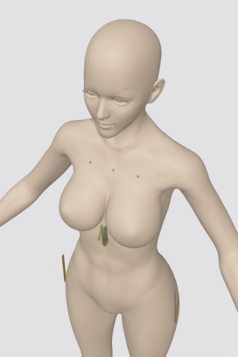</a> 08_shoulder_top</td>
  </tr>
</table>

#### `triangle_string_halter__rng1`

<table>
  <tr>
    <td align='center'><a href='renders/triangle_string_halter__rng1/01_front.png'>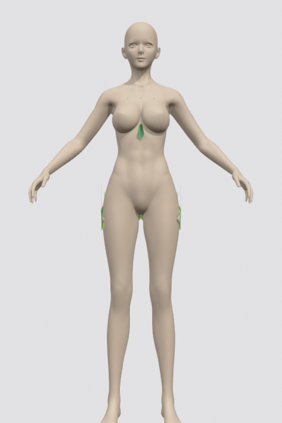</a> 01_front</td>
    <td align='center'><a href='renders/triangle_string_halter__rng1/02_three_quarter.png'>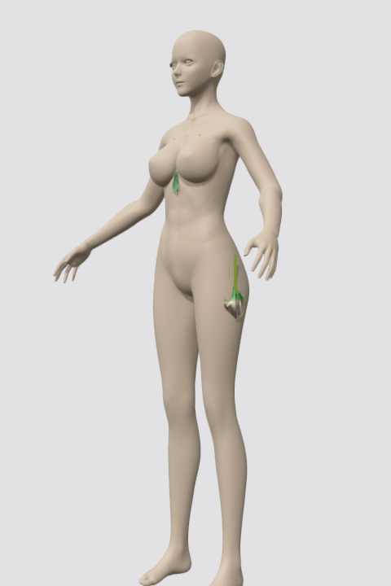</a> 02_three_quarter</td>
    <td align='center'> 03_side_left</td>
    <td align='center'><a href='renders/triangle_string_halter__rng1/04_back.png'>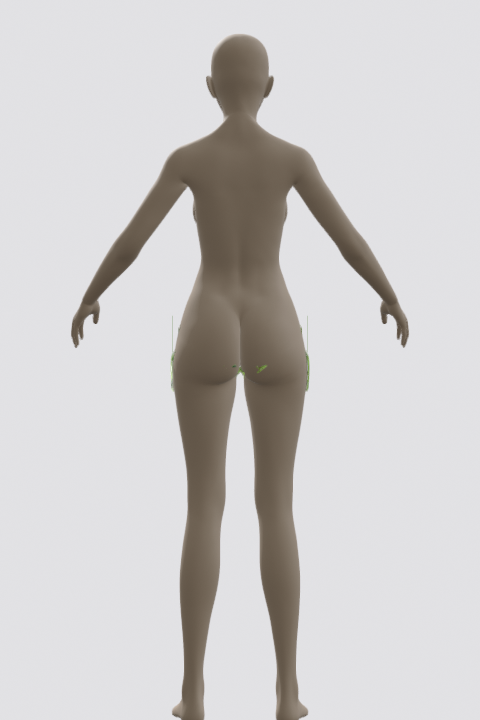</a> 04_back</td>
  </tr>
  <tr>
    <td align='center'><a href='renders/triangle_string_halter__rng1/05_chest_close.png'>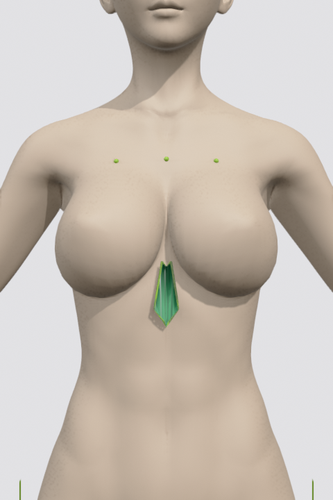</a> 05_chest_close</td>
    <td align='center'> 06_hip_close</td>
    <td align='center'><a href='renders/triangle_string_halter__rng1/07_neck_top.png'>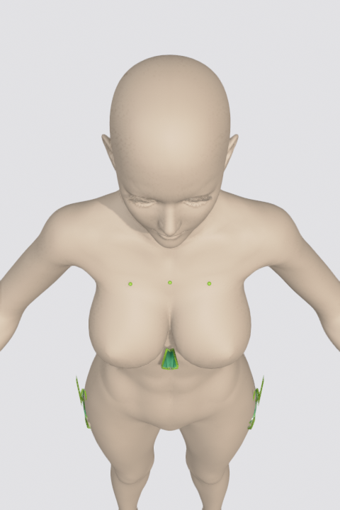</a> 07_neck_top</td>
    <td align='center'><a href='renders/triangle_string_halter__rng1/08_shoulder_top.png'>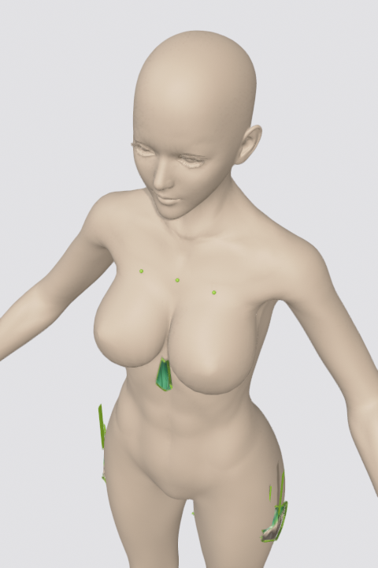</a> 08_shoulder_top</td>
  </tr>
</table>

#### `triangle_string_halter__rng2`

<table>
  <tr>
    <td align='center'><a href='renders/triangle_string_halter__rng2/01_front.png'>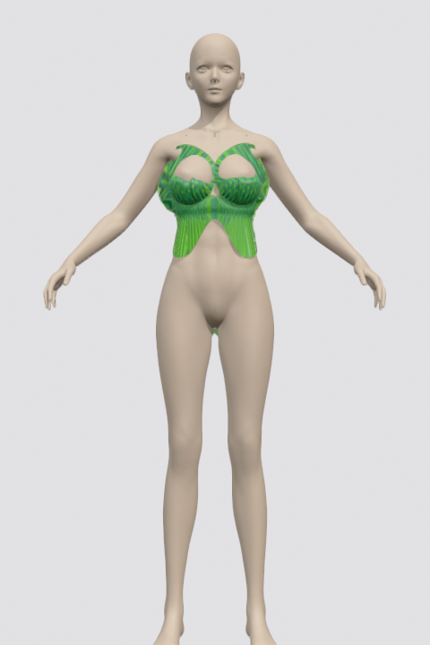</a> 01_front</td>
    <td align='center'><a href='renders/triangle_string_halter__rng2/02_three_quarter.png'>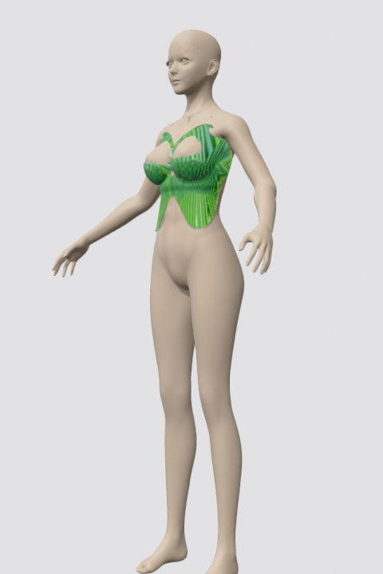</a> 02_three_quarter</td>
    <td align='center'><a href='renders/triangle_string_halter__rng2/03_side_left.png'>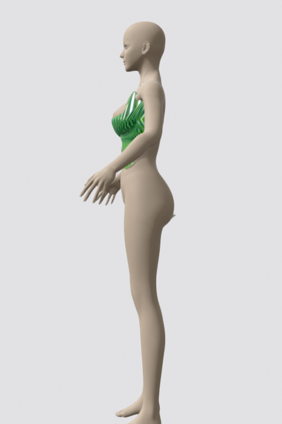</a> 03_side_left</td>
    <td align='center'><a href='renders/triangle_string_halter__rng2/04_back.png'>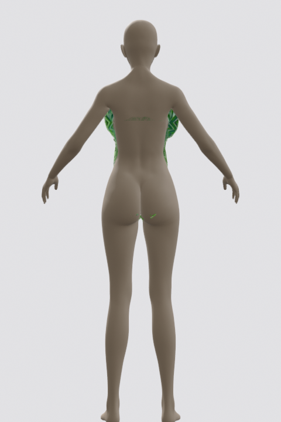</a> 04_back</td>
  </tr>
  <tr>
    <td align='center'><a href='renders/triangle_string_halter__rng2/05_chest_close.png'>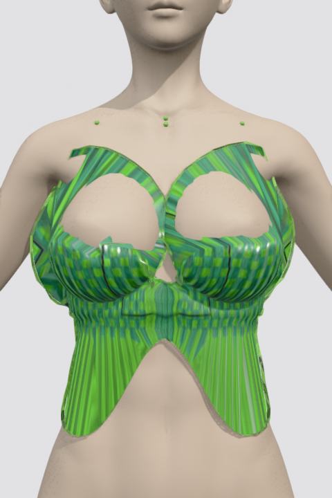</a> 05_chest_close</td>
    <td align='center'> 06_hip_close</td>
    <td align='center'><a href='renders/triangle_string_halter__rng2/07_neck_top.png'>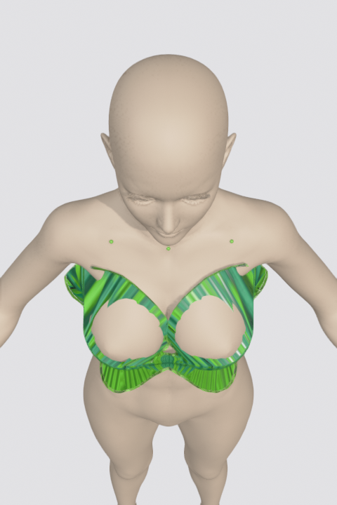</a> 07_neck_top</td>
    <td align='center'><a href='renders/triangle_string_halter__rng2/08_shoulder_top.png'>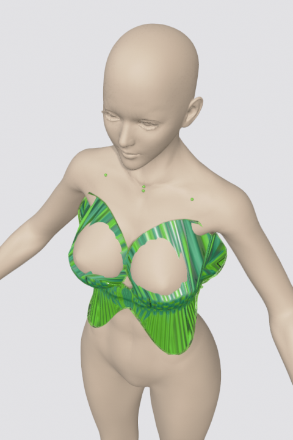</a> 08_shoulder_top</td>
  </tr>
</table>

#### `triangle_string_halter__rng3`

<table>
  <tr>
    <td align='center'><a href='renders/triangle_string_halter__rng3/01_front.png'>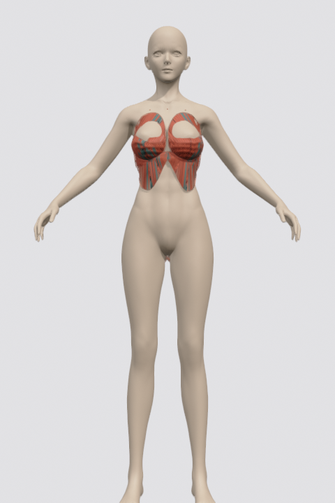</a> 01_front</td>
    <td align='center'><a href='renders/triangle_string_halter__rng3/02_three_quarter.png'>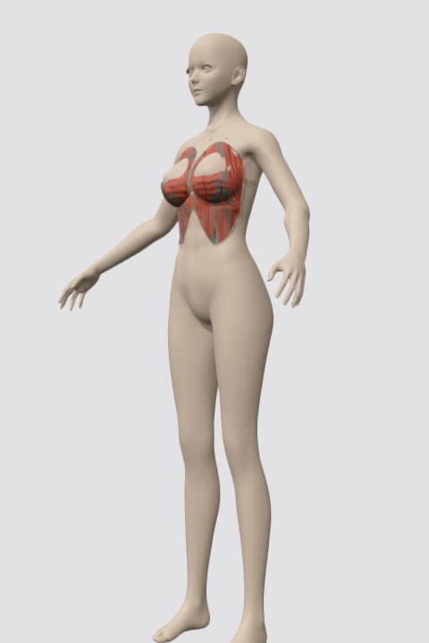</a> 02_three_quarter</td>
    <td align='center'><a href='renders/triangle_string_halter__rng3/03_side_left.png'>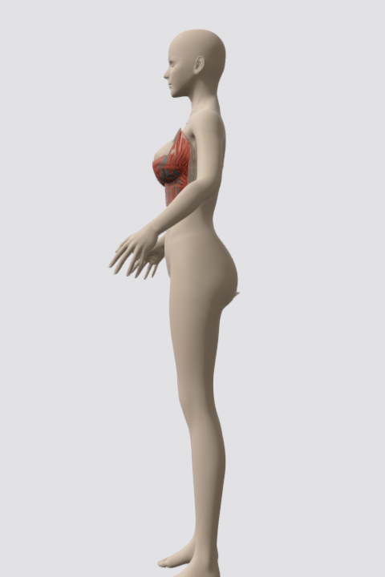</a> 03_side_left</td>
    <td align='center'><a href='renders/triangle_string_halter__rng3/04_back.png'>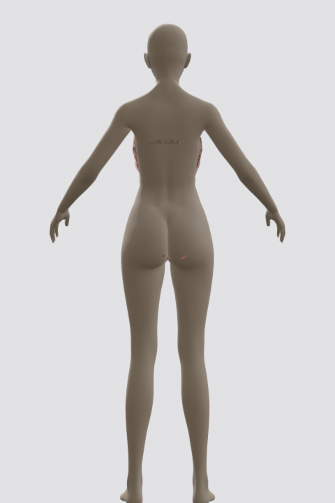</a> 04_back</td>
  </tr>
  <tr>
    <td align='center'><a href='renders/triangle_string_halter__rng3/05_chest_close.png'>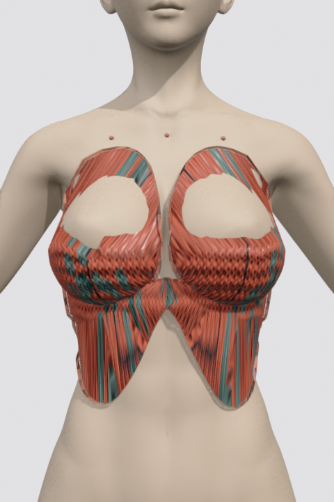</a> 05_chest_close</td>
    <td align='center'><a href='renders/triangle_string_halter__rng3/06_hip_close.png'>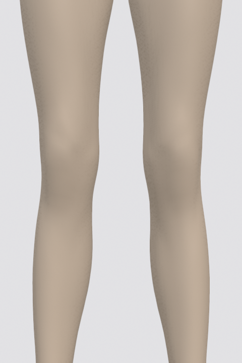</a> 06_hip_close</td>
    <td align='center'><a href='renders/triangle_string_halter__rng3/07_neck_top.png'>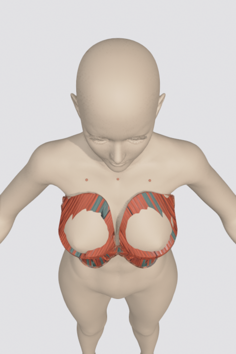</a> 07_neck_top</td>
    <td align='center'><a href='renders/triangle_string_halter__rng3/08_shoulder_top.png'>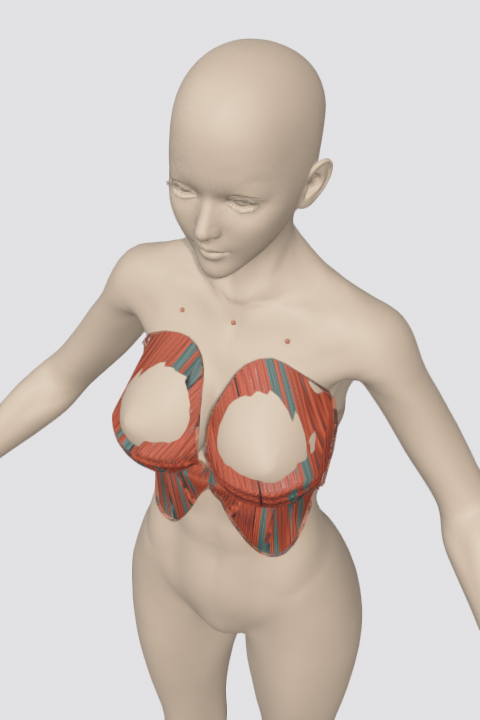</a> 08_shoulder_top</td>
  </tr>
</table>

## Run report

# v2 pure-random with both modesty caps at 1.0

`bottom_coverage_strict=1.0` + `cup_coverage_strict=1.0` applied during sampling. Same 16-outfit grid as 1021_v2_pure_random for direct comparison.

## Per-outfit (cup, bottom_front, composite score)

| outfit | cup | bottom_front | composite | outfit-native | v1-aesthetic |
|---|---|---|---|---|---|
| `triangle_string_halter__rng0` | `CUP_BRAZILIAN_M` | `BOT_CHEEKY_M` | 0.764 | 0.859 | 0.704 |
| `triangle_string_halter__rng1` | `CUP_BRAZILIAN_S` | `BOT_CHEEKY_S` | 0.755 | 0.759 | 0.771 |
| `triangle_string_halter__rng2` | `CUP_TRIANGLE_L` | `BOT_CHEEKY_S` | 0.815 | 0.809 | 0.814 |
| `triangle_string_halter__rng3` | `CUP_TRIANGLE_M` | `BOT_CHEEKY_M` | 0.826 | 0.859 | 0.829 |
| `bandeau_back_band__rng0` | `CUP_FOAM_MOLDED_L` | `BOT_HIGHWAIST_M` | 0.823 | 0.880 | 0.834 |
| `bandeau_back_band__rng1` | `CUP_FOAM_MOLDED_S` | `BOT_HIGHWAIST_M` | 0.808 | 0.880 | 0.797 |
| `bandeau_back_band__rng2` | `CUP_FOAM_MOLDED_M` | `BOT_HIGHWAIST_M` | 0.792 | 0.819 | 0.809 |
| `bandeau_back_band__rng3` | `CUP_FOAM_MOLDED_M` | `BOT_BRIEF_S` | 0.777 | 0.880 | 0.720 |
| `bralette_shoulder_strap__rng0` | `CUP_FOAM_MOLDED_M` | `BOT_BRIEF_M` | 0.796 | 0.888 | 0.760 |
| `bralette_shoulder_strap__rng1` | `CUP_FOAM_MOLDED_L` | `BOT_BRIEF_M` | 0.831 | 0.917 | 0.667 |
| `bralette_shoulder_strap__rng2` | `CUP_FOAM_MOLDED_S` | `BOT_BRIEF_S` | 0.828 | 0.861 | 0.833 |
| `bralette_shoulder_strap__rng3` | `CUP_FOAM_MOLDED_L` | `BOT_HIGHWAIST_M` | 0.769 | 0.817 | 0.753 |
| `one_piece_maillot__rng0` | `CUP_FOAM_MOLDED_S` | `BOT_HIGHWAIST_M` | 0.804 | 0.861 | 0.740 |
| `one_piece_maillot__rng1` | `CUP_FOAM_MOLDED_M` | `BOT_HIGHWAIST_S` | 0.864 | 0.845 | 0.810 |
| `one_piece_maillot__rng2` | `CUP_FOAM_MOLDED_M` | `BOT_BRIEF_S` | 0.870 | 0.967 | 0.813 |
| `one_piece_maillot__rng3` | `CUP_FOAM_MOLDED_L` | `BOT_BRIEF_S` | 0.802 | 0.917 | 0.686 |

## Aggregate

- composite: mean=0.808, std=0.033, range=[0.755, 0.870]
- outfit-native: mean=0.864, std=0.049, range=[0.759, 0.967]

## Cup distribution at strict=1

| cup | count | bottom | count |
|---|---|---|---|
| `CUP_FOAM_MOLDED_M` | 5 | `BOT_HIGHWAIST_M` | 5 |
| `CUP_FOAM_MOLDED_L` | 4 | `BOT_BRIEF_S` | 4 |
| `CUP_FOAM_MOLDED_S` | 3 | `BOT_BRIEF_M` | 2 |
| `CUP_BRAZILIAN_M` | 1 | `BOT_CHEEKY_M` | 2 |
| `CUP_BRAZILIAN_S` | 1 | `BOT_CHEEKY_S` | 2 |
| `CUP_TRIANGLE_L` | 1 | `BOT_HIGHWAIST_S` | 1 |
| `CUP_TRIANGLE_M` | 1 |  |  |

