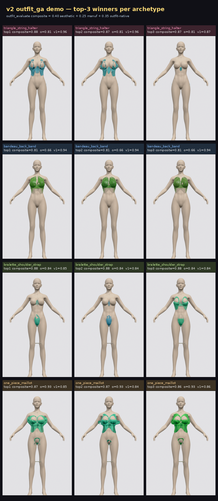
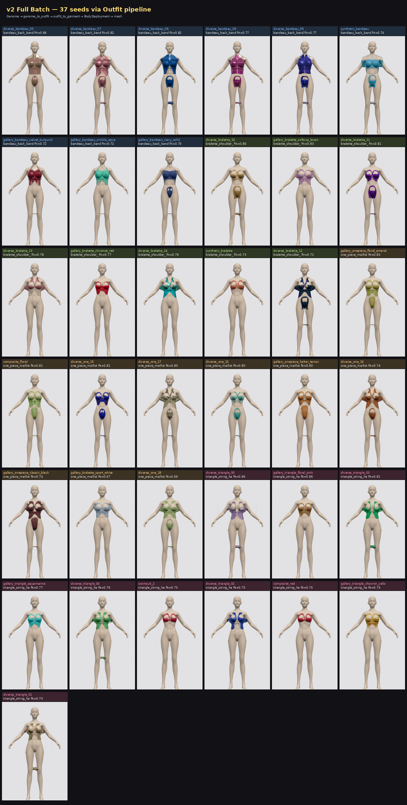
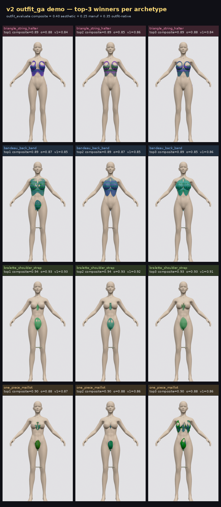

# 2026-05-08

_Top: [`tools/output/`](../README.md)_

## Tasks

- [`0337_v2_full_batch/`](0337_v2_full_batch/README.md) — 37 seed dirs · 297 images
   

- [`0352_v2_ga_demo/`](0352_v2_ga_demo/README.md) — 12 seed dirs · 97 images
   

- [`0657_v2_full_batch/`](0657_v2_full_batch/README.md) — 37 seed dirs · 297 images
   

- [`0657_v2_ga_demo/`](0657_v2_ga_demo/README.md) — 12 seed dirs · 97 images
   

- [`0755_v2_fixes_verify/`](0755_v2_fixes_verify/README.md) — 0 seed dirs · 0 images

- [`0823_v2_cup_strict_verify/`](0823_v2_cup_strict_verify/README.md) — 0 seed dirs · 0 images

- [`1021_v2_pure_random/`](1021_v2_pure_random/README.md) — 16 seed dirs · 129 images
   
