# 0025_v2_modest_series

_Day: [`2026-05-09/`](../README.md)_  ·  _Seeds: 16_  ·  _Images: 129_

Local interactive viewer: [`index.html`](index.html)  ·  Top: [`tools/output/`](../../README.md)

## Top-level images

### overview.png

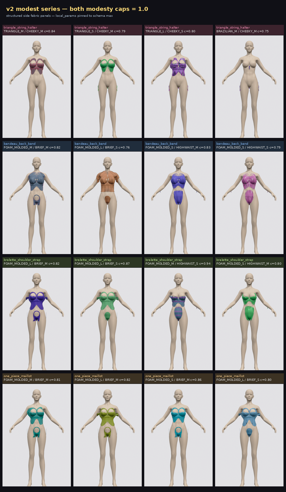

## Seeds (16)

### archetype: `unknown` (16)

#### `modest_bandeau_back_band__rng0`

<table>
  <tr>
    <td align='center'><a href='renders/modest_bandeau_back_band__rng0/01_front.png'>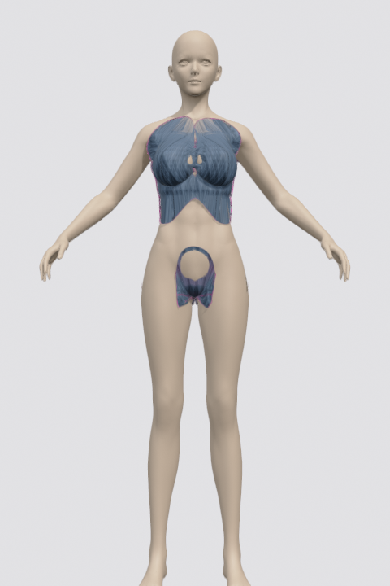</a> 01_front</td>
    <td align='center'><a href='renders/modest_bandeau_back_band__rng0/02_three_quarter.png'>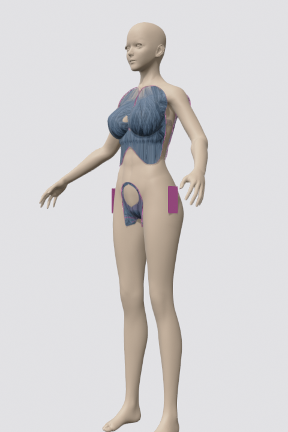</a> 02_three_quarter</td>
    <td align='center'><a href='renders/modest_bandeau_back_band__rng0/03_side_left.png'>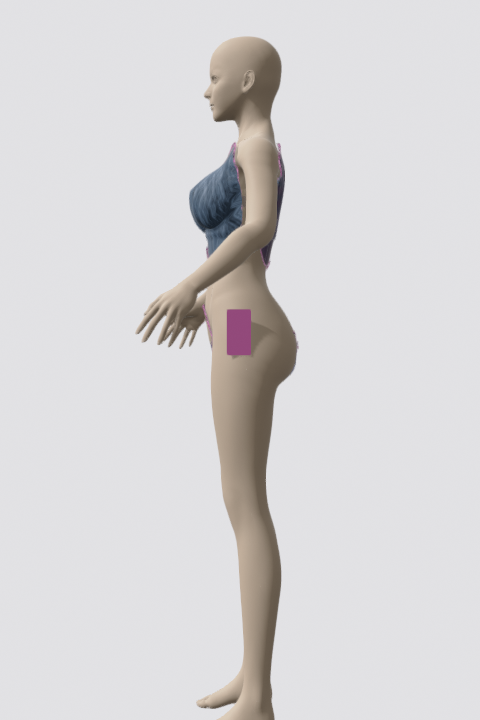</a> 03_side_left</td>
    <td align='center'><a href='renders/modest_bandeau_back_band__rng0/04_back.png'>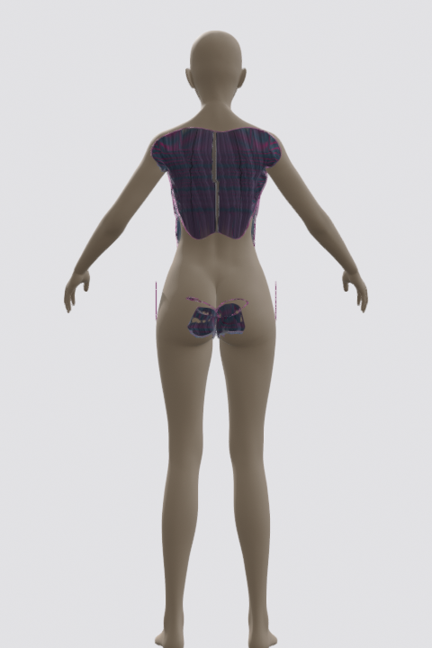</a> 04_back</td>
  </tr>
  <tr>
    <td align='center'><a href='renders/modest_bandeau_back_band__rng0/05_chest_close.png'>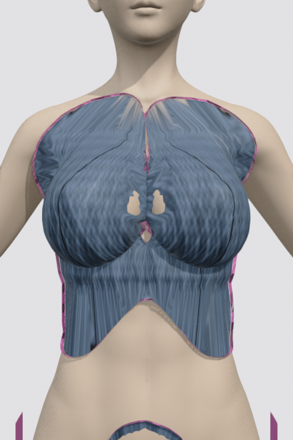</a> 05_chest_close</td>
    <td align='center'> 06_hip_close</td>
    <td align='center'><a href='renders/modest_bandeau_back_band__rng0/07_neck_top.png'>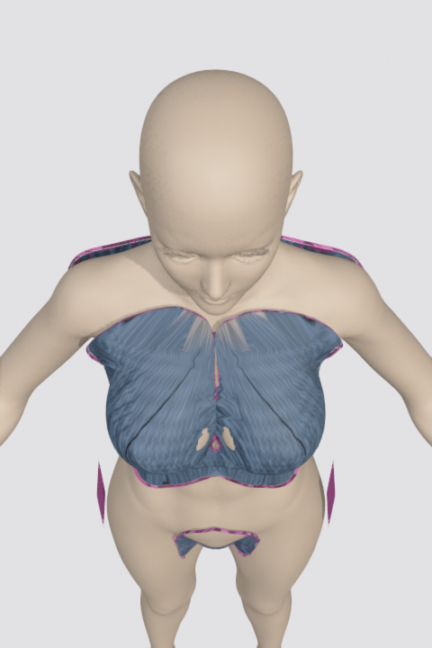</a> 07_neck_top</td>
    <td align='center'><a href='renders/modest_bandeau_back_band__rng0/08_shoulder_top.png'>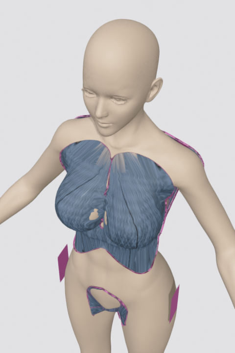</a> 08_shoulder_top</td>
  </tr>
</table>

#### `modest_bandeau_back_band__rng1`

<table>
  <tr>
    <td align='center'><a href='renders/modest_bandeau_back_band__rng1/01_front.png'>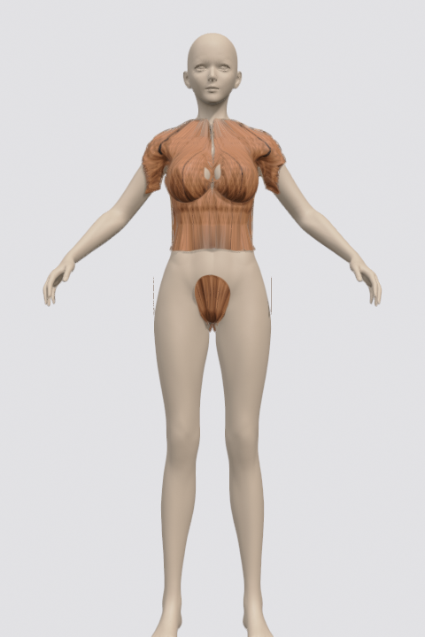</a> 01_front</td>
    <td align='center'><a href='renders/modest_bandeau_back_band__rng1/02_three_quarter.png'>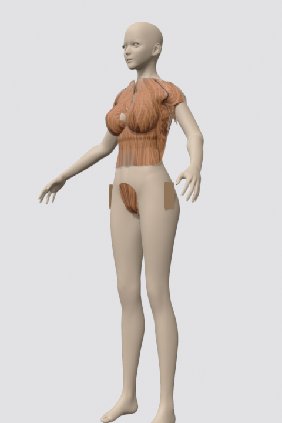</a> 02_three_quarter</td>
    <td align='center'><a href='renders/modest_bandeau_back_band__rng1/03_side_left.png'>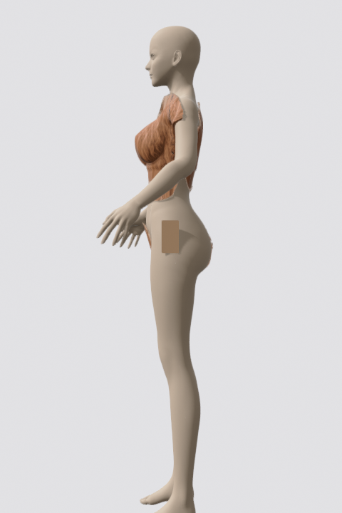</a> 03_side_left</td>
    <td align='center'><a href='renders/modest_bandeau_back_band__rng1/04_back.png'>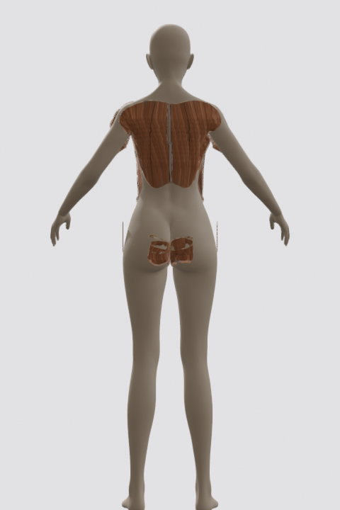</a> 04_back</td>
  </tr>
  <tr>
    <td align='center'><a href='renders/modest_bandeau_back_band__rng1/05_chest_close.png'>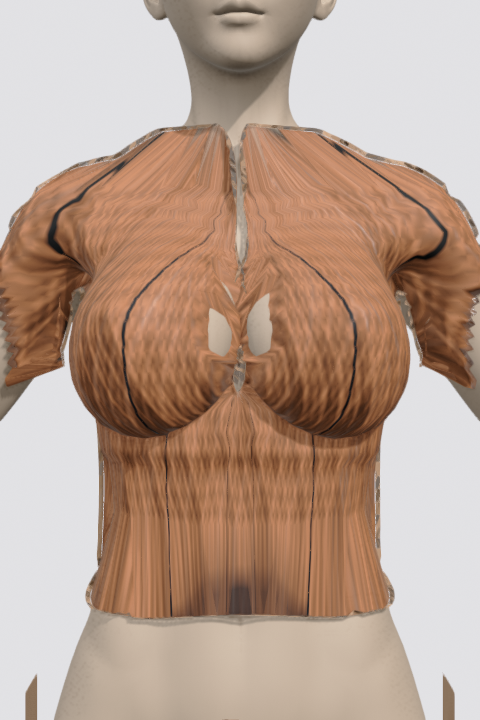</a> 05_chest_close</td>
    <td align='center'> 06_hip_close</td>
    <td align='center'><a href='renders/modest_bandeau_back_band__rng1/07_neck_top.png'>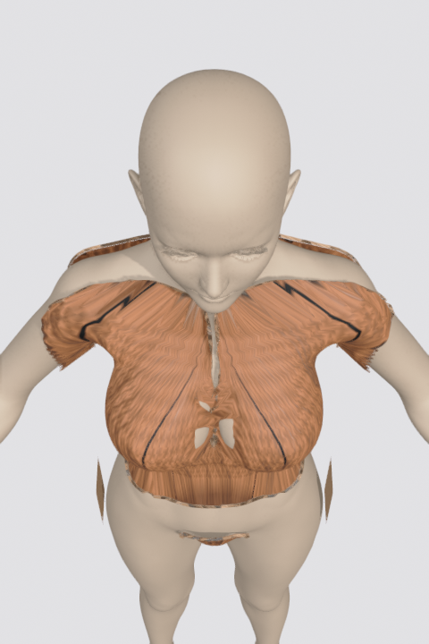</a> 07_neck_top</td>
    <td align='center'><a href='renders/modest_bandeau_back_band__rng1/08_shoulder_top.png'>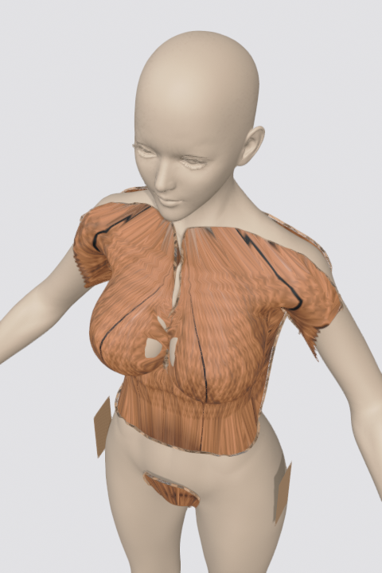</a> 08_shoulder_top</td>
  </tr>
</table>

#### `modest_bandeau_back_band__rng2`

<table>
  <tr>
    <td align='center'><a href='renders/modest_bandeau_back_band__rng2/01_front.png'>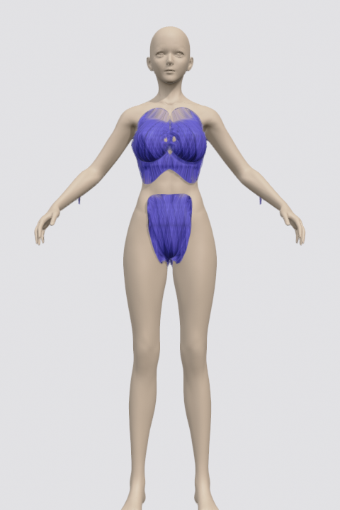</a> 01_front</td>
    <td align='center'><a href='renders/modest_bandeau_back_band__rng2/02_three_quarter.png'>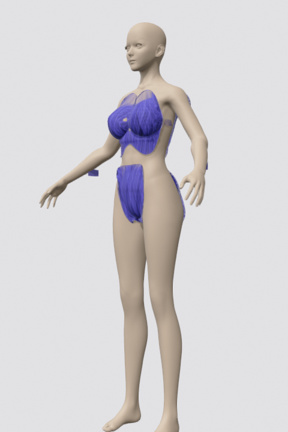</a> 02_three_quarter</td>
    <td align='center'><a href='renders/modest_bandeau_back_band__rng2/03_side_left.png'>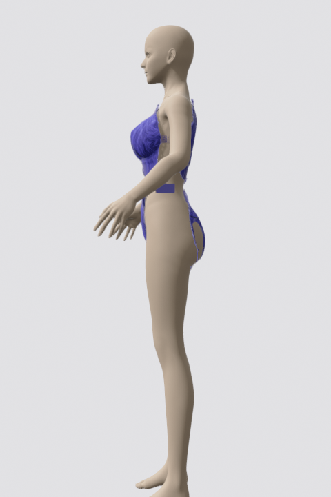</a> 03_side_left</td>
    <td align='center'><a href='renders/modest_bandeau_back_band__rng2/04_back.png'>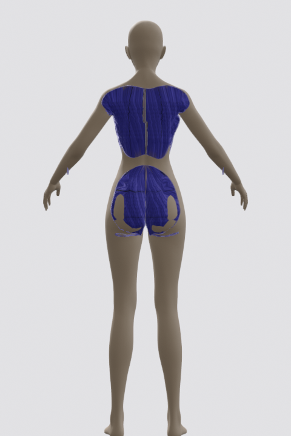</a> 04_back</td>
  </tr>
  <tr>
    <td align='center'><a href='renders/modest_bandeau_back_band__rng2/05_chest_close.png'>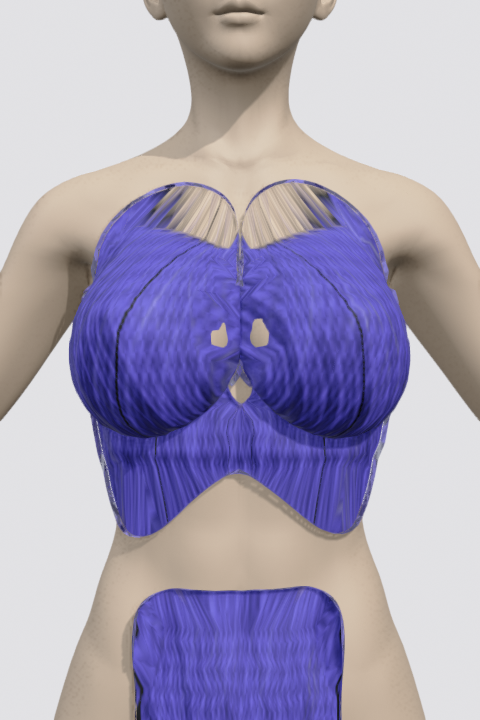</a> 05_chest_close</td>
    <td align='center'> 06_hip_close</td>
    <td align='center'><a href='renders/modest_bandeau_back_band__rng2/07_neck_top.png'>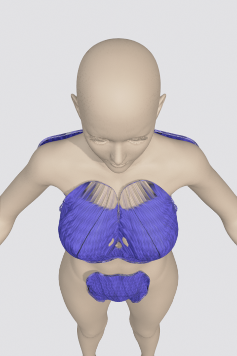</a> 07_neck_top</td>
    <td align='center'><a href='renders/modest_bandeau_back_band__rng2/08_shoulder_top.png'>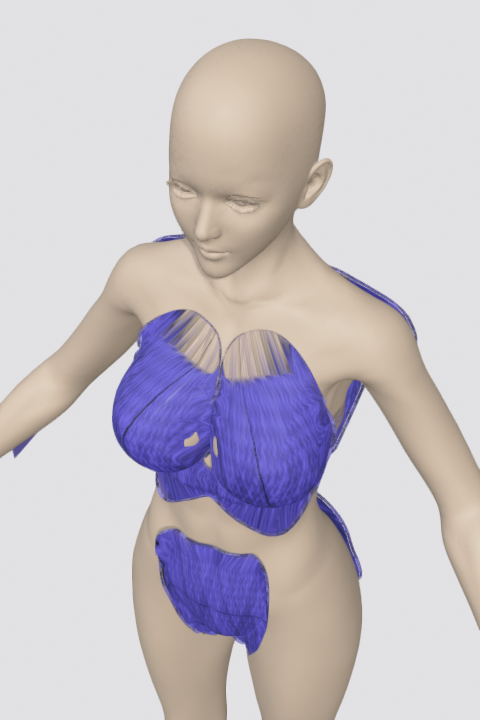</a> 08_shoulder_top</td>
  </tr>
</table>

#### `modest_bandeau_back_band__rng3`

<table>
  <tr>
    <td align='center'><a href='renders/modest_bandeau_back_band__rng3/01_front.png'>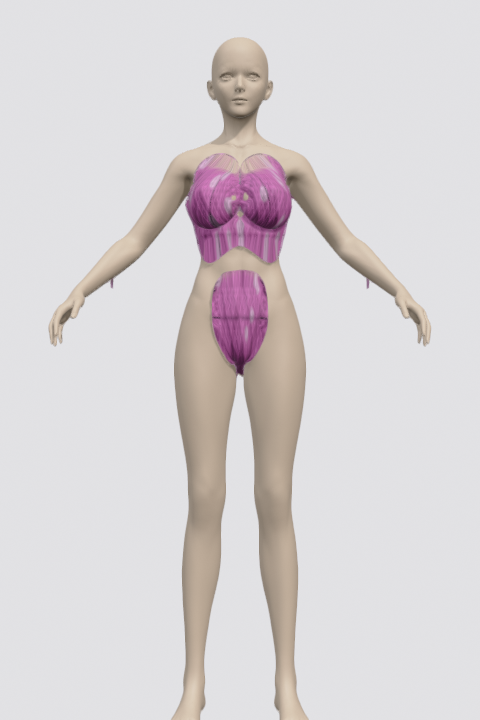</a> 01_front</td>
    <td align='center'><a href='renders/modest_bandeau_back_band__rng3/02_three_quarter.png'>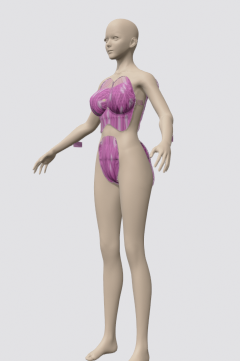</a> 02_three_quarter</td>
    <td align='center'><a href='renders/modest_bandeau_back_band__rng3/03_side_left.png'>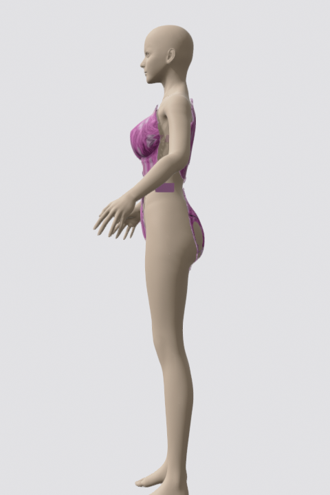</a> 03_side_left</td>
    <td align='center'><a href='renders/modest_bandeau_back_band__rng3/04_back.png'>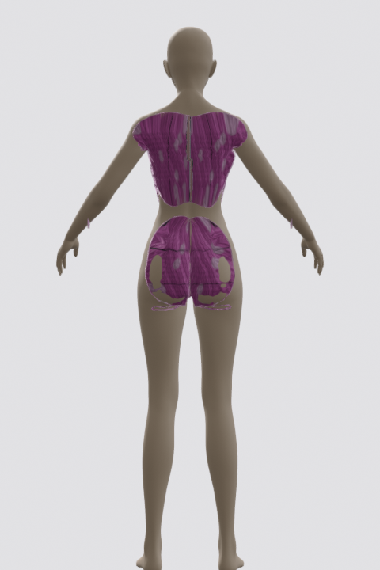</a> 04_back</td>
  </tr>
  <tr>
    <td align='center'><a href='renders/modest_bandeau_back_band__rng3/05_chest_close.png'>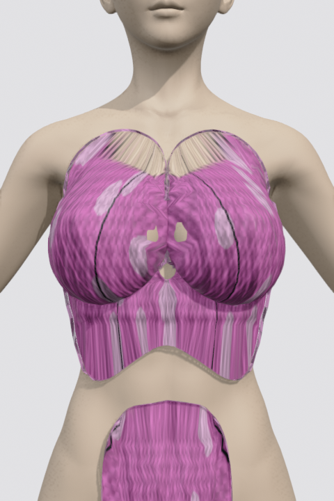</a> 05_chest_close</td>
    <td align='center'> 06_hip_close</td>
    <td align='center'><a href='renders/modest_bandeau_back_band__rng3/07_neck_top.png'>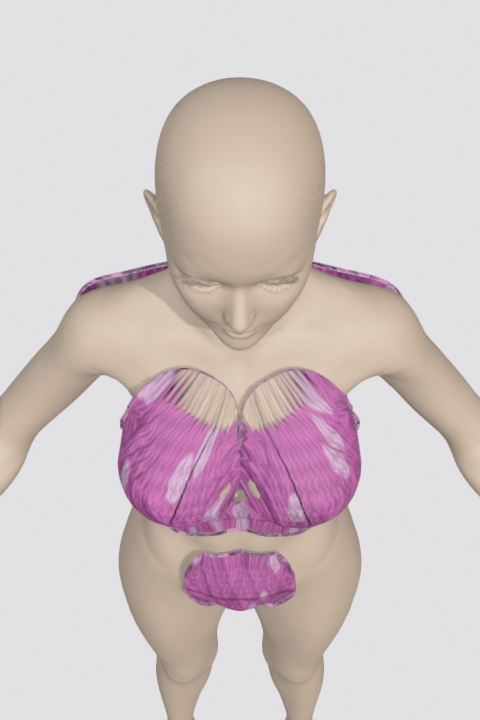</a> 07_neck_top</td>
    <td align='center'><a href='renders/modest_bandeau_back_band__rng3/08_shoulder_top.png'>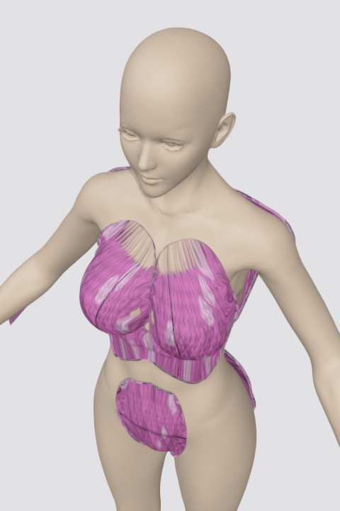</a> 08_shoulder_top</td>
  </tr>
</table>

#### `modest_bralette_shoulder_strap__rng0`

<table>
  <tr>
    <td align='center'><a href='renders/modest_bralette_shoulder_strap__rng0/01_front.png'>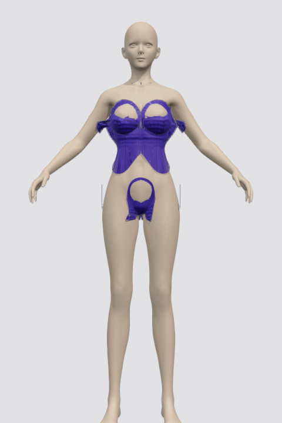</a> 01_front</td>
    <td align='center'><a href='renders/modest_bralette_shoulder_strap__rng0/02_three_quarter.png'>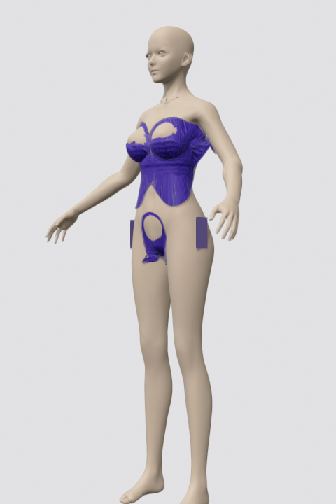</a> 02_three_quarter</td>
    <td align='center'><a href='renders/modest_bralette_shoulder_strap__rng0/03_side_left.png'>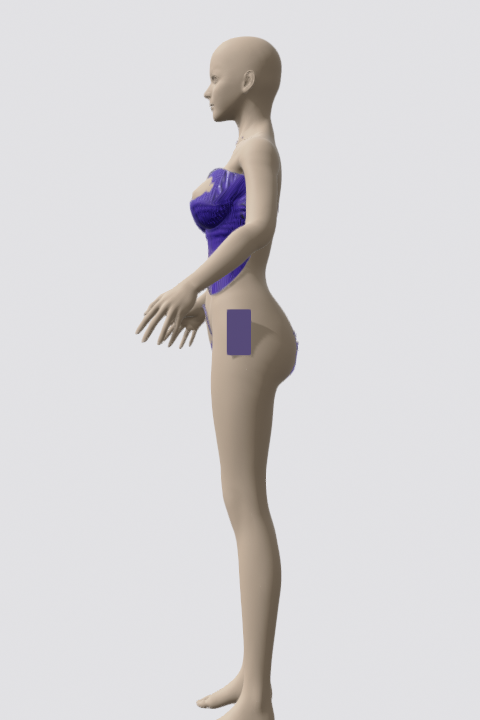</a> 03_side_left</td>
    <td align='center'><a href='renders/modest_bralette_shoulder_strap__rng0/04_back.png'>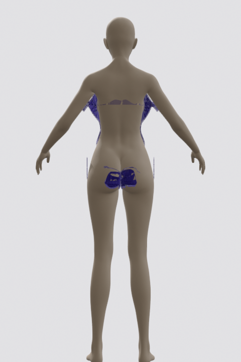</a> 04_back</td>
  </tr>
  <tr>
    <td align='center'><a href='renders/modest_bralette_shoulder_strap__rng0/05_chest_close.png'>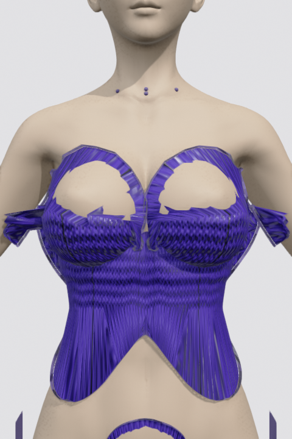</a> 05_chest_close</td>
    <td align='center'> 06_hip_close</td>
    <td align='center'><a href='renders/modest_bralette_shoulder_strap__rng0/07_neck_top.png'>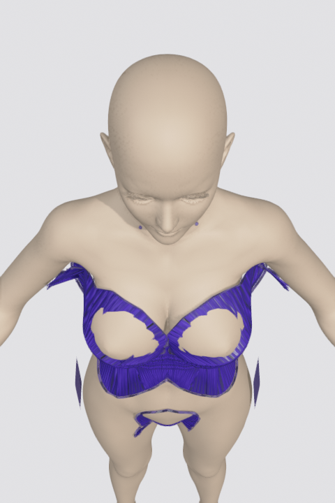</a> 07_neck_top</td>
    <td align='center'><a href='renders/modest_bralette_shoulder_strap__rng0/08_shoulder_top.png'>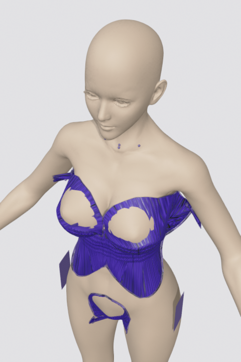</a> 08_shoulder_top</td>
  </tr>
</table>

#### `modest_bralette_shoulder_strap__rng1`

<table>
  <tr>
    <td align='center'><a href='renders/modest_bralette_shoulder_strap__rng1/01_front.png'>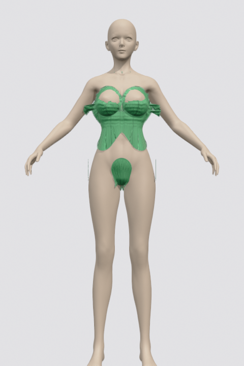</a> 01_front</td>
    <td align='center'><a href='renders/modest_bralette_shoulder_strap__rng1/02_three_quarter.png'>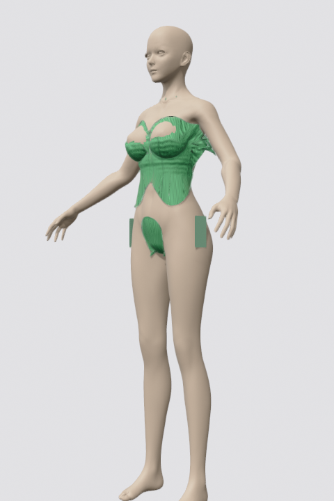</a> 02_three_quarter</td>
    <td align='center'><a href='renders/modest_bralette_shoulder_strap__rng1/03_side_left.png'>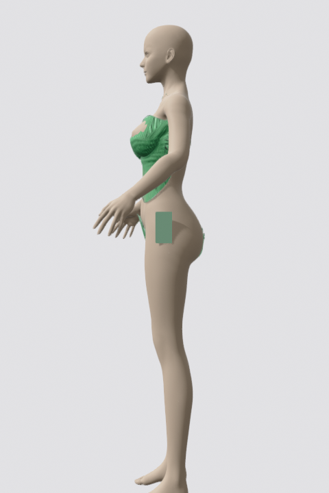</a> 03_side_left</td>
    <td align='center'><a href='renders/modest_bralette_shoulder_strap__rng1/04_back.png'>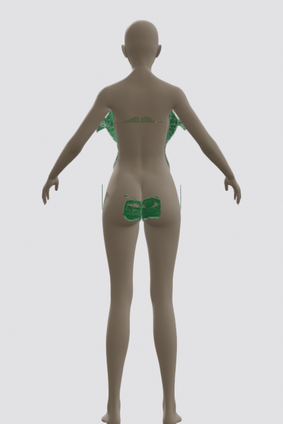</a> 04_back</td>
  </tr>
  <tr>
    <td align='center'><a href='renders/modest_bralette_shoulder_strap__rng1/05_chest_close.png'>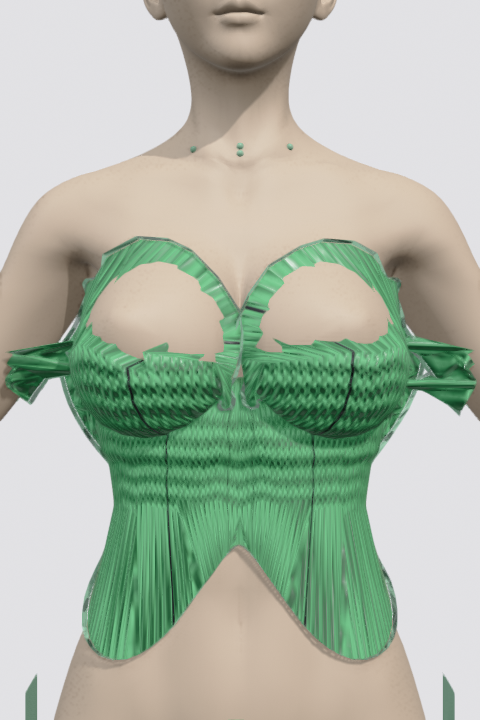</a> 05_chest_close</td>
    <td align='center'><a href='renders/modest_bralette_shoulder_strap__rng1/06_hip_close.png'>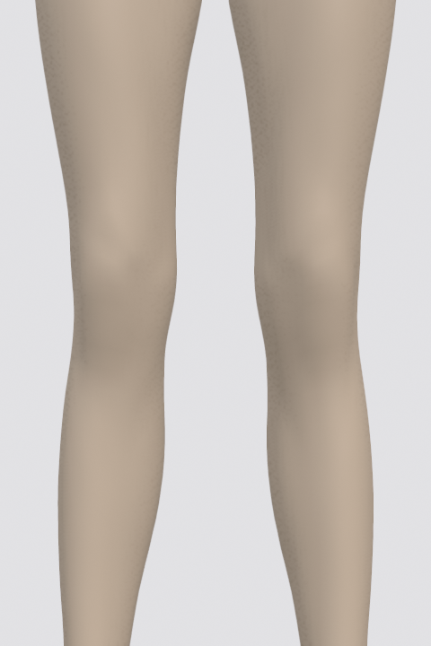</a> 06_hip_close</td>
    <td align='center'><a href='renders/modest_bralette_shoulder_strap__rng1/07_neck_top.png'>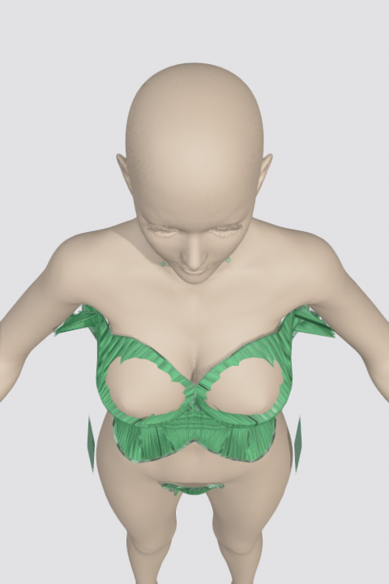</a> 07_neck_top</td>
    <td align='center'><a href='renders/modest_bralette_shoulder_strap__rng1/08_shoulder_top.png'>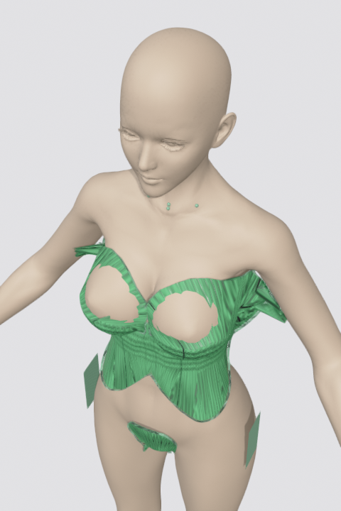</a> 08_shoulder_top</td>
  </tr>
</table>

#### `modest_bralette_shoulder_strap__rng2`

<table>
  <tr>
    <td align='center'><a href='renders/modest_bralette_shoulder_strap__rng2/01_front.png'>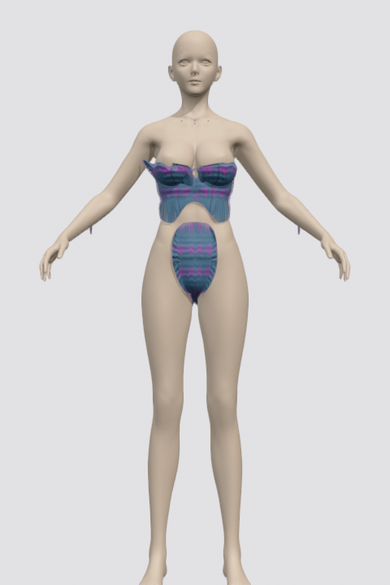</a> 01_front</td>
    <td align='center'><a href='renders/modest_bralette_shoulder_strap__rng2/02_three_quarter.png'>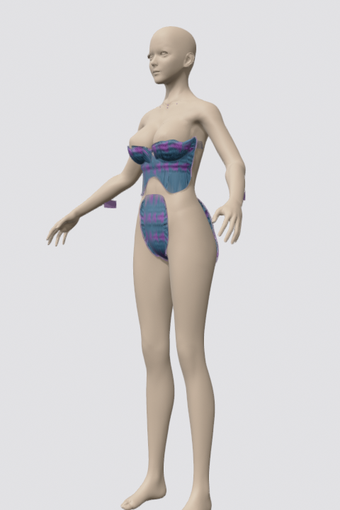</a> 02_three_quarter</td>
    <td align='center'><a href='renders/modest_bralette_shoulder_strap__rng2/03_side_left.png'>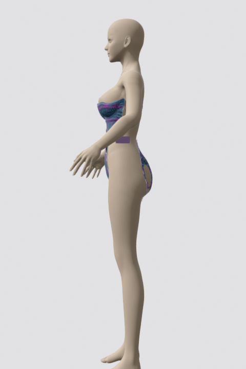</a> 03_side_left</td>
    <td align='center'><a href='renders/modest_bralette_shoulder_strap__rng2/04_back.png'>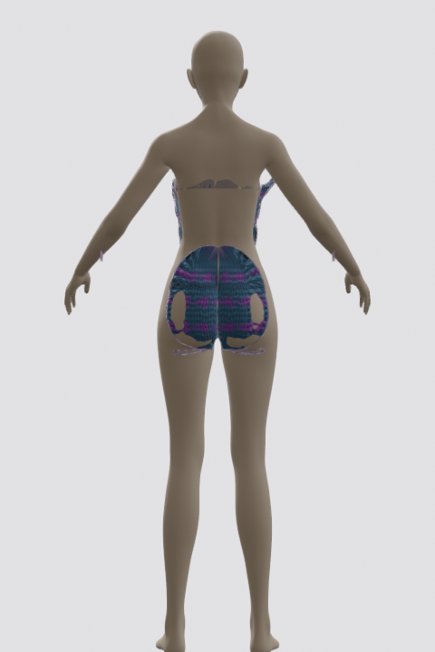</a> 04_back</td>
  </tr>
  <tr>
    <td align='center'><a href='renders/modest_bralette_shoulder_strap__rng2/05_chest_close.png'>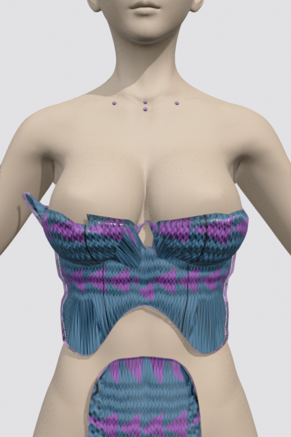</a> 05_chest_close</td>
    <td align='center'> 06_hip_close</td>
    <td align='center'><a href='renders/modest_bralette_shoulder_strap__rng2/07_neck_top.png'>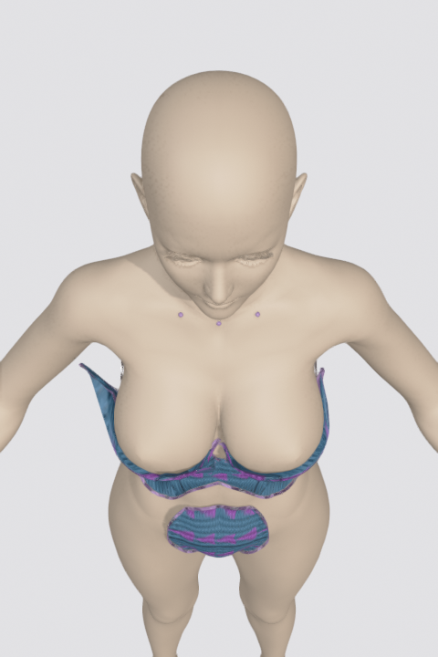</a> 07_neck_top</td>
    <td align='center'><a href='renders/modest_bralette_shoulder_strap__rng2/08_shoulder_top.png'>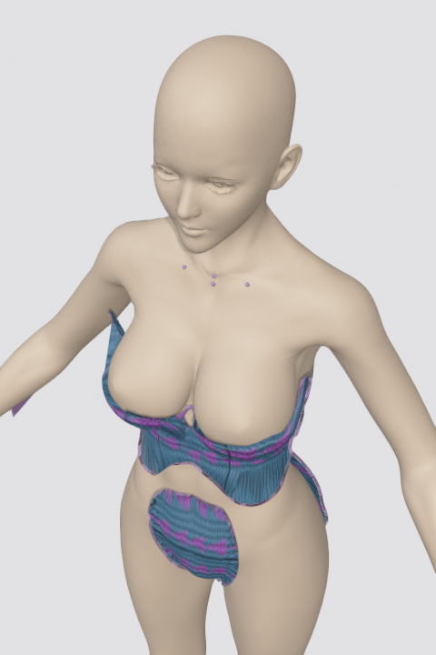</a> 08_shoulder_top</td>
  </tr>
</table>

#### `modest_bralette_shoulder_strap__rng3`

<table>
  <tr>
    <td align='center'><a href='renders/modest_bralette_shoulder_strap__rng3/01_front.png'>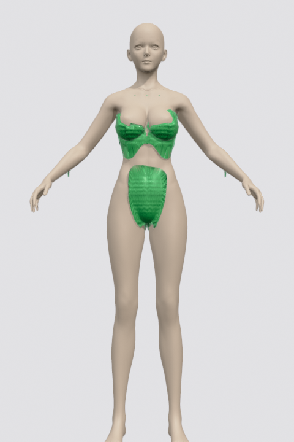</a> 01_front</td>
    <td align='center'><a href='renders/modest_bralette_shoulder_strap__rng3/02_three_quarter.png'>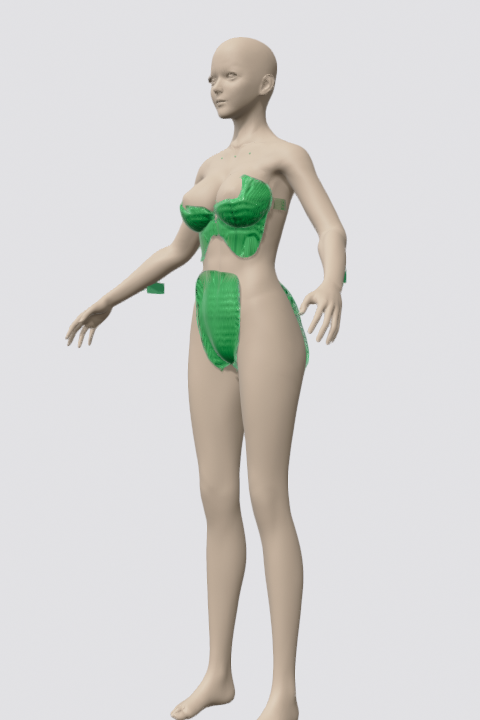</a> 02_three_quarter</td>
    <td align='center'><a href='renders/modest_bralette_shoulder_strap__rng3/03_side_left.png'>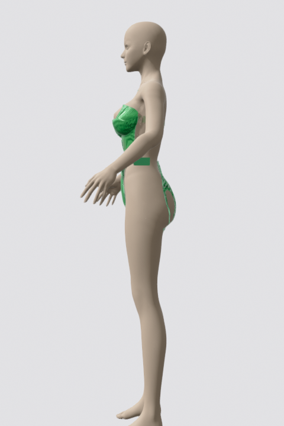</a> 03_side_left</td>
    <td align='center'><a href='renders/modest_bralette_shoulder_strap__rng3/04_back.png'>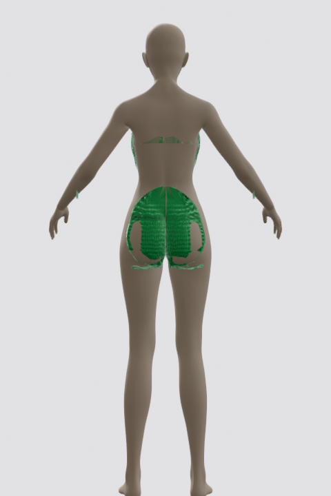</a> 04_back</td>
  </tr>
  <tr>
    <td align='center'><a href='renders/modest_bralette_shoulder_strap__rng3/05_chest_close.png'>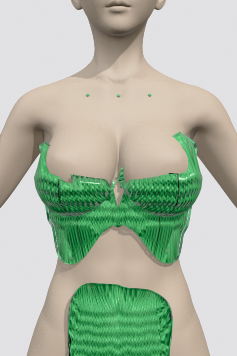</a> 05_chest_close</td>
    <td align='center'><a href='renders/modest_bralette_shoulder_strap__rng3/06_hip_close.png'>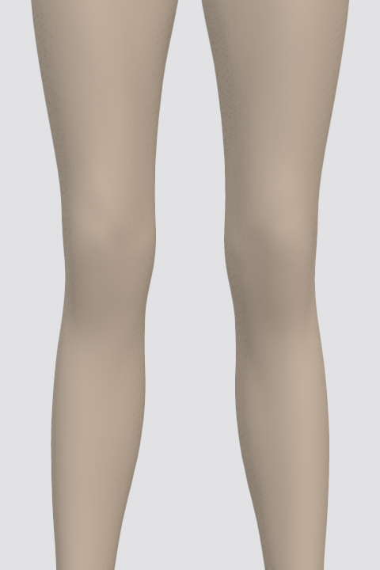</a> 06_hip_close</td>
    <td align='center'><a href='renders/modest_bralette_shoulder_strap__rng3/07_neck_top.png'>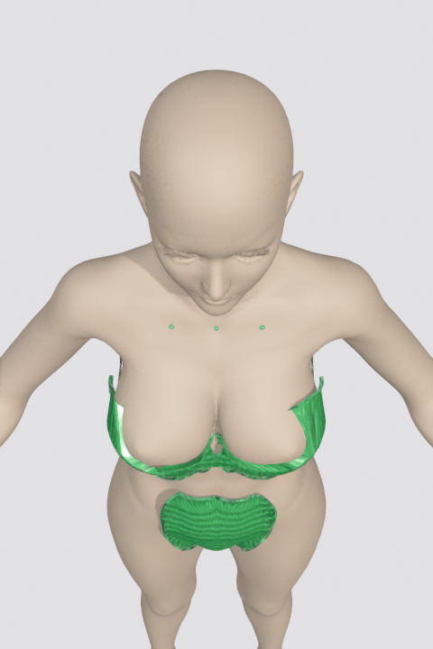</a> 07_neck_top</td>
    <td align='center'><a href='renders/modest_bralette_shoulder_strap__rng3/08_shoulder_top.png'>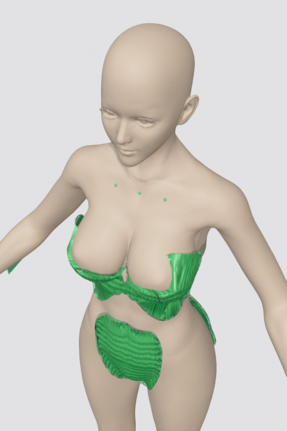</a> 08_shoulder_top</td>
  </tr>
</table>

#### `modest_one_piece_maillot__rng0`

<table>
  <tr>
    <td align='center'><a href='renders/modest_one_piece_maillot__rng0/01_front.png'>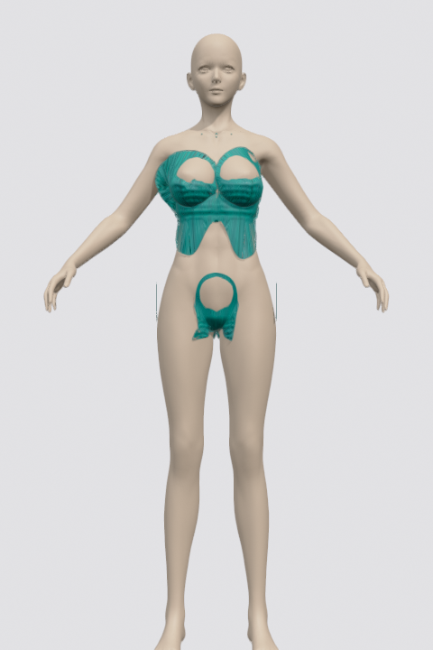</a> 01_front</td>
    <td align='center'><a href='renders/modest_one_piece_maillot__rng0/02_three_quarter.png'>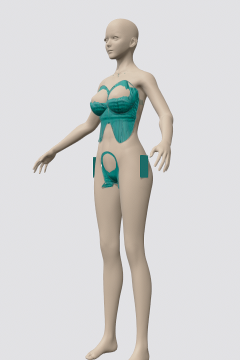</a> 02_three_quarter</td>
    <td align='center'><a href='renders/modest_one_piece_maillot__rng0/03_side_left.png'>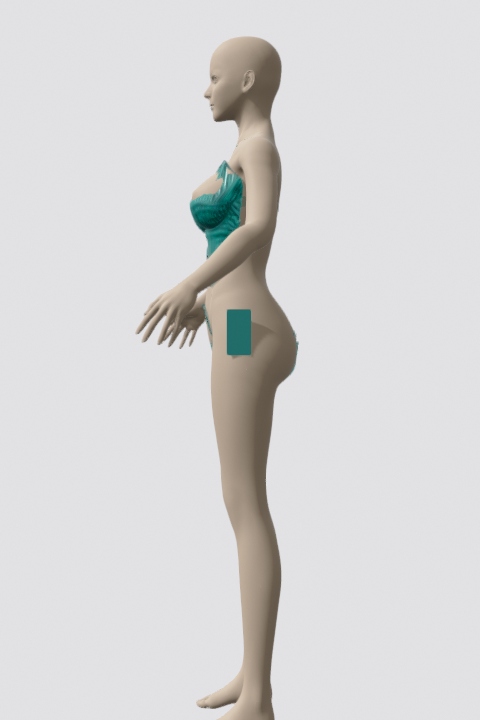</a> 03_side_left</td>
    <td align='center'><a href='renders/modest_one_piece_maillot__rng0/04_back.png'>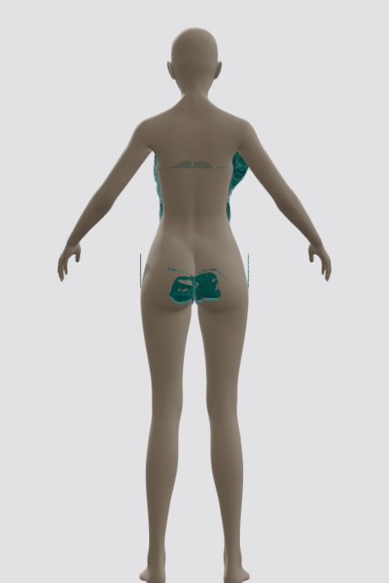</a> 04_back</td>
  </tr>
  <tr>
    <td align='center'><a href='renders/modest_one_piece_maillot__rng0/05_chest_close.png'>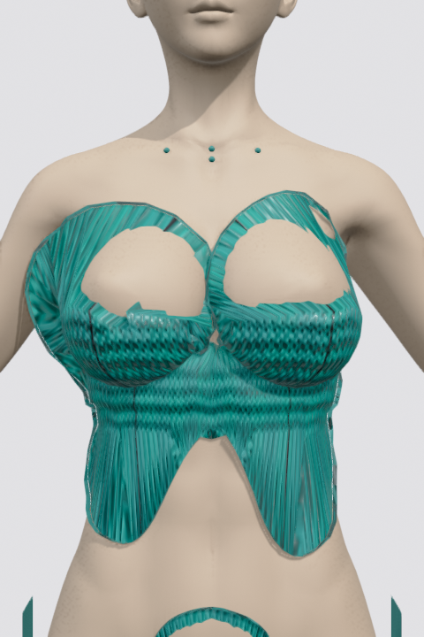</a> 05_chest_close</td>
    <td align='center'> 06_hip_close</td>
    <td align='center'><a href='renders/modest_one_piece_maillot__rng0/07_neck_top.png'>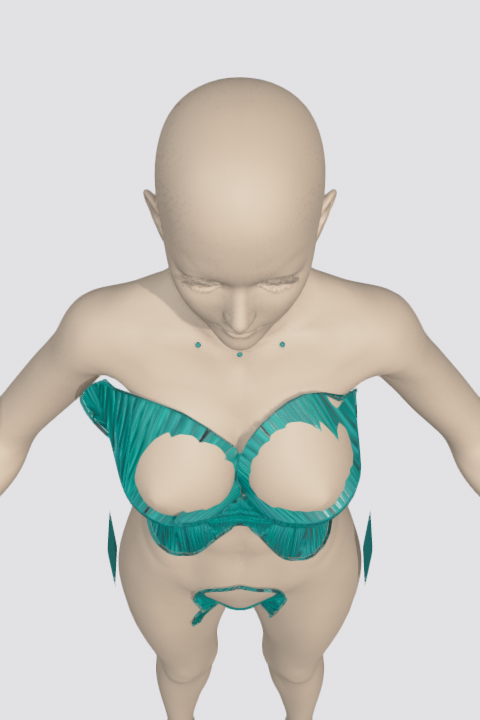</a> 07_neck_top</td>
    <td align='center'><a href='renders/modest_one_piece_maillot__rng0/08_shoulder_top.png'>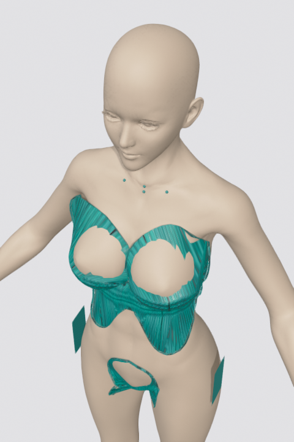</a> 08_shoulder_top</td>
  </tr>
</table>

#### `modest_one_piece_maillot__rng1`

<table>
  <tr>
    <td align='center'><a href='renders/modest_one_piece_maillot__rng1/01_front.png'>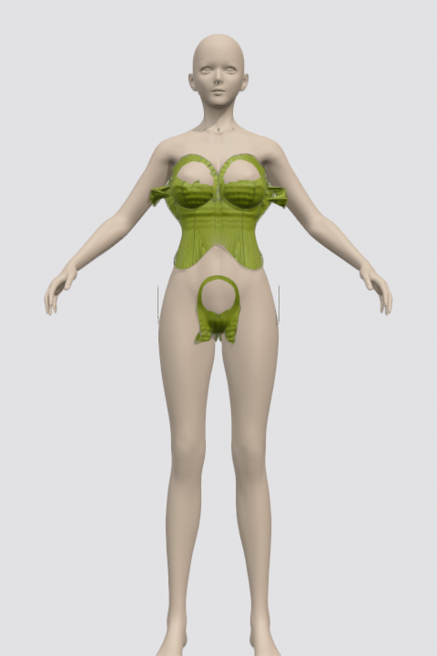</a> 01_front</td>
    <td align='center'><a href='renders/modest_one_piece_maillot__rng1/02_three_quarter.png'>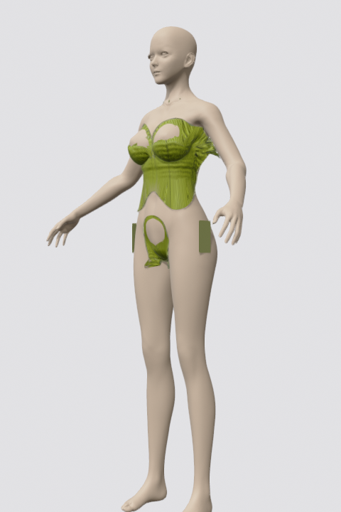</a> 02_three_quarter</td>
    <td align='center'><a href='renders/modest_one_piece_maillot__rng1/03_side_left.png'>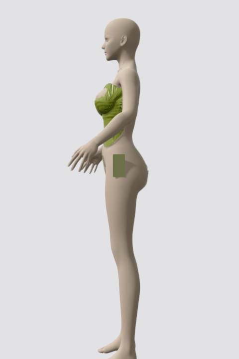</a> 03_side_left</td>
    <td align='center'><a href='renders/modest_one_piece_maillot__rng1/04_back.png'>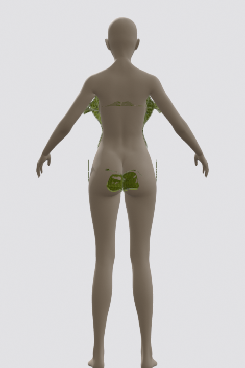</a> 04_back</td>
  </tr>
  <tr>
    <td align='center'><a href='renders/modest_one_piece_maillot__rng1/05_chest_close.png'>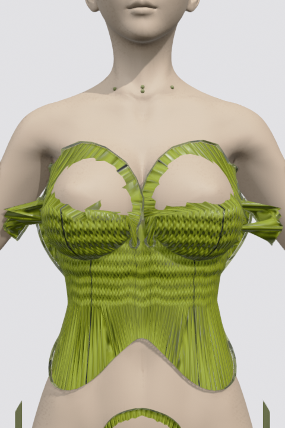</a> 05_chest_close</td>
    <td align='center'> 06_hip_close</td>
    <td align='center'><a href='renders/modest_one_piece_maillot__rng1/07_neck_top.png'>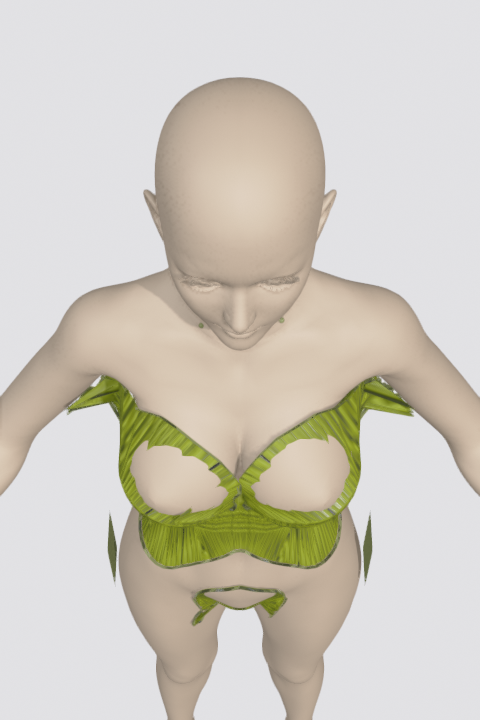</a> 07_neck_top</td>
    <td align='center'><a href='renders/modest_one_piece_maillot__rng1/08_shoulder_top.png'>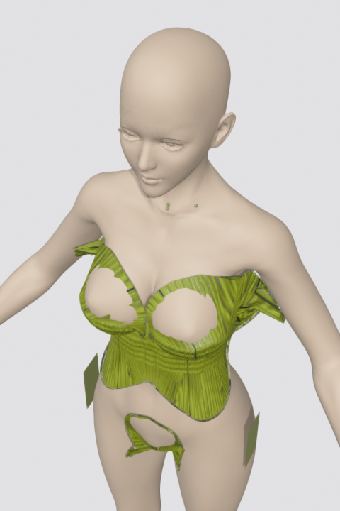</a> 08_shoulder_top</td>
  </tr>
</table>

#### `modest_one_piece_maillot__rng2`

<table>
  <tr>
    <td align='center'><a href='renders/modest_one_piece_maillot__rng2/01_front.png'>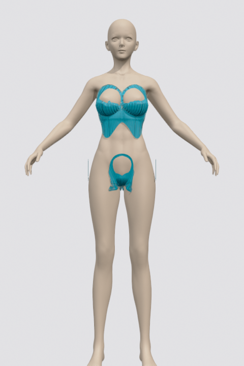</a> 01_front</td>
    <td align='center'><a href='renders/modest_one_piece_maillot__rng2/02_three_quarter.png'>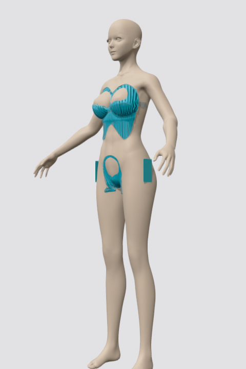</a> 02_three_quarter</td>
    <td align='center'><a href='renders/modest_one_piece_maillot__rng2/03_side_left.png'>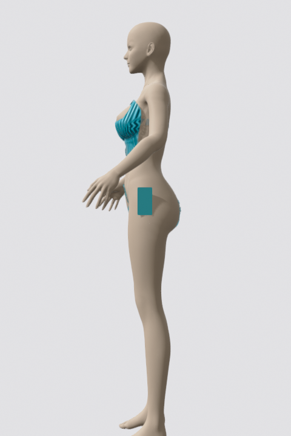</a> 03_side_left</td>
    <td align='center'><a href='renders/modest_one_piece_maillot__rng2/04_back.png'>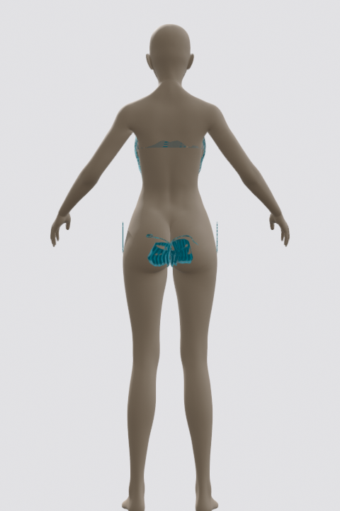</a> 04_back</td>
  </tr>
  <tr>
    <td align='center'><a href='renders/modest_one_piece_maillot__rng2/05_chest_close.png'>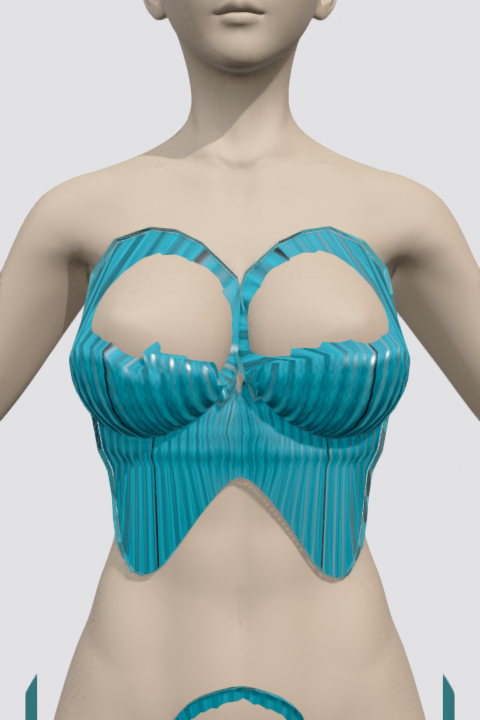</a> 05_chest_close</td>
    <td align='center'> 06_hip_close</td>
    <td align='center'><a href='renders/modest_one_piece_maillot__rng2/07_neck_top.png'>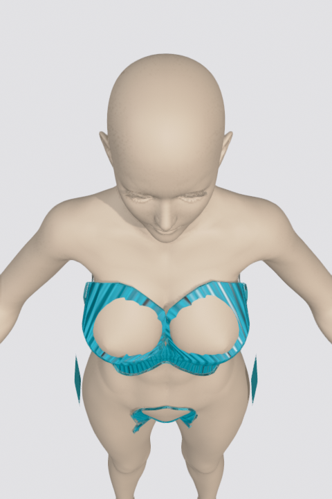</a> 07_neck_top</td>
    <td align='center'><a href='renders/modest_one_piece_maillot__rng2/08_shoulder_top.png'>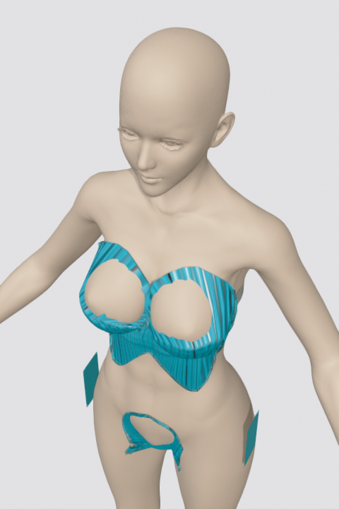</a> 08_shoulder_top</td>
  </tr>
</table>

#### `modest_one_piece_maillot__rng3`

<table>
  <tr>
    <td align='center'><a href='renders/modest_one_piece_maillot__rng3/01_front.png'>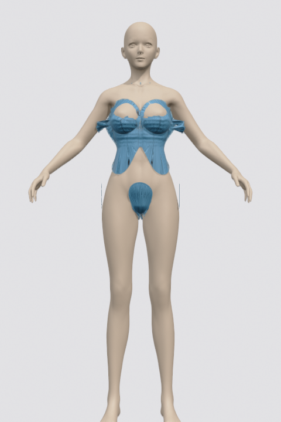</a> 01_front</td>
    <td align='center'><a href='renders/modest_one_piece_maillot__rng3/02_three_quarter.png'>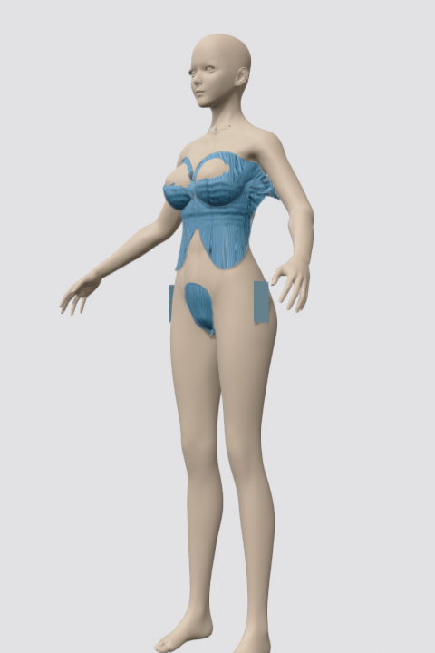</a> 02_three_quarter</td>
    <td align='center'><a href='renders/modest_one_piece_maillot__rng3/03_side_left.png'>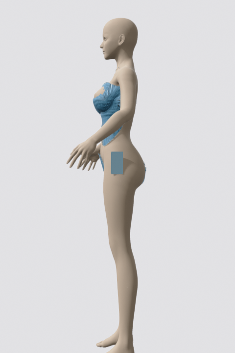</a> 03_side_left</td>
    <td align='center'><a href='renders/modest_one_piece_maillot__rng3/04_back.png'>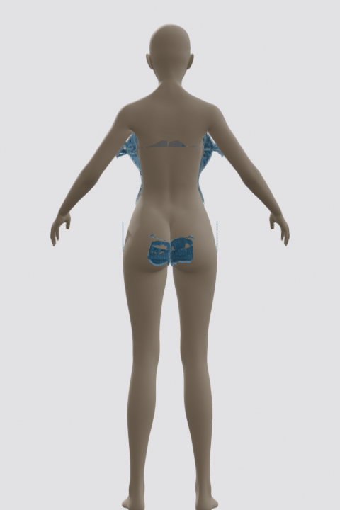</a> 04_back</td>
  </tr>
  <tr>
    <td align='center'><a href='renders/modest_one_piece_maillot__rng3/05_chest_close.png'>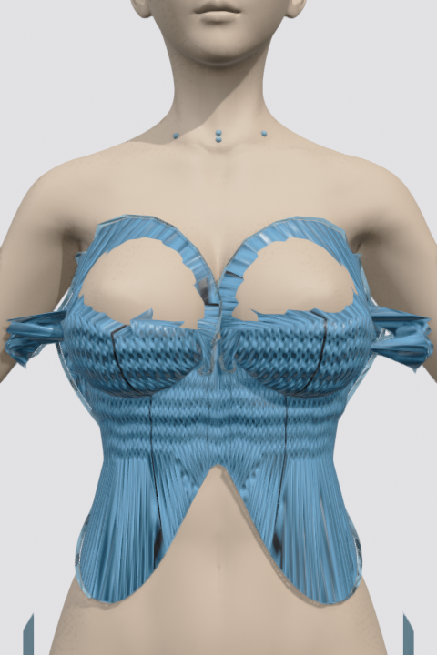</a> 05_chest_close</td>
    <td align='center'> 06_hip_close</td>
    <td align='center'><a href='renders/modest_one_piece_maillot__rng3/07_neck_top.png'>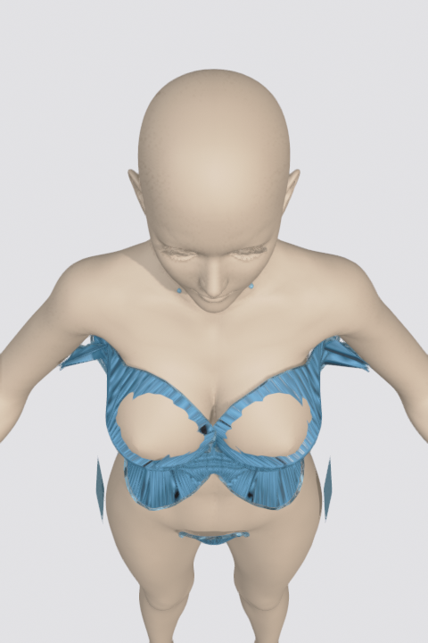</a> 07_neck_top</td>
    <td align='center'><a href='renders/modest_one_piece_maillot__rng3/08_shoulder_top.png'>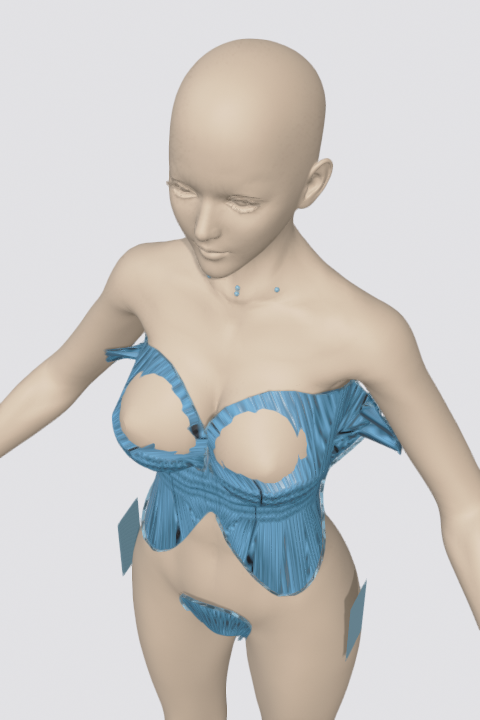</a> 08_shoulder_top</td>
  </tr>
</table>

#### `modest_triangle_string_halter__rng0`

<table>
  <tr>
    <td align='center'><a href='renders/modest_triangle_string_halter__rng0/01_front.png'>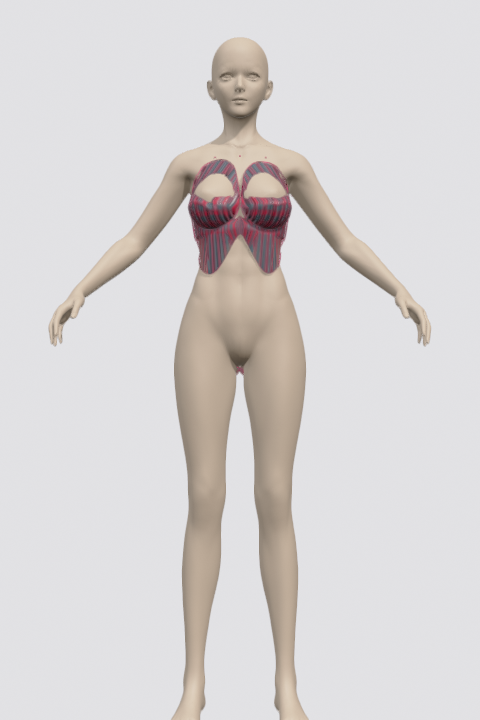</a> 01_front</td>
    <td align='center'><a href='renders/modest_triangle_string_halter__rng0/02_three_quarter.png'>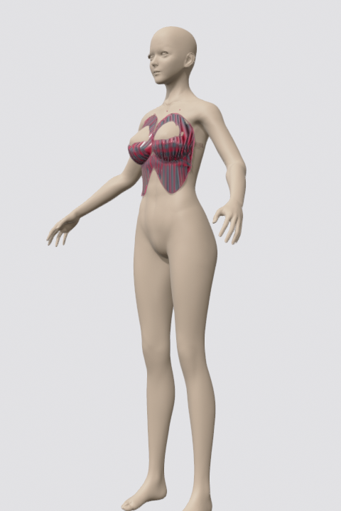</a> 02_three_quarter</td>
    <td align='center'><a href='renders/modest_triangle_string_halter__rng0/03_side_left.png'>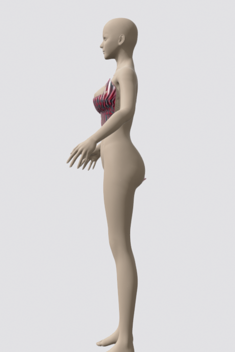</a> 03_side_left</td>
    <td align='center'> 04_back</td>
  </tr>
  <tr>
    <td align='center'><a href='renders/modest_triangle_string_halter__rng0/05_chest_close.png'>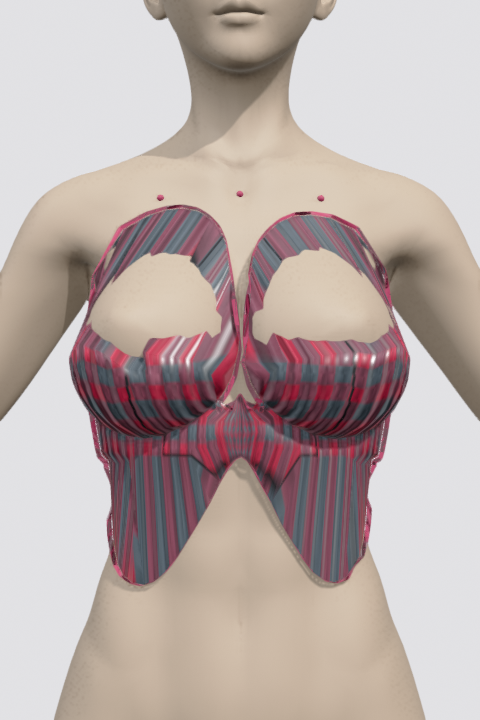</a> 05_chest_close</td>
    <td align='center'> 06_hip_close</td>
    <td align='center'><a href='renders/modest_triangle_string_halter__rng0/07_neck_top.png'>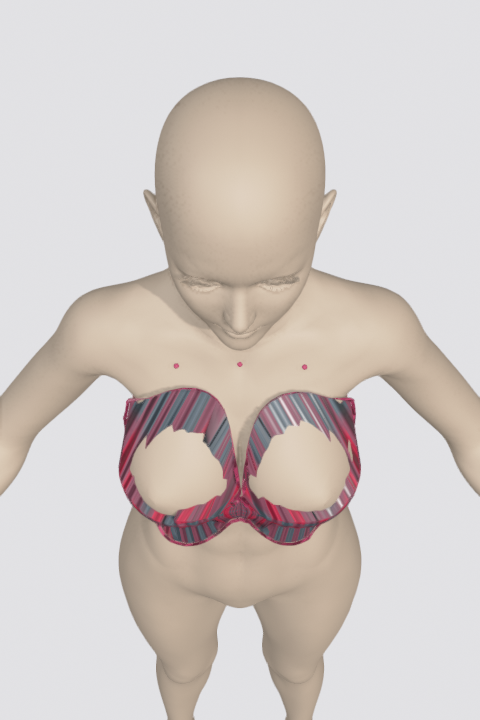</a> 07_neck_top</td>
    <td align='center'><a href='renders/modest_triangle_string_halter__rng0/08_shoulder_top.png'>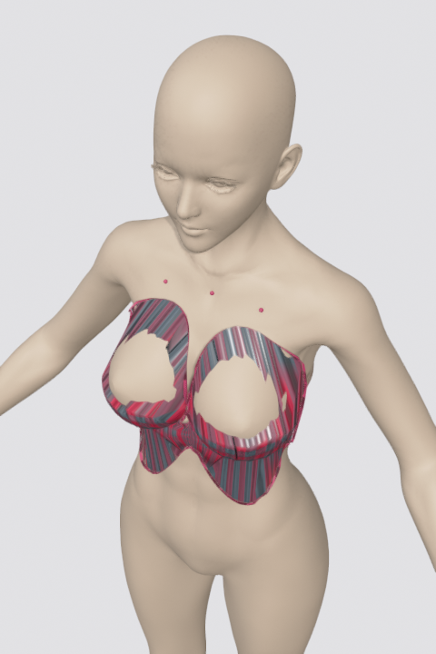</a> 08_shoulder_top</td>
  </tr>
</table>

#### `modest_triangle_string_halter__rng1`

<table>
  <tr>
    <td align='center'><a href='renders/modest_triangle_string_halter__rng1/01_front.png'>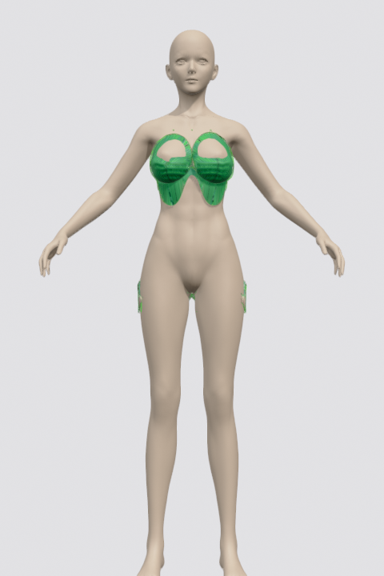</a> 01_front</td>
    <td align='center'><a href='renders/modest_triangle_string_halter__rng1/02_three_quarter.png'>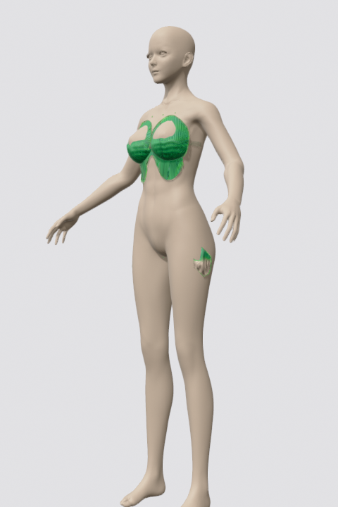</a> 02_three_quarter</td>
    <td align='center'><a href='renders/modest_triangle_string_halter__rng1/03_side_left.png'>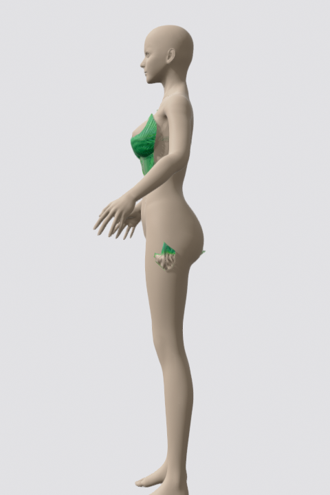</a> 03_side_left</td>
    <td align='center'><a href='renders/modest_triangle_string_halter__rng1/04_back.png'>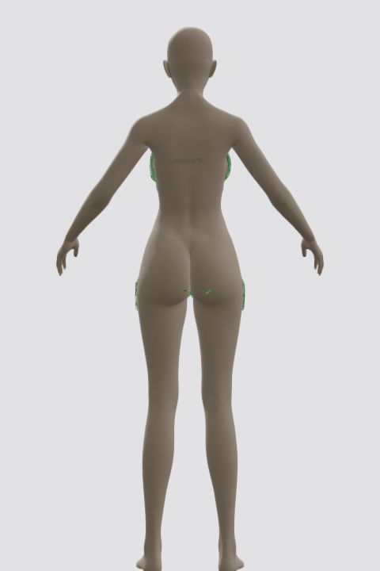</a> 04_back</td>
  </tr>
  <tr>
    <td align='center'><a href='renders/modest_triangle_string_halter__rng1/05_chest_close.png'>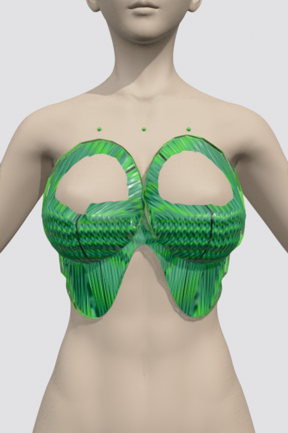</a> 05_chest_close</td>
    <td align='center'><a href='renders/modest_triangle_string_halter__rng1/06_hip_close.png'>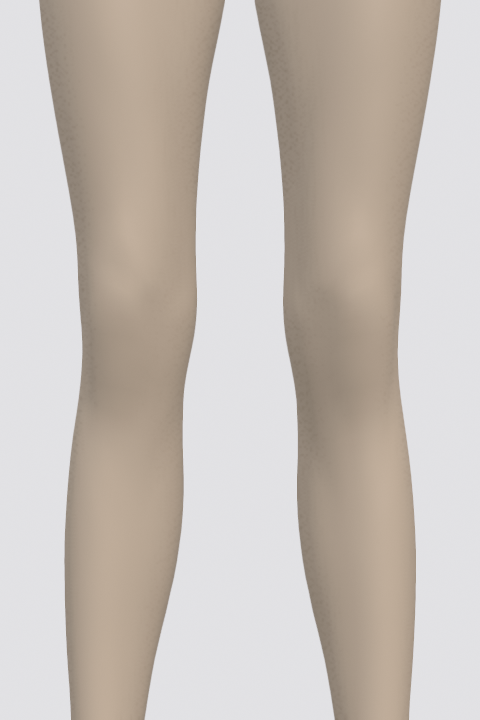</a> 06_hip_close</td>
    <td align='center'><a href='renders/modest_triangle_string_halter__rng1/07_neck_top.png'>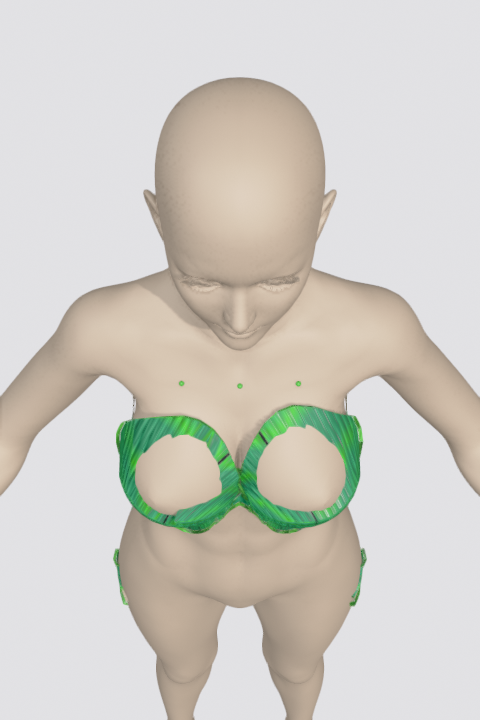</a> 07_neck_top</td>
    <td align='center'><a href='renders/modest_triangle_string_halter__rng1/08_shoulder_top.png'>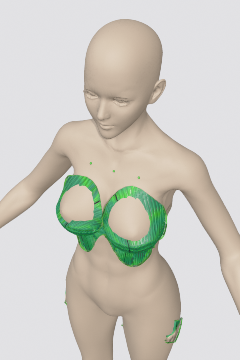</a> 08_shoulder_top</td>
  </tr>
</table>

#### `modest_triangle_string_halter__rng2`

<table>
  <tr>
    <td align='center'><a href='renders/modest_triangle_string_halter__rng2/01_front.png'>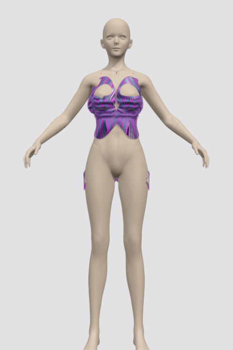</a> 01_front</td>
    <td align='center'><a href='renders/modest_triangle_string_halter__rng2/02_three_quarter.png'>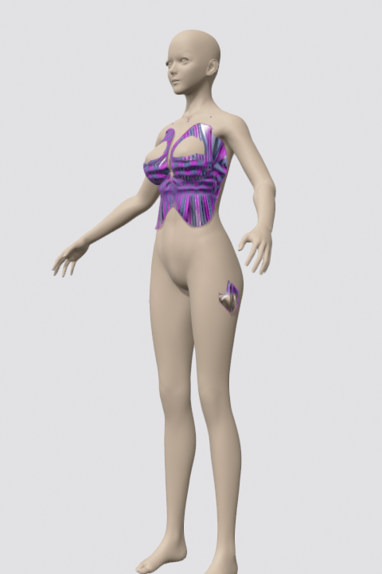</a> 02_three_quarter</td>
    <td align='center'><a href='renders/modest_triangle_string_halter__rng2/03_side_left.png'>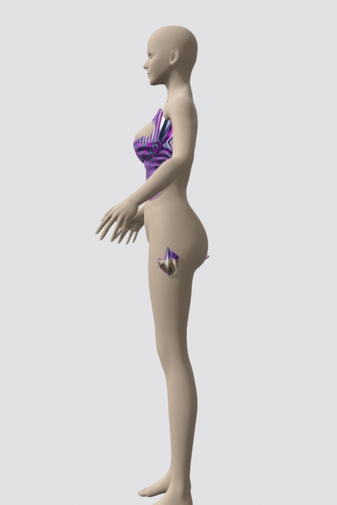</a> 03_side_left</td>
    <td align='center'><a href='renders/modest_triangle_string_halter__rng2/04_back.png'>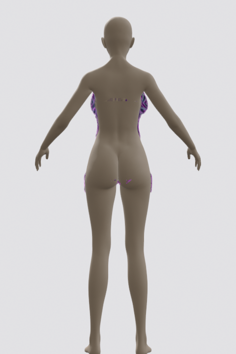</a> 04_back</td>
  </tr>
  <tr>
    <td align='center'><a href='renders/modest_triangle_string_halter__rng2/05_chest_close.png'>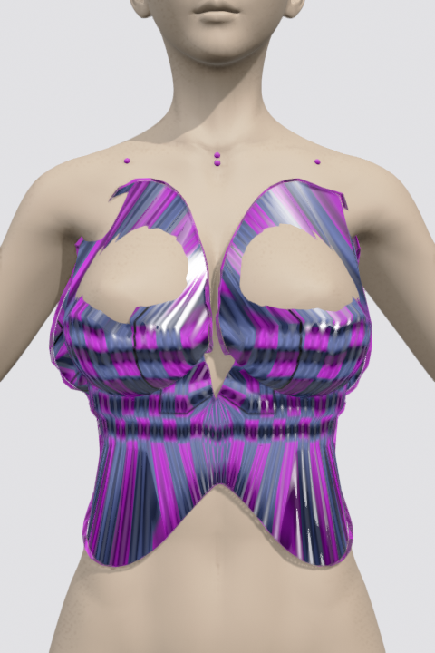</a> 05_chest_close</td>
    <td align='center'> 06_hip_close</td>
    <td align='center'><a href='renders/modest_triangle_string_halter__rng2/07_neck_top.png'>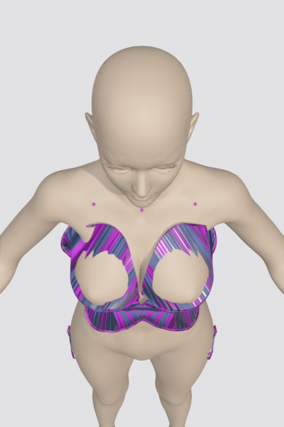</a> 07_neck_top</td>
    <td align='center'><a href='renders/modest_triangle_string_halter__rng2/08_shoulder_top.png'>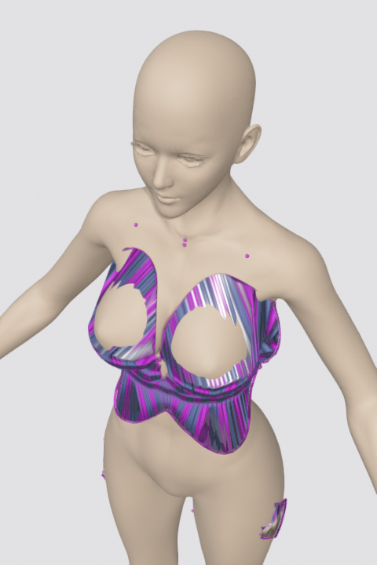</a> 08_shoulder_top</td>
  </tr>
</table>

#### `modest_triangle_string_halter__rng3`

<table>
  <tr>
    <td align='center'><a href='renders/modest_triangle_string_halter__rng3/01_front.png'>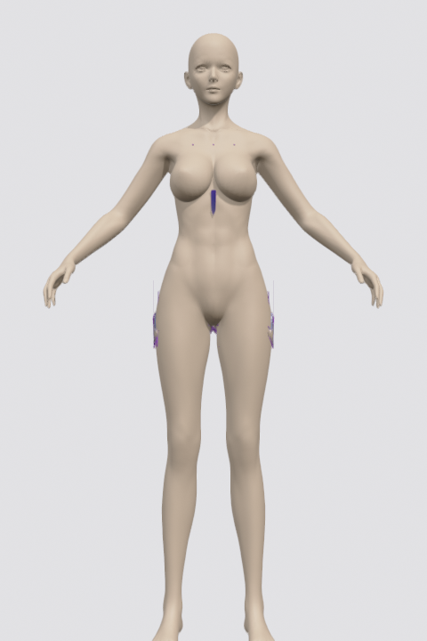</a> 01_front</td>
    <td align='center'><a href='renders/modest_triangle_string_halter__rng3/02_three_quarter.png'>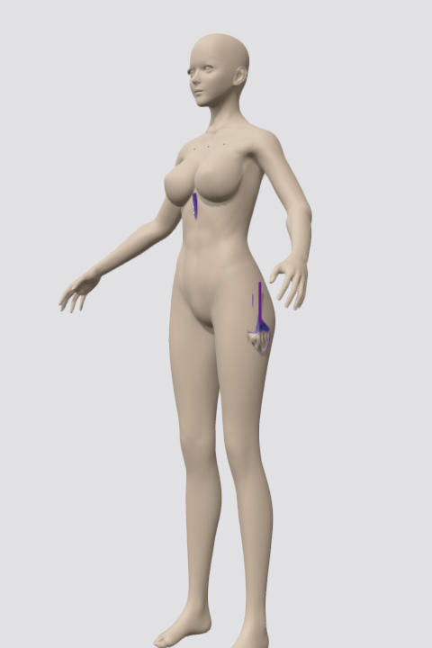</a> 02_three_quarter</td>
    <td align='center'><a href='renders/modest_triangle_string_halter__rng3/03_side_left.png'>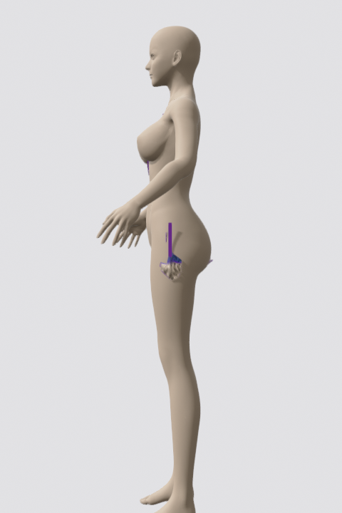</a> 03_side_left</td>
    <td align='center'><a href='renders/modest_triangle_string_halter__rng3/04_back.png'>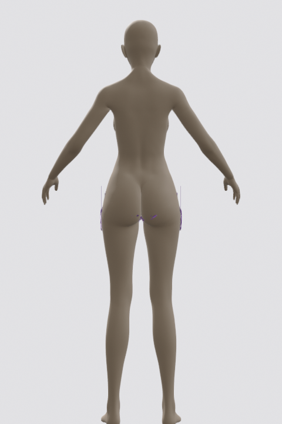</a> 04_back</td>
  </tr>
  <tr>
    <td align='center'><a href='renders/modest_triangle_string_halter__rng3/05_chest_close.png'>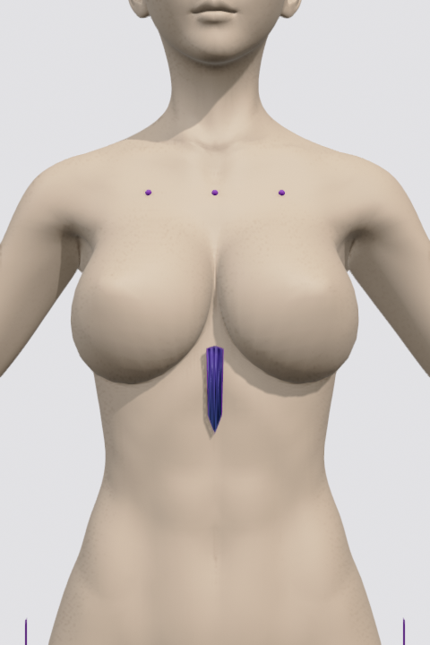</a> 05_chest_close</td>
    <td align='center'> 06_hip_close</td>
    <td align='center'><a href='renders/modest_triangle_string_halter__rng3/07_neck_top.png'>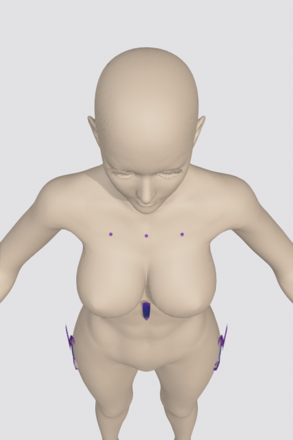</a> 07_neck_top</td>
    <td align='center'><a href='renders/modest_triangle_string_halter__rng3/08_shoulder_top.png'>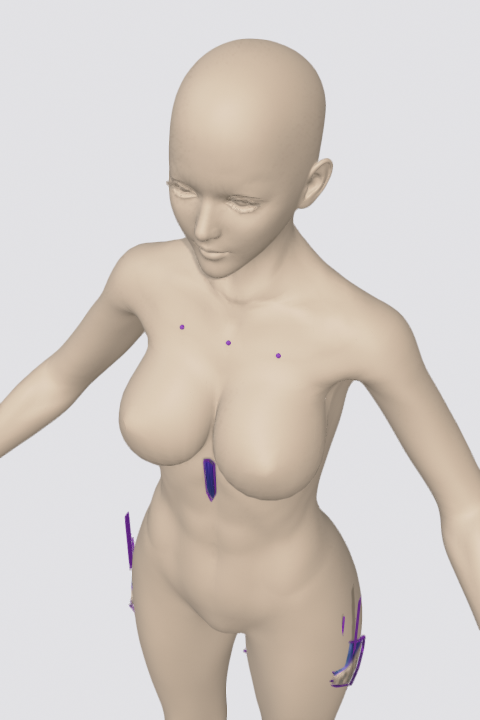</a> 08_shoulder_top</td>
  </tr>
</table>

## Run report

# Modest series — both coverage caps = 1.0, side panels pinned to max

Re-runs 1135_v2_strict_both_max with fresh RNG seeds. The point is to
show structured side fabric panels (not strings/ribbons): bottom
local_params front_half_u / back_half_u / front_top_v / back_top_v
all pinned to schema MAX inside `_pin_to_max_coverage`.

## Per outfit

| outfit | cup | bottom | front_half_u | back_half_u | composite |
|---|---|---|---|---|---|
| `triangle_string_halter__rng0` | `CUP_TRIANGLE_M` | `BOT_CHEEKY_M` | 0.220 | 0.160 | 0.845 |
| `triangle_string_halter__rng1` | `CUP_TRIANGLE_S` | `BOT_CHEEKY_M` | 0.220 | 0.160 | 0.792 |
| `triangle_string_halter__rng2` | `CUP_TRIANGLE_L` | `BOT_CHEEKY_S` | 0.187 | 0.160 | 0.800 |
| `triangle_string_halter__rng3` | `CUP_BRAZILIAN_M` | `BOT_CHEEKY_M` | 0.220 | 0.160 | 0.749 |
| `bandeau_back_band__rng0` | `CUP_FOAM_MOLDED_M` | `BOT_BRIEF_M` | 0.260 | 0.240 | 0.821 |
| `bandeau_back_band__rng1` | `CUP_FOAM_MOLDED_L` | `BOT_BRIEF_S` | 0.221 | 0.240 | 0.764 |
| `bandeau_back_band__rng2` | `CUP_FOAM_MOLDED_S` | `BOT_HIGHWAIST_M` | 0.260 | 0.260 | 0.826 |
| `bandeau_back_band__rng3` | `CUP_FOAM_MOLDED_S` | `BOT_HIGHWAIST_S` | 0.221 | 0.260 | 0.787 |
| `bralette_shoulder_strap__rng0` | `CUP_FOAM_MOLDED_L` | `BOT_BRIEF_M` | 0.260 | 0.240 | 0.823 |
| `bralette_shoulder_strap__rng1` | `CUP_FOAM_MOLDED_L` | `BOT_BRIEF_S` | 0.221 | 0.240 | 0.872 |
| `bralette_shoulder_strap__rng2` | `CUP_FOAM_MOLDED_M` | `BOT_HIGHWAIST_S` | 0.221 | 0.260 | 0.938 |
| `bralette_shoulder_strap__rng3` | `CUP_FOAM_MOLDED_S` | `BOT_HIGHWAIST_M` | 0.260 | 0.260 | 0.801 |
| `one_piece_maillot__rng0` | `CUP_FOAM_MOLDED_M` | `BOT_BRIEF_M` | 0.260 | 0.240 | 0.815 |
| `one_piece_maillot__rng1` | `CUP_FOAM_MOLDED_L` | `BOT_BRIEF_M` | 0.260 | 0.240 | 0.819 |
| `one_piece_maillot__rng2` | `CUP_FOAM_MOLDED_S` | `BOT_BRIEF_M` | 0.260 | 0.240 | 0.859 |
| `one_piece_maillot__rng3` | `CUP_FOAM_MOLDED_L` | `BOT_BRIEF_S` | 0.221 | 0.240 | 0.803 |

## Aggregate

- composite: mean=0.820, std=0.045, range=[0.749, 0.938]
- 16/16 outfits validate clean

