# 0448_fabric_weave_showcase

_Day: [`2026-05-17/`](../README.md)_  ·  _Seeds: 16_  ·  _Images: 17_

Local interactive viewer: [`index.html`](index.html)  ·  Top: [`tools/output/`](../../README.md)

## Top-level images

### fabric_showcase.png

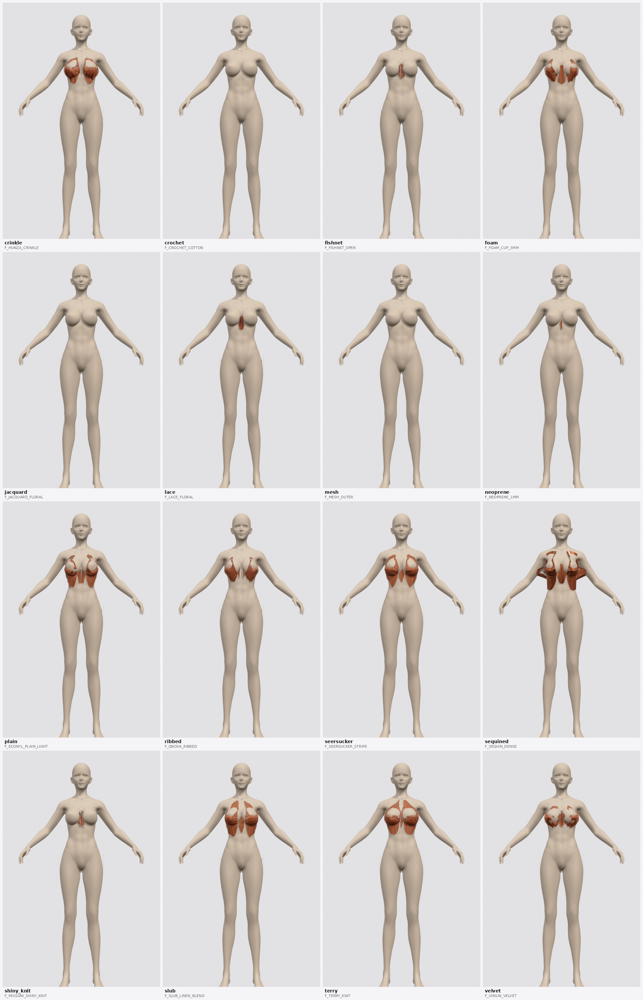

## Seeds (16)

### archetype: `unknown` (16)

#### `crinkle`

<table>
  <tr>
    <td align='center'><a href='crinkle/01_front.png'>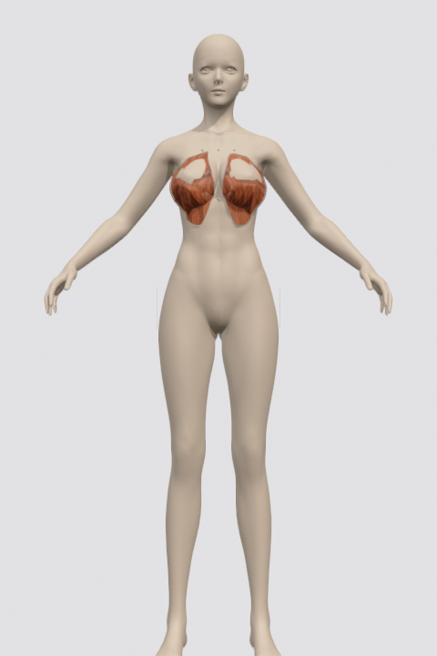</a> 01_front</td>
  </tr>
</table>

#### `crochet`

<table>
  <tr>
    <td align='center'> 01_front</td>
  </tr>
</table>

#### `fishnet`

<table>
  <tr>
    <td align='center'> 01_front</td>
  </tr>
</table>

#### `foam`

<table>
  <tr>
    <td align='center'><a href='foam/01_front.png'>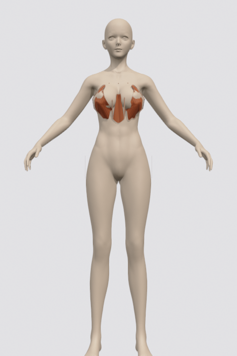</a> 01_front</td>
  </tr>
</table>

#### `jacquard`

<table>
  <tr>
    <td align='center'><a href='jacquard/01_front.png'>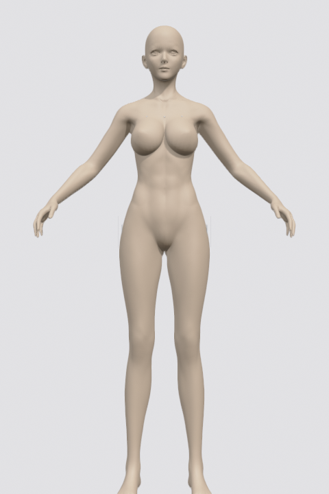</a> 01_front</td>
  </tr>
</table>

#### `lace`

<table>
  <tr>
    <td align='center'><a href='lace/01_front.png'>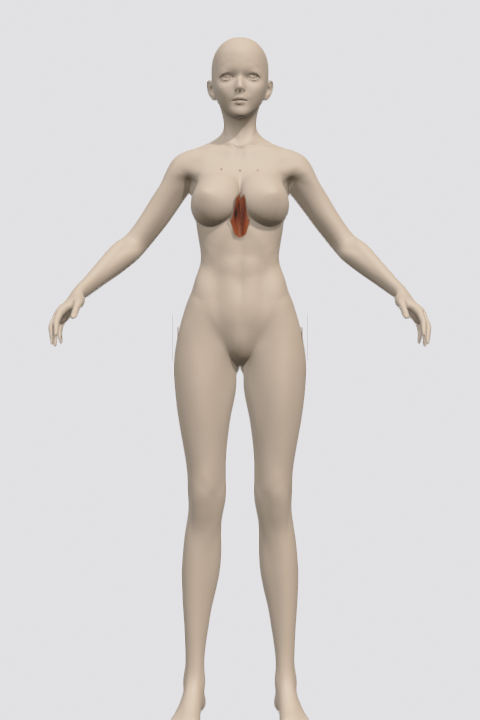</a> 01_front</td>
  </tr>
</table>

#### `mesh`

<table>
  <tr>
    <td align='center'> 01_front</td>
  </tr>
</table>

#### `neoprene`

<table>
  <tr>
    <td align='center'> 01_front</td>
  </tr>
</table>

#### `plain`

<table>
  <tr>
    <td align='center'><a href='plain/01_front.png'>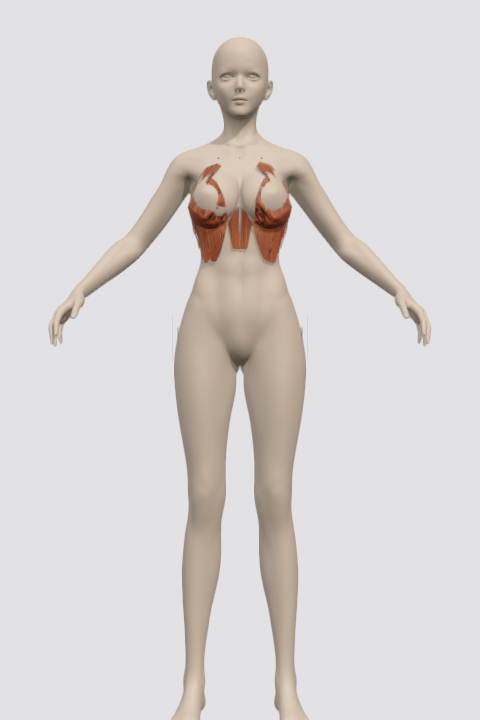</a> 01_front</td>
  </tr>
</table>

#### `ribbed`

<table>
  <tr>
    <td align='center'><a href='ribbed/01_front.png'>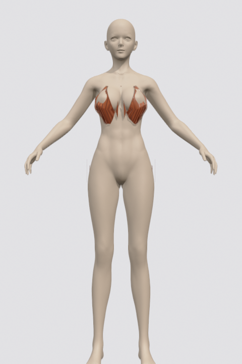</a> 01_front</td>
  </tr>
</table>

#### `seersucker`

<table>
  <tr>
    <td align='center'><a href='seersucker/01_front.png'>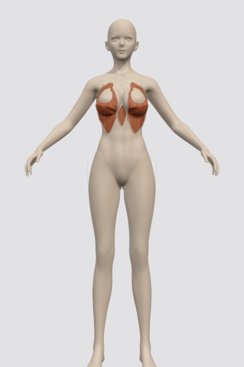</a> 01_front</td>
  </tr>
</table>

#### `sequined`

<table>
  <tr>
    <td align='center'><a href='sequined/01_front.png'>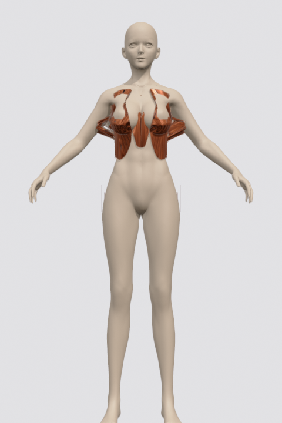</a> 01_front</td>
  </tr>
</table>

#### `shiny_knit`

<table>
  <tr>
    <td align='center'><a href='shiny_knit/01_front.png'>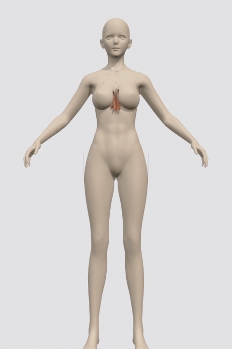</a> 01_front</td>
  </tr>
</table>

#### `slub`

<table>
  <tr>
    <td align='center'><a href='slub/01_front.png'>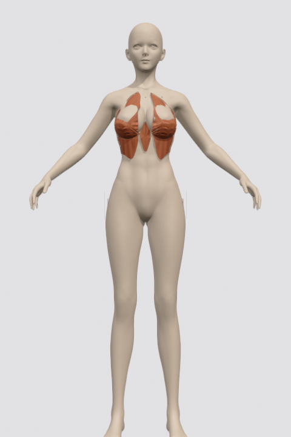</a> 01_front</td>
  </tr>
</table>

#### `terry`

<table>
  <tr>
    <td align='center'><a href='terry/01_front.png'>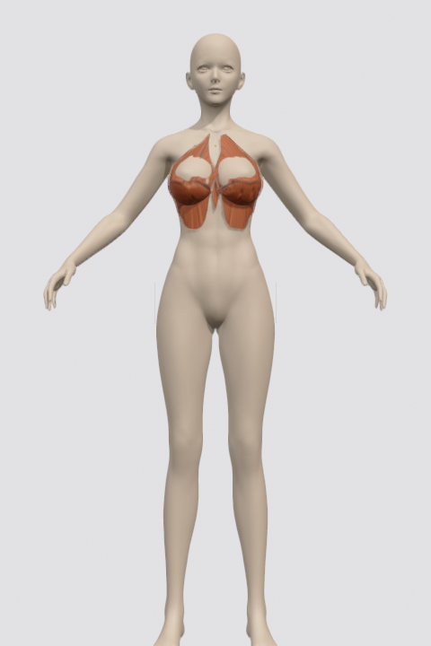</a> 01_front</td>
  </tr>
</table>

#### `velvet`

<table>
  <tr>
    <td align='center'><a href='velvet/01_front.png'>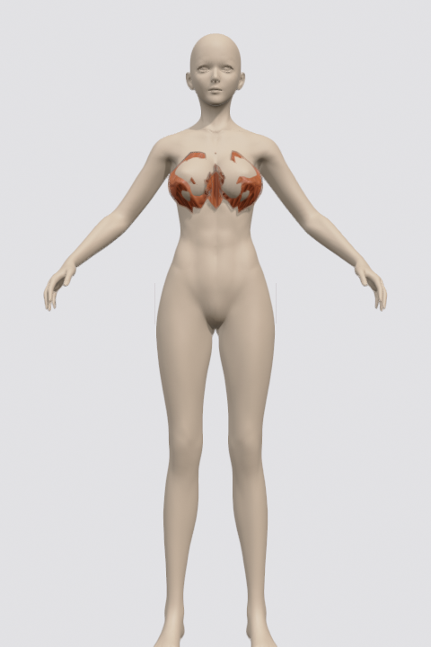</a> 01_front</td>
  </tr>
</table>
