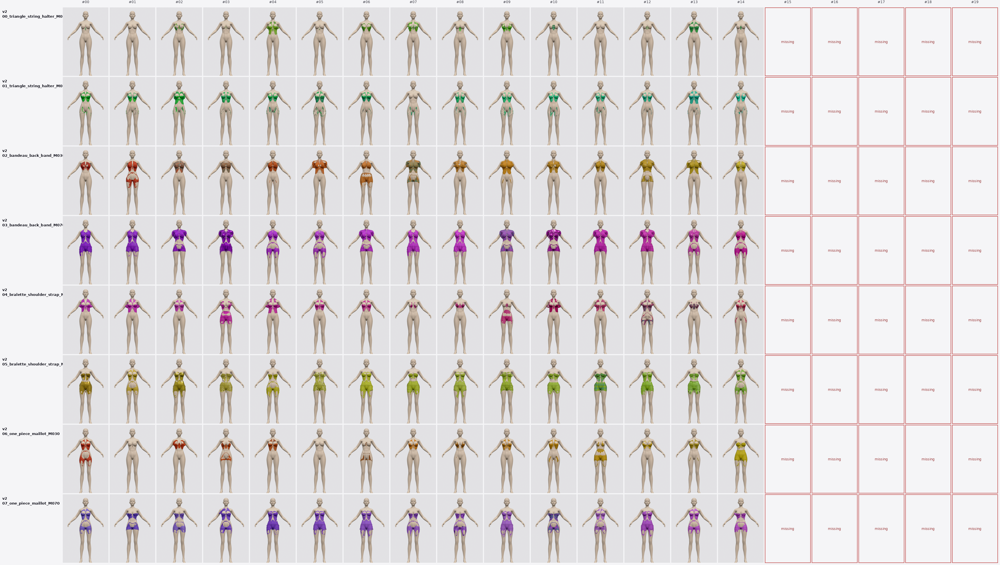
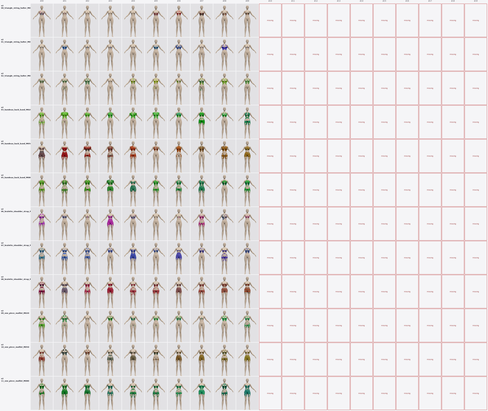
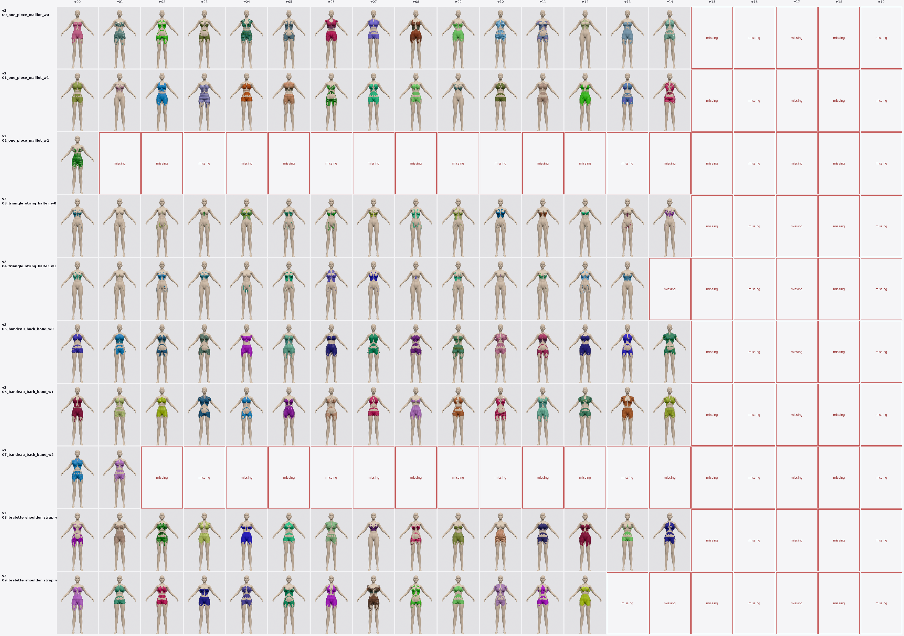
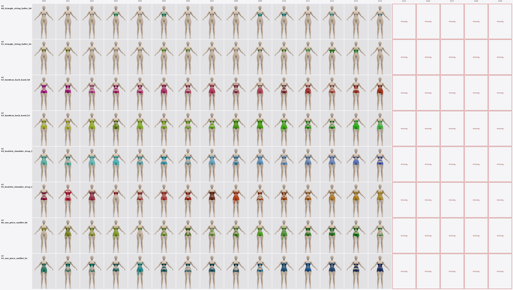

# 2026-05-17

_Top: [`tools/output/`](../README.md)_

## Tasks

- [`0448_fabric_weave_showcase/`](0448_fabric_weave_showcase/README.md) — 16 seed dirs · 17 images

- [`0745_diverse_batch_v2_8x15/`](0745_diverse_batch_v2_8x15/README.md) — 128 seed dirs · 249 images
   

- [`0823_diverse_batch_v2_8x15/`](0823_diverse_batch_v2_8x15/README.md) — 128 seed dirs · 249 images
   

- [`0855_diverse_batch_v2_8x15/`](0855_diverse_batch_v2_8x15/README.md) — 132 seed dirs · 253 images
   

- [`0910_diverse_batch_v2_8x15/`](0910_diverse_batch_v2_8x15/README.md) — 128 seed dirs · 249 images
   

- [`0936_diverse_winner_full_stack/`](0936_diverse_winner_full_stack/README.md) — 130 seed dirs · 251 images
   

- [`1530_diverse_batch_v2_8x15/`](1530_diverse_batch_v2_8x15/README.md) — 128 seed dirs · 249 images
   
