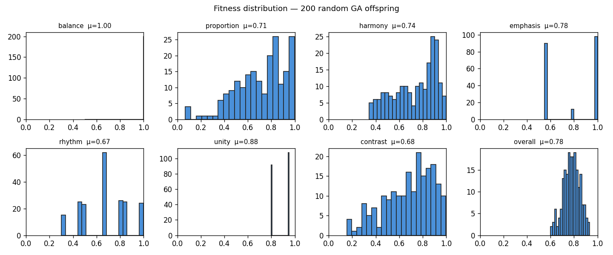
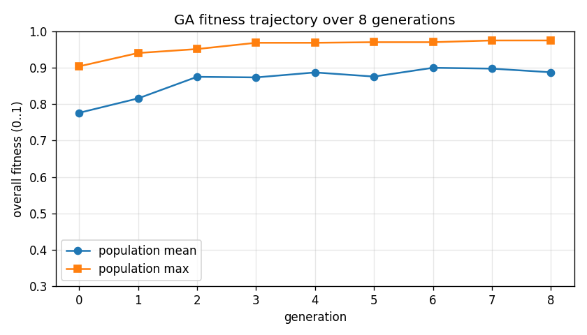
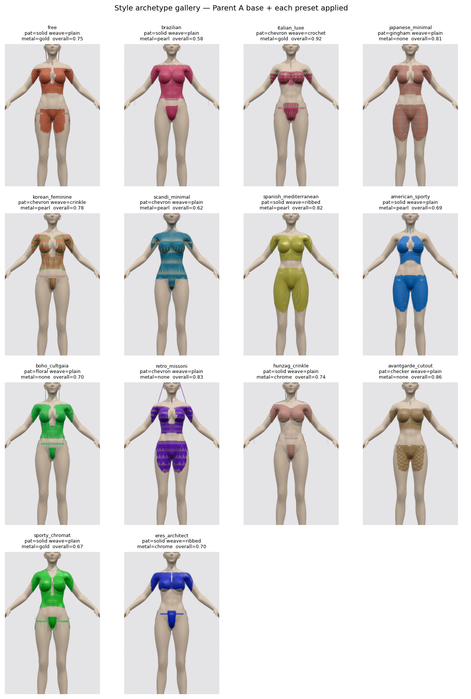

# Bikini GA — Test + Report

Generated at 2026-04-24 01:50:16

## 1. Sanity — construction, constraints, privacy seeds, patterns

- ✅ **PASS** — Genome has 44 fields (got 44)
- ✅ **PASS** — Parent A archetype 'brazilian' in whitelist
- ✅ **PASS** — Parent A fabric_weave valid
- ✅ **PASS** — Parent A fabric_source valid
- ✅ **PASS** — Parent A palette_preset valid
- ✅ **PASS** — Parent A hardware_metal valid
- ✅ **PASS** — Privacy seed 'right_nipple' enclosed by at least one cup/panel
- ✅ **PASS** — Privacy seed 'left_nipple' enclosed by at least one cup/panel
- ✅ **PASS** — Privacy seed 'pelvic_front' enclosed by at least one cup/panel
- ✅ **PASS** — All continuous fields clipped to [0,1]
- ✅ **PASS** — 'biodegradable' thresholded to 0/1 (got 0.0)
- ✅ **PASS** — 'single_material' thresholded to 0/1 (got 1.0)
- ✅ **PASS** — 'has_oring' thresholded to 0/1 (got 1.0)
- ✅ **PASS** — 'has_bow' thresholded to 0/1 (got 0.0)
- ✅ **PASS** — 'has_fringe' thresholded to 0/1 (got 1.0)
- ✅ **PASS** — 'has_beads' thresholded to 0/1 (got 0.0)
- ✅ **PASS** — 'has_shell' thresholded to 0/1 (got 0.0)

**17 passed / 0 failed** so far.

## 2. GA mechanics — crossover + mutation preserve constraints

- ✅ **PASS** — All 200 offspring pass privacy-seed containment
- ✅ **PASS** — All offspring respect stay-on topology (back coverage, waist span)
- 📊 Offspring spans **7/12 patterns**, **12/14 archetypes**, **5/6 hardware metals**.

- ✅ **PASS** — Offspring show multiple patterns
- ✅ **PASS** — Offspring show multiple archetypes
- 📊 Hue std across 200 offspring = **0.305** (expected > 0.05)

- ✅ **PASS** — Hue diversifies via GA
- ✅ **PASS** — All non-boolean continuous fields vary across offspring

## 3. Fitness distribution on 200-Genome random population

| principle | mean | std | min | max |
|---|---|---|---|---|
| balance | 1.000 | 0.000 | 1.000 | 1.000 |
| proportion | 0.708 | 0.210 | 0.067 | 0.998 |
| harmony | 0.735 | 0.180 | 0.345 | 0.999 |
| emphasis | 0.784 | 0.218 | 0.550 | 1.000 |
| rhythm | 0.668 | 0.198 | 0.300 | 1.000 |
| unity | 0.881 | 0.075 | 0.800 | 0.950 |
| contrast | 0.682 | 0.206 | 0.154 | 0.998 |
| overall | 0.780 | 0.069 | 0.600 | 0.933 |

- ✅ **PASS** — Mean overall fitness > 0.4

## 4. Multi-generation evolution — 8 generations, fitness-driven

| gen | mean_fitness | max_fitness |
|---|---|---|
| 0 | 0.776 | 0.904 |
| 1 | 0.816 | 0.940 |
| 2 | 0.875 | 0.951 |
| 3 | 0.873 | 0.968 |
| 4 | 0.887 | 0.968 |
| 5 | 0.876 | 0.970 |
| 6 | 0.900 | 0.970 |
| 7 | 0.897 | 0.975 |
| 8 | 0.887 | 0.975 |

- ✅ **PASS** — Mean fitness improved: 0.776 -> 0.887
- ✅ **PASS** — Max fitness non-decreasing: 0.904 -> 0.975

## 5. Style archetype gallery — one 3D render per style_archetype

- 🖼 91/91 archetype pairs render distinctly (image-diff > 1.5).

- ✅ **PASS** — >80% of archetype pairs are visibly distinct
- JSON dump: `test_archetype_gallery.json`

## Summary

- ✅ **Passed**: 27

- ❌ **Failed**: 0
