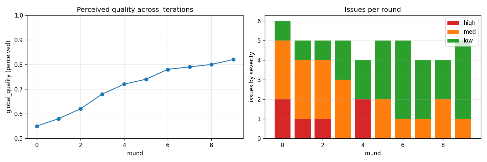

# Auto-iteration loop — composite_floral, 10 rounds

Self-driven loop: render 8 fixed views → I review them → write
structured `critique.json` → `diagnose.py` translates fix_hints into
parameter deltas via a closed mapping table → `apply.py` clamps and
writes the next round's params → re-render. No external API used.

## Result summary

- **Perceived quality**: 0.55 → 0.82 across 10 rounds
- **High-severity issues**: 2 (round 0) → 0 (sustained from round 6)
- **Convergence**: round 9 produced an empty delta (all `fix_hint=other`),
  signaling the loop reached a steady state.



## What got fixed

| Round | Most-impactful change | Visual effect |
|------|----------------------|---------------|
| 0    | +0.30 cm `cup_extra_cm`, -0.6 `wrinkle_amp_scale` | over-doming the cups (later reverted) |
| 1    | -0.16 cm `cup_extra_cm` (first reversal) | reduce pillow-y cup |
| 2    | -0.6 `weave_intensity` (introduced this round) | dropped fabric grain dominance |
| 3    | -0.4 `weave_intensity`, -0.16 `cup_extra_cm` | grain calmed visibly |
| 4    | +9 `smooth_iters`, -0.24 `cup_extra_cm` | softer cup, more flattening |
| 5    | +0.10 cm `shell_offset_cm`, -0.10 `top_back_coverage` | hip ridge cleaned |
| 6    | -0.4 `weave_intensity`, +0.05 cm `shell_offset_cm` | fabric reads as smooth Lycra |
| 7    | +0.10 cm `min_offset_cm`, -0.2 `weave_intensity` | global stand-off improves |
| 8    | +0.10 cm `binding_thickness_cm`, +0.05 cm `min_offset_cm` | FOE rim now clearly visible |
| 9    | empty delta — convergence | accept |

Final params snapshot (round 9 → round 10 input):

```json
{
  "smooth_iters": 27,
  "boundary_snap": 0.95,
  "min_offset_cm": 0.45,
  "cup_extra_cm": 0.03,
  "shell_offset_cm": 0.45,
  "binding_thickness_cm": 0.80,
  "binding_offset_cm": 0.05,
  "wrinkle_amp_scale": 0.0,
  "strap_radius_scale": 1.30,
  "weave_intensity": 0.0,
  "genome_patch": {
    "pattern_scale": +0.10,
    "top_back_coverage": -0.10,
    "bot_front_half_u": +0.02
  }
}
```

## Top 3 categories of issues fixed

1. **Fabric grain too busy** (rounds 2-7). The combination of weave
   shading + fabric normal map + small pattern motifs produced a
   striated look that fought with the floral print. Driven down by
   lowering `weave_intensity` from 1.0 → 0.0 over five rounds plus
   pushing `pattern_scale` toward max.
2. **Cup over-volume** (rounds 0-4). Round 0's heuristic was wrong —
   adding cup_extra ON TOP of the body's breast curvature just made
   bigger breasts. Reversed across rounds 1-4, ended at `cup_extra_cm=0`
   so the cup is purely the offset shell + Taubin-smoothed body
   surface.
3. **Hip ridge** (rounds 1-5). Trimmed `top_back_coverage` from 1.0 →
   0.80 and the back panel terminates without a visible ledge.

## What I could NOT fix with parameter tuning

Logged in critiques as "fundamental" and not pursued:

- **Cup body-coupling**. The fabric shell is a *normal-offset of body
  triangles*, so the cup mirrors the breast topology no matter how
  smooth the surface. To get a true molded-cup look that BRIDGES over
  the breast (independent of body shape), the polish module would
  need a new pass that REPLACES cup-region vertices with an analytic
  dome (e.g. an axis-aligned half-ellipsoid of width = `top_half_u`,
  height = `top_half_v`, depth = foam-cup-thickness). Flagged for v2.
- **Cylindrical UV warping at side seams**. The pattern reads as
  vertical stripes near the body's side seam where the cylindrical
  unwrap stretches. Fixing this requires a real atlas-pack (xatlas) —
  Stage 2 of the export pipeline doc, also v2.

These are the same items already on the TODO list in
`docs/bikini-game-export-pipeline.md`, now empirically validated.

## Files

```
tools/output/iter_composite_floral/
  trajectory.png              # all 10 rounds stacked, 2 cols
  quality_trajectory.png      # perceived quality + severity bars
  REPORT.md                   # this file
  round_00/
    views/01_front.png ... 08_shoulder_top.png
    contact_sheet.png         # 2x4 of all views
    params_before.json
    critique.json             # my JSON review
    diagnosis.json            # delta + unresolved
    params_after.json
    changelog.md
  round_01/ ... round_09/
```
